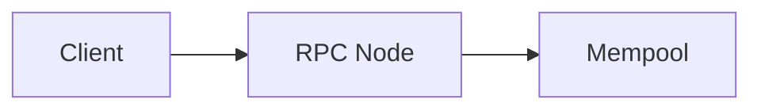

# Contributing Guidelines

Thank you for contributing to UB Society.
This project provides open educational material covering blockchain architecture, smart contracts, distributed systems, and Web3 engineering.
Please review the guidelines below before submitting changes.

## Development Setup

Clone the repository and install dependencies using pnpm:

```bash
git clone https://github.com/ub-society/modules.git
cd modules
pnpm install
```

Start the local development server:

```bash
pnpm run docs:dev
```

Test the production build:

```bash
pnpm run docs:build
```

## Adding and Modifying Content

### 1. Choose the Appropriate Directory

Content is organized under the `docs/` directory:

- `docs/learn/fundamentals/`: Theoretical foundations, cryptographic primitives, and distributed ledger concepts.
- `docs/learn/builder-foundations/`: Smart contract development, testing frameworks, and application architectures.
- `docs/learn/protocol-engineering/`: Virtual machine internals, consensus implementations, and Layer 2 rollups.
- `docs/archive/`: Internal research notes, technical specifications, and component sandbox verifications.

### 2. Create the Markdown File

Create your new lesson file within the chosen directory.
Use clear, hyphen-separated filenames:

```text
docs/learn/fundamentals/02-cryptographic-primitives.md
```

### 3. Register the Page in the Sidebar

Sidebar navigation is configured manually in `docs/.vitepress/config.mts`.
Locate the matching track key inside `themeConfig.sidebar` and add your page to the `items` array.
The display order in the portal directly follows the array order:

```ts
"/learn/fundamentals/": [
  {
    text: "Blockchain Fundamentals",
    items: [
      { text: "Track Overview", link: "/learn/fundamentals/" },
      { text: "Cryptographic Primitives", link: "/learn/fundamentals/02-cryptographic-primitives" },
    ],
  },
],
```

For nested topic groups, you can define collapsible sub-sections:

```ts
{
  text: "Consensus Mechanisms",
  collapsed: false,
  items: [
    { text: "Proof of Work", link: "/learn/fundamentals/pow" },
    { text: "Proof of Stake", link: "/learn/fundamentals/pos" },
  ],
}
```

## Editorial and Writing Standards

### Sentence Per Line

Every complete sentence in Markdown files must be placed on its own line.
This standard makes Git diffs clean and simplifies peer review.

### Zero Emojis

Do not use emojis anywhere in the repository.
This applies to Markdown files, code comments, commit messages, and documentation.

### Formatting and Punctuation

Never use em dashes or en dashes.
Use standard commas, colons, periods, or plain hyphens instead.

### Code Snippets

Provide verified, production-grade code snippets.
Always specify the language identifier for syntax highlighting, such as `solidity`, `rust`, or `typescript`.

### Mathematical Formulas

Write mathematical expressions using standard LaTeX syntax.
The portal renders math through KaTeX:

- Inline formulas: `$P = k \cdot G$`
- Block formulas: `$$y^2 \equiv x^3 + ax + b \pmod{p}$$`

### Architectural Diagrams

Use Mermaid code blocks for sequence diagrams, flowcharts, and state machines:

````markdown

````

### Images and Static Assets

Colocate lesson illustrations and diagrams directly within their module directory:

1. **Colocated Assets Folder**: Create an `assets/` subfolder alongside the Markdown files:
   ```text
   01-distributed-trust/
   ├── 01-double-spending-and-digital-cash.md
   └── assets/
       └── merkle-tree-proof.svg
   ```
2. **Relative Referencing**: Link assets using relative paths starting with `./assets/`:
   ```markdown
   
   ```
   Relative links are processed by Vite at build time, ensuring asset optimization, cache busting, and compile-time link validation.
3. **Global Assets**: Place cross-cutting site assets (such as site logos, favicons, and social preview cards) in `docs/public/` and reference them with absolute root paths, such as `/logo-dark.svg`.
4. **Format and Naming**:
   - Use kebab-case naming: `<topic>-<description>.<ext>`.
   - Prefer vector SVG files for technical schematics, flowcharts, and architecture diagrams.
   - Use WebP or optimized PNG files for raster screenshots or photographic content.

## Pull Request Guidelines

1. Create a descriptive branch from `main`.
2. Follow Conventional Commits format for your commit messages, such as `feat: add cryptographic primitives module`.
3. Do not include agent signatures or co-author tags in commit messages.
4. Run `pnpm run docs:build` locally to ensure there are no broken links or compilation errors.
5. Submit your pull request using the provided pull request template.
