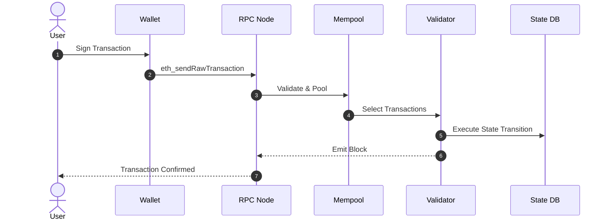

# Archive and Sandbox

This section serves as an archive for research notes, draft specifications, and visual sandbox verification.
Use this space to test diagrams, mathematical notation, and new component layouts before integrating them into active curricula.

## Mermaid Diagram Verification

The following diagram verifies Mermaid rendering within the documentation portal.
It illustrates a standard Web3 transaction lifecycle from client broadcast to block inclusion.

## KaTeX Mathematical Notation Verification

The following equations verify KaTeX LaTeX rendering for cryptographic concepts.

### Elliptic Curve Cryptography

The secp256k1 curve used in Bitcoin and Ethereum follows the short Weierstrass form:

$$y^2 \equiv x^3 + 7 \pmod{p}$$

The public key $P$ is derived through scalar multiplication of the private key $k$ with the generator point $G$:

$$P = k \cdot G$$

### Merkle Tree Root Hash

Parent nodes in a cryptographic hash tree are computed by hashing concatenated child hashes:

$$\mathcal{H}_{\text{parent}} = \text{Hash}(\mathcal{H}_{\text{left}} \mathbin{\Vert} \mathcal{H}_{\text{right}})$$

### Zero-Knowledge Proof Relation

A zero-knowledge relation checks whether an instance $x$ and a witness $w$ satisfy circuit constraints:

$$\mathcal{R} = \{ (x, w) \mid \mathcal{C}(x, w) = 0 \}$$
