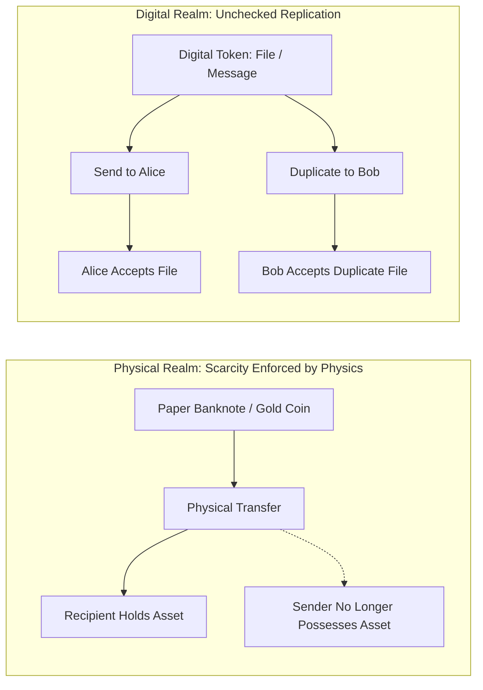
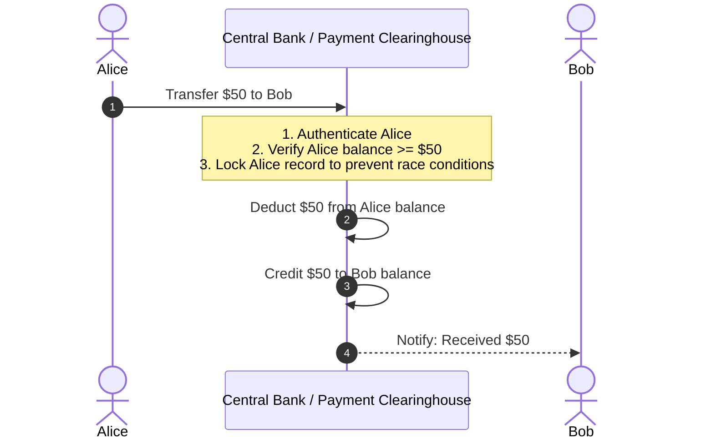
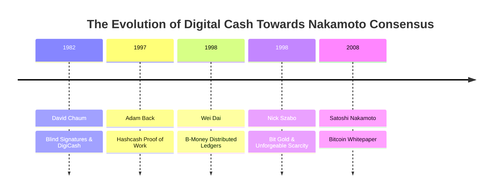
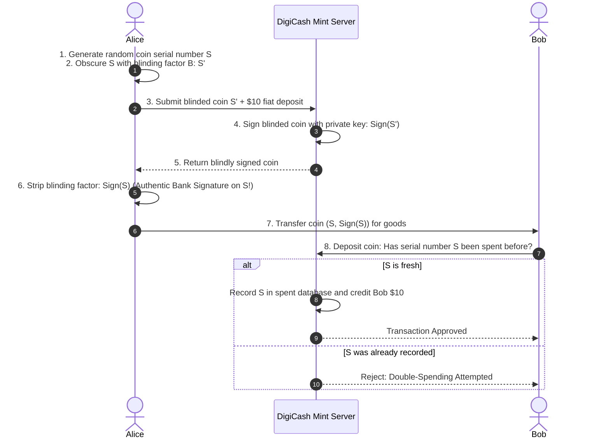
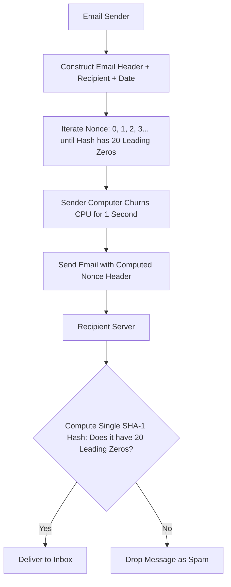
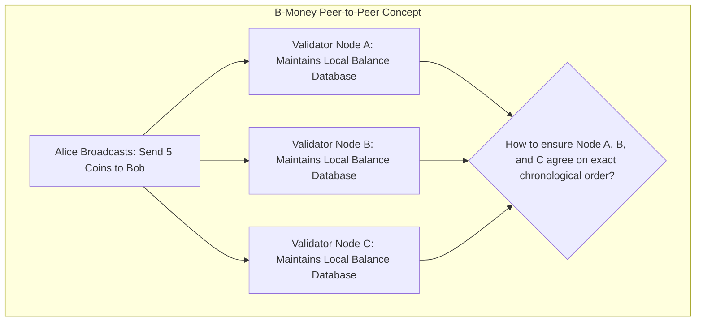
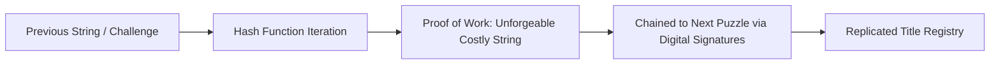
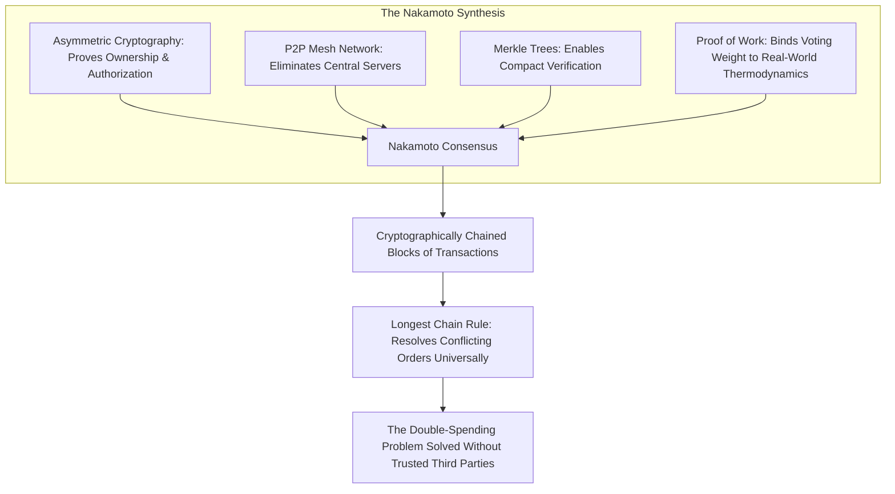

# The Double-Spending Problem and the History of Digital Cash

Money is fundamentally a coordination game.
For thousands of years, physical objects served as money because physical reality enforces scarcity naturally.
If you hand someone a gold coin or a paper banknote, you no longer possess it.
The laws of physics prevent you from giving that same physical coin to a merchant down the street five minutes later.
Transfer and settlement happen in the same physical instant.
The physical token embodies both the value and the settlement guarantee.

The internet dissolved physical boundaries, allowing information to travel globally at the speed of light.
However, digital information is fundamentally composed of bits: zeroes and ones.
By its very nature, digital information can be replicated infinitely, perfectly, and at virtually zero marginal cost.
When you send someone an email, an image, or a PDF document, you are not transferring the original file.
You are creating a duplicate copy on their computer while keeping the original file intact on your hard drive.

This mathematical property of digital information creates a profound challenge when applied to money: **The Double-Spending Problem**.

## The Nature of the Double-Spending Problem

If digital money were simply a digital computer file, say `dollar.dat`, nothing prevents a dishonest user from copying that file multiple times and sending it to different recipients simultaneously.

Consider a practical dilemma:
Suppose Alice has a digital file representing ten dollars.
She transmits the file to Bob in exchange for a cup of coffee.
At the exact same moment, she transmits the identical digital file to Charlie to purchase a book.
Both Bob and Charlie receive valid bits.
Both deliver their goods under the impression that they have been paid.
Yet, only ten dollars existed originally.
Alice has successfully duplicated her purchasing power out of thin air, defrauding either Bob, Charlie, or the wider economy.

For digital currency to function as a reliable medium of exchange and store of value, every participant must have absolute mathematical confidence that:
1. The currency cannot be forged or duplicated.
2. The current owner of the token is the only entity capable of transferring it.
3. Once transferred, the previous owner cannot spend the same token ever again.

## The Traditional Solution: Centralized Ledgers and Trusted Intermediaries

Prior to the invention of distributed blockchains, every successful digital payment network solved the double-spending problem by relying on a centralized intermediary.
This includes modern commercial banks, credit card networks (Visa, Mastercard), automated clearing houses (ACH), and digital payment platforms (PayPal, Venmo).

In a centralized payment system, money is not a self-contained digital token carried by users.
Instead, money is transformed into an entry in a private, centralized database called a **ledger**.

When Alice wants to pay Bob fifty dollars electronically:
1. Alice does not hand a digital object directly to Bob.
2. Alice sends a cryptographically authenticated instruction to her bank requesting a transfer.
3. The bank inspects its centralized database to confirm Alice's current balance is at least fifty dollars.
4. If Alice attempts to send the same fifty dollars to Charlie at the exact same moment, the bank's database serialization engine processes one request first and rejects the second request due to insufficient funds.
5. The bank deducts fifty dollars from Alice's ledger account and credits fifty dollars to Bob's ledger account.

### The Trade-offs and Vulnerabilities of Centralized Trust

Centralized clearinghouses solve the double-spending problem effectively, processing tens of thousands of transactions per second globally.
However, this solution introduces structural economic and political vulnerabilities:

- **Single Point of Failure:** If the centralized server crashes, suffers a cyberattack, or experiences a power outage, the entire economic apparatus depending on that database grinds to an immediate halt.
- **Censorship and Financial Deplatforming:** Because the central authority has complete unilateral control over ledger entries, it possesses the power to freeze accounts, reverse valid transactions, or deny access to individuals, organizations, or entire nations based on political pressure or corporate discretion.
- **Surveillance and Loss of Financial Privacy:** Every financial transaction must be observed, parsed, and logged by the central intermediary, enabling pervasive behavioral tracking and data commodification.
- **Inflationary Debasement and Seigniorage:** The centralized ledger keeper, often collaborating with central monetary authorities, possesses the power to alter total ledger supply arbitrarily, diluting the purchasing power of existing account holders without their consent.
- **Rent Extraction:** Monopolistic payment intermediaries charge transaction fees (often two to four percent on credit card networks) to intermediate every transaction, imposing a perpetual tax on merchants and consumers.

The holy grail of computer scientists and cryptographers throughout the late twentieth century was to construct a digital currency system that retained the convenience of electronic transfers while restoring the peer-to-peer, uncensorable, and self-sovereign properties of physical cash.

## The Historical Ancestry of Digital Cash

Bitcoin did not emerge in a vacuum.
Satoshi Nakamoto synthesized decades of theoretical research and failed experimental protocols developed by the **Cypherpunks**: an informal collective of mathematicians, cryptographers, and privacy activists who sought social and political change through the proactive deployment of strong cryptography.

### 1. David Chaum and DigiCash (1982 - 1998)

Dr. David Chaum, widely regarded as the father of digital cash, published a landmark paper in 1982 titled *Blind Signatures for Untraceable Payments*.
In 1989, Chaum founded a commercial enterprise called **DigiCash** to bring cryptographic digital money into practice through a system named **eCash**.

DigiCash pioneered the concept of **Blind Signatures**.
In traditional asymmetric cryptography, an authority inspects a document before signing it.
In Chaum's blind signature scheme, a user can have a digital coin signed by a bank without the bank ever seeing the serial number on the coin.

#### How Blind Signatures Worked

Imagine placing a piece of paper containing a unique serial number inside an envelope lined with carbon paper.
You hand the sealed envelope to a bank teller alongside ten dollars of physical cash.
The teller signs the outside of the envelope with a pen.
The pressure of the pen transfers the signature through the carbon paper directly onto the secret slip inside.
You take the envelope back, tear it open, and extract the slip.
You now hold a valid ten-dollar banknote authenticated by the bank's signature, yet the bank never saw the serial number written on that paper.

When Alice gives this digital coin to Bob:
1. Bob immediately contacts the DigiCash mint server before delivering goods.
2. The bank verifies that the signature on the coin is authentic.
3. The bank checks its centralized database of previously redeemed serial numbers.
4. If the serial number has never been recorded, the bank marks it as spent, credits Bob's account, and issues a fresh coin to Bob.
5. If the serial number is already present in the database, the bank rejects the payment as an attempted double-spend.

#### Why DigiCash Failed

DigiCash achieved perfect, mathematical recipient privacy: even the bank could not trace which customer spent which coin.
However, it possessed two fatal flaws:
- **Centralized Double-Spend Verification:** To prevent double-spending, every single transaction required real-time verification against DigiCash's central server.
- **Centralized Operational Vulnerability:** DigiCash was a legal corporation operating in the Netherlands. When the company filed for bankruptcy in 1998 due to commercial adoption hurdles, its mint servers shut down, and the entire eCash currency ceased to exist overnight.

DigiCash proved that cryptography could preserve privacy, but it demonstrated that any system reliant on a centralized mint could be shut down by bankruptcy, regulatory action, or hardware failure.

### 2. Adam Back and Hashcash (1997)

As the internet expanded in the 1990s, open communication systems like email were overwhelmed by unsolicited spam and denial-of-service (DoS) attacks.
Because sending an email cost the sender nothing, an attacker could broadcast millions of spam emails per hour for virtually zero cost.

In 1997, British cryptographer Dr. Adam Back proposed **Hashcash** as an economic friction mechanism against spam.
Hashcash altered the economics of digital communication by forcing the sender's computer to solve an arbitrary, computationally intensive mathematical puzzle before an email could be delivered.

#### The Mechanism of Cost Functions

The sender constructs a message header containing the recipient's address, the date, and a variable counter called a **nonce**.
The sender must find a nonce such that the SHA-1 hash of the header starts with a specific number of binary zeroes (e.g. 20 leading zero bits).

Because cryptographic hash functions cannot be reversed, there is no shortcut to finding this nonce.
The sender's CPU must guess millions of random values one by one until it hits a valid solution.
For an ordinary user sending ten emails a day, computing a puzzle taking one second of CPU time is unnoticeable.
For a spammer attempting to send ten million emails a day, computing ten million seconds of CPU time requires an impossible and prohibitively expensive server farm.

Critically, while finding the solution requires substantial computational work, verifying the solution is instantaneous: the recipient computes a single hash to verify that the leading zeroes exist.
This concept of **asymmetric verification** (expensive to compute, trivial to verify) became known as **Proof of Work (PoW)**.

Hashcash solved spam through thermodynamic cost, but it was not money:
- Hashcash tokens could not be transferred from one person to another.
- Because computing hardware naturally improves every year (Moore's Law), older Hashcash proofs depreciated in value as newer computers could solve puzzles faster, preventing it from functioning as a stable store of value.

### 3. Wei Dai and B-Money (1998)

In 1998, computer scientist Wei Dai published the **b-money** proposal on the Cypherpunk mailing list.
B-money was the first conceptual blueprint for a decentralized digital currency that replaced central mints with a distributed peer-to-peer network.

Dai proposed two distinct architectures, the first of which introduced the foundational concept of a **distributed ledger maintained by collective broadcast**:

In b-money:
1. Every network participant maintains a private copy of a shared ledger tracking the account balances of all public keys.
2. Money is created by solving computational Proof of Work puzzles relative to a basket of standard commodities.
3. Transactions are broadcast to all participants simultaneously, and each node updates its local record of balances upon hearing a valid signature.

#### Why B-Money Remained Theoretical

Wei Dai's proposal lacked a critical mechanism: **a decentralized method to achieve consensus on the chronological ordering of transactions**.

If Alice broadcasts "Send 10 coins to Bob" across the left side of the network, and simultaneously broadcasts "Send the same 10 coins to Charlie" across the right side of the network, network latency guarantees that some nodes hear Bob's transaction first, while other nodes hear Charlie's transaction first.
Because b-money had no global clock and no mechanism to resolve ties without a central coordinator, the ledger would inevitably diverge into irreconcilable, conflicting states.

### 4. Nick Szabo and Bit Gold (1998)

Around the same period, cryptographer and legal scholar Nick Szabo designed **Bit Gold**, widely recognized as the direct architectural predecessor to Bitcoin.

Szabo analyzed the history of money through an anthropological lens.
He observed that throughout human civilization, successful monetary commodities (such as seashells, wampum beads, silver, and gold) possessed **unforgeable costliness**: their creation required genuine, unavoidable physical sacrifice or skilled labor that could not be faked.

Szabo attempted to translate this physical unforgeable costliness into the digital domain using cryptographic hash puzzles:

1. A participant creates a string of bits by solving a computationally intensive hash puzzle based on a public challenge string.
2. Once solved, the solution bits are timestamped and signed with the finder's digital signature.
3. The newly generated "piece of gold" is registered in a distributed, replicated title registry where an array of independent servers store property rights.
4. Each newly generated puzzle incorporates the hash of the previous puzzle, forming an unbroken cryptographic chain of work.

#### The Quorum Vulnerability

Bit Gold brought all the pieces together except one: the title registry relied on a classical voting quorum (a majority of server IP addresses).
Szabo recognized that on an open, permissionless network like the internet, an attacker could spin up thousands of virtual server identities on different IP addresses for minimal cost and outvote the honest servers.
This fatal flaw is the **Sybil attack**.
Unable to solve how a decentralized network could agree on ledger state without being vulnerable to Sybil manipulation, Bit Gold was never implemented in software.

## The Missing Link: Nakamoto Consensus

In October 2008, an anonymous researcher operating under the pseudonym **Satoshi Nakamoto** published an eight-page document titled *Bitcoin: A Peer-to-Peer Electronic Cash System*.

Nakamoto achieved what had eluded computer scientists for three decades.
Bitcoin did not invent new cryptographic primitives.
Instead, Nakamoto assembled asymmetric public-key cryptography (1970s), Merkle trees (1979), peer-to-peer gossip networking (1990s), and Hashcash Proof of Work (1997) into an elegant, game-theoretically stable architecture.

Nakamoto's breakthrough rested on two fundamental innovations:

### 1. Proof of Work as a Sybil-Resistant Voting Mechanism

Instead of counting votes by counting IP addresses (which can be forged cheaply), Nakamoto tied voting power directly to computational hashing power: **one-CPU-one-vote** (more precisely, one-hash-unit-one-vote).
An attacker cannot outvote the network simply by creating a million virtual servers; the attacker must physically deploy and power more thermodynamic computational capacity than the rest of the honest network combined.

### 2. The Blockchain and the Longest-Chain Rule

Nakamoto solved the chronological ordering dilemma that plagued b-money and Bit Gold by packaging transactions into sequential **blocks**.
Each block contains:
- A cryptographic hash pointing back to the header of the immediately preceding block.
- A batch of newly confirmed transactions organized in a Merkle tree.
- A Proof of Work nonce proving that substantial computational energy was expended to validate this specific batch.

Because every block is cryptographically bound to its parent, modifying any historical transaction requires recalculating the Proof of Work for that block and every block built on top of it.

If two conflicting transactions are broadcast at the same time (an attempted double-spend), miners work on whichever block they received first.
Inevitably, one branch will find a subsequent block before the other due to the probabilistic nature of mining.
Nakamoto established the universal consensus rule: **Nodes must always adopt the chain that contains the greatest accumulated Proof of Work as the single, objective truth.**

Through this mechanism, the double-spending problem was resolved.
Transactions achieve probabilistic finality as blocks accumulate on top of them, creating an immutable, decentralized ledger of economic trust that operates without relying on banks, corporate intermediaries, or sovereign governments.
