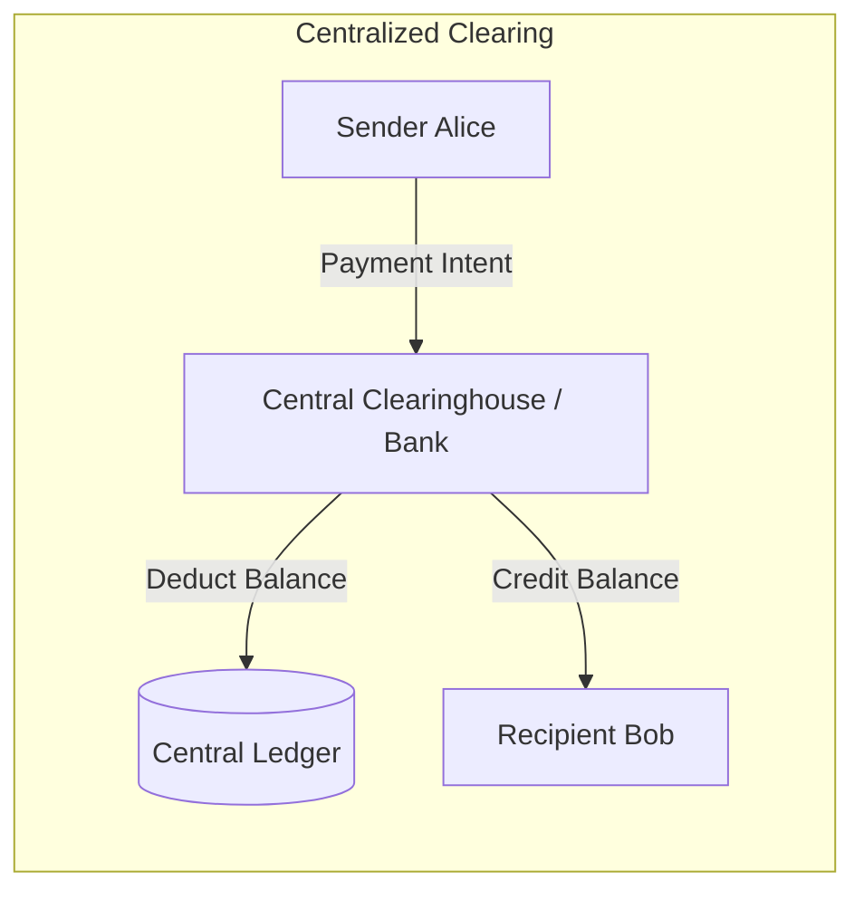
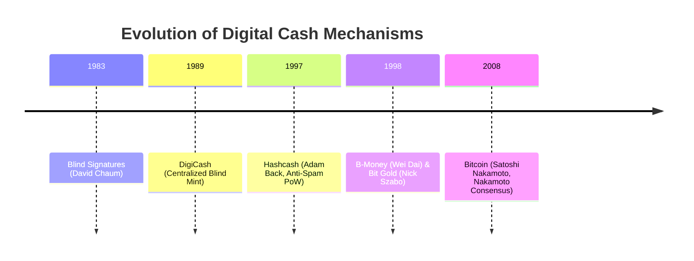
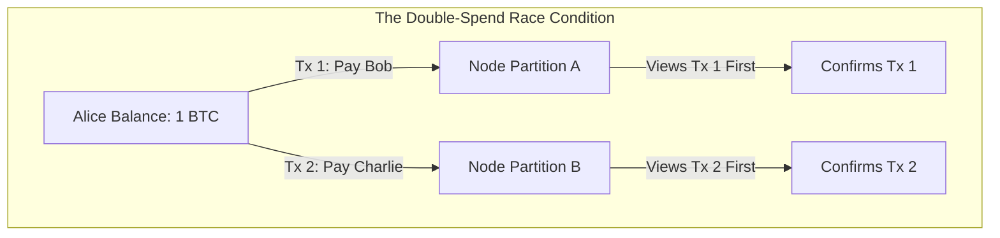

# The Double-Spending Problem and Digital Cash History

Digital data is inherently reproducible at near-zero marginal cost.
When an asset exists purely as bits, an owner can attempt to transmit the identical sequence of bytes to multiple recipients in parallel.
This failure mode is the double-spending problem.
Physical cash prevents double-spending through physical possession.
Once a physical banknote transfers hands, the original holder no longer possesses it.
Replicating this physical guarantee in software without relying on a central authority was the central computer science obstacle in the development of decentralized digital currency.

## Centralized Clearinghouses vs. Decentralized Verification

Traditional financial systems resolve the double-spending problem through centralized intermediaries.
Commercial banks and payment processors maintain a private, authoritative ledger of balances.

When Alice transfers ten dollars to Bob, the transaction is not an atomic swap of physical value between peers.
Instead, Alice sends an instruction to a central clearinghouse.
The clearinghouse verifies that Alice's account has sufficient balance, decrements her ledger balance, and increments Bob's ledger balance.
If Alice attempts to send that same balance to Charlie moments later, the clearinghouse rejects the second request because Alice's balance is already zero.

This centralized model carries specific architectural trade-offs:

- **Single Point of Failure:** Operational outages at the clearinghouse halt payments across the entire network.
- **Censorship Potential:** The operator maintains arbitrary power to block accounts, reverse settlements, or reject specific transactions.
- **Opaque State:** Users must trust that the operator does not secretly manipulate balances or run fractional reserves.
- **Rent Extraction:** The intermediary extracts processing fees on every state change because market participants lack alternative execution paths.

Decentralized verification replaces the authoritative intermediary with a shared protocol run across an untrusted network.
Every validator maintains a local copy of the full transaction history.
A transaction is valid only if every independent node can verify its cryptographic signatures and trace its input funds to unspent outputs.

| Architectural Dimension | Centralized Clearinghouse | Decentralized Network |
| :--- | :--- | :--- |
| **Authority** | Single institution or federation | Distributed node consensus |
| **Ledger Access** | Private, permissioned read and write | Public, permissionless read and write |
| **Double-Spend Prevention** | Database locks and serial ACID transactions | Cryptographic proofs, mempools, and consensus rules |
| **Settlement Finality** | Legal and institutional guarantees | Probabilistic or deterministic protocol finality |
| **Censorship Resistance** | Low (subject to jurisdiction and operator policy) | High (guaranteed by network distribution) |

## Pre-Bitcoin Digital Cash Systems

Decentralized currency did not emerge in a vacuum.
It represents the synthesis of several decades of cryptographic research and distributed systems experiments.

### DigiCash and Blind Signatures (1989)

David Chaum introduced blind signatures in 1983 and commercialized the technology through DigiCash in 1989.
Chaumian eCash achieved cryptographic anonymity for users while preventing unauthorized coin duplication.

The protocol relies on a cryptographic blinding technique where a user blinds a serial number before sending it to the mint.
The mint signs the blinded token with its private key and deducts the corresponding fiat balance from the user.
The user strips the blinding factor to reveal a valid coin signed by the mint.

$$m' = m \cdot r^e \pmod{n}$$

$$s' = (m')^d \pmod{n}$$

$$s = s' \cdot r^{-1} \equiv m^d \pmod{n}$$

When the coin is spent with a merchant, the merchant submits the coin to the mint.
The mint verifies its own signature and checks whether the coin's unique serial number has already been recorded in a database of spent coins.
If the serial number is absent, the mint credits the merchant and records the serial number as spent.

DigiCash solved user privacy, but it retained a fatal architectural flaw: centralization.
The mint remained the sole arbiter of double-spending.
When DigiCash declared bankruptcy in 1998, the mint ceased operations and the currency collapsed.

### Hashcash: Cost Functions for Sybil Resistance (1997)

Adam Back designed Hashcash in 1997 to mitigate email spam and denial-of-service attacks against internet servers.
Hashcash shifted the cost of message generation from near-zero to a measurable computational expense.

In Hashcash, a sender must find a pre-image value (a nonce) such that hashing the message header concatenated with the nonce produces a digest with a predefined number of leading zero bits.

$$\text{SHA-1}(\text{Header} \mathbin{\Vert} \text{Nonce}) < \text{Target}$$

Because cryptographic hash functions exhibit pre-image resistance, the sender has no shortcut other than brute-force iteration over potential nonce values.
Conversely, the recipient verifies the computation with a single hash evaluation.

Hashcash proved that computational work could serve as a rate-limiting mechanism.
However, Hashcash was not designed as money.
It lacked a ledger mechanism, meaning tokens could not be circulated or transferred without central tracking to prevent the reuse of historical work proofs.

### B-Money and Bit Gold (1998)

Wei Dai proposed b-money in 1998, outlining a decentralized protocol for anonymous electronic contracts.
In b-money, participants maintain synchronized local ledgers of account balances.
Creation of money required solving a computational puzzle, and transactions were broadcast over an unauthenticated network.
Dai proposed two protocols:
- A protocol where every participant maintains an identical database of balances, which failed to solve how nodes reach final agreement during network partitions.
- A protocol where a subset of participants (servers) verify transactions via an auction and bond-slashing mechanism, anticipating modern Proof of Stake.

Concurrently, Nick Szabo proposed Bit Gold.
Bit Gold chained computational puzzles together.
The solution to one puzzle became the seed for the next puzzle, creating a verifiable sequence of computational investment.
Szabo addressed the double-spending problem through a distributed registry of ownership titles.
However, Bit Gold lacked a Byzantine fault tolerant mechanism to resolve competing branches when multiple participants produced valid puzzle solutions simultaneously.

## The Missing Component: Nakamoto Consensus

Prior systems established the cryptographic primitives necessary for digital cash:
- Asymmetric keypairs provided non-repudiation of transactions.
- Cryptographic hash functions provided immutable content addressing.
- Proof of work provided unforgeable computational cost.

The missing component across all pre-Bitcoin attempts was a decentralized, time-stamping synchronization engine capable of resolving competing transaction histories in an untrusted network.
Without a synchronized global clock or a trusted coordinator, nodes could not definitively agree on the ordering of transactions.
If Alice created two conflicting transactions at the same time, different network partitions would observe different transactions first.

Satoshi Nakamoto solved this challenge in 2008 by uniting Proof of Work with a dynamic, cumulative-weight chain selection rule (the longest-chain rule).
Instead of voting by IP address, which is vulnerable to Sybil manipulation, nodes vote with computational hash power.
Transactions are packaged into ordered blocks, and each block references the hash of its parent.
The network reaches finality on transaction ordering by collectively treating the chain with the largest cumulative proof of work as the single source of truth.
This eliminated the need for a central clearinghouse and provided the first functional solution to the decentralized double-spending problem.
