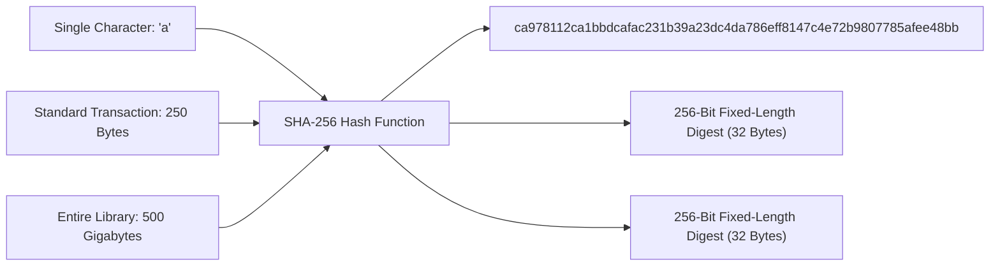
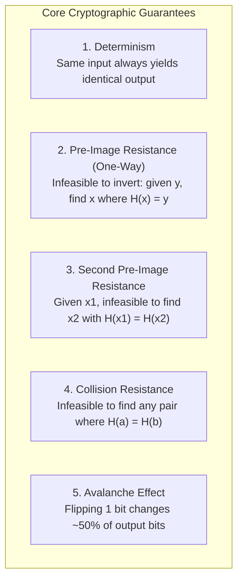
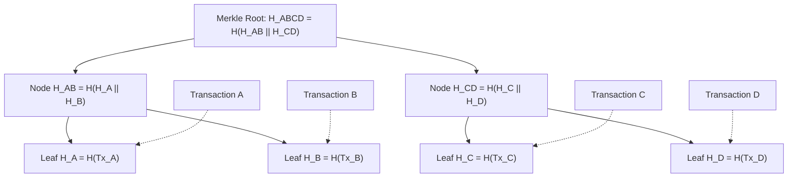
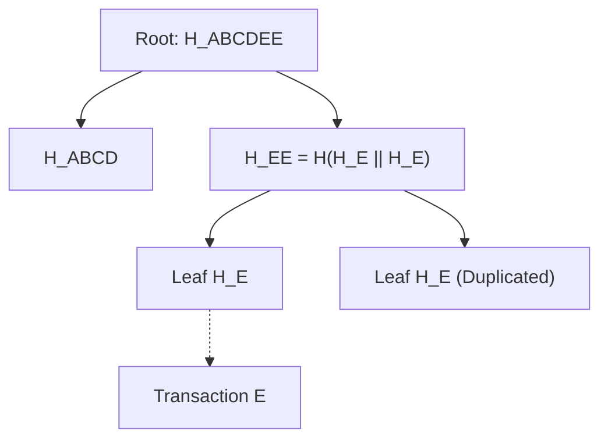
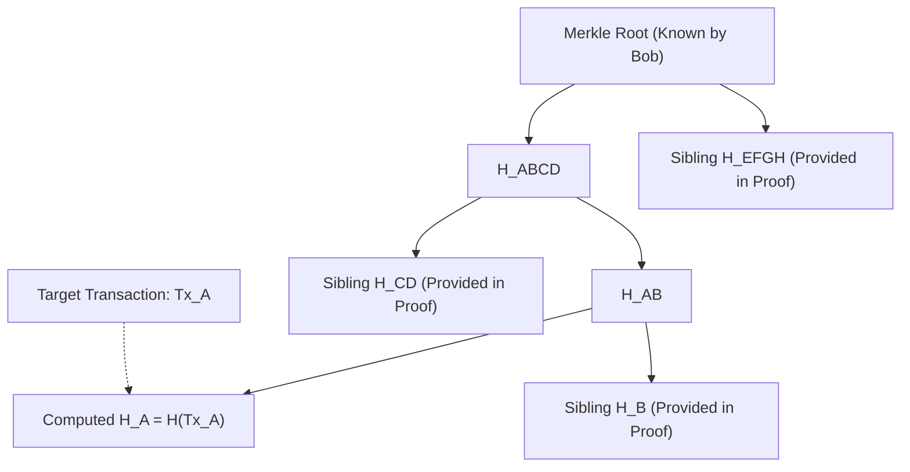
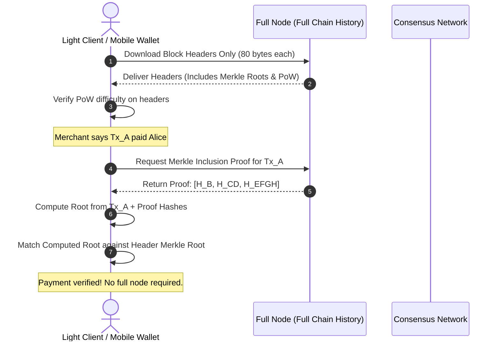

# Cryptographic Hash Functions and Merkle Trees

At the core of every blockchain protocol lies an unassuming mathematical primitive: the cryptographic hash function.
Without hash functions, there would be no tamper-evident blocks, no unforgeable transaction identifiers, no Proof of Work mining, and no efficient way for light clients to verify account balances.
To understand how distributed ledgers achieve integrity without a centralized database administrator, one must first grasp the mathematical mechanics of hashing and how hashes organize hierarchically into Merkle trees.

## The Intuition: Digital Fingerprints

In the physical world, human beings have unique biological fingerprints.
If a forensic investigator recovers a fingerprint from a crime scene, they can compare it against a database to uniquely identify a suspect.
You cannot reconstruct the physical human being from their fingerprint alone, but given both the human and the fingerprint, verification is immediate and unambiguous.

A cryptographic hash function serves as a digital fingerprint engine for information.
It takes any arbitrary digital file, whether a single letter, a financial transaction, an image, or an entire encyclopedia, and reduces it to a compact, fixed-size string of characters.



Regardless of whether the input is one byte or five hundred gigabytes, the output produced by a 256-bit hash function like SHA-256 is always exactly 256 bits (32 bytes), typically represented as a 64-character hexadecimal string.

## Mathematical Formalization

Mathematically, a cryptographic hash function $H$ is a deterministic mapping from an infinite domain of arbitrary-length bit strings to a finite codomain of fixed-length bit strings:

$$H: \{0, 1\}^* \to \{0, 1\}^n$$

In production blockchain implementations, the output length $n$ is typically 256 bits.
A standard computer function (like a simple checksum or CRC32) maps inputs to fixed outputs, but checksums are not secure.
To qualify as **cryptographically secure**, a hash function must satisfy five rigorous mathematical properties:



### 1. Determinism

For any given input $m$, evaluating $H(m)$ must always produce the identical output digest, whether computed today on a server in Tokyo or ten years from now on a phone in London.
If a function had any internal randomness, timestamps, or system-dependent state, independent nodes on a blockchain could never agree on whether a block header was valid.
Determinism provides the universal consistency required for decentralized consensus.

### 2. Pre-Image Resistance (The One-Way Property)

Pre-image resistance states that given a hash output $y$, it must be computationally impossible to calculate or discover the original input $x$ such that:

$$H(x) = y$$

A hash function is a computational one-way street.
It is simple to calculate forward, but impossible to invert backward.

Consider the physical analogy of blending a fruit smoothie:
If you place a banana, a strawberry, and a cup of milk into a blender and press blend, you quickly produce a pink smoothie.
Computing the forward direction is easy.
However, if someone hands you a glass of pink smoothie, it is physically impossible to reverse the process and reconstruct the original, unblemished strawberry and banana.

In SHA-256, because the output space is $2^{256}$, recovering an input $x$ by brute force requires an expected search of $2^{255}$ trial evaluations.
To grasp how immense $2^{256}$ is:
- The total number of atoms in the observable universe is estimated around $10^{80}$, which is roughly $2^{266}$.
- If every computer on Earth performed one billion hashes per second for the entire age of the universe (13.8 billion years), the network would have searched less than $0.000000000000000000000000000001\%$ of the total 256-bit keyspace.

### 3. Second Pre-Image Resistance (Weak Collision Resistance)

Second pre-image resistance states that given a specific input $x_1$, an adversary cannot find a distinct input $x_2$ ($x_1 \ne x_2$) such that:

$$H(x_1) = H(x_2)$$

Why is this property critical in blockchains?
Suppose Alice signs a transaction paying Bob 1 BTC, and the transaction hash is $H(Tx_1)$.
If second pre-image resistance were broken, Bob could craft a fraudulent transaction $Tx_2$ stating "Alice pays Bob 1,000 BTC" that hashes to the exact same digest $H(Tx_1)$.
Bob could substitute his fraudulent transaction into the network, and full nodes verifying the digital signature would accept it because the hash digest matches Alice's signature.
Second pre-image resistance guarantees that once a document or transaction is hashed, no alternative payload can masquerade under that same hash identity.

### 4. Collision Resistance (Strong Collision Resistance)

Collision resistance is a stronger requirement: it must be computationally infeasible to find *any* arbitrary pair of distinct inputs $x_1$ and $x_2$ such that:

$$H(x_1) = H(x_2) \quad \text{where } x_1 \ne x_2$$

Notice the difference:
- In second pre-image resistance, the attacker is challenged with a fixed, predefined target $x_1$.
- In collision resistance, the attacker has complete freedom to find *any two colliding inputs anywhere* in the universe.

Because the domain of possible inputs is infinite ($\{0, 1\}^*$) while the output space is finite ($\{0, 1\}^n$), collisions mathematically *must exist* by the Dirichlet Pigeonhole Principle.
However, collision resistance requires that finding a collision is computationally impossible in practice.

#### The Birthday Paradox and the Square Root Bound
In statistics, the **Birthday Paradox** demonstrates that in a room of just 23 people, the probability that two people share the same birthday exceeds 50 percent, even though there are 365 days in a year.
Because the attacker can compare any pair among many choices, the complexity of finding a collision scales not with $2^n$, but with the square root of the keyspace:

$$\mathcal{O}\left(2^{n/2}\right)$$

For SHA-256 ($n = 256$):
- Pre-image resistance security level: $2^{256}$ operations.
- Collision resistance security level: $2^{128}$ operations.

An operation budget of $2^{128}$ requires billions of years of modern computing power, keeping 256-bit hash functions collision-resistant against classical supercomputers today.
Older algorithms with shorter bit outputs have been broken:
- **MD5** (128-bit output, $2^{64}$ collision bound): Completely broken in 2004; practical collisions can now be generated on a smartphone in seconds.
- **SHA-1** (160-bit output, $2^{80}$ collision bound): Officially broken by Google in 2017 (the SHAttered attack).

### 5. The Avalanche Effect

The avalanche effect dictates that a microscopic change in the input data must cause an unpredictable, radical transformation in the resulting digest.
If you change a single bit in a 10-megabyte file, roughly 50 percent of the bits in the output hash must invert.

Consider this concrete demonstration using SHA-256:

```bash
$ echo -n "The quick brown fox jumps over the lazy dog" | sha256sum
d7a8fbb307d7809469ca9abcb0082e4f8d5651e46d3cdb762d02d0bf37c9e592

$ echo -n "The quick brown fox jumps over the lazy dog." | sha256sum
ef530b25d4add636772a9d612e4023746ac579e27c702a4e0529131a420023f2
```

Adding a single period at the end of the sentence completely scrambles the output.
No human or computer inspecting the two digests can discern that the inputs differed by only one punctuation mark.
This property ensures that hash functions behave like true mathematical random oracles, preventing attackers from using gradient descent or linear cryptanalysis to reverse-engineer input data.

## Major Production Hash Functions in Blockchains

Blockchains deploy different hash functions depending on their cryptographic design choices, performance needs, and hardware environments:

| Hash Function | Output Size | Internal Architecture | Primary Use Cases | Technical Rationale |
| :--- | :--- | :--- | :--- | :--- |
| **SHA-256** | 256 bits | Merkle-Damgård Construction | Bitcoin (PoW, Merkle roots, Address derivation) | Standardized by NIST; battle-tested security; native hardware acceleration in modern CPUs and ASICs. |
| **Keccak-256** | 256 bits | Sponge Construction (Keccak permutation) | Ethereum (EVM hashing, storage keys, account addresses) | Winner of NIST SHA-3 competition; immune to length-extension attacks that affect Merkle-Damgård functions. |
| **RIPEMD-160** | 160 bits | Merkle-Damgård Construction | Bitcoin address compression | Generates short 20-byte digests; combined with SHA-256 to produce compact Bitcoin public key hashes (P2PKH). |
| **BLAKE3** | 256 bits | Tree-based Merkle construction | Solana tooling, Aleo, high-throughput verification | Highly parallelizable across multi-core CPUs and SIMD lanes; significantly faster than SHA-256 and Keccak. |
| **Poseidon** | Variable | Algebraic sponge over prime fields | Zero-Knowledge rollups (Starknet, zkSync, Scroll) | Optimized for arithmetic circuits; requires drastically fewer constraints in ZK-SNARKs and ZK-STARKs. |

## Merkle Trees: Hierarchical Cryptographic Verification

Blockchains group transactions into blocks.
In networks like Bitcoin and Ethereum, a single block can contain thousands of transactions.
If a block simply listed transactions linearly, verifying whether a specific payment was included would require downloading and scanning the entire block payload.

In 1979, computer scientist Ralph Merkle patented the **Merkle Tree** (or binary hash tree), a hierarchical data structure that summarizes massive datasets into a single cryptographic root hash while allowing efficient, logarithmic verification of any individual item.

### Merkle Tree Construction Step-by-Step

Let us walk through how a Merkle tree is constructed from four transactions: $Tx_A$, $Tx_B$, $Tx_C$, and $Tx_D$.



1. **Step 1: Hash Individual Leaves**
   Each transaction is independently hashed to produce its leaf digest:
   $$H_A = H(Tx_A), \quad H_B = H(Tx_B), \quad H_C = H(Tx_C), \quad H_D = H(Tx_D)$$

2. **Step 2: Pair and Concatenate**
   Adjacent leaves are paired together, concatenated end-to-end ($\mathbin{\Vert}$), and hashed:
   $$H_{AB} = H(H_A \mathbin{\Vert} H_B)$$
   $$H_{CD} = H(H_C \mathbin{\Vert} H_D)$$

3. **Step 3: Recurse to the Root**
   This pairing and hashing process repeats level by level up the tree until only a single hash remains:
   $$H_{ABCD} = H(H_{AB} \mathbin{\Vert} H_{CD})$$
   This final 32-byte digest is the **Merkle Root**.

The Merkle root acts as a cryptographic seal over every single transaction in the tree.
Because of the avalanche effect, modifying a single character, amount, or recipient address in $Tx_A$ alters $H_A$, which in turn alters $H_{AB}$, which in turn completely scrambles the Merkle root $H_{ABCD}$.

### Handling Odd Numbers of Transactions

What happens if a block contains an odd number of transactions (say, five transactions)?
A binary tree requires pairs.
Standard implementations (including Bitcoin) resolve this by duplicating the final un-paired transaction hash:



The node $H_E$ is duplicated and hashed with itself to form $H_{EE} = H(H_E \mathbin{\Vert} H_E)$, allowing tree balancing to proceed to the root.

## Merkle Proofs and Logarithmic Verification

The true computational power of a Merkle tree is its ability to produce **Merkle Proofs** (audit paths).
A Merkle proof allows a verifier to confirm that a specific transaction exists inside a block **without downloading or parsing any other transactions in that block**.

### Concrete Walkthrough: Proving Transaction $Tx_A$

Imagine a block containing eight transactions ($Tx_A$ through $Tx_H$).
Alice wants to prove to Bob that her transaction $Tx_A$ was confirmed in this block.
Bob does not have the full block; he only has the 32-byte **Merkle Root** stored in the block header.



To prove inclusion, Alice does not need to send all eight transactions.
Alice sends Bob a compact Merkle proof consisting of:
1. The raw transaction data: $Tx_A$.
2. The sibling hashes along the path from $Tx_A$ to the root: $[H_B, H_{CD}, H_{EFGH}]$.

Bob executes the following verification steps:
1. Compute the leaf hash:
   $$H_A = H(Tx_A)$$
2. Combine $H_A$ with sibling $H_B$ to compute the parent:
   $$H_{AB} = H(H_A \mathbin{\Vert} H_B)$$
3. Combine $H_{AB}$ with sibling $H_{CD}$:
   $$H_{ABCD} = H(H_{AB} \mathbin{\Vert} H_{CD})$$
4. Combine $H_{ABCD}$ with sibling $H_{EFGH}$:
   $$\text{ComputedRoot} = H(H_{ABCD} \mathbin{\Vert} H_{EFGH})$$
5. Compare:
   $$\text{ComputedRoot} \stackrel{?}{=} \text{MerkleRoot}$$

If the computed root matches the trusted Merkle root in the block header, Bob has mathematical certainty that $Tx_A$ is included in the block.
If Alice attempted to modify any detail in $Tx_A$, the computed root would fail to match.

### The Mathematics of Logarithmic Efficiency

The number of hashes required in a Merkle proof scales logarithmically with the number of transactions $N$:

$$\text{Proof Size} = \lceil \log_2 N \rceil \text{ hashes}$$

Let us contrast linear verification versus Merkle verification:

| Block Capacity ($N$ Transactions) | Raw Transactions to Download (Linear) | Merkle Proof Hashes Needed ($\lceil \log_2 N \rceil$) | Proof Payload Size (at 32 bytes/hash) |
| :--- | :--- | :--- | :--- |
| **4 Transactions** | 4 transactions (~2 KB) | 2 hashes | 64 bytes |
| **16 Transactions** | 16 transactions (~8 KB) | 4 hashes | 128 bytes |
| **1,024 Transactions** | 1,024 transactions (~500 KB) | 10 hashes | 320 bytes |
| **4,096 Transactions** | 4,096 transactions (~2 MB) | 12 hashes | 384 bytes |
| **1,048,576 Transactions** | 1,048,576 transactions (~500 MB) | 20 hashes | 640 bytes |

Even if a block held one million transactions, an SPV client or mobile wallet only needs **20 hashes (640 bytes)** to verify a transaction with absolute mathematical certainty.

## Simplified Payment Verification (SPV) and Light Clients

In Section 8 of the Bitcoin whitepaper, Satoshi Nakamoto introduced **Simplified Payment Verification (SPV)**.
SPV leverages Merkle trees to enable secure participation on smartphones, IoT devices, and browsers without downloading hundreds of gigabytes of blockchain data.


