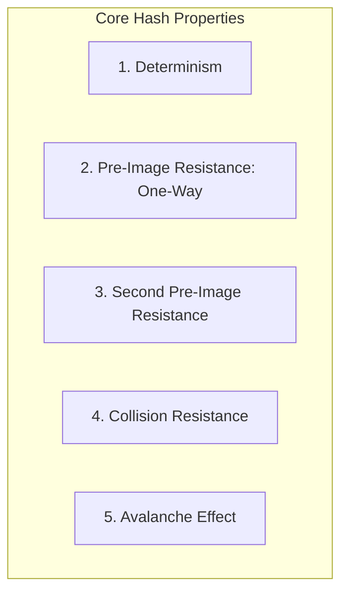
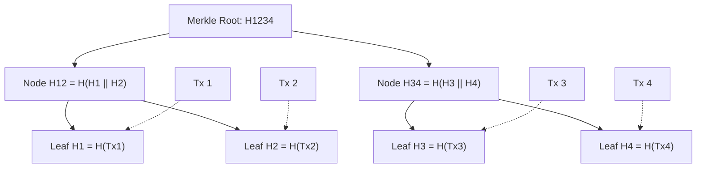
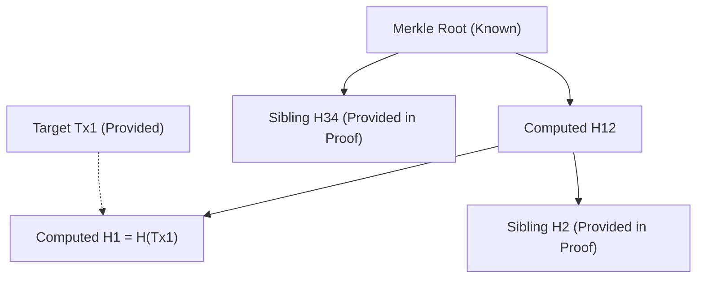
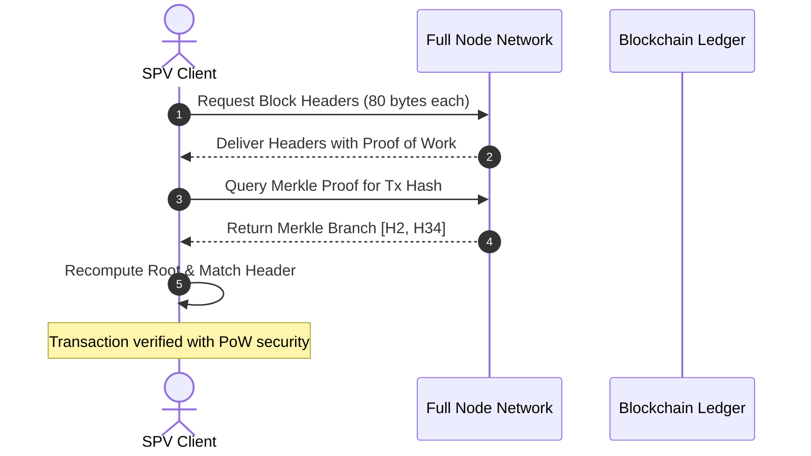

# Cryptographic Hash Functions and Merkle Trees

Cryptographic hash functions are the mathematical workhorses of blockchain architectures.
They provide data integrity, tamper evidence, address derivation, and the computational proof foundations that enable decentralized consensus.
Understanding their mathematical properties and how they compose into hierarchical data structures like Merkle trees is essential for analyzing modern distributed systems.

## What is a Cryptographic Hash Function?

A cryptographic hash function $H$ is a deterministic mathematical algorithm that maps an arbitrary-length binary input sequence to a fixed-length bit string:

$$H: \{0, 1\}^* \to \{0, 1\}^n$$

In production blockchain systems, the output space $n$ is commonly 256 bits (32 bytes).
To be cryptographically secure for use in distributed ledgers, a function must satisfy five primary criteria:

### 1. Determinism

For any given input $m$, evaluating $H(m)$ must always yield the exact same bit string output.
Every validator across the decentralized network must reach identical state outcomes when computing the hash of identical inputs.

### 2. Pre-Image Resistance (One-Way Property)

Given a hash output $y \in \{0, 1\}^n$, it must be computationally infeasible to find any original input $x$ such that:

$$H(x) = y$$

For a 256-bit hash function, recovering $x$ by brute force requires an expected search space of $2^{256}$ operations, exceeding the thermodynamic capacity of the observable universe.

### 3. Second Pre-Image Resistance (Weak Collision Resistance)

Given a specific input $x_1$, it must be computationally infeasible to discover a distinct input $x_2$ ($x_1 \ne x_2$) such that:

$$H(x_1) = H(x_2)$$

This property guarantees that an adversary cannot craft a fraudulent transaction that generates the identical hash digest as an authentic transaction.

### 4. Collision Resistance (Strong Collision Resistance)

It must be computationally infeasible to locate *any* two arbitrary, distinct inputs $x_1$ and $x_2$ such that:

$$H(x_1) = H(x_2)$$

By the **Birthday Paradox**, finding an arbitrary collision requires significantly fewer operations than inverting a specific pre-image:

$$\mathcal{O}\left(2^{\frac{n}{2}}\right)$$

For a 256-bit hash function, finding an arbitrary collision requires approximately $2^{128}$ operations, well beyond current classical computing thresholds.

### 5. Avalanche Effect

A negligible modification in the input message (such as flipping a single bit) must cause a radical, unpredictable transformation in the resulting digest.
Statistically, approximately 50 percent of the output bits should change value, preventing linear cryptanalysis or output prediction.

## Production Hash Functions

Different blockchain networks prioritize different hash architectures based on hardware security, standardization, and execution efficiency:

| Algorithm | Digest Size | Architecture | Primary Blockchain Deployments |
| :--- | :--- | :--- | :--- |
| **SHA-256** | 256 bits | Merkle-Damgård Construction | Bitcoin (PoW, Merkle roots, Address hashing) |
| **Keccak-256** | 256 bits | Sponge Construction (Cryptographic Permutation) | Ethereum (EVM native hashing, State roots) |
| **RIPEMD-160** | 160 bits | Merkle-Damgård | Bitcoin address compression (Used after SHA-256) |
| **BLAKE3** | 256 bits | Tree Hash Mode (Bao Tree / Merkle-Damgård derivative) | Aleo, Solana tooling, high-throughput verification |
| **Poseidon** | Variable | Algebraic sponge over prime fields | Zero-knowledge proof systems (Starknet, zkSync) |

## Merkle Trees: Construction and Verification

A Merkle tree (binary hash tree) is a hierarchical data structure where every leaf node contains the cryptographic hash of a data block (such as a transaction), and every non-leaf node contains the hash of its concatenated child nodes:

$$Parent = H(Child_{\text{left}} \mathbin{\Vert} Child_{\text{right}})$$

### Odd Leaf Handling

When a block contains an odd number of transactions, standard implementations duplicate the final transaction hash to maintain a balanced binary tree:

$$H_{odd} = H(Leaf_n \mathbin{\Vert} Leaf_n)$$

## Merkle Proofs and Inclusion Verification

Merkle trees enable logarithmic verification of data inclusion.
To verify that a specific transaction exists inside a block containing $N$ transactions, a client does not need to download the full block payload.
The client only requires the Merkle root from the 80-byte block header and an authentication path (the sibling hashes along the branch to the root).

The number of hashes required to verify inclusion scales as:

$$k = \lceil \log_2 N \rceil$$

For a block containing 4,096 transactions, a verifier requires only 12 hashes (384 bytes) instead of downloading all 4,096 transactions (approximately 2 MB).

To prove that transaction $Tx_1$ is included in the root above:
1. The prover provides the raw transaction $Tx_1$ and two sibling hashes: $[H_2, H_{34}]$.
2. The verifier computes $H_1 = H(Tx_1)$.
3. The verifier concatenates and hashes $H_1$ with $H_2$ to compute $H_{12} = H(H_1 \mathbin{\Vert} H_2)$.
4. The verifier concatenates and hashes $H_{12}$ with $H_{34}$ to compute $Root' = H(H_{12} \mathbin{\Vert} H_{34})$.
5. The verifier checks whether $Root' == Root$.

If any bit in $Tx_1$ was modified, the calculated $H_1$ diverges, propagating up the tree and causing $Root'$ to mismatch the trusted block header root.

## Simplified Payment Verification (SPV)

Satoshi Nakamoto introduced Simplified Payment Verification in Section 8 of the Bitcoin whitepaper.
SPV clients allow resource-constrained environments (such as mobile phones and embedded hardware) to verify transactions with cryptographic certainty without executing a full node:

1. **Header Synchronization:** The client downloads only block headers (80 bytes per 10 minutes, approximately 4.2 MB per year).
2. **Proof Verification:** When the client expects a payment, it requests a Merkle inclusion proof for that specific transaction from a full node.
3. **PoW Depth:** By verifying that the Merkle root is committed inside a valid block header buried beneath cumulative Proof of Work, the client confirms transaction validity with high probabilistic security.
