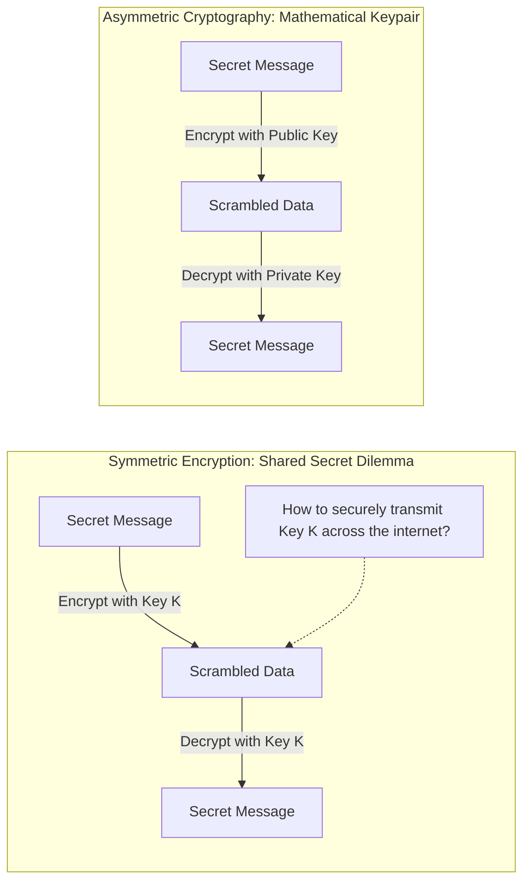
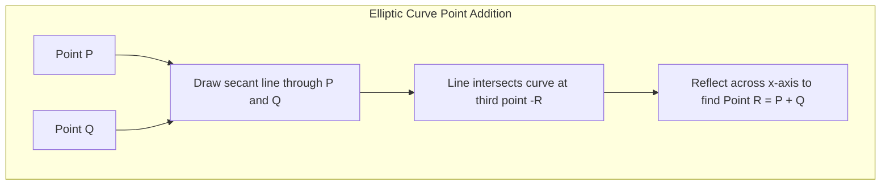
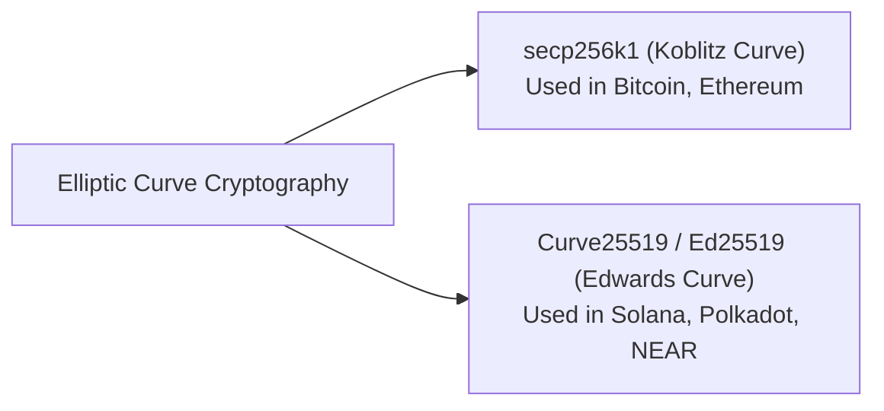
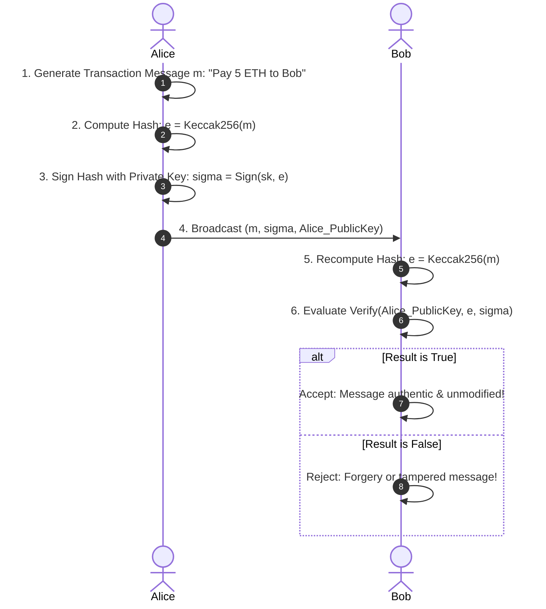
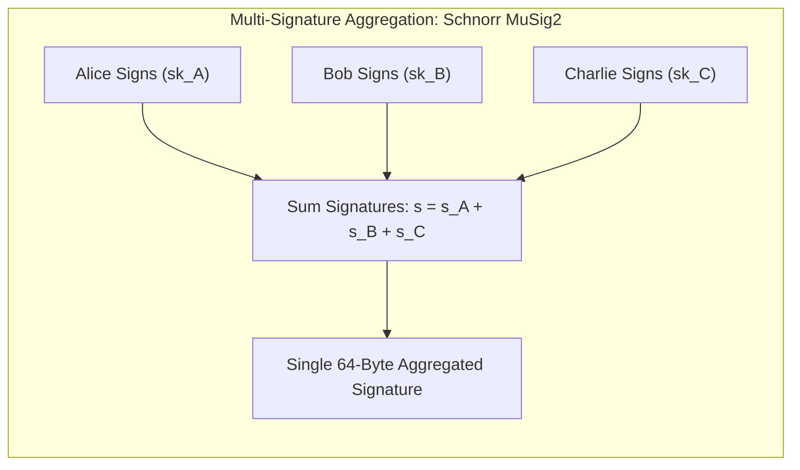
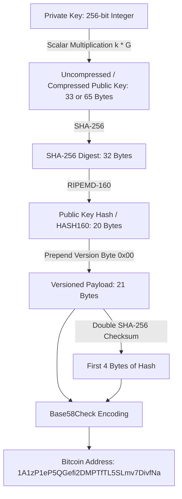
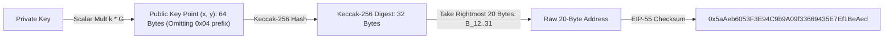

# Asymmetric Cryptography and Digital Signatures

In centralized financial systems, your identity and authority are enforced through credentials issued by intermediaries: bank account numbers, physical signatures on checks, passwords, and two-factor SMS codes.
If someone steals your credit card number, they can spend your money.
The bank resolves this by acting as an ultimate arbiter: they verify identity documents, reverse fraudulent charges, and issue new plastic cards.

In a decentralized blockchain, there is no customer support desk, no fraud department, and no identity verification bureau.
Ownership must be mathematically absolute.
Anyone who knows a secret must be able to spend funds, and anyone who does not know that secret must be physically and mathematically barred from doing so.
This is achieved through **asymmetric cryptography** (public-key cryptography) and **digital signatures**.

## Symmetric vs. Asymmetric Cryptography

To appreciate asymmetric cryptography, one must first understand the historical limitation of symmetric encryption.

In symmetric cryptography (such as AES):
- The sender and the recipient use the exact same secret key $K$ to encrypt and decrypt information.
- This creates the **Key Distribution Problem**: How do two parties who have never met in person share the secret key $K$ over an insecure internet without an eavesdropper intercepting it?

In the late 1970s, Whitfield Diffie, Martin Hellman, and Ralph Merkle solved this dilemma by introducing **Asymmetric Cryptography**.
Instead of a single shared key, asymmetric systems generate a **mathematically linked keypair**:
1. **The Private Key ($sk$ or $d$):** Kept strictly confidential by its owner. It is used to generate digital signatures and authorize transfers.
2. **The Public Key ($pk$ or $Q$):** Broadcast freely to the entire world. Anyone can use it to verify signatures generated by the corresponding private key.

Crucially, the relationship between the two keys is **one-way**:
It is easy to compute the public key from the private key, but mathematically impossible to derive the private key from the public key.

## Trapdoor One-Way Functions

Asymmetric cryptography relies on mathematical structures called **trapdoor one-way functions**.
A trapdoor function is an operation that is easy to compute in one direction, but practically impossible to compute in reverse unless you possess a special piece of secret information called the "trapdoor":

$$y = f(x) \quad \text{(easy to compute)}$$
$$x = f^{-1}(y) \quad \text{(infeasible without trapdoor)}$$

Modern cryptography relies primarily on two families of trapdoor mathematical problems:
- **Integer Factorization (RSA):** Easy to multiply two massive prime numbers together ($N = p \cdot q$), but computationally infeasible to factor the product $N$ back into its constituent primes $p$ and $q$.
- **The Discrete Logarithm Problem on Elliptic Curves (ECC):** Easy to multiply a point on an elliptic curve by a scalar integer, but computationally infeasible to determine the scalar integer given only the starting and resulting points.

Because of hardware efficiency and key size, modern blockchains almost universally choose **Elliptic Curve Cryptography (ECC)** over RSA.

| Security Level | RSA Key Size | Elliptic Curve Key Size | Performance Advantage |
| :--- | :--- | :--- | :--- |
| **80-bit Security** | 1,024 bits | 160 bits | ECC is ~6x smaller |
| **128-bit Security** | 3,072 bits | 256 bits | ECC is ~12x smaller |
| **256-bit Security** | 15,360 bits | 512 bits | ECC is ~30x smaller |

A 256-bit elliptic curve key provides the identical cryptographic security margin as a 3,072-bit RSA key, requiring drastically less network bandwidth, disk storage, and computational overhead on blockchain nodes.

## Elliptic Curve Cryptography (ECC) Mechanics

An elliptic curve over real numbers is defined by the algebraic equation:

$$y^2 = x^3 + ax + b$$

For cryptographic applications, curves are not evaluated over continuous real numbers (which introduce floating-point rounding errors).
Instead, they are evaluated over a **finite field** modulo a massive prime number $p$ ($\mathbb{F}_p$):

$$y^2 \equiv x^3 + ax + b \pmod p$$

Under modulo arithmetic, the continuous smooth curve transforms into a discrete lattice of points bounded within an integer grid.
However, the algebraic group properties of the curve are preserved.

### The Group Law: Point Addition and Point Doubling

We can define an arithmetic addition operation on the points of an elliptic curve:
1. **Point Addition ($P + Q$):** To add two distinct points $P$ and $Q$, draw a straight line through them. The line will intersect the curve at exactly one third point, $-R$. Reflect $-R$ across the horizontal $x$-axis to obtain the result: $R = P + Q$.
2. **Point Doubling ($P + P = 2P$):** To add a point $P$ to itself, draw the line tangent to the curve at point $P$. Find the intersection point $-R$ and reflect it across the $x$-axis to obtain $2P$.

### Scalar Point Multiplication

By repeatedly doubling and adding, we can define scalar multiplication: multiplying an elliptic curve point $G$ by an integer $k$:

$$P = k \cdot G = \underbrace{G + G + \dots + G}_{k \text{ times}}$$

Using the **double-and-add algorithm**, computing $k \cdot G$ requires only $\mathcal{O}(\log k)$ operations.
Even when $k$ is a massive 256-bit integer, a computer calculates $k \cdot G$ in a fraction of a millisecond.

### The Elliptic Curve Discrete Logarithm Problem (ECDLP)

The one-way security of elliptic curve cryptography rests entirely on the **ECDLP**:
- Given the integer $k$ and the base generator point $G$, calculating $P = k \cdot G$ is instantaneous.
- Given only the resulting point $P$ and the generator point $G$, it is computationally impossible to determine the scalar $k$.

In blockchain architecture:
- **Private Key ($k$):** A randomly chosen 256-bit integer:
  $$k \in [1, n-1]$$
- **Public Key ($P$):** The point $(x, y)$ on the elliptic curve obtained by scalar multiplication:
  $$P = k \cdot G$$

To discover someone's private key from their public key, an attacker must solve the discrete logarithm problem over the finite field, which requires an expected $\mathcal{O}(\sqrt{n})$ operations using Pollard's rho algorithm (roughly $2^{128}$ operations for a 256-bit curve), which is computationally infeasible.

## Production Curve Standards: secp256k1 vs. Ed25519

Different blockchains select different elliptic curve specifications based on design trade-offs:

### 1. secp256k1 (Bitcoin and Ethereum)

Specified by Certicom's Standards for Efficient Cryptography (SEC), secp256k1 is a Koblitz curve defined by:

$$y^2 \equiv x^3 + 7 \pmod p$$

where $p = 2^{256} - 2^{32} - 977$.
- **Why Satoshi Nakamoto Chose It:** Most commercial systems used NIST curves (such as secp256r1). Satoshi specifically avoided NIST curves out of concern that the United States National Security Agency (NSA) had introduced hidden mathematical backdoors into NIST parameter generation. The parameters of secp256k1 were chosen deterministically without arbitrary constants.
- **Koblitz Efficiency:** The special mathematical structure of $a = 0$ enables fast endomorphism point multiplication, speeding up signature verification by up to 30 percent.

### 2. Ed25519 and Curve25519 (Solana, Polkadot, Cosmos)

Designed by cryptographer Daniel J. Bernstein (djb) in 2011, Ed25519 is a Twisted Edwards curve defined by:

$$-x^2 + y^2 = 1 - \frac{121665}{121666} x^2 y^2 \pmod{2^{255} - 19}$$

- **Complete Addition Formulas:** Point addition on Ed25519 has no exceptional cases (such as points at infinity or dividing by zero). This makes the implementation naturally immune to side-channel timing attacks.
- **High Performance:** Signature verification on Ed25519 is significantly faster than ECDSA on secp256k1, making it the standard for high-throughput networks like Solana.

## Digital Signatures: Proving Authorization Without Revealing Secrets

A digital signature is a mathematical proof that fulfills three essential security requirements:
1. **Authentication:** Proves that the message was created by the holder of the specific private key.
2. **Non-Repudiation:** The signer cannot claim they did not sign the message, because no one else possesses their private key.
3. **Integrity:** Proves that the message was not modified in transit by any intermediate node.

A digital signature scheme consists of three distinct algorithms:

$$\text{KeyGen}() \to (sk, pk)$$
$$\text{Sign}(sk, m) \to \sigma$$
$$\text{Verify}(pk, m, \sigma) \to \{\text{True}, \text{False}\}$$

## The Elliptic Curve Digital Signature Algorithm (ECDSA)

Bitcoin and Ethereum traditionally use ECDSA over secp256k1.
Let us examine the exact mathematical steps executed under the hood.

### 1. Signature Generation

To sign a transaction payload $m$ using private key $d$:
1. Compute the cryptographic hash of the message:
   $$z = \text{Hash}(m)$$
2. Generate a cryptographically secure random integer $k \in [1, n-1]$ called the **ephemeral key** (or nonce).
3. Compute the curve point:
   $$(x_1, y_1) = k \cdot G$$
4. Compute the scalar $r$:
   $$r = x_1 \pmod n$$
   If $r = 0$, pick a fresh random $k$ and restart.
5. Compute the scalar $s$:
   $$s = k^{-1} (z + r \cdot d) \pmod n$$
   If $s = 0$, pick a fresh random $k$ and restart.

The resulting digital signature $\sigma$ is the pair of 256-bit integers:

$$\sigma = (r, s)$$

### The Catastrophic Danger of Nonce Reuse

Notice step 2 in signature generation: the ephemeral key $k$ must be completely unique and unpredictable for every single signature.
If a signer uses the **identical nonce $k$** to sign two different transactions ($m_1$ and $m_2$), an outside observer can derive the private key using basic high-school algebra!

Given two signatures with the same $r$:
$$s_1 = k^{-1}(z_1 + r \cdot d) \pmod n$$
$$s_2 = k^{-1}(z_2 + r \cdot d) \pmod n$$

Subtracting the two equations eliminates the private key $d$:
$$s_1 - s_2 = k^{-1}(z_1 - z_2) \pmod n$$
$$k = (z_1 - z_2)(s_1 - s_2)^{-1} \pmod n$$

Once the nonce $k$ is calculated, the attacker solves for the private key $d$:
$$d = r^{-1}(s_1 \cdot k - z_1) \pmod n$$

This exact failure occurred in the PlayStation 3 hack in 2010 (Sony hardcoded a static nonce $k$) and caused millions of dollars in Bitcoin wallet thefts in 2013 due to broken pseudo-random number generators on Android devices.
To solve this permanently, modern implementations use **RFC 6979**, which derives $k$ deterministically by hashing the private key and the message:

$$k = \text{HMAC-SHA256}(d \mathbin{\Vert} z)$$

This guarantees that $k$ is always mathematically unpredictable to outsiders, completely unique for each message, and 100% deterministic.

### 2. Signature Verification

Given the public key $Q$, the message hash $z$, and the signature $(r, s)$, any node verifies correctness:
1. Verify that $r, s \in [1, n-1]$.
2. Calculate the modular inverse of $s$:
   $$w = s^{-1} \pmod n$$
3. Calculate two scalars:
   $$u_1 = z \cdot w \pmod n, \quad u_2 = r \cdot w \pmod n$$
4. Calculate the curve point:
   $$(x_1, y_1) = u_1 \cdot G + u_2 \cdot Q$$
5. The signature is valid if and only if:
   $$r \equiv x_1 \pmod n$$

### 3. Public Key Recovery (The `v` Parameter)

In Ethereum, transactions do not explicitly include the sender's 64-byte public key.
Instead, Ethereum utilizes **public key recovery**.
Given the signature $(r, s)$ and an additional recovery identifier byte $v \in \{27, 28\}$ (or $v \in \{35, 36 + 2 \cdot \text{ChainID}\}$ under EIP-155), the EVM opcode `ecrecover` reconstructs the sender's public key point directly from the signature.
This saves 64 bytes of calldata per transaction, significantly reducing on-chain gas costs.

## Schnorr Signatures and Linear Aggregation

In 2021, Bitcoin activated the Taproot soft fork (BIP-340), upgrading its signature scheme from ECDSA to **Schnorr Signatures**.
Claus Schnorr patented his signature scheme in 1990, which prevented its inclusion in early cryptographic standards.
When the patent expired in 2008, ECDSA had already been standardized.

Schnorr signatures are mathematically simpler,provably secure under standard random oracle assumptions, and natively **linear**:

Under Schnorr signatures:
- **Linearity:** The sum of multiple signatures equals the signature of the sum of the keys:
  $$s_{\text{agg}} = \sum s_i, \quad Q_{\text{agg}} = \sum Q_i$$
- **Native Multi-Signatures (MuSig2):** A complex 3-of-3 multi-signature transaction between Alice, Bob, and Charlie can be aggregated off-chain into a single standard 64-byte signature that looks indistinguishable from a single-user transaction on the blockchain.
- **Privacy and Scalability:** On-chain verifiers do not need to know that multiple signers were involved, preserving multi-sig privacy and cutting transaction verification overhead.

## Address Derivation Pipelines

A public key is not the same as a blockchain address.
Public keys are large points on a mathematical curve.
Blockchains pass public keys through multi-stage hashing pipelines to produce compact, checksummed addresses that guard against user typing errors.

### 1. Bitcoin Address Derivation (Legacy P2PKH)

1. **Private to Public Key:** $P = k \cdot G$ (produces a 33-byte compressed public key).
2. **Double Hash (HASH160):**
   $$\text{Hash160} = \text{RIPEMD-160}\big(\text{SHA-256}(P)\big)$$
   This reduces the public key to a compact 20-byte digest.
3. **Checksum Protection:** Prepend a network version byte ($0x00$ for Bitcoin mainnet) and compute a double SHA-256 hash. The first 4 bytes of that hash serve as a checksum.
4. **Base58Check Encoding:** Encodes the 25-byte payload using an alphabet that intentionally excludes visually ambiguous characters ($0, O, I, l$) to prevent human transcription errors.

### 2. Ethereum Address Derivation

Ethereum uses a simpler derivation pipeline based on Keccak-256:

1. Compute the uncompressed 64-byte public key point $(x, y)$.
2. Compute the Keccak-256 hash of the 64 bytes.
3. Keep only the **rightmost 20 bytes** (last 40 hexadecimal characters).
4. Prepend `0x` to form the raw address.
5. **EIP-55 Mixed-Case Checksum:** The capitalization of individual hexadecimal letters is determined by the hash of the lowercase address string. If a user mistypes a single character, the client detects a checksum mismatch and rejects the transaction before broadcast.
