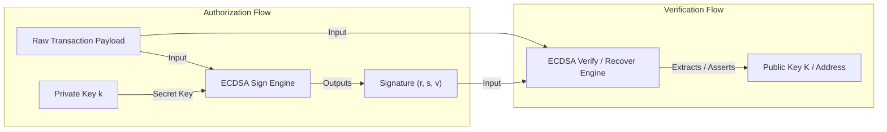
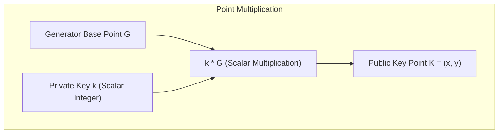
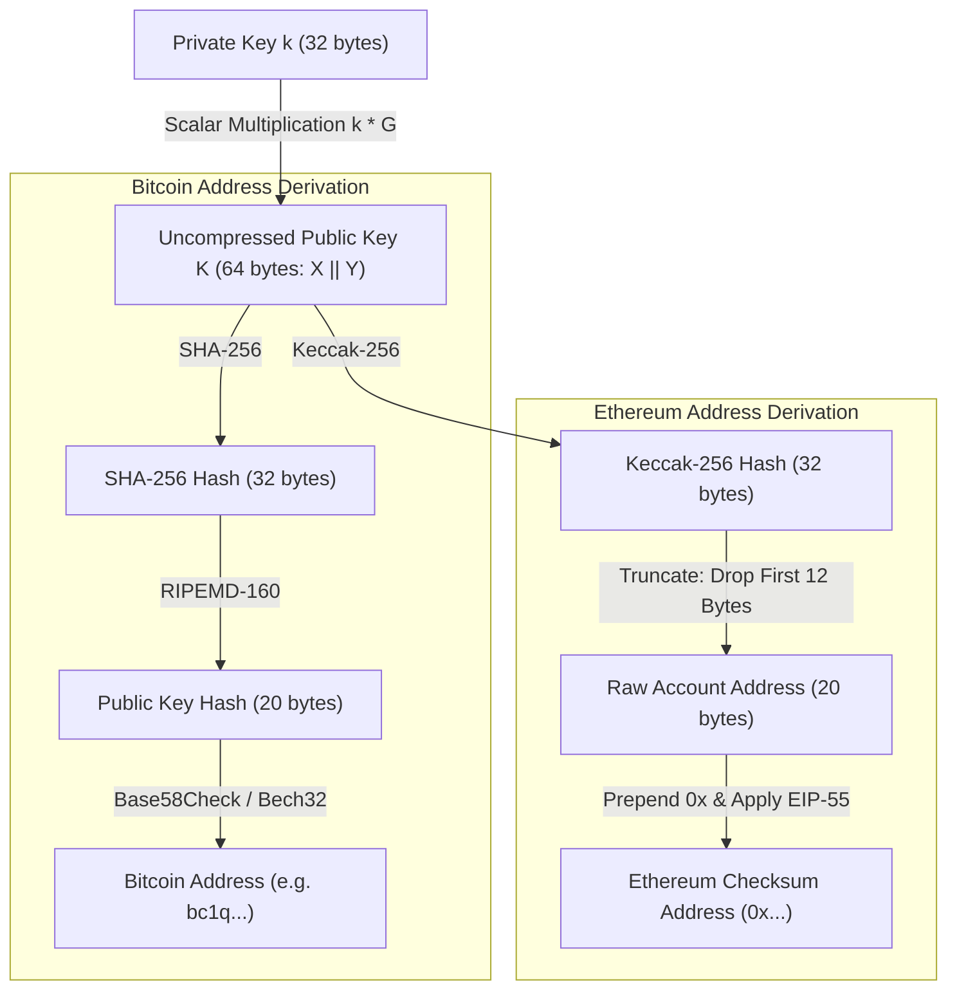

# Asymmetric Cryptography and Digital Signatures

Distributed ledgers operate without centralized account directories or password databases.
Instead, user identity, asset ownership, and transaction authorization rely entirely on asymmetric cryptography.
A user proves ownership of funds by generating a digital signature using a private key, and every network participant verifies this signature using the corresponding public key.

## Symmetric vs. Asymmetric Cryptography

Symmetric cryptography uses a shared secret key for both encryption and decryption.
In a decentralized network of thousands of untrusted participants, symmetric encryption cannot establish identity because sharing the secret key compromises authorization authority.

Asymmetric cryptography decouples authority from verification by using mathematically linked keypairs:

- **Private Key ($k$):** A secret, randomly generated scalar retained exclusively by the account owner to sign transactions.
- **Public Key ($K$):** An open point derived mathematically from the private key, distributed to the network to verify signatures.

## Elliptic Curve Cryptography (ECC)

Early public-key cryptosystems such as RSA rely on the difficulty of prime factorization.
RSA requires key lengths of at least 3,072 bits to provide 128 bits of cryptographic security, imposing prohibitive transaction payload sizes and verification costs on blockchain networks.

Blockchains use Elliptic Curve Cryptography (ECC).
ECC achieves 128-bit security using 256-bit keys, reducing transaction byte sizes by more than 90 percent compared to RSA equivalents.

### The Mathematics of Elliptic Curves

An elliptic curve over a finite field $\mathbb{F}_p$ is defined by the Weierstrass equation:

$$y^2 \equiv x^3 + ax + b \pmod{p}$$

Bitcoin and Ethereum standardize on the **secp256k1** curve parameters specified by Certicom:

$$y^2 \equiv x^3 + 7 \pmod{p}$$

where $p$ is the prime integer:

$$p = 2^{256} - 2^{32} - 977$$

The curve specifies a fixed generator base point $G$ with a large prime order $n$.
A private key $k$ is an integer chosen uniformly at random from the range $[1, n-1]$.
The corresponding public key $K$ is the curve point computed by scalar multiplication:

$$K = k \cdot G$$

Point multiplication on an elliptic curve represents repeated point addition:

$$k \cdot G = \underbrace{G + G + \dots + G}_{k \text{ times}}$$

Computing $K$ given $k$ and $G$ is computationally efficient via double-and-add algorithms ($O(\log k)$ steps).
Conversely, computing $k$ given $K$ and $G$ requires solving the **Elliptic Curve Discrete Logarithm Problem (ECDLP)**.
No known polynomial-time classical algorithm exists for ECDLP, requiring approximately $\sqrt{n} \approx 2^{128}$ operations via Pollard's rho algorithm.

### Curve Comparison

| Parameter | secp256k1 | Ed25519 (Curve25519) |
| :--- | :--- | :--- |
| **Equation** | $y^2 = x^3 + 7$ (Koblitz Curve) | $-x^2 + y^2 = 1 - \frac{121665}{121666} x^2 y^2$ (Twisted Edwards) |
| **Primary Usage** | Bitcoin, Ethereum, EVM Chains | Solana, NEAR, Polkadot, Cosmos |
| **Signature Scheme**| ECDSA, Schnorr (Taproot) | EdDSA |
| **Side-Channel Safety** | Requires careful constant-time implementation | Naturally immune to timing attacks by design |
| **Performance** | Standard hardware acceleration | Fast scalar multiplication and batch verification |

## The ECDSA Signature Scheme

Ethereum and Bitcoin (pre-Taproot) employ the Elliptic Curve Digital Signature Algorithm (ECDSA).
An ECDSA signature over a transaction message hash $z = \text{Hash}(m)$ consists of two 256-bit integers: $(r, s)$.

### Signature Generation

1. Generate a cryptographically secure random ephemeral scalar nonce $k_{\text{eph}} \in [1, n-1]$.
2. Compute the curve point $R = k_{\text{eph}} \cdot G = (x_R, y_R)$.
3. Assign $r = x_R \pmod{n}$. If $r = 0$, pick a new $k_{\text{eph}}$.
4. Calculate $s = k_{\text{eph}}^{-1} (z + r \cdot k) \pmod{n}$. If $s = 0$, pick a new $k_{\text{eph}}$.
5. Output the signature tuple $(r, s)$.

The ephemeral nonce $k_{\text{eph}}$ must never be reused across different messages with the same private key.
Reusing $k_{\text{eph}}$ enables an attacker to compute the signer's private key directly through basic modular arithmetic:

$$k = \frac{s_1 z_2 - s_2 z_1}{s_2 r - s_1 r} \pmod{n}$$

Modern implementations enforce RFC 6979 to derive $k_{\text{eph}}$ deterministically from $H(k \mathbin{\Vert} z)$, eliminating random number generator failure risks.

### Public Key Recovery (`ecrecover`)

Ethereum uses an extended ECDSA signature $(r, s, v)$, where $v \in \{27, 28\}$ is a 1-byte recovery identifier.
Because an $x$-coordinate on an elliptic curve corresponds to two possible $y$-coordinates ($\pm y$), $v$ denotes the parity of $y_R$ and whether $x_R$ exceeded $n$.

With $(r, s, v)$ and the message hash $z$, a validator reconstructs the curve point $R$ and calculates the signer's public key directly:

$$K = r^{-1} (s \cdot R - z \cdot G)$$

The EVM exposes this primitive natively through the precompiled contract at address `0x0000000000000000000000000000000000000001` (`ecrecover`).
This design avoids the need to include the 64-byte uncompressed public key within transaction payloads, conserving block space.

### Signature Malleability and EIP-2

For any valid ECDSA signature $(r, s)$, the tuple $(r, -s \pmod{n})$ is also a mathematically valid signature for the identical message hash.
This symmetry allowed third parties to modify valid transactions in transit without altering their execution outcome, altering the resulting transaction hash.
To prevent transaction malleability, Bitcoin (BIP-62) and Ethereum (EIP-2) restrict $s$ to the lower half of the curve order:

$$s \le \frac{n-1}{2}$$

Signatures with $s > \frac{n-1}{2}$ are rejected by consensus rules.

## Schnorr Signatures and Taproot

Bitcoin activated Schnorr signatures over secp256k1 with the Taproot upgrade (BIP-340) in 2021.
A Schnorr signature computes:

$$s = k_{\text{eph}} + e \cdot k \pmod{n} \quad \text{where } e = H(R \mathbin{\Vert} K \mathbin{\Vert} m)$$

Schnorr signatures provide mathematical linearity:

$$\sum s_i = \sum k_{\text{eph}, i} + e \sum k_i \pmod{n}$$

This property enables native signature aggregation (MuSig2).
Multiple signers in a multi-signature transaction can combine their public keys into a single joint public key and produce a single 64-byte signature indistinguishable from a standard single-key transaction on-chain.

## Address Derivation Pipelines

Public keys are not used directly as account identifiers in user interfaces or state trees.
Protocols apply one-way hashing pipelines to public keys to reduce address byte length and protect against potential future quantum threats to exposed public keys.

### Ethereum Address Generation Steps

1. Start with the 32-byte private key.
2. Compute the public key point $K = (x, y)$ on secp256k1.
3. Concatenate the two 32-byte coordinates into a 64-byte uncompressed payload: $x \mathbin{\Vert} y$.
4. Compute the Keccak-256 hash of the 64-byte uncompressed payload:
   $$\mathcal{H} = \text{keccak256}(x \mathbin{\Vert} y)$$
5. Drop the first 12 bytes of $\mathcal{H}$ and retain the last 20 bytes.
6. Prepend `0x` to obtain the hexadecimal address.

### EIP-55 Mixed-Case Checksum

Raw hexadecimal addresses contain no internal checksum, creating risks of typo-induced fund loss.
EIP-55 implements a backward-compatible checksum using capitalized letters:
1. Convert the lowercased hexadecimal address string (excluding `0x`) to an ASCII byte array.
2. Calculate the Keccak-256 hash of this string.
3. For the $i$-th character in the address, capitalize the letter if the $i$-th nibble of the hash is 8 or greater (${\ge} 8$).
