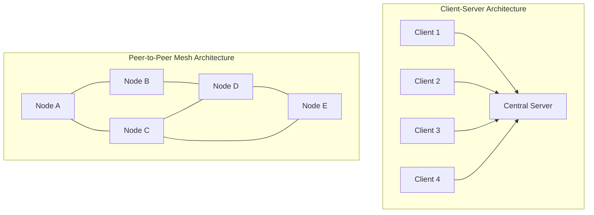
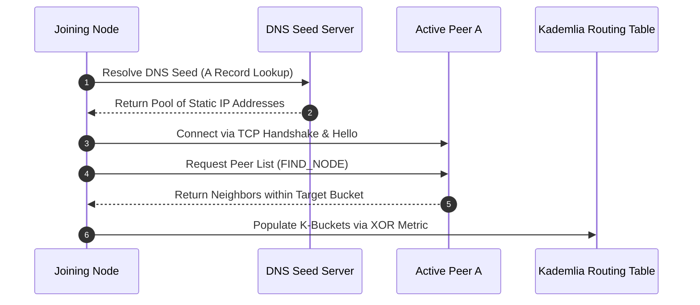
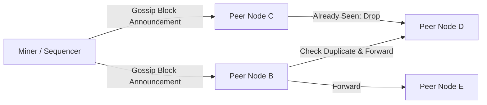
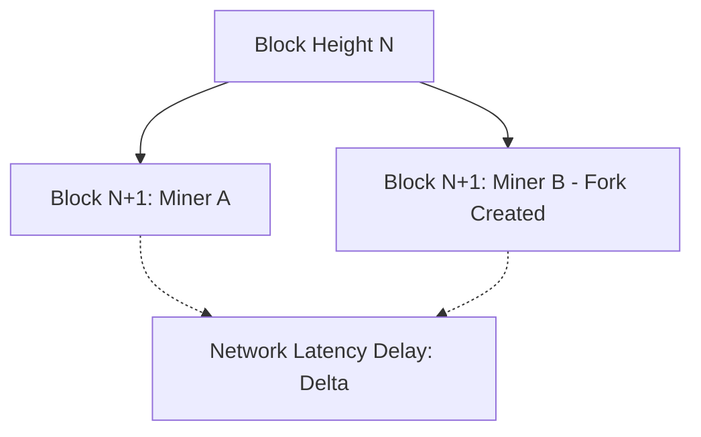

# Peer-to-Peer Networks and Network Topologies

A blockchain consensus engine cannot function without a transport layer to disseminate transactions and blocks across an untrusted network.
Decentralized networks rely on peer-to-peer (P2P) overlays operating over the public internet.
Every participating node acts simultaneously as a client and a server, discovering peers, routing messages, and validating forwarded payloads without centralized coordination.

## Client-Server vs. Peer-to-Peer Topologies

In client-server architectures, clients connect to authoritative central servers.
The server controls traffic routing, authentication, and state management.
If the central server becomes unreachable, all clients lose access to the network.

In a P2P overlay network, all full nodes maintain symmetric responsibilities:
- **Autonomous Routing:** Nodes establish point-to-point TCP or UDP connections with a dynamic set of peers.
- **Independent Validation:** Nodes inspect and validate every message before forwarding it, dropping malformed or malicious payloads immediately.
- **Fault Resilience:** If any subset of nodes disconnects, the remaining graph maintains connectivity through alternate paths.

## Node Discovery and Routing

Before a node can exchange ledger state, it must identify and connect to active peers on the network.
Modern blockchains split peer connectivity into bootstrapping and continuous discovery.

### 1. Bootstrapping

When a new node launches with an empty routing table, it requires an initial entry point to join the network:
- **DNS Seeds:** Hardcoded domain names that resolve to dynamic lists of stable full node IP addresses via DNS A-record queries.
- **Hardcoded Bootnodes:** Pre-configured nodes maintained by client teams and infrastructure providers, identified by static public keys and addresses.

### 2. Kademlia Distributed Hash Table (DHT)

Protocols like Ethereum (Discv4 and Discv5) implement variants of the Kademlia DHT for decentralized peer discovery.
Nodes are identified by a 256-bit Node ID (derived from the node's public key).

Distance between two nodes $x$ and $y$ is calculated using the bitwise exclusive-OR (XOR) metric:

$$d(x, y) = x \oplus y$$

The XOR metric satisfies all geometric properties of a mathematical metric space:
- $d(x, y) = 0 \iff x = y$ (identity)
- $d(x, y) = d(y, x)$ (symmetry)
- $d(x, z) \le d(x, y) \oplus d(y, z)$ (unidirectional triangle inequality)

A node maintains a routing table composed of $k$-buckets, where each bucket contains up to $k$ known peers sharing a specific prefix distance from the node.
When searching for new peers, a node executes an iterative lookup, querying the $\alpha$ closest known nodes in parallel.
Lookup complexity scales logarithmically with network size:

$$\mathcal{O}(\log_2 N)$$

### Ethereum Node Records (ENR)

Ethereum upgraded its discovery protocol (Discv5) via EIP-778 with Ethereum Node Records (ENRs).
An ENR is an authenticated key-value record signed by the node's private key.
It includes an incrementing sequence number, the node's IP address, UDP and TCP ports, and network identity metadata such as the supported chain fork digest.
This enables nodes to negotiate protocol compatibility before establishing heavy TCP connections.

## Gossip Protocols and Message Propagation

Once connected, nodes must disseminate two primary classes of payloads: unconfirmed transactions and newly minted blocks.
Naive broadcast (flooding every message to every connected peer) saturates network bandwidth through redundant transmissions.
Blockchains utilize controlled epidemic gossip protocols.

### 1. Announcement and Retrieval Pipeline

To prevent re-broadcasting multi-megabyte payloads, Bitcoin nodes use an announcement-and-request pipeline:
1. When a node receives a transaction or block, it broadcasts a lightweight inventory message (`inv`) containing only the 32-byte hash.
2. The receiving peer checks whether that hash already exists in its local mempool or block index.
3. If absent, the peer requests the full payload via a `getdata` message.
4. The sending node responds with the actual transaction or block data (`tx` or `block`).

### 2. Compact Blocks (BIP-152)

Because nodes already possess most transactions in their local mempools before a block is mined, sending full blocks wastes bandwidth.
Under BIP-152 (Compact Blocks), the proposer transmits:
- The 80-byte block header.
- Short 6-byte transaction IDs derived via SipHash.
- A prefilled list of transactions expected to be missing from peer mempools (such as the coinbase transaction).

Receivers reconstruct the block using transactions already stored locally.
If any transactions are missing, the receiver queries only those specific short IDs via `getblocktxn`.
Compact blocks reduce block propagation latency across the network by over 80 percent.

### 3. Libp2p and GossipSub in Ethereum

Ethereum's Consensus Layer (Proof of Stake) uses **GossipSub v1.1**, an authenticated pub/sub protocol specified within libp2p.
Nodes join specific topic meshes (such as attestation subnets and block proposal topics).
GossipSub pairs full message flooding within an active peer mesh with lightweight metadata gossip (IHAVE / IWANT control messages) to maintain fast message dissemination while defending against spam.

## Network Latency and Protocol Security

In distributed consensus, propagation delay $\Delta$ (the time required for a block to reach a critical threshold of the network) directly dictates security margins.

### Fork Rates and Stale Blocks

If $\Delta$ is large relative to the block generation interval $T$, multiple miners will discover competing blocks at the identical block height before learning of each other's discoveries.

The probability of producing a stale (orphaned) block increases with the ratio $\frac{\Delta}{T}$.
High orphan rates degrade the security budget of Nakamoto consensus, reducing the effective hash rate threshold required for an attacker to execute a 51 percent reorganization attack.

### Network Attack Vectors and Mitigations

| Attack Vector | Mechanism | Protocol Defense |
| :--- | :--- | :--- |
| **Eclipse Attack** | An attacker controls all inbound and outbound peer connections of a target node, isolating it from valid network state. | Enforce outbound connection slots to diverse IP subnets (/16 ranges), preserve long-lived anchor peers across reboots, and limit inbound peer turnover. |
| **Sybil Attack** | An entity spawns thousands of virtual nodes with distinct IP addresses to manipulate routing decisions or monitor transactions. | Separate discovery from consensus validation. Pair networking with computational proof of work or economic proof of stake. Apply GossipSub peer scoring. |
| **Transaction Snooping** | An adversary analyzes message propagation timing across multiple vantage nodes to infer the originating IP address of a transaction. | Introduce randomized forwarding delays (such as the Dandelion++ routing protocol, which shifts propagation from an initial stem phase to a fluff phase). |

## Networking Stack Architecture Comparison

| Component | Bitcoin Core | Ethereum Execution Layer | Ethereum Consensus Layer |
| :--- | :--- | :--- | :--- |
| **Discovery Protocol** | DNS seeds, IRC (historical), `addr` gossip | Discv4, Discv5 (UDP Kademlia) | Discv5 (UDP ENR) |
| **Transport Layer** | Custom P2P protocol over plain TCP | RLPx protocol over encrypted TCP | libp2p (TCP, QUIC, Noise encryption) |
| **Framing & Serialization** | Custom binary wire format | RLP (Recursive Length Prefix) | SSZ (Simple Serialize) |
| **Dissemination Engine** | `inv` / `getdata` and Compact Blocks | ETH wire protocol (`eth/68`) | GossipSub v1.1 mesh |
