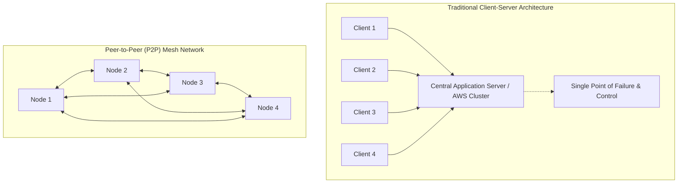
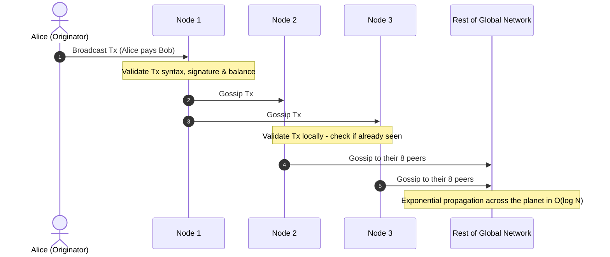
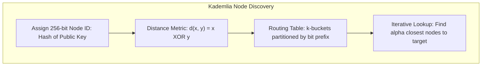
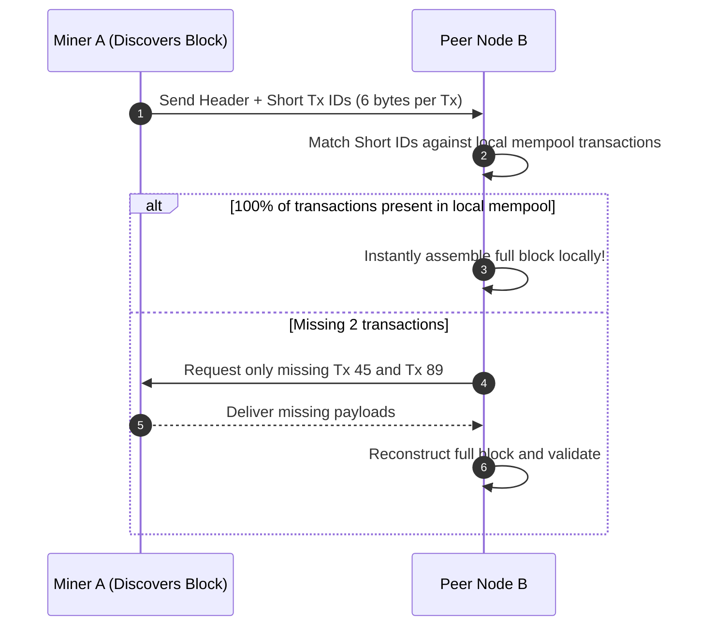
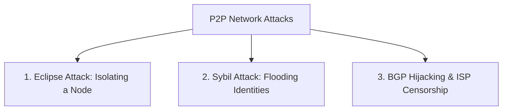

# Peer-to-Peer Networks and Network Topologies

A blockchain is fundamentally a shared state machine that relies on complete synchronization across thousands of independent machines.
However, before transactions can be validated, packaged into blocks, or evaluated by consensus rules, they must first physically propagate across the planet over the public internet.
The communication substrate that makes this possible is the **Peer-to-Peer (P2P) network**.

Without a resilient, decentralized network layer, even the most sophisticated cryptographic proofs and consensus algorithms would fail.
If an attacker can partition nodes, delay block propagation, or isolate specific validators, the security guarantees of the entire blockchain collapse.

## The Architectural Shift: Client-Server vs. Peer-to-Peer

To understand how blockchain networks operate, we must contrast them with traditional internet architecture.

### 1. The Client-Server Model

Traditional Web2 platforms (Google, Visa, Amazon, Twitter) rely on the **client-server model**:
- **Asymmetric Roles:** A centralized cluster of authoritative servers holds the database, runs business logic, and decides which requests to fulfill. End-user devices (clients) act as passive consumers with no administrative authority.
- **Hierarchical Trust:** The client trusts the server completely. If the server goes offline, clients cannot interact with each other.
- **Vulnerabilities:** Susceptible to coordinated DDoS attacks, physical ISP cable cuts, corporate deplatforming, and state-level regulatory coercion.

### 2. The Peer-to-Peer Mesh Model

In a peer-to-peer network:
- **Symmetric Roles (Servents):** Every node acts simultaneously as a client and a server (historically termed a *servent*). Every peer requests data from others and serves data back to incoming peers.
- **No Central Coordinator:** There is no master server, no central directory, and no authoritative DNS registrar required to route packets.
- **Organic Fault Tolerance:** If fifty percent of the nodes in a P2P network disconnect simultaneously, the remaining fifty percent continue routing transactions and maintaining the ledger without interruption.

## The Gossip Protocol (Epidemic Dissemination)

How does a transaction broadcast by a laptop in Argentina reach a validator node in South Korea in a fraction of a second without a central broadcast server?
Blockchains use **Gossip Protocols**, mathematically modeled on the spread of biological epidemics (epidemic dissemination).

### The Gossip Mechanics Step-by-Step

1. **Originating the Message:** Alice signs a new transaction and sends it to the handful of peer nodes her client is currently connected to (typically 8 to 12 outbound peers).
2. **Local Validation:** When Node 1 receives the transaction, it does not blindly forward it.
   It immediately runs preliminary validation checks:
   - Does the transaction conform to proper byte formatting?
   - Is the digital signature mathematically authentic?
   - Are the inputs unspent, and does the sender hold sufficient funds?
3. **Mempool Ingestion:** If valid, Node 1 adds the transaction to its local **Mempool** (memory pool of pending transactions).
4. **Targeted Dissemination:** Node 1 sends an inventory message (`inv`) or hashes of the newly discovered transaction to its other connected peers (Node 2, Node 3).
5. **Deduplication:** When Node 2 and Node 3 receive the gossip, they check whether they already have that transaction in their mempool.
   If yes, they discard the message to save network bandwidth.
   If no, they validate it, insert it into their own mempool, and gossip it to their respective peers.
6. **Exponential Fan-Out:** In a well-connected random graph with average degree $d$, the number of informed nodes grows exponentially ($d^1, d^2, d^3...$).
   The message reaches all $N$ nodes in $O(\log N)$ hops, achieving planetary consensus in under two seconds.

## Node Discovery and Routing: The Kademlia DHT

When a new node starts up, how does it locate other blockchain nodes without a centralized master server?
Blockchains use **Distributed Hash Tables (DHT)**, with the majority utilizing the **Kademlia** algorithm (pioneered in BitTorrent and adapted by Ethereum as `discv4` and `discv5`).

### The XOR Metric: The Mathematical Elegance of Kademlia

In Kademlia, every node is assigned a 256-bit Node ID (derived from the hash of its cryptographic public key).
The "distance" between any two nodes $x$ and $y$ is not their geographic physical distance, but their **bitwise exclusive-OR (XOR) distance**:

$$d(x, y) = x \oplus y$$

The XOR operation satisfies all mathematical axioms of a geometric metric space:
1. $d(x, y) = 0 \iff x = y$ (A node's distance to itself is zero).
2. $d(x, y) = d(y, x)$ (Symmetry: Distance from A to B equals distance from B to A).
3. $d(x, z) \le d(x, y) \oplus d(y, z)$ (Triangle Inequality).

### K-Buckets and Routing

Each node organizes its known peers into **k-buckets**.
Each bucket holds up to $k$ nodes (typically $k = 16$) that share a specific bit prefix with the host node:
- Bucket 0 holds nodes that differ in the very first bit (the farthest half of the network).
- Bucket 1 holds nodes that match the first bit but differ in the second.
- Bucket $i$ holds nodes that share an $i$-bit prefix.

Because nodes prioritize keeping long-lived, reliable connections in their buckets (using least-recently-seen replacement policies), Kademlia networks resist churn (nodes constantly connecting and disconnecting).
Finding any specific node in the network requires at most $O(\log N)$ lookup steps.

### Bootnodes and Discovery Seeding

When a brand-new node boots up with an empty routing table:
- The client software includes hardcoded fallback IP addresses known as **Bootnodes** (maintained by core developers and foundation infrastructure).
- The new node connects to a bootnode for the first few seconds, asks for its nearest neighbors via Kademlia queries, populates its own local routing table, and immediately disconnects from the bootnode to participate in the autonomous mesh.

## Block Propagation and Network Latency Bottlenecks

While individual transactions are small (a few hundred bytes), a full block can be several megabytes in size.
In a decentralized consensus network, **block propagation latency** is a direct determinant of security:

If it takes 15 seconds for a newly mined block to travel across the globe:
- A miner in Asia who discovers a block has an unfair advantage over a miner in Europe or North America.
- The rest of the world spends 15 seconds wasting electrical energy mining on top of an outdated, stale block tip.
- This creates economic centralization pressure: miners are financially incentivized to merge into a single massive geographic data center to eliminate propagation delays.

### Compact Blocks (BIP-152) and Graphene

In naive protocols, when a miner finds a block, they broadcast the entire block containing thousands of full transactions.
However, 99 percent of those transactions have **already been broadcast and received via the mempool** minutes earlier!
Broadcasting full blocks wastes redundant network bandwidth.

Bitcoin resolved this with **Compact Blocks (BIP-152)**:

Instead of sending a 2 MB block payload, Miner A sends:
1. The 80-byte block header.
2. An array of 6-byte **Short Transaction IDs** (salted SipHash digests) representing the transactions in the block.

When Node B receives this compact bundle:
- It looks up the short IDs in its own local mempool.
- In over 95 percent of cases, Node B already possesses all of the transactions.
- Node B reconstructs the complete 2 MB block locally in memory within milliseconds, reducing block transmission bandwidth by over 90 percent and drastically compressing propagation delays.

## Peer-to-Peer Attack Vectors and Defenses

Because public blockchains operate over untrusted open networks, the P2P layer is an active target for adversarial attacks.

### 1. The Eclipse Attack

In an **Eclipse Attack**, an adversary isolates a specific target node from the rest of the honest network:
- The attacker spins up hundreds of malicious nodes and monopolizes all of the victim's incoming and outgoing peer connections.
- The victim node is now "eclipsed": it can only send and receive data that the attacker permits.
- The attacker can feed the victim a fake, privately mined blockchain, tricking an exchange or merchant into accepting an unconfirmed payment and executing a double-spend.

#### Defenses against Eclipse Attacks:
- **Bucket Diversification:** Restrict outgoing connections so that peers must come from diverse autonomous systems (ASNs) and different IPv4 `/16` subnets.
- **Anchor Connections:** Persist a list of proven, long-standing honest peer IP addresses to disk across client restarts.

### 2. Sybil Attacks at the Network Layer

While Nakamoto consensus uses Proof of Work to prevent Sybil voting in block creation, an attacker can still launch a Sybil attack at the networking layer:
- The attacker launches thousands of dummy nodes to manipulate peer discovery, slow down message propagation, or monitor transaction origins to deanonymize users.
- **Defense:** Strict peer connection caps, rate limiting on message gossip, and scoring algorithms that disconnect peers who broadcast invalid or duplicate data.

### 3. BGP Hijacking and Transit Partitions

Internet traffic relies on the Border Gateway Protocol (BGP) to route packets between autonomous networks.
A malicious Internet Service Provider (ISP) or state actor can broadcast fraudulent BGP route announcements, intercepting traffic destined for major blockchain mining pools or splitting the global network into two geographically separated partitions.
To defend against this, major networks deploy encrypted P2P tunnels, alternative transport protocols (like libp2p with Noise encryption), and independent satellite relays (such as the Blockstream Satellite network) that broadcast block headers directly from orbit.
