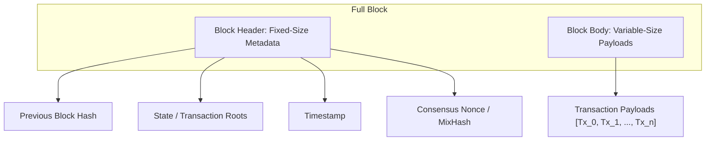
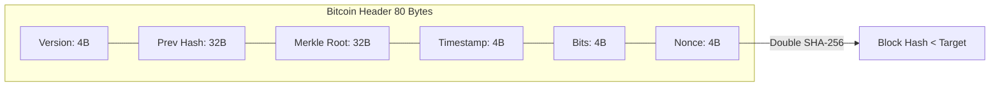
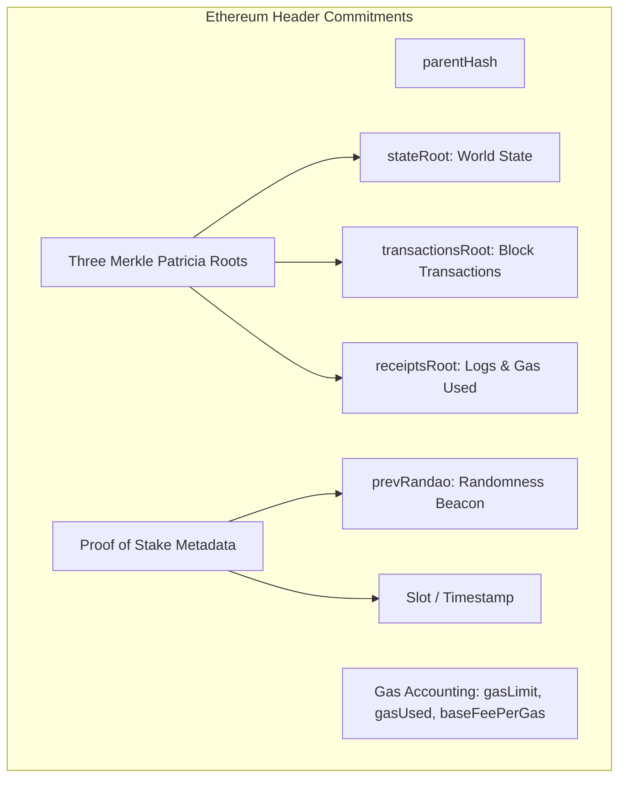
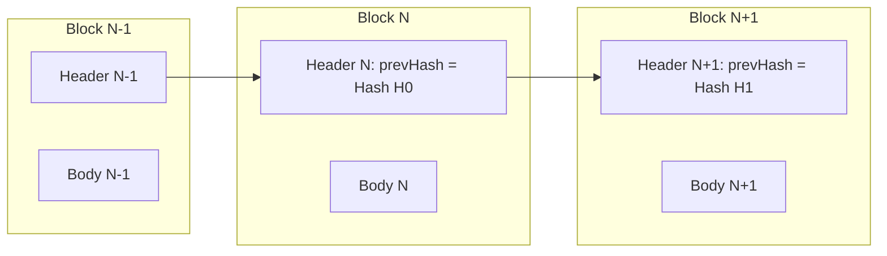

# Anatomy of a Block and Block Headers

A blockchain is an append-only, authenticated linked list of data batches termed blocks.
Every block bundles a collection of state-modifying transactions together with a cryptographically committed block header.
By chaining headers through cryptographic hashes, the protocol ensures that altering any transaction in historical blocks invalidates all subsequent block headers.

## Block Anatomy: Headers vs. Body

A block consists of two distinct components: the block header and the block body.

- **Block Header:** A compact, fixed-size data structure containing protocol metadata, consensus commitments, and cryptographic roots of the block's data. Light clients download only headers to verify consensus.
- **Block Body:** The arbitrary-length payload containing the ordered list of transactions executed within that block interval. In Ethereum, it also includes execution receipts and system withdrawals.

## The Bitcoin Block Header (80 Bytes)

Bitcoin's block header is strictly 80 bytes in size.
Miners iterate over these 80 bytes when computing Proof of Work hashes.

| Field | Size | Type | Description |
| :--- | :--- | :--- | :--- |
| `version` | 4 bytes | `int32_t` | Block format version and soft-fork signaling flags via BIP-9 |
| `prev_block_hash` | 32 bytes | `char[32]` | Double-SHA-256 hash of the preceding block header |
| `merkle_root` | 32 bytes | `char[32]` | Merkle tree root derived from all transactions in the block body |
| `timestamp` | 4 bytes | `uint32_t` | Unix epoch time in seconds |
| `bits` | 4 bytes | `uint32_t` | Compact representation of the target difficulty threshold |
| `nonce` | 4 bytes | `uint32_t` | 32-bit arbitrary counter iterated by miners |

Because the 32-bit nonce space ($2^{32} \approx 4.29 \times 10^9$ combinations) is exhausted in milliseconds by modern mining hardware, miners iterate the **extraNonce** field located inside the coinbase transaction in the block body.
Modifying the extraNonce updates the coinbase transaction hash, propagating a new Merkle root into the header and resetting the 32-bit header nonce space.

## The Ethereum Execution Block Header

Ethereum headers are dynamic RLP-encoded structures that account for account balances, smart contract execution, and Proof of Stake consensus attributes.

### Key Header Fields in Ethereum

- `parentHash`: Keccak-256 hash of the parent block header.
- `stateRoot`: The root hash of the modified world-state Merkle Patricia Trie after executing all transactions in the block.
- `transactionsRoot`: The root hash of the trie constructed from the ordered transactions within the block.
- `receiptsRoot`: The root hash of the trie constructed from transaction execution receipts, including event logs and cumulative gas consumption.
- `logsBloom`: A 256-byte Bloom filter facilitating fast searches for contract event log addresses and topics without reading full transaction receipts.
- `gasLimit`: The maximum quantity of gas permitted to be consumed by transactions within this block.
- `gasUsed`: The actual cumulative gas consumed by transactions executed in this block.
- `timestamp`: The Unix timestamp when the block was proposed (must increment monotonically by 12 seconds per slot in Proof of Stake).
- `baseFeePerGas`: The minimum gas price required for transaction inclusion, algorithmically calculated via EIP-1559.
- `prevRandao`: The randomness beacon output supplied by the consensus beacon chain to resist miner manipulation.

## Cryptographic Chaining and Tamper Evidence

Blocks are linked chronologically through the `parentHash` field.
This creates a recursive cryptographic hash chain:

$$H_k = \text{Hash}(\text{Header}_k)$$

$$\text{Header}_{k+1} = \{ H_k, \text{Roots}_{k+1}, \dots \}$$

If an attacker modifies a single byte in transaction $Tx_j$ of Block $N-1$:
1. The Merkle root of Block $N-1$'s body changes.
2. The block header hash $\text{Hash}(\text{Header}_{N-1})$ shifts completely due to the avalanche effect.
3. Block $N$'s `parentHash` no longer matches $\text{Hash}(\text{Header}_{N-1})$, breaking the cryptographic link.
4. To convince the network that the modified block is valid, the attacker must regenerate valid consensus proofs (re-mining or re-attesting) for Block $N-1$, Block $N$, Block $N+1$, and all subsequent blocks faster than the honest network produces new blocks.
