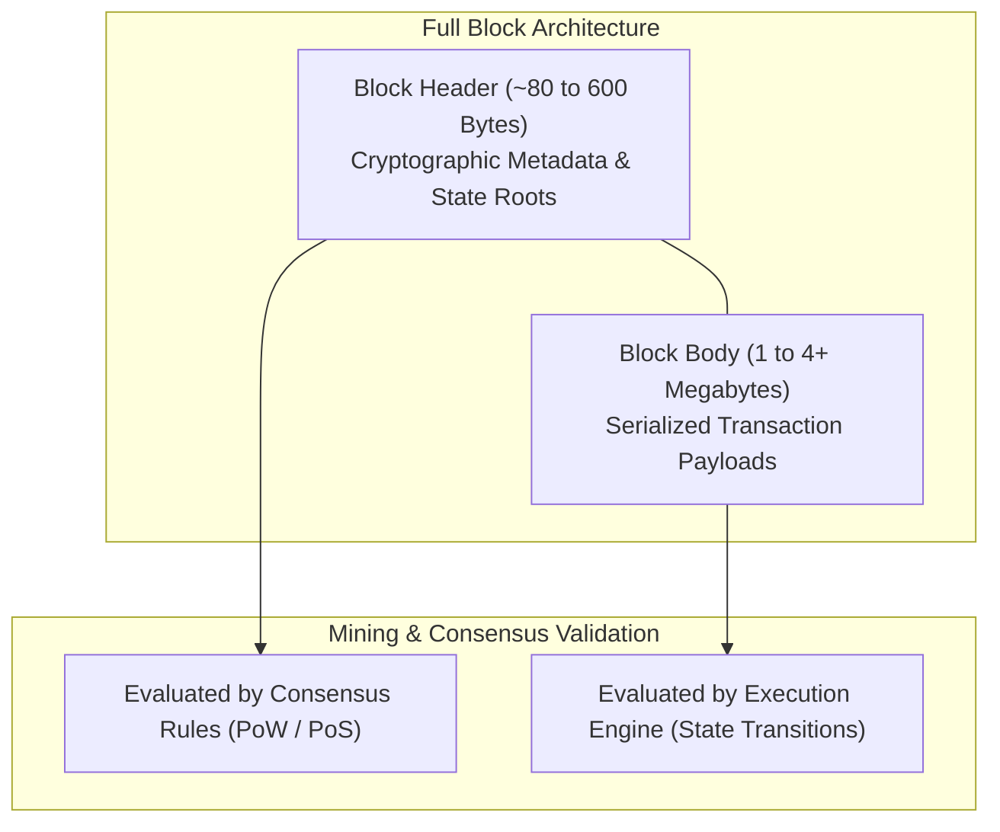
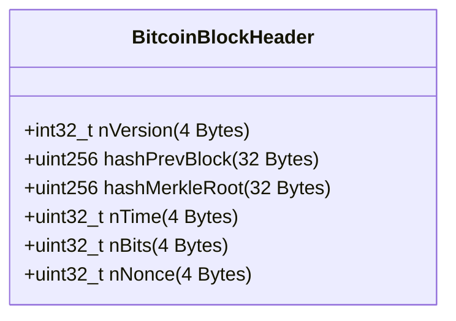
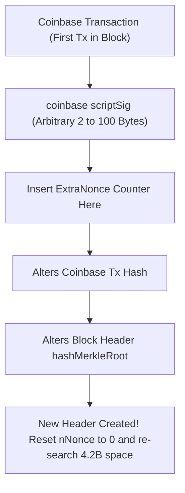
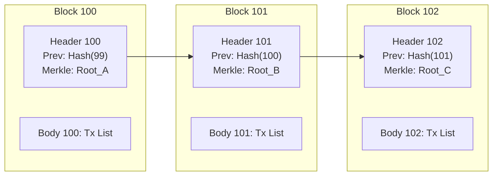
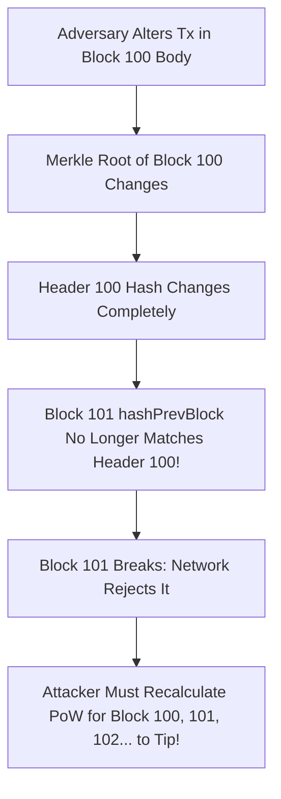
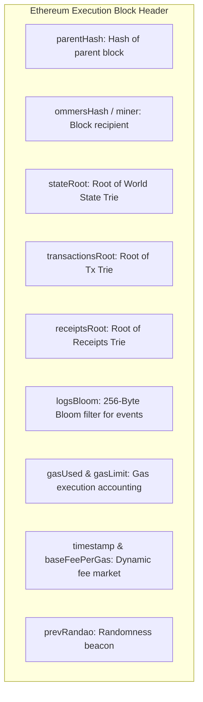

# Anatomy of a Block and Block Headers

A blockchain is fundamentally an append-only, chronologically ordered distributed ledger.
However, transactions are not added to the ledger one by one in real time.
Recording and gossiping individual transactions across thousands of global nodes with individual consensus votes would overwhelm network bandwidth and lead to endless race conditions.
Instead, transactions are packaged into discrete containers called **blocks**.

Understanding the internal anatomy of a block and its header is essential.
The block header is where cryptography meets consensus: it contains the mathematical metadata that chains history together, commits to state transitions, and proves computational work or validator attestations.

## High-Level Block Structure: Header vs. Body

Every block in a blockchain is architecturally partitioned into two primary components: the **Block Header** and the **Block Body**.

### 1. The Block Header: The Cryptographic Identity

The block header is the compact, standardized metadata envelope that identifies the block.
- **Size:** Very small (exactly 80 bytes in Bitcoin; roughly 500 to 600 bytes in Ethereum).
- **Function:** Contains the cryptographic hashes that link the block to its parent, the timestamp, consensus difficulty targets, and Merkle roots committing to the transactions in the body.
- **Consensus Role:** In Proof of Work, miners do not hash the entire block; **they hash only the 80-byte header**. Light clients and SPV nodes only download and store block headers to verify the validity and weight of the chain.

### 2. The Block Body: The Transaction Payload

The block body contains the raw list of transactions included in that block.
- **Size:** Large (hundreds of kilobytes to several megabytes, depending on network limits).
- **Function:** Contains the sender signatures, recipient addresses, transferred amounts, and smart contract execution payloads.
- **Execution Role:** Full nodes download the body to execute every transaction sequentially, calculate balance changes, and update the global state database.

## Deep Dive: Bitcoin 80-Byte Block Header

Bitcoin's block header is an example of minimal, efficient cryptographic engineering.
It is exactly 80 bytes in size, serialized in little-endian byte order, and composed of six fixed fields:

| Field Name | Byte Size | Data Type | Purpose & Mechanics |
| :--- | :--- | :--- | :--- |
| **`nVersion`** | 4 Bytes | `int32_t` | Block version number; tracks protocol upgrades and BIP soft fork signal readiness among miners. |
| **`hashPrevBlock`** | 32 Bytes | `uint256` | Double-SHA-256 hash of the previous block's header. This field forms the backward cryptographic chain. |
| **`hashMerkleRoot`** | 32 Bytes | `uint256` | Root hash of the Merkle tree committing to all transactions in the body, starting with the Coinbase transaction. |
| **`nTime`** | 4 Bytes | `uint32_t` | Unix epoch timestamp (seconds since Jan 1, 1970). Must be greater than the median of the past 11 blocks and less than the network-adjusted time plus 2 hours. |
| **`nBits`** | 4 Bytes | `uint32_t` | Compact representation ("bits") of the current Proof of Work target threshold $T$. |
| **`nNonce`** | 4 Bytes | `uint32_t` | 32-bit arbitrary counter iterated by miners to discover a hash below the target. |

### The Mechanics of `nBits` and Target Representation

The mining target $T$ is a 256-bit unsigned integer.
Storing a 256-bit integer directly would consume 32 bytes of header space.
Instead, Bitcoin uses a compact 4-byte floating-point notation called **nBits**:

$$\text{Format: } \mathtt{0xEEAABBCC}$$

- The first byte ($\mathtt{EE}$) is the **exponent** (the byte length).
- The remaining three bytes ($\mathtt{AABBCC}$) represent the **mantissa** (coefficient).

The actual 256-bit target is reconstructed via:

$$\text{Target} = \text{Mantissa} \times 256^{(\text{Exponent} - 3)}$$

For example, if `nBits` is `0x1804b46c`:
- Exponent: `0x18` = 24 in decimal.
- Mantissa: `0x04b46c`.
- $\text{Target} = \mathtt{0x04b46c} \times 256^{(24 - 3)} = \mathtt{0x04b46c} \times 256^{21}$.

This compact notation saves 28 bytes of header space per block.

### The Nonce Exhaustion Problem and the ExtraNonce

Notice that `nNonce` is only 4 bytes (32 bits).
A 32-bit counter has a maximum keyspace of:

$$2^{32} = 4,294,967,296 \text{ possibilities}$$

In the early days of Bitcoin, iterating 4.2 billion hashes took a desktop CPU several days.
However, modern ASIC mining rigs calculate over 100 terahashes (100 trillion hashes) per second.
A modern mining ASIC exhausts the entire 32-bit nonce space in less than **40 microseconds**!

How do miners continue searching for a valid block once the nonce space is exhausted?
They use the **ExtraNonce**:

1. Every block begins with a special transaction called the **Coinbase Transaction** (which mints new coins and pays fees to the miner).
2. The input of the Coinbase transaction (`scriptSig`) can hold between 2 and 100 bytes of arbitrary user-defined data.
3. Miners insert a 4-to-8 byte counter into this field, called the **ExtraNonce**.
4. Incrementing the ExtraNonce alters the Coinbase transaction's hash.
5. Because the Coinbase hash is a leaf in the Merkle tree, altering it completely changes the `hashMerkleRoot` in the block header.
6. This provides miners with an effectively infinite search space ($2^{96}$ or greater).

## Cryptographic Chaining and Tamper Evidence

Why is the data structure called a "blockchain"?
Because every block header explicitly contains the cryptographic hash of the block that came before it (`hashPrevBlock`).

This backward cryptographic linkage creates an immutable dependency graph:

$$\text{Hash}(B_n) = \text{SHA-256}\big(\text{SHA-256}(\text{Header}_n)\big)$$

### What Happens When an Attacker Attempts Tampering?

Suppose an adversary attempts to modify a transaction inside Block 100 (for example, altering a payment of 1 BTC to 100 BTC):

1. Changing a single character in the transaction body alters the transaction's hash.
2. The altered transaction hash propagates up the Merkle tree, producing a completely different `hashMerkleRoot`.
3. The altered Merkle root changes the 80-byte header of Block 100, causing its hash $\text{Hash}(B_{100})$ to change completely.
4. Block 101's header contains the *original* `hashPrevBlock` of Block 100.
   Because the attacker's modified Block 100 hash no longer matches Block 101's pointer, the cryptographic link breaks.
5. Every full node on the planet immediately detects the discrepancy and drops the block.
6. To make the rest of the network accept the forged transaction, the attacker would have to re-mine Block 100, and then re-mine Block 101, Block 102, and every subsequent block up to the tip of the chain faster than the entire global honest network combined.

This is the cryptographic foundation of **tamper evidence**: historical modifications become exponentially more difficult with each subsequent block appended to the chain.

## Evolution: Ethereum Execution Block Headers

While Bitcoin's header focuses strictly on verifying transactions via a single Merkle root, Ethereum functions as a Turing-complete state machine.
Consequently, an Ethereum execution block header must track global account balances, contract bytecode, storage variables, and execution receipts.

### The Three State Roots in Ethereum

Unlike Bitcoin's single transaction Merkle root, an Ethereum header contains **three distinct Merkle Patricia Trie roots**:

1. **`transactionsRoot`:** The root hash of the trie containing all transactions included in this block (analogous to Bitcoin's Merkle root).
2. **`stateRoot`:** The root hash of the **World State Trie**.
   This trie stores the updated account balance, nonce, code hash, and storage root for every single account and smart contract on Ethereum after executing all transactions in this block.
   This allows any node to verify an account balance with a cryptographic proof without replaying historical transactions from genesis.
3. **`receiptsRoot`:** The root hash of the trie containing transaction receipts.
   A receipt records the post-transaction execution status (success or revert), cumulative gas consumed, and event logs emitted by smart contracts.

### Additional Ethereum Header Metadata

- **`logsBloom` (256 Bytes):** A probabilistic Bloom filter that allows decentralized applications to quickly test whether a specific contract address or event topic was emitted in this block without scanning the entire receipt trie.
- **`gasLimit` and `gasUsed`:** Track the computational resource consumption of the block.
- **`baseFeePerGas` (EIP-1559):** The minimum protocol fee per unit of gas required to include a transaction in this block, algorithmically adjusted based on the congestion of previous blocks.
- **`prevRandao`:** The randomness output provided by the Proof of Stake consensus layer (Beacon Chain) used to generate verifiable on-chain pseudo-randomness.

By encapsulating both historical links and global state commitments inside compact headers, modern blockchains provide an immutable, mathematically verifiable timeline of computation.
