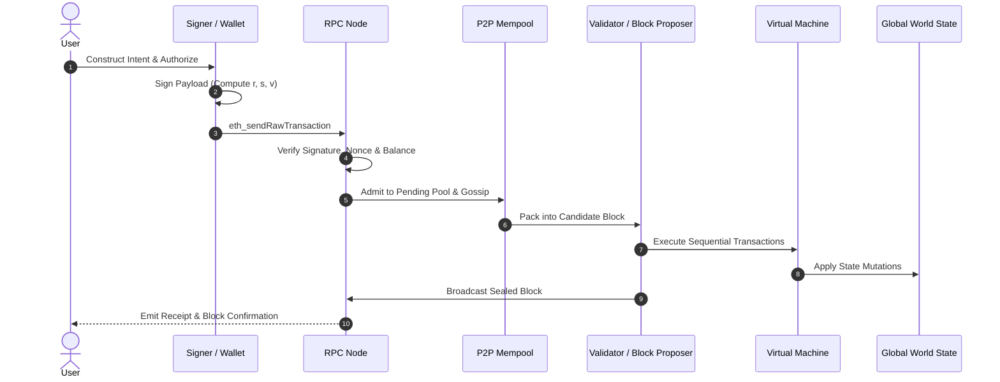
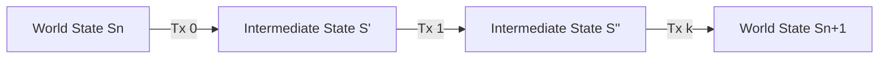
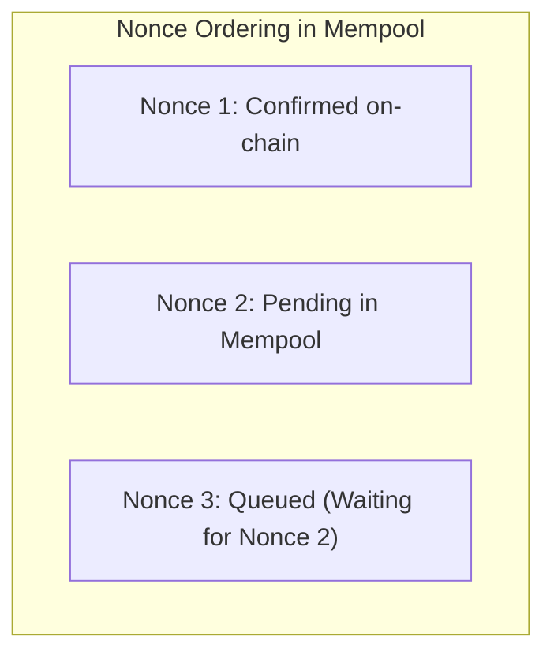

# Transaction Lifecycle and State Transitions

A transaction is an atomic, cryptographically signed instruction issued by an external account to alter the global state of a blockchain.
Whether transferring native cryptocurrency, deploying byte-compiled code, or invoking a smart contract method, every on-chain event originates from an authenticated transaction.

## The Transaction Lifecycle

A transaction transitions through several stages before achieving protocol finality:

### 1. Construction and Offline Signing

The user or client software compiles the transaction fields:
- Destination address (`to`)
- Value in native units (`value`)
- Arbitrary payload or ABI-encoded method call (`data`)
- Gas parameters (`gasLimit`, `maxFeePerGas`, `maxPriorityFeePerGas`)
- Sequential counter (`nonce`)
- Chain identifier (`chainId`) for cross-chain replay protection (EIP-155)

The private key generates an ECDSA signature over the Keccak-256 hash of the RLP-encoded transaction fields.
This signing step occurs entirely offline within a secure enclave, browser extension, or hardware security module.

### 2. Mempool Admission and Validation

The signed raw byte string is transmitted to an RPC gateway via `eth_sendRawTransaction`.
Before forwarding the transaction across the peer-to-peer gossip network, every receiving node executes intrinsic sanity checks:
- **Signature Integrity:** The public key recovered from $(r, s, v)$ matches the sender address.
- **Nonce Correctness:** The transaction nonce exactly matches the sender's current account nonce in the state database, or is queued if it is a future nonce.
- **Balance Sufficiency:** The sender holds sufficient native balance to cover $\text{value} + (\text{gasLimit} \times \text{maxFeePerGas})$.
- **Intrinsic Gas:** The specified `gasLimit` meets or exceeds the baseline intrinsic gas cost:
  $$G_{\text{intrinsic}} = 21000 + \sum G_{\text{calldata}}$$
  where non-zero calldata bytes cost 16 gas and zero bytes cost 4 gas.

Transactions failing these initial constraints are rejected immediately and never propagate to the mempool.
Transactions passing validation enter the node's local **mempool** (memory pool) and are gossiped to adjacent peers.

### 3. Block Packaging and Ordering

Block proposers (miners in PoW or selected slot validators in PoS) pull transactions from their local mempools to construct a new block.
Proposers order transactions to maximize transaction fee revenue or capture Maximum Extractable Value (MEV).
Transactions with higher priority fees (`maxPriorityFeePerGas`) are ordered first.

### 4. Sequential Execution and State Mutation

Within the execution environment, transactions execute deterministically in sequential order.
A transaction is atomic: if execution encounters an exception (such as an out-of-gas condition, an explicit `revert()`, or an assertion failure), all state modifications to storage balances and contract variables are rolled back to the state prior to that transaction's execution.
However, because execution consumed computational resources on network nodes, the base fee and priority fee are still deducted from the sender's balance.

### 5. Receipts and Event Logs

Upon completion, the node constructs a transaction receipt containing:
- Execution status (`1` for success, `0` for revert).
- Cumulative gas used within the block up to this transaction.
- Bloom filter entries encoding event topics.
- Event logs emitted during execution via the `LOG0` through `LOG4` opcodes.

## The Formal State Transition Function

In distributed ledger theory, a blockchain is a state machine.
The Ethereum Yellow Paper formalizes the single-transaction state transition function as $\Upsilon$:

$$S_{t+1} = \Upsilon(S_t, T)$$

where $S_t$ is the world state prior to execution, $T$ is the transaction, and $S_{t+1}$ is the updated world state.

Expanding this to an entire block $B$ containing ordered transactions $[T_0, T_1, \dots, T_k]$ yields the block state transition function $\Pi$:

$$S_{n+1} = \Pi(S_n, B)$$

The state transition is deterministic: given state $S_n$ and block $B$, every node across the globe must independently arrive at the identical $S_{n+1}$ root hash.

## Nonce Mechanics and Transaction Replacement

The account nonce prevents transaction replay attacks.
Without a nonce, an observer could capture Alice's valid payment to Bob and re-broadcast the raw signature thousands of times, draining Alice's balance.

In account-based chains, the nonce represents the count of transactions confirmed from that account:
- Transactions must execute in strict sequential order ($0, 1, 2, \dots$).
- If transaction nonce $3$ is broadcast while nonce $2$ is missing from the state, transaction $3$ remains suspended in the mempool queued state until nonce $2$ arrives.

### Replace-By-Fee (RBF) and Cancellation

If a transaction is stalled in the mempool due to a sudden spike in network gas prices, the sender can replace it by broadcasting a new transaction with:
- The identical nonce.
- A higher tip (Ethereum requires at least a 10 percent increase in `maxPriorityFeePerGas` and `maxFeePerGas`).

Nodes overwrite the older pending transaction with the newer higher-paying payload.
To cancel a pending transaction, the user broadcasts a 0 ETH transfer to their own address using the identical nonce and a higher gas fee.
Once included in a block, the nonce increments, rendering the older stuck transaction permanently invalid.
