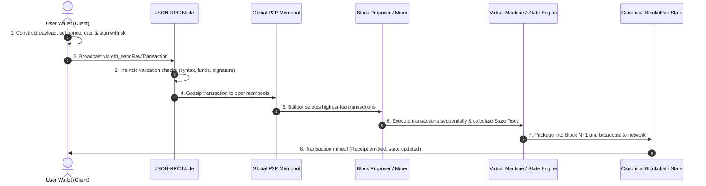
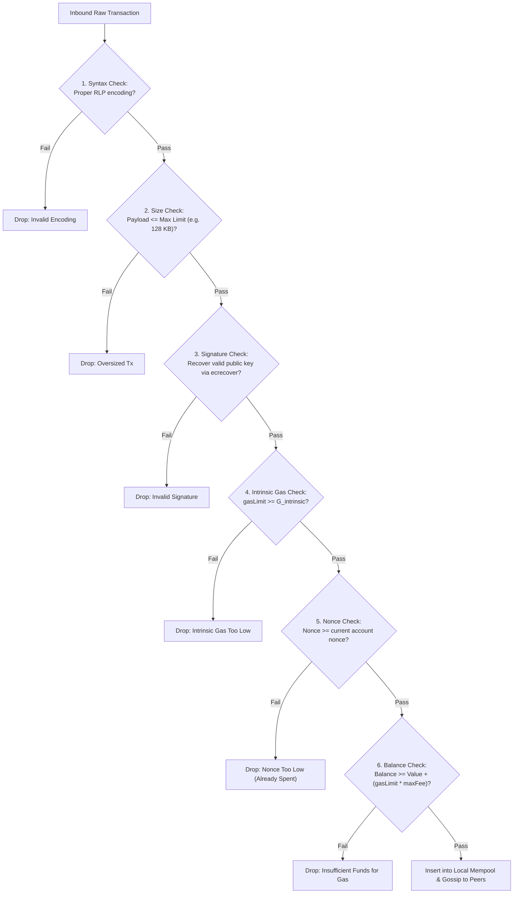
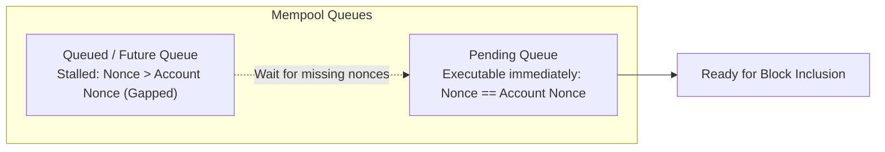
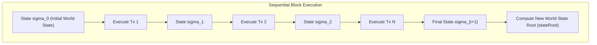
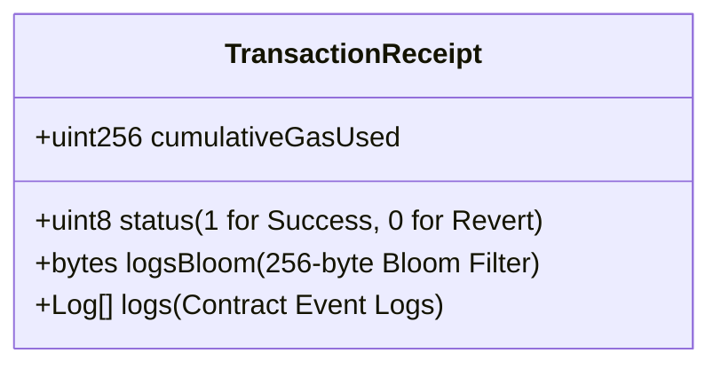

# Transaction Lifecycle and State Transitions

To the end user, executing a blockchain transaction appears simple: you enter an address, click "Send" in your wallet, and watch your balance decrease while the recipient's balance increases.
Under the surface, however, an incoming transaction initiates a multi-stage distributed journey.
It travels through cryptographic verification pipelines, memory staging queues, peer-to-peer gossip gossip, validator auction markets, and deterministic virtual machine execution engines before permanently altering the global state of the network.

Understanding this lifecycle is essential for protocol engineers, smart contract developers, and system architects.
Every latency spike, failed transaction, and front-running exploit occurs somewhere along this pathway.

## End-to-End Transaction Pipeline

Before dissecting the specific sub-systems, let us observe the overall chronological flow of a transaction from creation to final settlement:

## Phase 1: Construction and Client-Side Signing

A transaction begins inside the user's client application or wallet (such as MetaMask, Rabby, or a command-line script).
The user specifies three primary intentions:
- **Recipient (`to`):** The destination 20-byte address (either an Externally Owned Account or a Smart Contract).
- **Value (`value`):** The amount of native cryptocurrency to transfer (measured in wei, where $1 \text{ ETH} = 10^{18} \text{ wei}$, or satoshis, where $1 \text{ BTC} = 10^8 \text{ satoshis}$).
- **Data Payload (`data`):** An arbitrary byte array. Empty for simple payments, but populated with function selectors and encoded parameters when interacting with smart contracts.

The wallet automatically attaches vital operational fields:

### The Nonce (Replay Protection and Sequential Ordering)

In account-based systems like Ethereum, the **nonce** is an integer scalar strictly tracking the number of transactions sent from that account:

$$\text{Nonce} \in \{0, 1, 2, 3, \dots\}$$

The nonce enforces two critical guarantees:
1. **Replay Protection:** An attacker who intercepts your signed transaction on the network cannot broadcast it a second time to drain your funds again. Once a transaction with nonce $N$ is mined, any subsequent transaction from your account must have nonce $N+1$.
2. **Deterministic Sequence:** If you broadcast transaction A (nonce 5) and transaction B (nonce 6) simultaneously, the network will never execute transaction B before transaction A, regardless of which transaction arrives at a validator first.

### Fee Specification: EIP-1559 Parameters

Under Ethereum's EIP-1559 standard, the wallet attaches three fee parameters:
- **`gasLimit`:** The maximum number of gas units the sender authorizes this transaction to consume (e.g. 21,000 for a simple transfer, or 250,000 for a complex DeFi swap).
- **`maxFeePerGas`:** The absolute maximum price per gas unit (in gwei) the sender is willing to pay.
- **`maxPriorityFeePerGas`:** The direct tip paid to the block proposer to incentivize fast inclusion.

### Cryptographic Serialization and Signing

Once all fields are assembled, the wallet serializes the payload using **Recursive Length Prefix (RLP)** encoding, hashes the encoded bytes using Keccak-256, and signs the resulting 32-byte digest using the account's private key ($sk$) via ECDSA.
The resulting raw transaction hex string (containing the payload and the $(r, s, v)$ signature tuple) is completely self-contained and tamper-proof.

## Phase 2: RPC Ingestion and Static Validation

The wallet transmits the serialized hex string to a blockchain node via an HTTP or WebSocket JSON-RPC call: `eth_sendRawTransaction`.

The receiving node does not forward the transaction immediately.
To protect itself and its peers from denial-of-service spam, the node performs strict **static validation checks**:

### The Intrinsic Gas Calculation

Before executing a single opcode, every transaction must pay a non-refundable baseline cost called **Intrinsic Gas** ($G_{\text{intrinsic}}$):

$$G_{\text{intrinsic}} = 21000 + G_{\text{calldata}} + G_{\text{access\_list}} + G_{\text{creation}}$$

- **Base Cost (21,000 gas):** Covers signature verification, nonce incrementation, balance checks, and disk I/O record keeping.
- **Calldata Cost:**
  - 4 gas for every zero byte ($0x00$).
  - 16 gas for every non-zero byte.
- **Contract Creation Cost:** An additional 32,000 gas if the transaction deploys a new contract (`to` field is empty).

If the transaction's specified `gasLimit` is less than $G_{\text{intrinsic}}$, the node rejects the transaction immediately at zero computational cost to the miner.

## Phase 3: The Mempool (Memory Pool) Dynamics

Once validated, the transaction enters the node's **Mempool** (memory pool).
The mempool is not a single, synchronized global database.
It is an ephemeral, in-memory holding pen maintained independently by every full node.

### Pending vs. Queued Transactions

A node categorizes transactions into two distinct internal queues:
1. **Pending Queue:** Transactions whose nonce matches the account's current state nonce ($N_{\text{tx}} = N_{\text{state}}$). These are immediately executable and ready to be packaged into a block.
2. **Queued (Future) Queue:** Transactions whose nonce is higher than the current state nonce ($N_{\text{tx}} > N_{\text{state}}$).
   For example, if your current account nonce is 10, and you broadcast a transaction with nonce 12, the node places it in the queued pool.
   It will sit dormant until a transaction with nonce 11 is received and mined.
   If nonce 11 is never mined, nonce 12 will eventually expire and be dropped.

### Replace-by-Fee (RBF) and Speeding Up Transactions

If network traffic surges, low-fee transactions can become stuck in the mempool for hours or days.
A sender can overwrite a pending transaction by broadcasting a replacement transaction containing the **identical nonce** but a higher fee.

Under standard client policies (such as Geth or Bitcoin Core):
- The replacement transaction must pay a `maxFeePerGas` that is at least **10 percent higher** than the original transaction.
- When nodes receive the higher-paying replacement, they drop the original low-fee transaction from their pending queue and gossip the replacement to peers.

## Phase 4: Block Assembly and State Transitions

Block builders and miners monitor their mempools, sorting pending transactions in descending order of profitability (maximizing priority tips).

The actual execution of a block is mathematically modeled as a deterministic **State Transition Function**:

$$\sigma_{t+1} = \Pi(\sigma_t, B_{t+1})$$

where:
- $\sigma_t$ represents the global world state at block $t$.
- $B_{t+1}$ is the newly assembled block of transactions $[T_1, T_2, \dots, T_k]$.
- $\Pi$ is the block-level state transition function.

### The Transaction-Level Transition ($\Upsilon$)

For each individual transaction $T$ inside the block, the virtual machine applies the formal state transition function:

$$\sigma_{i} = \Upsilon(\sigma_{i-1}, T)$$

Execution proceeds through atomic stages:
1. **Pre-execution Debit:** The maximum potential fee ($\text{gasLimit} \times \text{EffectiveGasPrice}$) is temporarily deducted from the sender's account to guarantee payment capacity.
2. **Nonce Increment:** The sender's account nonce is incremented by 1:
   $$N_{\text{sender}} \leftarrow N_{\text{sender}} + 1$$
3. **Execution Context:** The EVM allocates stack, volatile memory, and storage access caches.
   If the transaction interacts with smart contracts, opcodes execute sequentially, deducting gas units for each operation.
4. **Final Fee Settlement and Refunds:**
   - The actual gas consumed ($G_{\text{used}}$) is calculated.
   - Any unused gas is refunded back to the sender's balance:
     $$\text{Refund} = (\text{gasLimit} - G_{\text{used}}) \times \text{EffectiveGasPrice}$$
   - The base fee portion is burned, and the priority fee portion is credited to the block proposer's account.

## Phase 5: Receipts and Event Logging

When transaction execution completes, the node generates a permanent record called a **Transaction Receipt** ($R$).

Receipts are not stored inside the state trie because they do not represent mutable balances or storage slots.
Instead:
- All receipts in a block are organized into a dedicated **Receipts Merkle Patricia Trie**.
- The root of this trie is committed to the block header as `receiptsRoot`.
- Decentralized applications (dApps) query receipts via RPC (`eth_getTransactionReceipt`) to confirm execution success and parse event logs (such as ERC-20 `Transfer` events) emitted during execution.

Once the block containing the transaction is gossiped, validated by consensus participants, and built upon by subsequent blocks, the transaction completes its lifecycle, achieving immutable economic settlement.
