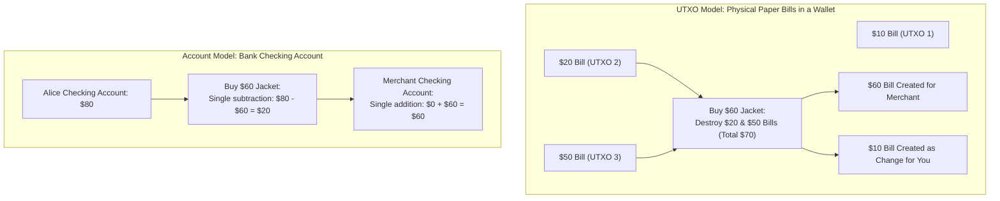
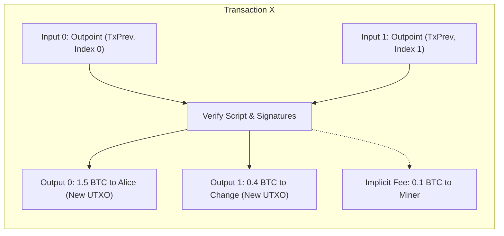
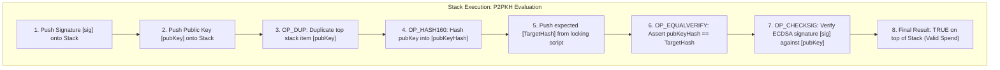
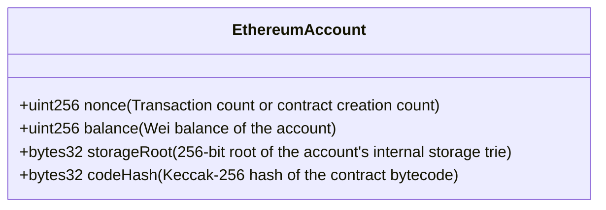
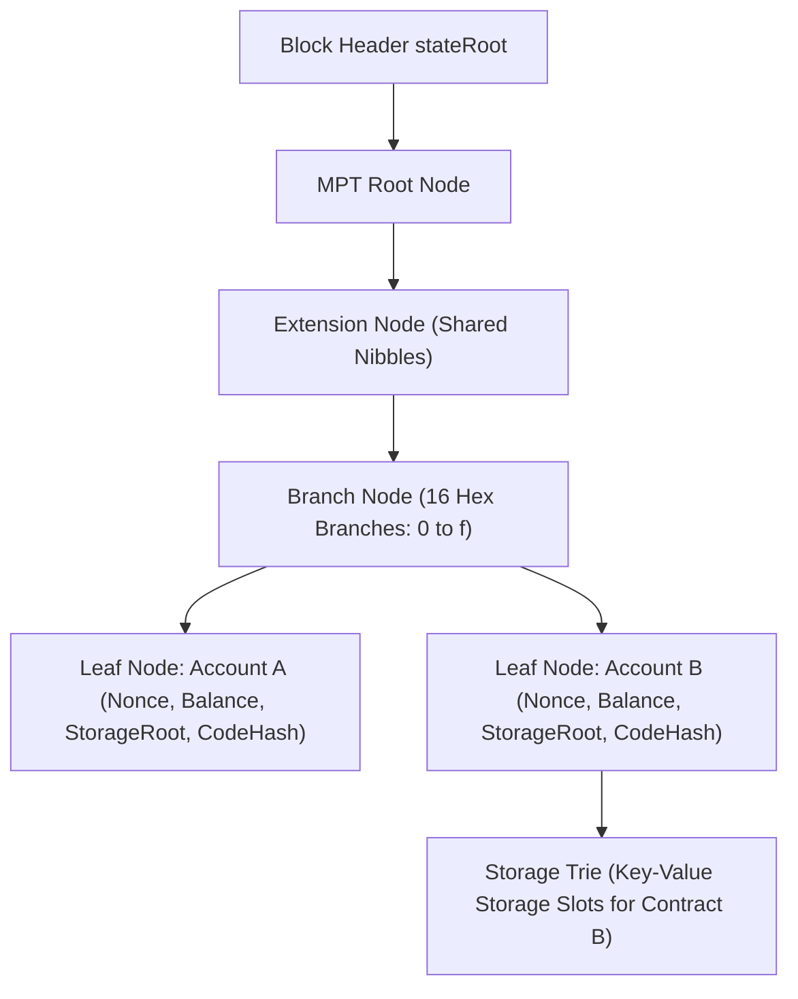

# Ledger State Models: UTXO vs. Account Model

Every blockchain is fundamentally a distributed state machine maintaining a ledger of ownership.
However, how that ledger is conceptualized, organized in memory, and updated on disk differs profoundly across networks.

In computer science, there are two primary architectures for tracking state:
1. **The UTXO Model (Unspent Transaction Output):** Used by Bitcoin, Cardano, Monero, and Kaspa.
2. **The Account / Balance Model:** Used by Ethereum, Solana, Cosmos, and traditional banking systems.

Choosing between these two models dictates everything about a blockchain: its privacy guarantees, transaction concurrency, smart contract capabilities, storage bloat, and developer experience.

## Conceptual Mental Models

To understand the difference intuitively, consider two everyday analogies:

### 1. The UTXO Model: Discrete Physical Banknotes

In the UTXO model, there is no such thing as an "account balance" recorded anywhere on the blockchain.
Coins exist exclusively as discrete, indivisible chunks of value called **Unspent Transaction Outputs (UTXOs)**, analogous to paper currency notes inside a physical leather wallet.

If your wallet contains an $80 balance, you do not have an abstract number "80" written on a chalkboard.
You hold a collection of specific bills: perhaps one $50 bill, one $20 bill, and one $10 bill.
When you buy a $60 item:
- You cannot tear a piece off the $50 bill.
- You hand the cashier both the $50 bill and the $20 bill ($70 total inputs).
- The cashier consumes both bills and returns a new $10 bill as change.
- The old $50 and $20 bills are destroyed (spent), and two new bills are created: $60 for the cashier and $10 for you.

### 2. The Account Model: A Bank Checking Ledger

In the Account model, money operates exactly like a commercial bank account or spreadsheet ledger.
The blockchain maintains a global database mapping every account address directly to its current total balance.

When Alice sends Bob $60:
- The system checks if Alice's balance is $\ge 60$.
- If valid, the system executes an in-place arithmetic mutation:
  $$\text{Balance}_{\text{Alice}} \leftarrow \text{Balance}_{\text{Alice}} - 60$$
  $$\text{Balance}_{\text{Bob}} \leftarrow \text{Balance}_{\text{Bob}} + 60$$
No physical objects or coins are created or destroyed; only numeric balances in a persistent table are updated.

## Deep Dive: The UTXO Architecture

In Bitcoin, the global state is represented by the **UTXO Set**: the complete collection of all unspent transaction outputs that have ever been created but not yet consumed.

### Structure of a Transaction

A Bitcoin transaction consists of an array of **Inputs** and an array of **Outputs**:

1. **Transaction Inputs:**
   An input does not specify an amount.
   Instead, it points backward to an existing unspent output using an **Outpoint**:
   - `TxID`: The 32-byte hash of the previous transaction that created the coin.
   - `vout`: The 4-byte integer index indicating which specific output of that transaction is being spent.
   - `scriptSig` / `Witness`: The cryptographic unlocking proof (digital signature and public key).

2. **Transaction Outputs (`TxOut`):**
   - `value`: The exact amount of satoshis being locked in this output (8-byte integer).
   - `scriptPubKey`: The cryptographic locking script defining the conditions required to spend this output in the future.

### The Conservation Law: Total Inputs = Total Outputs + Fee

In the UTXO model, value cannot be partially spent.
An output is either 100 percent unspent or 100 percent consumed.
The total value of all inputs must equal the total value of all outputs plus the transaction fee:

$$\sum \text{Value}(\text{Inputs}) = \sum \text{Value}(\text{Outputs}) + \text{MinerFee}$$

Notice that the miner fee is **implicit**: it is not explicitly declared as an output.
The fee is simply the difference between the total input value and the total output value.
If a user forgets to create a change output, the entire surplus is awarded directly to the miner as a fee!

### Transaction Verification: The Bitcoin Script Stack Engine

Bitcoin evaluates transactions using a Forth-like, stack-based scripting language.
To verify that an input is authorized to spend a UTXO, the node executes the spender's unlocking script (`scriptSig`) followed by the UTXO's locking script (`scriptPubKey`) on an evaluation stack:

If the stack evaluates to `TRUE` (non-zero) without errors, the spend is mathematically valid, the referenced input UTXOs are removed from the UTXO set, and the new output UTXOs are added.

## Deep Dive: The Account Model Architecture

Ethereum does not track individual coins.
The global state of Ethereum is a key-value mapping from 20-byte addresses to **Account State Objects**:

$$\sigma: \text{Address} \to \text{Account}$$

Every account state object is serialized as a 4-tuple:

### Externally Owned Accounts (EOAs) vs. Contract Accounts

Ethereum distinguishes between two types of accounts:

1. **Externally Owned Accounts (EOAs):**
   - Controlled by a private key held by a human or off-chain software.
   - `codeHash` is the hash of an empty string.
   - `storageRoot` is empty.
   - Can initiate transactions, execute transfers, and pay gas.

2. **Contract Accounts (Smart Contracts):**
   - Governed autonomously by compiled EVM bytecode stored on-chain.
   - `codeHash` points to the persistent bytecode.
   - `storageRoot` points to a dedicated Merkle Patricia Trie containing the contract's persistent state variables (e.g. mapping balances, ownership records).
   - Cannot initiate transactions on their own; execute only when triggered by an incoming call from an EOA or another contract.

### The World State: Merkle Patricia Trie

How does Ethereum store millions of account balances without risking data corruption or state divergence across nodes?
It uses a specialized data structure called the **Modified Merkle Patricia Trie (MPT)**:

The World State Trie combines the cryptographic properties of a Merkle tree with the path-lookup efficiency of a radix trie:
- Keys are the Keccak-256 hashes of the 20-byte account addresses.
- Values are the RLP-encoded account 4-tuples.
- When an account balance changes, only the nodes along the logarithmic path from that leaf to the root are recalculated.
- The new 32-byte root hash of this entire tree is committed into the block header as `stateRoot`.

## In-Depth Architectural Comparison

| Dimension | UTXO Model (Bitcoin, Cardano) | Account Model (Ethereum, Solana) |
| :--- | :--- | :--- |
| **State Representation** | Graph of unspent output objects | Global key-value mapping of balances & storage |
| **Transaction Concurrency** | **High:** Transactions spending distinct UTXOs can be verified and executed in parallel across multiple CPU cores. | **Low / Complex:** Transactions modifying the same account must execute sequentially to prevent race conditions. |
| **Smart Contract Expressiveness** | **Restricted:** Contracts are stateless or require complex off-chain state accumulators. | **Turing-Complete:** Natural support for complex, multi-party shared state (e.g. Uniswap pools, lending markets). |
| **Storage & Pruning** | **Efficient:** Nodes only need to store unspent outputs. Once an output is spent, it can be pruned from active RAM caches. | **State Bloat:** Accounts with non-zero balances and contract storage slots persist indefinitely, creating perpetual disk bloat. |
| **Privacy & Pseudonymity** | **Superior:** Best practices encourage generating a fresh address for every change output, preventing address balance clustering. | **Inferior:** Users reuse single account addresses, making transaction history easily traceable via graph analysis. |
| **Double-Spend Prevention** | Checking if a specific output outpoint has already been spent in the local UTXO database. | Enforcing strictly incrementing account nonces ($N = N_{\text{state}} + 1$). |

### Concurrency vs. Programmability: The Core Trade-Off

The decision between UTXO and Account models represents one of the most fundamental trade-offs in distributed systems design:

- **The UTXO model optimizes for concurrency and verification simplicity.**
  Because every input explicitly identifies the exact coin being consumed, two transactions that spend different UTXOs can never conflict.
  A validator can verify a block of 10,000 UTXO transactions across 32 CPU cores simultaneously with zero locking or mutex overhead.
  However, building a decentralized exchange or lending protocol on UTXO is notoriously difficult because thousands of users cannot interact with a shared pool of capital concurrently without colliding on the same UTXO.

- **The Account model optimizes for developer ergonomics and composability.**
  In an account system, multiple smart contracts can interact seamlessly within a single transaction (e.g. borrow on Aave, swap on Uniswap, and deposit into Curve).
  The drawback is execution contention: because transactions interact with shared state, the virtual machine must process transactions sequentially (or implement complex optimistic software transactional memory engines like Solana's Sealevel or Aptos' Block-STM), significantly increasing the computational burden on full node hardware.
