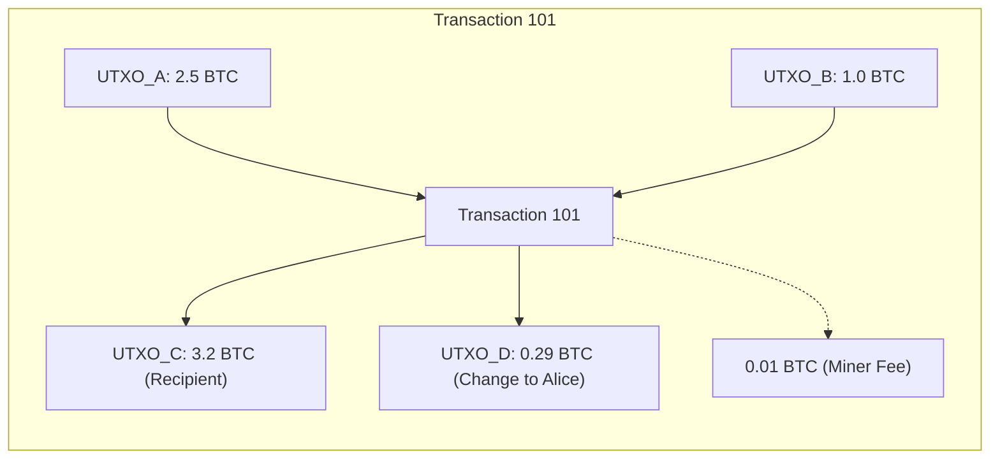
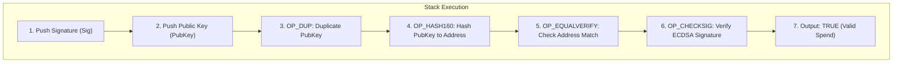
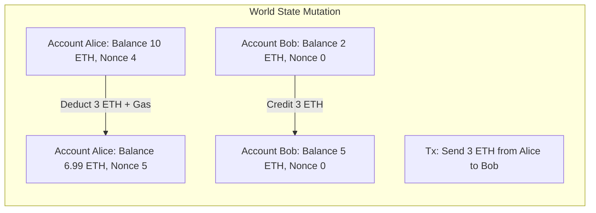

# Ledger State Models: UTXO vs. Account Model

Every distributed ledger must solve a fundamental database question: how should ownership and asset balances be tracked across state transitions?
Blockchains implement one of two primary architectural paradigms: the Unspent Transaction Output (UTXO) model or the Account / Balance model.
The choice of state model dictates how transactions are validated, how smart contracts execute, and how the network scales across multi-core processors.

## The UTXO Model

The UTXO model represents ledger state as a decentralized pool of unspent digital coins.
Used in Bitcoin, Cardano, and Ergo, the UTXO model contains no concept of an account balance or wallet balance at the protocol layer.
Instead, a wallet's balance is calculated dynamically by summing the values of all valid, unspent outputs whose spending conditions can be unlocked by the user's private keys.

### Consumption and Creation Lifecycle

In the UTXO model, an output cannot be partially spent.
A transaction fully consumes one or more existing UTXOs as inputs and creates one or more new UTXOs as outputs:

- **Destruction of Inputs:** Once a UTXO is referenced as an input in a valid block, it is consumed permanently and removed from the active UTXO set.
- **Generation of Outputs:** The transaction creates brand-new UTXOs with specific cryptographic spending conditions.
- **Change Mechanism:** If Alice owns a single 5 BTC UTXO and wishes to pay Bob 1 BTC, the transaction consumes the full 5 BTC UTXO, creates a 1 BTC output locked to Bob's address, and creates a 3.99 BTC change output locked back to an address controlled by Alice.
- **Fee Equation:** The transaction fee is implicit, defined by the surplus of input values over output values:
  $$\text{Fee} = \sum \text{Value}(\text{Inputs}) - \sum \text{Value}(\text{Outputs})$$

### Script Verification

Every UTXO carries a locking script (`scriptPubKey`).
To spend the UTXO, the spending transaction must provide an unlocking script (`scriptWitness` or historical `scriptSig`).
Bitcoin Script is a Forth-like, stack-based language without loops.
Validation evaluates the concatenated script:

## The Account / Balance Model

The Account model treats the blockchain as a global state database mapping account addresses to internal state records.
Standardized in Ethereum and adopted by most Layer 1 smart contract chains, it mirrors the operational behavior of traditional double-entry bank accounts.

### Account Types in Ethereum

The Ethereum world-state maintains two distinct categories of accounts:

1. **Externally Owned Accounts (EOAs):**
   - Controlled by cryptographic private keys.
   - Contains a balance (in wei) and an account nonce.
   - Holds no code and has an empty storage root.
2. **Contract Accounts (Smart Contracts):**
   - Controlled by compiled bytecode.
   - Contains a balance, an account nonce (which tracks contract deployments), a code hash (`codeHash`), and a storage root (`storageRoot`).
   - Executes code when triggered by incoming transactions or cross-contract calls.

### State Representation via Merkle Patricia Tries

In Ethereum, account data is not stored as raw individual records scattered across disk.
It is indexed inside a modified cryptographic 16-ary hexary **Merkle Patricia Trie** (the World State Trie).
The 32-byte storage root of this trie is committed to every block header.

An account entry in the state trie is serialized via RLP as a tuple of four fields:

$$\sigma[a] = (\text{nonce}, \text{balance}, \text{storageRoot}, \text{codeHash})$$

When an account's balance or storage changes, only the path from the modified leaf node up to the root is recalculated, generating a new 32-byte `stateRoot`.

## Architectural Trade-Offs

| Dimension | UTXO Model (e.g. Bitcoin) | Account Model (e.g. Ethereum) |
| :--- | :--- | :--- |
| **State Storage Footprint** | Nodes only track the unspent output set (the UTXO set). Historical inputs can be pruned. | Nodes must track the balance, nonce, and full storage trie of every existing account. |
| **Concurrency & Parallelism** | High. Transactions spending non-overlapping UTXOs can be executed and verified in parallel across CPU cores. | Challenging. Multiple transactions touching the identical account create state contention and must be serialized. |
| **Smart Contract Expressiveness**| Complex. State is fragmented across individual outputs, requiring advanced state-threading techniques. | Simple. Contracts maintain persistent global storage variables, enabling shared liquidity pools and complex DeFi composability. |
| **Privacy & Address Reuse** | High. Protocols encourage generating a fresh address for every change output, breaking transaction linkability. | Low. Accounts encourage address reuse to maintain identifiable balances, exposing full transactional histories. |
| **Transaction Size** | Variable. Spending multiple small UTXOs requires embedding multiple signatures, expanding transaction byte size. | Fixed. Transfers require only a single signature and destination address regardless of transfer magnitude. |
| **Double-Spend Detection** | Simple lookup: check if the referenced input exists in the local UTXO cache. | Balance and nonce evaluation: requires querying the current state trie. |
