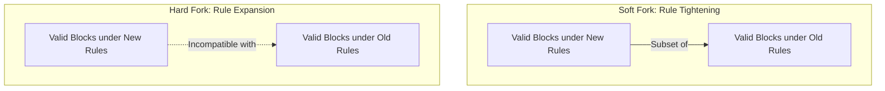
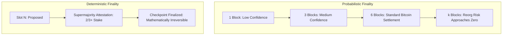

# Forks, Finality, and Reorganizations

In a distributed network with independent nodes and variable latency, divergence in the ledger state is an unavoidable phenomenon.
When two nodes produce valid blocks concurrently, or when core protocol rules change, the blockchain branches into competing paths.
Protocols use fork-choice rules to resolve transient splits and establish finality over historical transactions.

## Types of Protocol Forks

A fork occurs when consensus rules diverge.
Protocol upgrades are categorized into soft forks and hard forks based on their backward compatibility with older client versions.



### Soft Forks (Backward-Compatible Tightening)

A soft fork tightens or restricts protocol rules.
Blocks generated under the new rules remain strictly valid under the old rules:
- **Upgrade Path:** Non-upgraded nodes accept blocks mined by upgraded nodes because the new rules are a subset of the previous valid state space.
- **Enforcement:** As long as a majority of network hash power or validator weight adopts the soft fork, the upgraded chain outpaces the legacy chain, forcing non-upgraded nodes to follow along.
- **Historical Examples:** Segregated Witness (SegWit BIP-141) in 2017 and Taproot (BIP-340) in 2021 on Bitcoin.
  SegWit placed signature witness data outside the legacy 1 MB block serialization, allowing older nodes to process transactions as anyone-can-spend scripts while upgraded nodes enforced cryptographic signatures.

### Hard Forks (Non-Backward-Compatible Expansion)

A hard fork expands protocol capabilities or alters consensus rules such that newer blocks violate older validation logic:
- **Upgrade Path:** Non-upgraded nodes reject the new blocks as invalid and continue following the legacy rules.
- **Chain Split:** If part of the mining or validator community refuses to adopt the new rules, the network splits permanently into two distinct, independent blockchains sharing a common genesis history.
- **Historical Examples:**
  - The Ethereum DAO fork in 2016 (splitting into Ethereum and Ethereum Classic).
  - The Bitcoin block size debate in 2017 (splitting into Bitcoin and Bitcoin Cash).
  - The Merge in 2022, transitioning Ethereum from Proof of Work to Proof of Stake.

| Attribute | Soft Fork | Hard Fork |
| :--- | :--- | :--- |
| **Rule Modification** | Restricts valid transactions / blocks | Expands or fundamentally alters validation rules |
| **Backward Compatibility** | Fully backward-compatible | Non-backward-compatible |
| **Node Upgrade Requirement** | Optional for non-mining nodes | Mandatory for all participating nodes |
| **Split Risk** | Low (if miner majority enforces rules) | High (guarantees split if old nodes persist) |

## Transient Forks and Block Reorganizations

Even without software upgrades, network latency naturally creates temporary branches.
If two miners in different geographic locations discover valid blocks at the identical block height $N$, both broadcast their discoveries simultaneously.

```mermaid
flowchart LR
    BNminus1[Block N-1] --> BNA[Block N: Miner A (Accepted)]
    BNminus1 --> BNB[Block N: Miner B (Orphaned)]
    BNA --> BNplus1[Block N+1: Miner C]
```

1. Part of the network receives Block $N_A$ first and sets its local tip to $N_A$.
2. Another part of the network receives Block $N_B$ first and sets its local tip to $N_B$.
3. When Miner $C$ finds Block $N+1$ built on top of $N_A$ and broadcasts it, nodes tracking $N_B$ detect that the chain containing $N_A$ has accumulated greater weight.
4. Nodes tracking $N_B$ trigger a **block reorganization (reorg)**: they discard Block $N_B$, roll back its state transitions, and apply the state transitions of $N_A$ and $N+1$.
5. Block $N_B$ becomes an **orphaned block** (or stale block).
   Its transactions return to the mempool to be picked up in subsequent blocks unless already included in $N_A$ or $N+1$.

## Fork-Choice Rules

A fork-choice rule is the deterministic algorithm a node executes to evaluate which competing branch represents the canonical head of the blockchain.

### 1. Longest-Chain Rule (Accumulated Difficulty)

Nakamoto consensus uses the heaviest chain rule.
Although commonly referred to as the longest chain, nodes evaluate total accumulated Proof of Work difficulty, not raw block count:

$$\text{Canonical Chain} = \arg\max_{\text{chain}} \sum_{i=1}^{M} \text{Difficulty}(B_i)$$

This prevents an attacker from generating thousands of low-difficulty blocks on a private chain and tricking nodes into accepting it.

### 2. GHOST (Greedy Heaviest Observed Sub-Tree)

In networks with short block intervals (such as Ethereum during its Proof of Work era), network propagation delays caused frequent accidental forks.
The standard longest-chain rule penalizes miners who publish valid blocks that get orphaned due to geographic latency.

GHOST includes stale blocks (called **ommer** or **uncle** blocks) in the weight calculation.
Blocks that reference valid uncle blocks received partial block rewards, and their weight contributed to the security of the canonical chain.

### 3. LMD-GHOST (Latest Message Driven GHOST)

Modern Ethereum uses LMD-GHOST in combination with Casper FFG (the Gasper consensus protocol).
Under LMD-GHOST, the weight of a branch is not determined by computational hashing, but by the accumulated cryptographic attestations of staked validators.
The protocol considers only the most recent attestation message submitted by each active validator in the current epoch.

## Probabilistic vs. Deterministic Finality

Finality defines the point at which a transaction confirmed in a block cannot be reversed, mutated, or replaced.



### Probabilistic Finality (Nakamoto Chains)

Proof of Work networks offer probabilistic finality.
As subsequent blocks are appended on top of a transaction's block, the depth $k$ increases.
The probability $P$ that an attacker can substitute an alternative private chain decreases exponentially with depth:

$$P \approx \sum_{k=0}^{\infty} \left( \frac{q}{p} \right)^k$$

where $q$ is the attacker's hash power share and $p$ is honest hash power.
While $P$ rapidly approaches zero for $k \ge 6$ under the assumption that $q < 0.5$, it never reaches zero in absolute mathematical terms.
A deep reorganization remains theoretically possible if an entity marshals over 51 percent of global hash power.

### Deterministic and Economic Finality (BFT and Casper)

Proof of Stake protocols with finality gadgets provide deterministic, economic finality.
In Ethereum Casper FFG, blocks achieve finality when a supermajority (at least two-thirds) of the total staked ETH signs attestations across two consecutive epoch boundaries (approximately 12.8 minutes).

Once finalized, a block cannot be reverted unless an attacker burns at least one-third of the total network stake through automated protocol slashing:

$$\text{Slashing Cost} \ge \frac{1}{3} \times \text{Total Active Stake}$$

This transforms finality from an empirical waiting period into an explicit economic guarantee.
