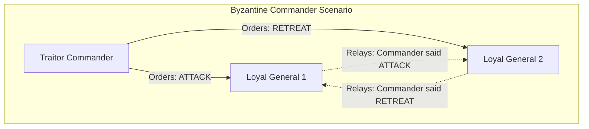
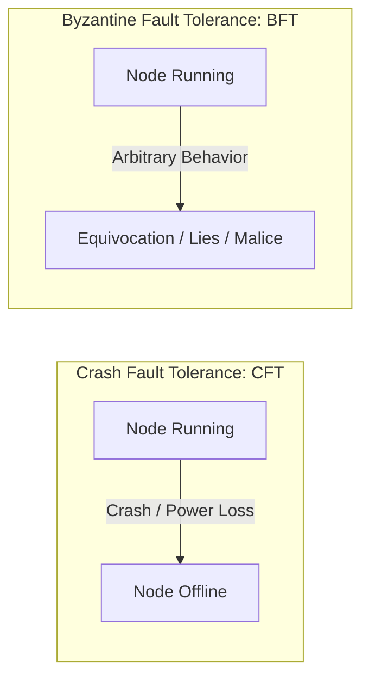
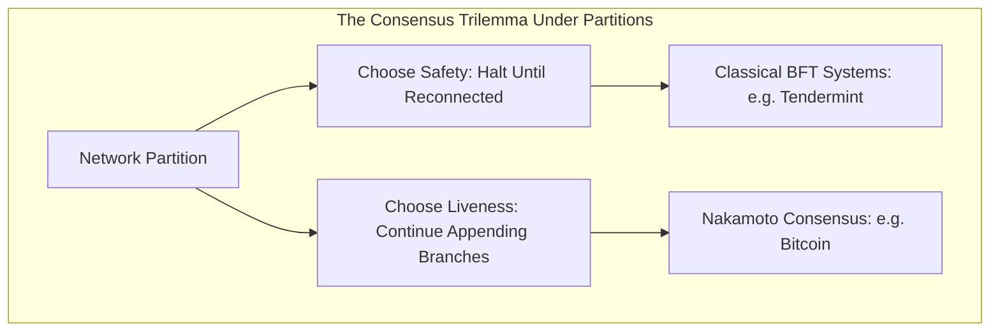

# The Byzantine Generals Problem

Distributed systems must reach coordinated decisions across networks of independent nodes communicating over unreliable channels.
When individual nodes fail to respond, the system faces crash faults.
When individual nodes actively send conflicting, forged, or malicious data to different peers, the system faces arbitrary or Byzantine faults.
Resolving agreement under arbitrary failure conditions is the Byzantine Generals Problem.

## Problem Formalization

Leslie Lamport, Robert Shostak, and Marshall Pease formalized the Byzantine Generals Problem in 1982.
In the classical analogy, several divisions of the Byzantine army camp outside an enemy city.
Each division is commanded by a general, and the generals communicate solely by messenger.
To succeed, the generals must reach a consensus on whether to attack or retreat.
A coordinated attack succeeds; an uncoordinated attack results in catastrophic defeat.

The complication arises because one or more generals, or even the commanding general, may be traitors.
Traitorous generals intentionally transmit conflicting instructions to different peers, attempting to divide the loyal generals' votes.

For a consensus protocol to solve this problem, it must satisfy two conditions:

- **Agreement:** All loyal generals decide upon the identical plan of action.
- **Validity:** If the commanding general is loyal, every loyal general adopts the commander's issued order.

## Crash Fault Tolerance (CFT) vs. Byzantine Fault Tolerance (BFT)

Distributed databases traditionally operated within closed corporate data centers where servers were assumed to be benign.
Public blockchains operate in permissionless networks where adversaries actively attempt to steal funds or halt execution.

| Dimension | Crash Fault Tolerance (CFT) | Byzantine Fault Tolerance (BFT) |
| :--- | :--- | :--- |
| **Fault Assumption** | Nodes fail by stopping or dropping packets. No node sends malicious or contradictory messages. | Nodes can behave arbitrarily, forge messages, delay traffic, or coordinate coordinated attacks. |
| **Classic Protocols** | Paxos, Raft, ZooKeeper (ZAB) | PBFT, Tendermint, HotStuff, Casper |
| **Max Faulty Nodes ($f$)** | $f < \frac{n}{2}$ (Can tolerate up to 49% crashes) | $f < \frac{n}{3}$ (Can tolerate up to 33% malicious actors) |
| **Operational Setting** | Private cloud clusters, internal enterprise state | Public blockchains, decentralized validator sets |

### The $3f + 1$ Bound

In a classical deterministic Byzantine agreement protocol under partial synchrony, reaching consensus among $n$ nodes when up to $f$ nodes are Byzantine requires:

$$n \ge 3f + 1$$

To understand why $n$ must exceed $3f$:
1. Suppose $f$ nodes are malicious and send contradictory votes.
2. An additional $f$ honest nodes may be temporarily offline or experiencing extreme network latency.
3. A deciding node cannot distinguish between a dead node and a slow node.
4. Therefore, the node must make a deterministic progress decision after receiving messages from $n - f$ nodes.
5. Among those $n - f$ responding nodes, $f$ might be the Byzantine nodes lying about their state.
6. For the remaining honest responses to outvote the Byzantine lies, the number of honest responders $(n - 2f)$ must strictly exceed the Byzantine cohort $(f)$:

$$n - 2f > f \implies n > 3f \implies n \ge 3f + 1$$

If Byzantine nodes control one-third or more ($f \ge \frac{n}{3}$) of the voting power, safety or liveness can be permanently compromised.

## Safety, Liveness, and the FLP Impossibility Theorem

Every distributed consensus protocol balances two fundamental guarantees:

- **Safety (Nothing bad happens):** All honest nodes agree on the identical sequence of state transitions. No two honest nodes ever finalize conflicting blocks at the same height.
- **Liveness (Something good eventually happens):** The network makes continuous forward progress, processing transactions and appending new blocks without deadlocking.

### The FLP Impossibility Theorem

In 1985, Fischer, Lynch, and Paterson published their impossibility result:
In a purely asynchronous network, no deterministic consensus protocol can guarantee both safety and liveness in the presence of even a single unannounced crash fault.

In pure asynchrony, message delivery delays are unbounded.
A node cannot determine whether a peer has crashed or is merely experiencing extreme latency.
Consequently, deterministic protocols must sacrifice either liveness (halting progress during network partitions) or safety (risking forks).

### Network Synchrony Models

The feasibility of Byzantine consensus depends on network delay assumptions:

- **Synchronous Network:** A known upper bound $\Delta$ exists such that every message transmitted is guaranteed to arrive within time $\Delta$. Safety and liveness can be preserved, but the assumption is unrealistic over the public internet.
- **Asynchronous Network:** Messages eventually arrive, but transmission delays are completely unbounded. Constrained by the FLP theorem.
- **Partially Synchronous Network:** Messages are unbounded initially, but after an unknown Global Stabilization Time (GST), transmission delays are bounded by $\Delta$. Modern BFT protocols (such as PBFT and Tendermint) operate under this model.

## How Nakamoto Consensus Bypassed FLP

The FLP impossibility theorem applies strictly to deterministic consensus algorithms.
Satoshi Nakamoto bypassed the constraint by introducing randomized, probabilistic consensus:

- **Randomized Leader Election:** Proof of Work converts leader election into a memoryless Poisson process. No deterministic round-robin coordinator exists to be targeted with denial-of-service attacks.
- **Prioritizing Liveness Over Immediate Safety:** Bitcoin guarantees liveness under network partitions. Nodes continue mining on the best chain they can see.
- **Probabilistic Safety:** Instead of immediate absolute finality, safety converges exponentially with block depth ($k$). Once partitions heal, the longest chain reconciles the history across all participants.
