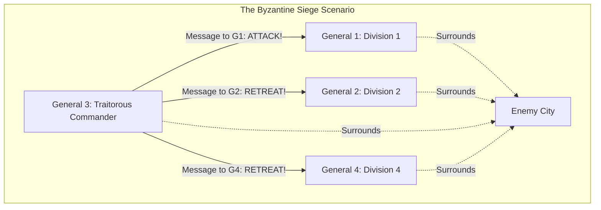
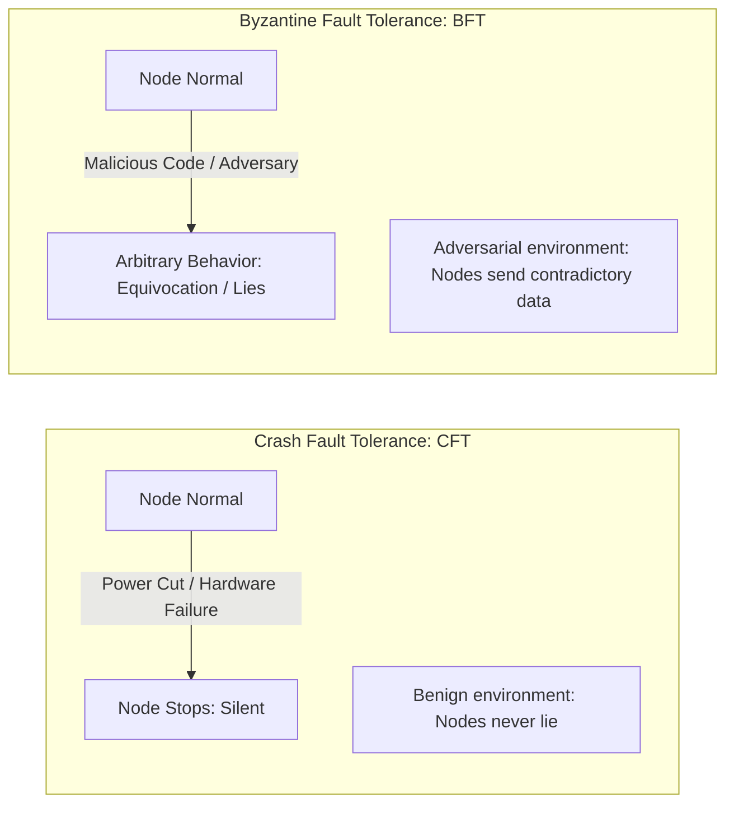
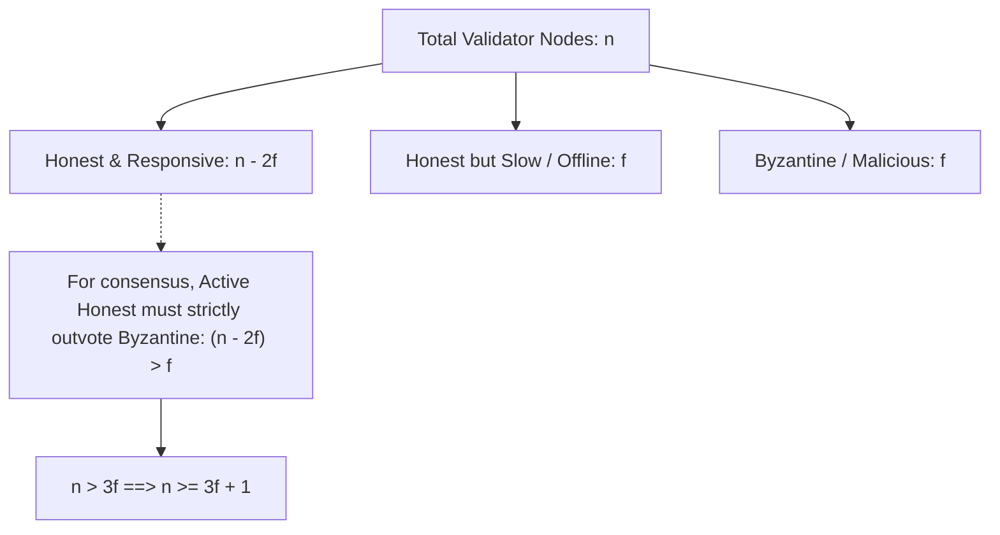
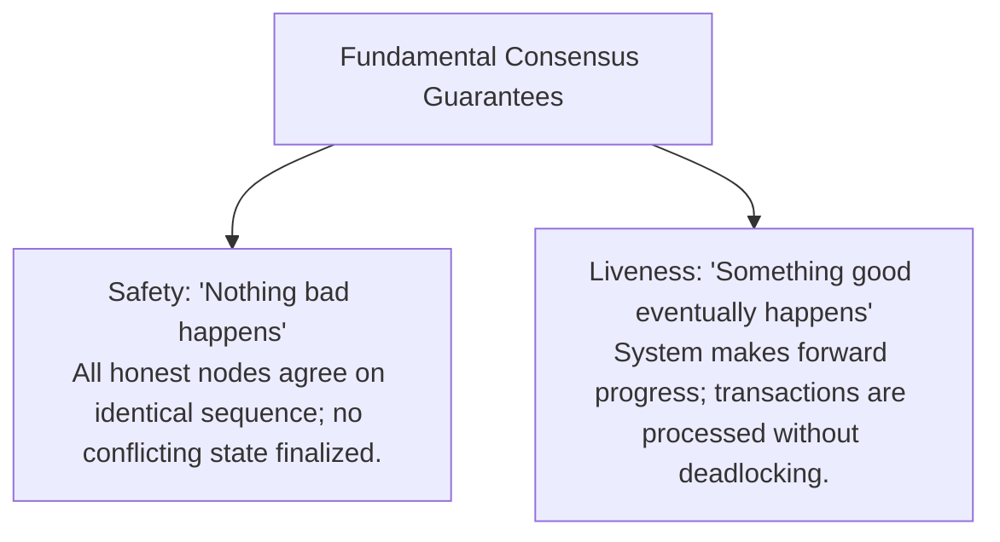
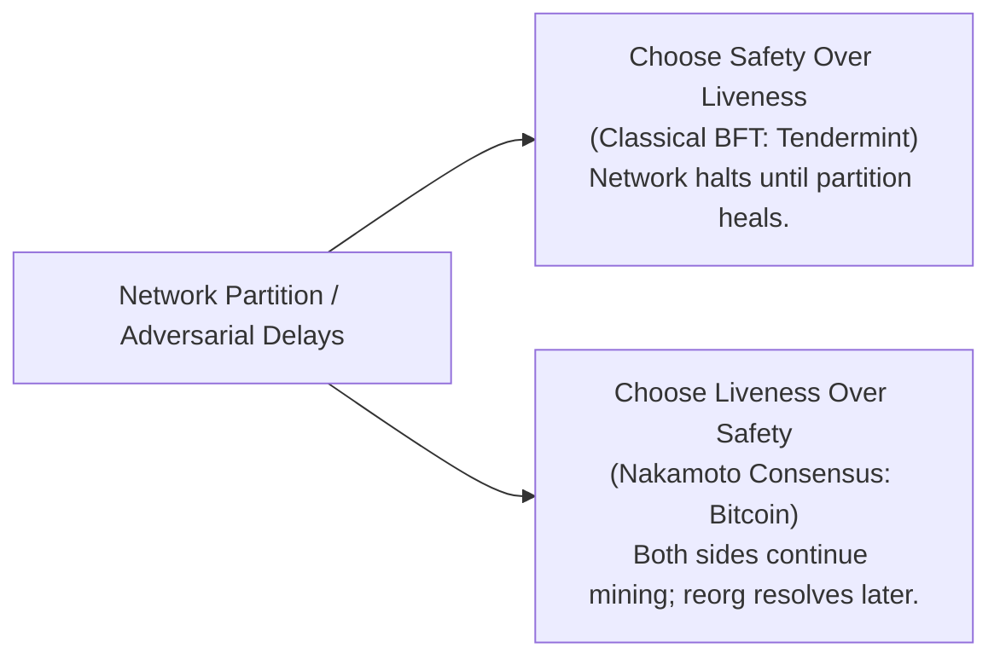

# The Byzantine Generals Problem

In computer science, reaching agreement across a network of separate machines is one of the most thoroughly studied challenges.
When all computers in a cluster are owned by a single corporation (like Google, Amazon, or Netflix) inside a private data center, the problem is relatively straightforward.
Servers might occasionally crash, lose power, or suffer hardware failure, but no server is actively attempting to deceive its peers, lie about its database contents, or sabotage the system.

Public blockchains, however, do not operate inside private corporate data centers.
They operate across the open internet among pseudonymous, untrusted participants.
In this environment, nodes may not only fail by stopping; they may be actively malicious, coordinated by sophisticated attackers attempting to steal funds, forge state transitions, or halt network progress.

The foundational theoretical framework for solving coordination in this hostile environment is **The Byzantine Generals Problem**.

## The Classical Allegory

Leslie Lamport, Robert Shostak, and Marshall Pease formalized the problem in 1982 in a landmark paper titled *The Byzantine Generals Problem*.

To explain the challenge intuitively, they framed it as a military dilemma:

- Several divisions of the Byzantine army camp outside an enemy city, each division commanded by its own general.
- The generals cannot communicate in person or via telephone; they can communicate exclusively by sending human messengers on foot between camps.
- The enemy city is heavily fortified.
  If the entire army attacks together at dawn, they will capture the city.
  If only a fraction attacks while the rest retreat, the attacking divisions will be overwhelmed and slaughtered.
- The generals must reach a unanimous, coordinated decision: either **all attack** or **all retreat**.

### The Complication: Traitorous Actors

The dilemma arises because one or more generals (or even the commanding general who issues the initial battle plan) may be **traitors**.
A traitorous general's sole objective is to prevent the loyal generals from reaching agreement:
- To General 1, the traitor sends a messenger saying: *"Attack at dawn!"*
- To General 2, the traitor sends a messenger saying: *"Retreat at dawn!"*
- When the loyal generals relay messages among themselves to verify the commander's orders, the traitors send contradictory reports, intentionally confusing the vote counts.

To succeed, a consensus protocol must satisfy two invariant conditions:

1. **Agreement:** All honest (loyal) generals decide upon the identical plan of action.
2. **Validity:** If the commanding general is loyal, every loyal general adopts the specific order issued by the commander.

## Crash Fault Tolerance (CFT) vs. Byzantine Fault Tolerance (BFT)

To understand why blockchains are revolutionary, one must first distinguish between the two primary fault models in distributed systems:

### 1. Crash Fault Tolerance (CFT)

In a Crash Fault Tolerant system:
- **Failure Model:** Nodes fail by **halting** (crashing, rebooting, dropping offline, or experiencing severed network cables).
- **Assumed Honesty:** Crucially, a node never sends malicious, forged, or contradictory data. If a node responds to a query, its response is assumed to be honest and accurate according to its local state.
- **Classic Algorithms:** Paxos (Leslie Lamport, 1998), Raft (Ongaro and Ousterhout, 2014), ZooKeeper (ZAB).
- **Tolerated Faults:** A CFT system of $n$ nodes can tolerate up to:
  $$f < \frac{n}{2}$$
  In other words, as long as a simple majority of nodes ($51\%$) remains online, the database continues operating smoothly.

### 2. Byzantine Fault Tolerance (BFT)

In a Byzantine Fault Tolerant system:
- **Failure Model:** Nodes can fail in arbitrary, unpredictable ways (the **Byzantine failure mode**).
- **Adversarial Capabilities:** A faulty node can:
  - Stay online and pretend to be honest while broadcasting conflicting state updates to different peers (**equivocation**).
  - Selectively drop messages from specific peers to manipulate voting majorities.
  - Coordinate with other compromised nodes to execute coordinated Sybil or double-spending attacks.
- **Tolerated Faults:** A classical deterministic BFT system under partial synchrony can tolerate at most:
  $$f < \frac{n}{3}$$
  A BFT network requires more than two-thirds ($> 66.7\%$) of participating voting power to be honest to guarantee safety and liveness.

| Architectural Dimension | Crash Fault Tolerance (CFT) | Byzantine Fault Tolerance (BFT) |
| :--- | :--- | :--- |
| **Trust Assumption** | Semi-trusted: nodes fail only by stopping | Zero-trust: nodes can lie, forge, collude |
| **Industry Deployments** | Cloud infrastructure: CockroachDB, etcd, Kafka | Public blockchains: Bitcoin, Ethereum, Cosmos |
| **Max Faulty Weight ($f$)** | Up to $49\%$ crashes ($n \ge 2f + 1$) | Up to $33\%$ malicious actors ($n \ge 3f + 1$) |
| **Communication Topology** | Typically star / leader-follower | High-density peer gossip / multi-round voting |

## The Mathematical Proof: Why $n \ge 3f + 1$

Why can a deterministic BFT consensus protocol tolerate at most $f < \frac{n}{3}$ faulty nodes?
Let us walk through the fundamental mathematical proof.

Suppose a network consists of $n$ total voting nodes, of which at most $f$ may be Byzantine (malicious).

1. **The Liveness Requirement:**
   In an asynchronous network, message transmission delays are variable.
   A node waiting for votes cannot distinguish between a node that is dead (crashed) and a node that is merely experiencing high network latency.
   Therefore, to avoid waiting forever (deadlock), the protocol must make forward progress as soon as it receives messages from $n - f$ nodes (since up to $f$ honest nodes might simply be slow or temporarily disconnected).

2. **The Adversarial Worst Case:**
   Among those $n - f$ responses that the protocol receives:
   - Up to $f$ of those responses could be coming from **Byzantine nodes** that are deliberately lying or voting for a fraudulent state.
   - Therefore, the number of guaranteed **honest responses** among the quorum is at most:
     $$\text{Honest Responders} = (n - f) - f = n - 2f$$

3. **Outvoting the Adversary:**
   For honest nodes to reach unambiguous agreement and prevent the Byzantine nodes from tipping the vote toward fraud, the number of honest responders must strictly exceed the number of Byzantine nodes:
   $$n - 2f > f$$

4. **Solving for $n$:**
   $$n > 3f \implies n \ge 3f + 1$$

Thus, in any classical deterministic Byzantine agreement protocol:
- If $f = 1$ traitor, you need at least $n = 3(1) + 1 = 4$ total nodes.
- If $f = 2$ traitors, you need at least $n = 3(2) + 1 = 7$ total nodes.
- In general, honest nodes must control **strictly more than two-thirds** ($> \frac{2}{3}$) of total voting weight.

If Byzantine actors acquire $\frac{1}{3}$ or more of the voting power ($f \ge \frac{n}{3}$), they can permanently compromise consensus by voting for one state to half the network and a contradictory state to the other half, causing a permanent, unresolvable safety failure.

## Safety, Liveness, and the FLP Impossibility Theorem

Every distributed consensus protocol must provide two fundamental guarantees:

### The FLP Impossibility Theorem (1985)

In 1985, researchers Fischer, Lynch, and Paterson published what is widely considered the most famous impossibility result in distributed computing: **The FLP Impossibility Theorem**.

> In a purely asynchronous distributed system, no deterministic consensus protocol can guarantee both Safety and Liveness in the presence of even a single unannounced crash fault.

In a purely asynchronous network:
- Message delays are completely unbounded: a message will eventually arrive, but it could take one millisecond or one year.
- A node cannot tell whether a silent peer has crashed or is merely delayed by network congestion.
- Fischer, Lynch, and Paterson proved mathematically that an adversary who can selectively delay messages can keep any deterministic algorithm cycling through undecided states forever, destroying liveness.

Consequently, every real-world consensus engine must compromise on one of these dimensions:
- **Classical BFT Protocols (e.g. Tendermint, Cosmos):** Prioritize **Safety over Liveness**.
  If a network partition cuts off more than one-third of validators, the blockchain intentionally halts.
  No new blocks are produced until connectivity is restored, ensuring that no conflicting blocks are ever finalized.
- **Nakamoto Consensus (e.g. Bitcoin):** Prioritizes **Liveness over immediate Safety**.
  If the Atlantic fiber cables are severed, miners on both sides continue producing blocks independently.
  The chain never halts.
  Once the partition heals, the longest-chain rule reorganizes the divergent history, sacrificing immediate deterministic safety in favor of continuous availability.

## How Satoshi Nakamoto Bypassed FLP

For more than two decades following the publication of the FLP theorem, computer scientists believed that building an open, permissionless, global Byzantine-resilient monetary system was mathematically impossible.

Satoshi Nakamoto bypassed the constraints of the FLP impossibility theorem through three foundational design innovations:

1. **Replacing Determinism with Randomness (Poisson Process):**
   The FLP theorem applies strictly to **deterministic** algorithms.
   Nakamoto consensus is fundamentally **probabilistic**.
   Block discovery is a memoryless Poisson process driven by Proof of Work.
   There is no deterministic leader-election schedule that an adversary can target with selective network delays to stall the algorithm.

2. **Decoupling Voting from Identity:**
   In classical BFT, the formula $n \ge 3f + 1$ requires knowing the exact, finite number of participants $n$.
   On an open internet, $n$ cannot be known because anyone can spawn unlimited fake IP addresses (Sybil attacks).
   Nakamoto replaced counting node identities ($n$) with counting computational energy expenditure (hash rate).

3. **Substituting Instant Finality with Probabilistic Finality:**
   Instead of demanding that every block achieve 100 percent deterministic settlement before proposing the next, Nakamoto consensus allows transactions to settle probabilistically.
   Safety converges toward mathematical certainty exponentially with block depth ($k$), bypassing the asynchronous deadlock that halted classical distributed systems.
