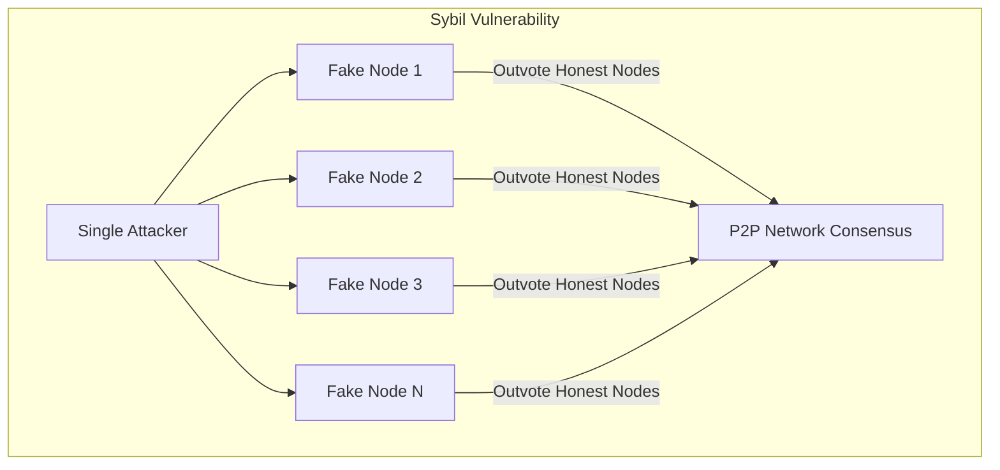
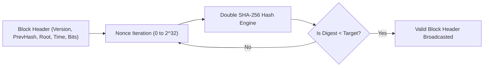
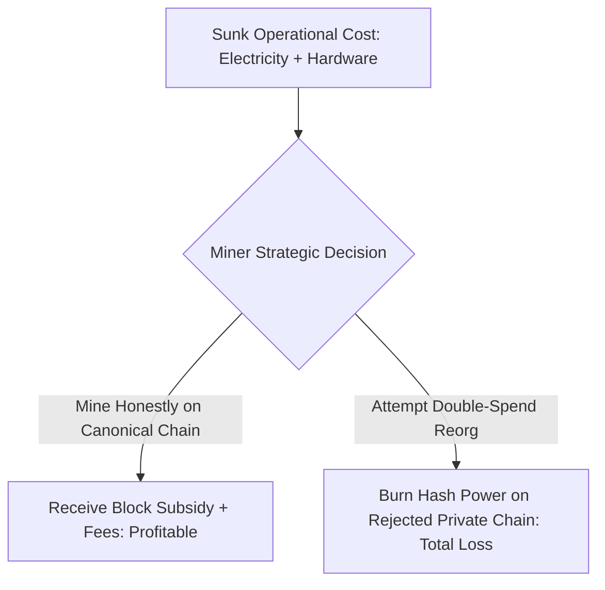

# Proof of Work and Nakamoto Consensus

Decentralized networks cannot rely on IP addresses or registered identities to distribute voting weight.
Because creating digital identities costs nothing, an attacker could spawn millions of virtual nodes to dominate network voting.
This vulnerability is the Sybil attack.
Proof of Work (PoW) resolves Sybil attacks by anchoring voting power directly to physical computing power and thermodynamic energy expenditure.

## The Sybil Attack and Cryptographic Cost Functions

John Douceur formalized the Sybil attack in 2002.
He proved that without a centralized identity certification authority, distributed networks cannot defend against an attacker generating unlimited counterfeit identities.

Nakamoto consensus bypasses identity entirely through the rule of **one-CPU-one-vote** (later evolving into one-hash-unit-one-vote).
To produce a valid block, a participant must prove that a measurable amount of computational work was expended.
Because compute requires real-world hardware and electricity, acquiring voting weight carries unavoidable physical costs.

## The Mining Mechanism: Iterating Nonces

A Proof of Work block header is valid only if its double-SHA-256 hash digest falls below a network-defined threshold called the **Target** ($T$):

$$\text{SHA-256}(\text{SHA-256}(\text{Header})) < T$$

The target is a 256-bit unsigned integer.
The smaller the target, the more leading zero bits the resulting block hash must possess, and the lower the mathematical probability that any single hash attempt succeeds.

Because cryptographic hash functions satisfy the pre-image resistance and avalanche properties, mining behaves as a memoryless Poisson process:
- Each hash evaluation is an independent Bernoulli trial.
- The probability $p$ of discovering a valid block in any single hash attempt is:
  $$p = \frac{T}{2^{256}}$$
- A miner who has computed for two hours has the identical probability of discovering a block in the subsequent microsecond as a miner who began one second ago.

## Dynamic Difficulty Adjustment

If network hash power increases due to faster hardware or new miners joining, blocks would be produced too rapidly, causing excessive network propagation collisions and chain splits.
If hash power drops, block generation would stall, paralyzing transaction throughput.

Protocols implement dynamic difficulty adjustments to maintain an invariant target block interval.
In Bitcoin, the target interval is 10 minutes ($T_{\text{target}} = 600$ seconds).
Every 2,016 blocks (approximately two weeks), every full node independently recalculates the target:

$$T_{\text{new}} = T_{\text{old}} \times \frac{\text{Time taken for last 2016 blocks}}{2016 \times 10 \text{ minutes}}$$

To protect the network against transient anomalies or malicious timestamp manipulation, the adjustment factor is clamped within a factor of four:

$$\frac{1}{4} \le \frac{T_{\text{new}}}{T_{\text{old}}} \le 4$$

Difficulty ($D$) is a normalized scalar expressing how difficult the current target is relative to the genesis block target ($T_{\text{genesis}}$):

$$D = \frac{T_{\text{genesis}}}{T_{\text{current}}}$$

## Economic Incentive Alignment and Nash Equilibrium

Proof of Work aligns the economic interests of miners with the honest maintenance of the ledger.
Miners incur ongoing capital expenditures (ASIC hardware acquisition) and operational expenditures (electricity and facility cooling).

Miners recoup these expenses through two revenue streams awarded only when a block is accepted into the canonical chain:

- **Coinbase Block Subsidy:** Newly minted native coins awarded to the miner. In Bitcoin, this subsidy halves every 210,000 blocks (roughly every four years).
- **Transaction Fees:** The aggregate remainder between transaction input values and output values.

This dynamic creates a Nash equilibrium:
- If a miner attempts to include an invalid transaction (e.g. forging coins or double-spending), full nodes immediately reject the block without broadcasting it further.
- The attacking miner incurs 100 percent of the electrical cost of mining that block but receives zero rewards.
- Honest mining provides predictable, positive expected economic return.

## Security Bounds and Attack Vectors

### 1. The 51 Percent Reorganization Attack

If an entity controls more than 50 percent of the global hash power ($q > 0.5$), the attacker can generate an alternative chain faster than the rest of the honest network combined.
The attacker can:
- Execute a transaction on the public chain (e.g. depositing coins to an exchange).
- Simultaneously mine a private chain in secret that excludes this payment.
- Once the exchange credits the deposit and processes a fiat withdrawal, the attacker releases the private chain.
- Because the private chain has accumulated greater cumulative difficulty, the network reorganizes to the attacker's chain, restoring the spent funds to the attacker.

A 51 percent attack does not allow the attacker to forge signatures, invent coins from thin air, or steal funds from arbitrary accounts.
It allows only the reversal of the attacker's own past transactions and the censorship of specific transactions.

### 2. Selfish Mining (Eyal and Sirer)

In 2014, Ittay Eyal and Emin Gün Sirer demonstrated that honest mining is not strictly incentive-compatible for large mining pools.
In a selfish mining attack, a pool that finds a block keeps it private rather than broadcasting it immediately.
The selfish pool continues mining on top of its secret block, building a lead over the public chain.

When the honest network finds a block, the selfish pool reveals its private branch.
If the pool's lead was sufficient, the honest network's block is orphaned, wasting honest hash power and increasing the selfish pool's relative proportion of rewards.
Selfish mining becomes mathematically profitable if a pool controls more than 33 percent of the hash rate under worst-case network propagation, or as low as 25 percent under favorable connectivity.

## Hardware Evolution: CPU to ASIC

The search for energy efficiency drove mining through distinct hardware phases:

| Hardware Era | Dominant Architecture | Hashing Efficiency | Centralization Impact |
| :--- | :--- | :--- | :--- |
| **CPU (2009-2010)** | x86 Instruction Sets | Kilohashes per watt ($\text{KH/W}$) | Completely decentralized across personal computers |
| **GPU (2010-2012)** | Highly parallelized SIMD cores | Megahashes per watt ($\text{MH/W}$) | Accessible to consumer desktop graphics rigs |
| **FPGA (2012-2013)** | Reconfigurable logic gates | Gigahashes per watt ($\text{GH/W}$) | Transition to specialized hardware builders |
| **ASIC (2013-Present)** | Dedicated silicon custom-printed for SHA-256 | Terahashes per watt ($\text{TH/W}$) | Industrialization into mega-facilities and specialized foundry supply chains |

To counter silicon specialization, several subsequent networks adopted **ASIC-resistant** memory-hard hash functions:
- **Scrypt** (Litecoin): Requires substantial memory storage to calculate each hash, limiting purely arithmetic hardware optimizations.
- **Ethash** (Ethereum historical PoW): Relied on a periodically regenerating 4+ GB Directed Acyclic Graph (DAG) dataset loaded into GPU VRAM.
- **RandomX** (Monero): Generates randomized code execution loops that utilize hardware CPU cache and branch prediction, optimizing specifically for consumer CPUs.
