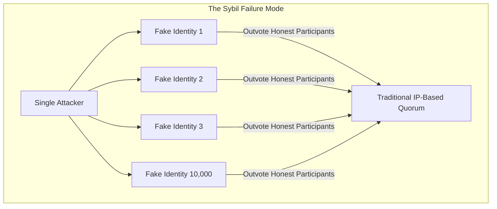
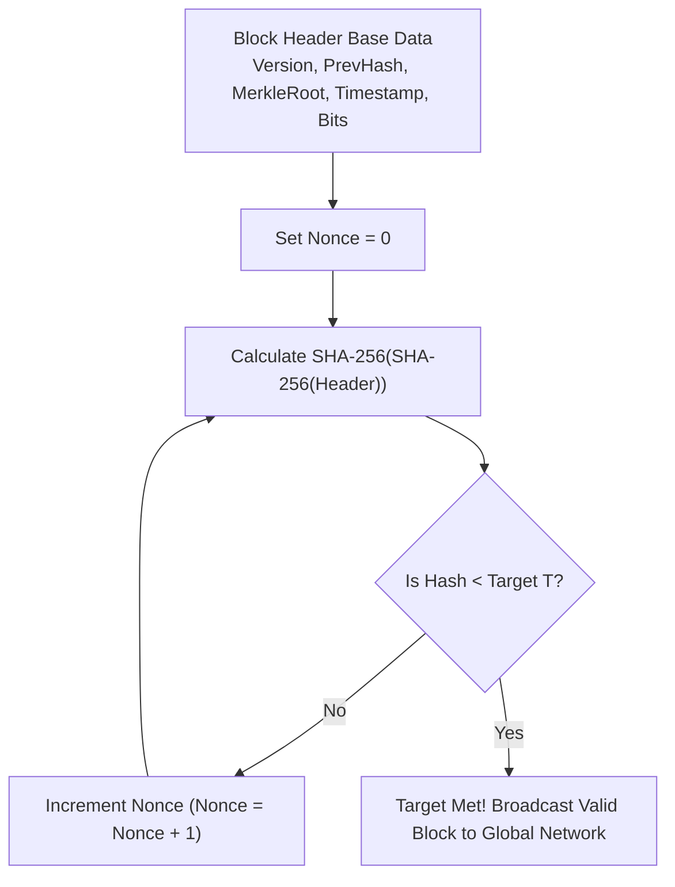
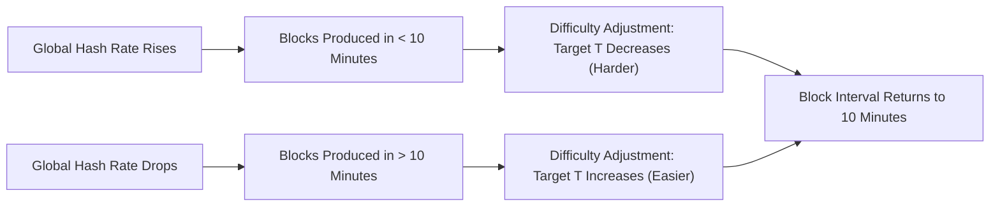
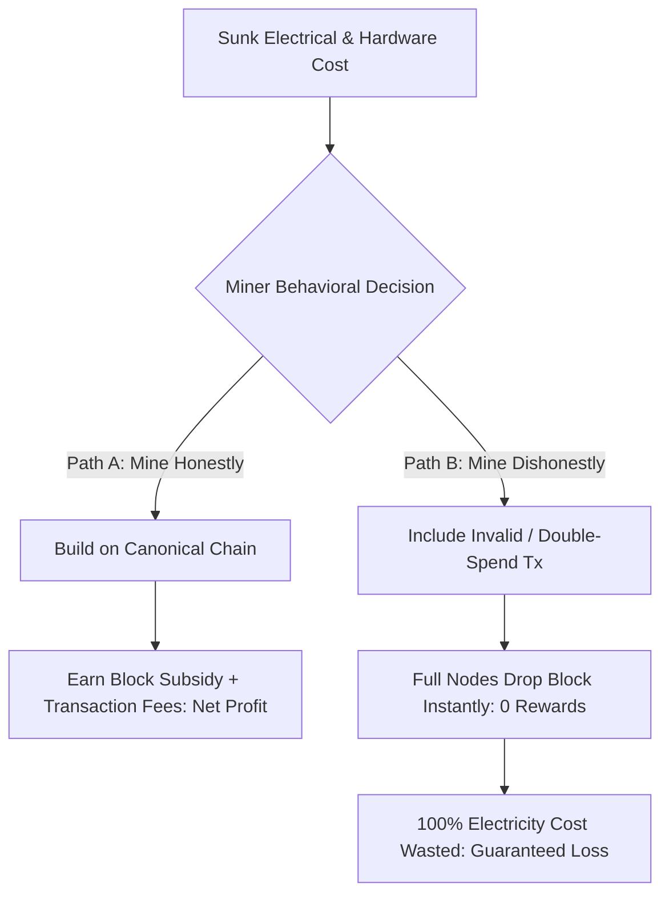
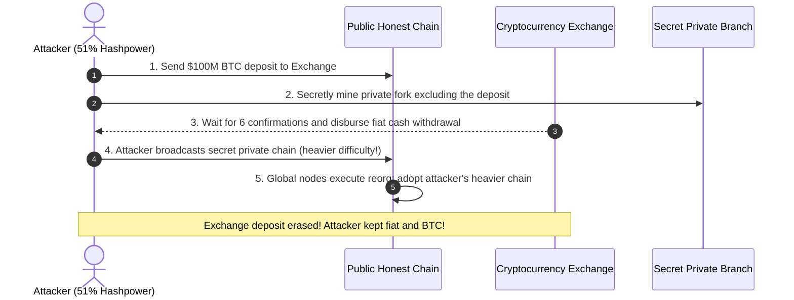
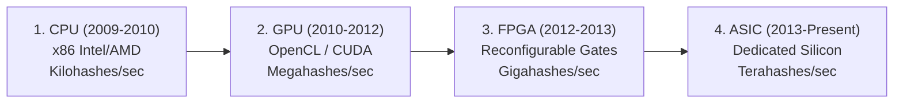

# Proof of Work and Nakamoto Consensus

In an open, permissionless network like the public internet, anyone can download software, generate an IP address, and begin transmitting messages.
This openness is the superpower of decentralized systems, but it presents a catastrophic vulnerability: **The Sybil Attack**.

If a blockchain relied on democratic voting where "one IP address equals one vote," an attacker with a modest laptop could spin up 100,000 virtual machines in the cloud for a few dollars, claim 99 percent of the voting power, and instantly authorize fraudulent transactions.
Any open consensus mechanism must find a way to distribute decision-making authority without trusting human identities, IP addresses, or central registries.

Satoshi Nakamoto's breakthrough was **Proof of Work (PoW)**, the engine of **Nakamoto Consensus**.
Instead of anchoring voting power to virtual digital identities (which cost zero to create), Proof of Work anchors voting power directly to **thermodynamic energy expenditure and physical computation in the real world**.

## John Douceur and the Sybil Proof

In 2002, Microsoft researcher John Douceur published a paper titled *The Sybil Attack*.
Douceur mathematically proved a sobering reality:

> Without a centralized identity certification authority, an open distributed network cannot defend against an attacker who fabricates an arbitrary number of counterfeit identities to dominate network quorums.

Nakamoto consensus solved the Sybil problem by bypassing identities entirely.
In Bitcoin, the network does not care who you are, what your IP address is, or how many software nodes you run.
The protocol enforces a rule of **one-hash-unit-one-vote**:
- To propose a valid block, you must present cryptographic proof that your computer calculated millions or billions of hash operations.
- Because computation requires physical silicon processors (ASICs) and physical electricity (kilowatt-hours), acquiring voting power carries an unavoidable, unforgeable real-world cost.

## The Mining Mechanism: Iterating Nonces and the Target

How does a computer "prove" that it performed work?
It solves a cryptographic search puzzle called a **pre-image search**.

A miner takes the 80-byte block header and calculates its double-SHA-256 hash:

$$\text{Block Hash} = \text{SHA-256}\big(\text{SHA-256}(\text{Header})\big)$$

For the block to be accepted as valid by every node in the network, the resulting 256-bit hash digest must be **numerically smaller than a dynamic network threshold called the Target ($T$)**:

$$\text{Block Hash} < T$$

### The Target and Leading Zeroes

The Target $T$ is a 256-bit unsigned integer.
Because hash functions exhibit the avalanche effect and behave like uniform random number generators, the probability $p$ that any single random hash falls below the target $T$ is:

$$p = \frac{T}{2^{256}}$$

- When the target $T$ is large, the puzzle is easy: many random hashes will be smaller than $T$.
- When the target $T$ is small, the puzzle is extraordinarily difficult: the resulting hash must start with a large number of leading binary zeroes.

For example, a block hash that starts with 19 hexadecimal zeroes:

$$\mathtt{00000000000000000002a4b5e7f1\dots}$$

represents a number that is astronomically small relative to $2^{256}$.
Because SHA-256 cannot be reversed, there is no formula, shortcut, or mathematical trick to discover a winning nonce.
The only way to find a valid block is brute-force trial and error: guess a nonce, compute the hash, check if it is smaller than $T$, increment the nonce, and try again.

### The Memoryless Poisson Process

An essential mathematical property of Proof of Work mining is that it is a **memoryless Poisson process**:
- Every single hash evaluation is an independent Bernoulli trial.
- The outcome of the current hash calculation has zero correlation with previous or future attempts.
- A miner who has computed for ten hours has the exact same probability of finding a block in the next millisecond as a miner who plugged in their machine one second ago.

This memoryless property ensures that block discovery is fair, decentralized, and cannot be gamed by hoarding past work.

## Dynamic Difficulty Adjustment: Regulating Block Time

If Bitcoin simply had a static, unchangeable target $T$:
- In 2009, when only a few laptops were mining, it would take months to find a single block.
- In 2026, with millions of high-powered industrial ASIC rigs operating globally, blocks would be produced every millisecond, causing catastrophic network propagation collisions, massive forks, and immediate state explosion.

To maintain a consistent, predictable monetary issuance and stable transaction clearing time, Bitcoin implements a **Dynamic Difficulty Adjustment**.

### The 2,016-Block Retarget Formula

Bitcoin's protocol targets an average block interval of **10 minutes** ($T_{\text{target}} = 600$ seconds).
Every **2,016 blocks** (which takes approximately two weeks under normal conditions: $2016 \times 10 \text{ minutes} = 20,160 \text{ minutes} = 14 \text{ days}$), every full node on Earth independently recalculates the target:

$$T_{\text{new}} = T_{\text{old}} \times \left( \frac{\text{Actual Time Taken for Last 2,016 Blocks}}{20,160 \text{ minutes}} \right)$$

1. **If actual time was 10 days (miners added hash power):**
   The ratio $\frac{10}{14} \approx 0.714$.
   The new target $T_{\text{new}}$ is multiplied by $0.714$, making the target smaller and the puzzle approximately 40 percent harder.
2. **If actual time was 20 days (miners shut off machines):**
   The ratio $\frac{20}{14} \approx 1.428$.
   The new target $T_{\text{new}}$ is multiplied by $1.428$, making the target larger and the puzzle easier.

### Clamping Bounds

To protect the network from extreme transient anomalies, timestamp manipulation, or software bugs, the adjustment factor is clamped within a factor of four:

$$\frac{1}{4} \le \frac{T_{\text{new}}}{T_{\text{old}}} \le 4$$

Difficulty ($D$) is a normalized human-readable representation comparing the current target to the genesis block target ($T_{\text{genesis}}$):

$$D = \frac{T_{\text{genesis}}}{T_{\text{current}}}$$

## Economic Incentive Alignment and Nash Equilibrium

Proof of Work is not merely a cryptographic algorithm; it is a **game-theoretic economic mechanism**.

Miners do not mine out of altruism.
They mine to generate a profit.
Mining incurs real, unavoidable capital expenditures (buying ASIC hardware) and operational expenditures (paying monthly electricity bills in fiat currency).

Miners recoup their expenses through two revenue streams awarded exclusively when their block is accepted into the canonical chain:
1. **The Coinbase Block Subsidy:** Newly minted native coins created out of thin air in the first transaction of the block.
   In Bitcoin, this subsidy began at 50 BTC per block and halves every 210,000 blocks (roughly every four years: $50 \to 25 \to 12.5 \to 6.25 \to 3.125$ BTC).
2. **Transaction Fees:** The difference between total input amounts and total output amounts in the block.

### The Nash Equilibrium of Honest Mining

This structure forms a self-enforcing **Nash Equilibrium**:
- If a miner includes a fraudulent transaction (such as spending coins they do not own or double-spending), full nodes and non-mining peers verify the block rules and **immediately drop the block**.\n- The fraudulent miner incurs 100 percent of the electrical cost of calculating the valid Proof of Work hash, but receives **zero coins and zero fees**.
- Conversely, following the rules and building honestly on the longest chain guarantees that valid blocks are accepted and rewarded with high-value native currency.
Dishonesty is rendered economically irrational by design.

## Security Bounds and Attack Vectors

While Nakamoto consensus is remarkably robust, it is subject to well-defined game-theoretic and physical attack vectors:

### 1. The 51 Percent Reorganization Attack

If a single entity or mining cartel controls more than 50 percent of the global hash power ($q > 0.5$):
- The attacker can calculate Proof of Work faster than the rest of the honest network combined.
- The attacker can secretly mine an alternative private chain while sending a transaction on the public chain (e.g. depositing $100M of BTC to an exchange, selling it for fiat, and withdrawing the fiat).
- Once the exchange withdrawal completes, the attacker releases their secretly mined private chain to the public.
- Because the private chain has accumulated greater cumulative difficulty, the network reorganizes to the attacker's chain under the longest-chain rule.
- The original deposit transaction is wiped out, and the attacker retains both the fiat cash and the original BTC!

Crucially, a 51 percent attack **does not** allow the attacker to:
- Steal coins from other users' wallets (because the attacker lacks their private keys).
- Modify historical transactions prior to the fork point.
- Change protocol consensus rules (such as minting 100 million new coins), because validating full nodes reject invalid blocks regardless of difficulty.
It allows only the reversal of the attacker's own recent payments (double-spending) and transaction censorship.

### 2. Selfish Mining (Eyal and Sirer, 2014)

In 2014, researchers Ittay Eyal and Emin Gün Sirer proved that honest mining is not strictly incentive-compatible for large mining pools.
In a **Selfish Mining Attack**:
1. A selfish pool finds a block but keeps it secret instead of broadcasting it.
2. The pool continues mining on top of its secret block, aiming to build a private lead.
3. When the honest network discovers a block, the selfish pool immediately publishes its private branch.
4. Because the pool's branch is longer, the honest network's block is orphaned, wasting honest hash power.

Eyal and Sirer proved that selfish mining becomes mathematically profitable if a pool controls as little as **25 percent to 33 percent** of global hash power (depending on network propagation advantages), demonstrating that absolute threshold security requires careful propagation design.

## Hardware Evolution: From CPU to ASIC

Proof of Work transformed the physical semiconductor industry across four distinct eras:

1. **CPU Era (2009-2010):** Mining ran on consumer desktop processors. Anyone with a personal computer could participate democratically.
2. **GPU Era (2010-2012):** Miners realized that graphics cards contain thousands of parallel arithmetic logic units (ALUs) capable of running thousands of SHA-256 iterations simultaneously, achieving $100\times$ speedups over CPUs.
3. **FPGA Era (2012-2013):** Field Programmable Gate Arrays allowed engineers to burn SHA-256 logic directly onto reconfigurable hardware circuits, optimizing energy consumption.
4. **ASIC Era (2013-Present):** Application-Specific Integrated Circuits (ASICs) print the double-SHA-256 algorithm permanently onto custom silicon dies.
   An ASIC can perform no other task (it cannot render a video or boot an operating system), but it executes SHA-256 hashing billions of times more efficiently than general-purpose CPUs.

This hardware industrialization led to large-scale mining operations located near cheap hydroelectric, geothermal, or stranded natural gas energy sources, permanently anchoring digital monetary issuance to the physical energy infrastructure of the planet.
