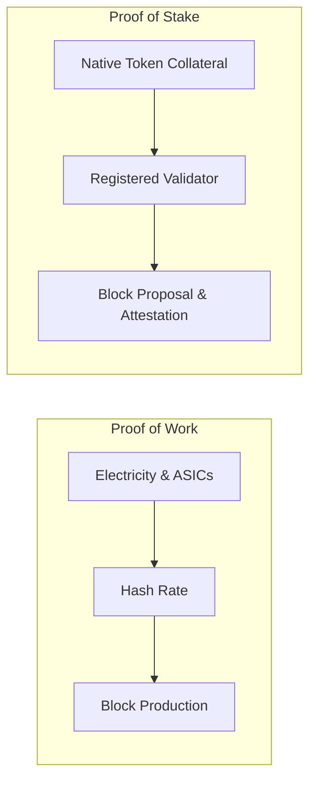
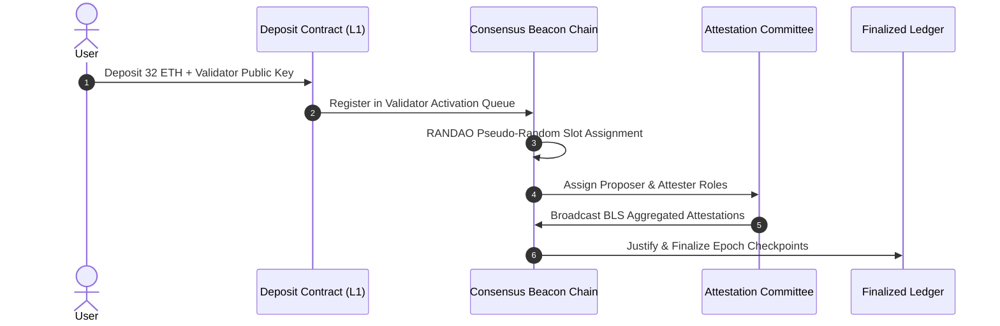
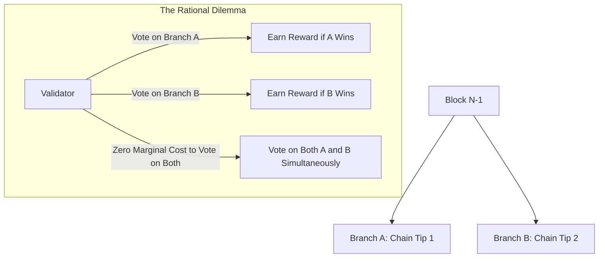
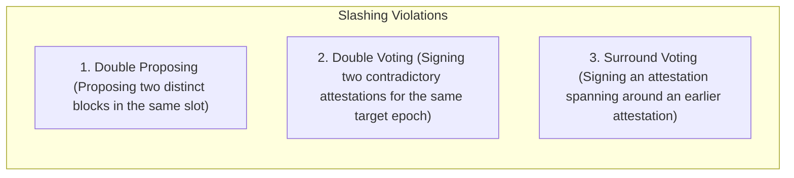
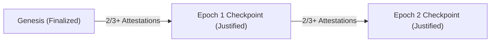

# Proof of Stake and Finality Gadgets

Proof of Work secures consensus through continuous thermodynamic expenditure.
Proof of Stake (PoS) replaces computational machinery with virtual economic capital.
In PoS, consensus participants lock up native tokens as collateral (stake) to earn the right to propose blocks and cast finality attestations.
If a validator acts dishonestly or violates consensus rules, the protocol algorithmically destroys (slashes) their deposited capital.

## The Architectural Rationale for Proof of Stake

Proof of Stake was designed to address three constraints inherent to Proof of Work:

- **Energy Efficiency:** PoS eliminates the requirement for competitive hash calculations, reducing protocol electricity consumption by over 99.95 percent.
- **Capital Efficiency of the Security Budget:** In PoW, block subsidies must constantly cover miners' fiat electricity bills, creating perpetual sell pressure. In PoS, capital is locked within the consensus state, allowing the network to maintain security with lower issuance rates.
- **Protocol-Enforced Penalties:** If a PoW miner mounts a 51 percent reorganization attack, the network cannot remotely confiscate or destroy their physical ASIC hardware. In PoS, an attacking validator's staked collateral is burned directly on-chain by protocol rules.

## Validator Lifecycle and Consensus Mechanics

In Ethereum's implementation of Proof of Stake, validation follows a structured lifecycle:

### 1. Registration and Activation

A participant deposits 32 ETH into the official L1 deposit contract, specifying their BLS12-381 validator public key and withdrawal credentials.
To prevent sudden shifts in the validator composition, the protocol regulates activation through a churn limit queue, admitting a fixed number of validators per epoch.

### 2. Slots, Epochs, and RANDAO

Time is partitioned into discrete intervals:
- **Slot:** A 12-second window during which one designated validator proposes an execution block, and an assigned committee of validators submits attestations.
- **Epoch:** A sequence of 32 slots (lasting 6.4 minutes).
- **RANDAO:** A decentralized randomness beacon updated at every slot using commit-reveal mechanics and BLS signatures, ensuring unpredictable, unmanipulable leader and committee selection.

### 3. BLS Signature Aggregation

With hundreds of thousands of active validators, broadcasting and verifying individual digital signatures for every block would saturate network bandwidth.
Ethereum uses Boneh-Lynn-Shacham (BLS) signatures over the BLS12-381 elliptic curve.
BLS signatures can be combined into a single aggregated signature of fixed size (96 bytes), regardless of whether 100 or 10,000 validators signed the attestation.

## The Nothing-at-Stake Problem

Early Proof of Stake designs suffered from a game-theoretic failure mode termed the **Nothing-at-Stake problem**.

In Proof of Work, a miner who divides hash power across two competing branches halves their probability of finding a block on either chain.
In naive Proof of Stake, creating an attestation requires only computing a digital signature.
Because signing costs nothing, the economically rational strategy for every validator is to sign every competing fork simultaneously.
By voting on all possible branches, validators guarantee that they receive block rewards regardless of which branch ultimately wins.
This prevents the network from ever resolving forks naturally.

## Slashing Conditions and Economic Penalties

Modern PoS resolves the Nothing-at-Stake dilemma by introducing explicit cryptographic slashing rules.
If a validator produces contradictory signatures that violate safety rules, any node can submit the conflicting signatures to the network as cryptographic proof.

Ethereum enforces three primary slashing conditions:

When an offense is proven on-chain, the protocol applies three automated punishments:

1. **Immediate Burn:** A baseline penalty of 1 ETH is burned from the validator's balance immediately.
2. **Forced Ejection:** The validator is permanently transitioned to the exit queue and cannot participate or earn further rewards.
3. **Correlation Penalty:** Over the next 36 days, the protocol calculates the proportion of other validators slashed within the same time window. If many validators violate rules concurrently (suggesting an organized coordinated attack), the penalty scales quadratically, burning up to 100 percent of their entire 32 ETH deposit.

## Casper FFG and Finality Gadgets

Ethereum combines LMD-GHOST (which selects the head of the chain slot-by-slot) with Casper the Friendly Finality Gadget (Casper FFG) to provide deterministic finality.

Casper FFG operates at epoch boundaries:
- The first block of an epoch is designated as a **checkpoint**.
- Validators cast checkpoint votes pairing a source checkpoint with a target checkpoint.
- **Justification:** A target checkpoint is justified if a two-thirds supermajority ($> 66.6\%$) of the active validator weight signs an attestation linking it to an already justified source checkpoint.
- **Finalization:** When a justified checkpoint achieves an unbroken supermajority link to the subsequent justified checkpoint, the earlier checkpoint is declared finalized.

Once finalized, an attacker cannot revert the block without violating Casper slashing conditions, requiring the attacker to burn at least one-third of the global staked capital ($>\frac{1}{3} \times \text{Total Stake}$).

### Inactivity Leak

During an extreme network partition where more than one-third of validators are cut off by a geopolitical internet disruption, the online partition cannot reach the two-thirds threshold required to finalize blocks.
To recover liveness, Casper initiates an **inactivity leak**.
The protocol progressively burns the stake of offline, non-attesting validators in quadratic increments.
Eventually, the relative stake share of the active, connected validators rises above two-thirds of the remaining total stake, enabling the network to resume finalization.
