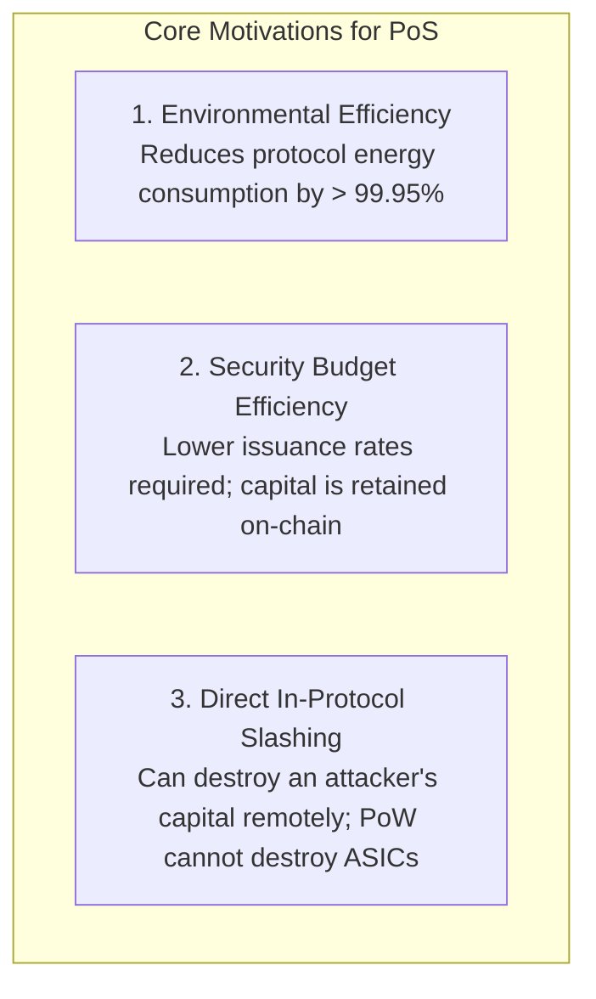
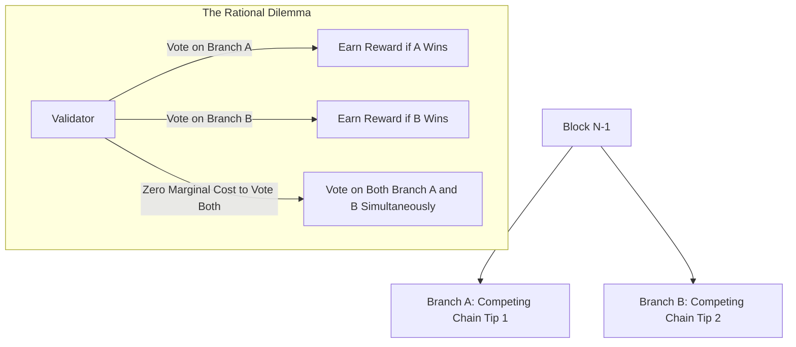
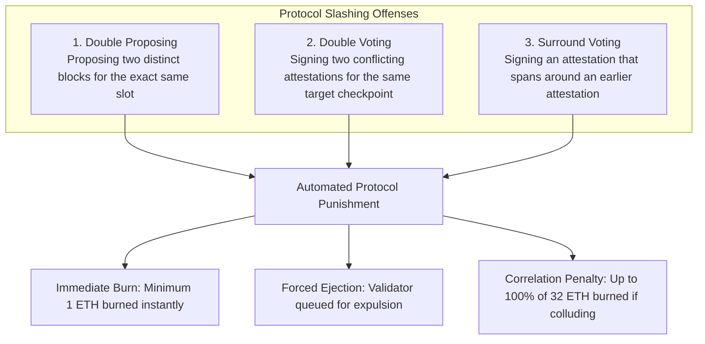
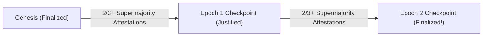
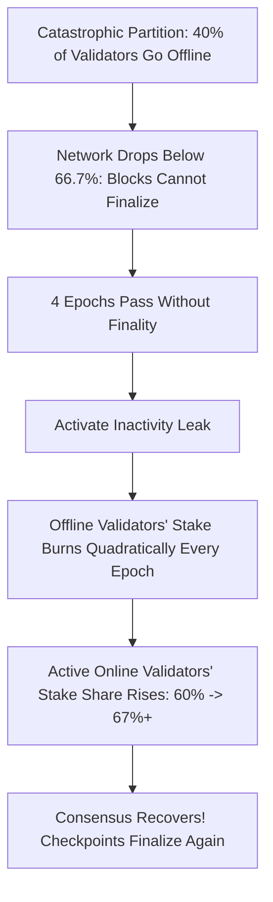

# Proof of Stake and Finality Gadgets

Proof of Work secures decentralized consensus by binding voting power to thermodynamic energy consumption.
However, this thermodynamic link imposes substantial physical realities: modern PoW networks consume tens of terawatt-hours of electrical power annually, and miners must constantly sell native tokens on open markets to pay off recurring fiat electricity bills.

**Proof of Stake (PoS)** eliminates the requirement for competitive hash calculations.
Instead of burning physical electricity through silicon processors, PoS secures the ledger using **virtual economic capital locked directly on-chain**.
Participants deposit (stake) native cryptocurrency into a protocol-level smart contract as collateral.
In return, they earn the legal right to propose blocks, participate in validation committees, and earn protocol rewards.
If a participant acts dishonestly or attempts to reorganize history, the protocol algorithmically destroys (slashes) their deposited collateral.

## The Architectural Rationale for Proof of Stake

Proof of Stake was engineered to overcome three fundamental limitations of Proof of Work:



### 1. Energy Decoupling

In Proof of Work, consensus security is a linear function of ongoing physical power consumption.
In Proof of Stake, validation involves verifying digital signatures, executing virtual machine state transitions, and gossiping blocks: ordinary compute tasks easily handled by low-power consumer hardware (such as an Intel NUC or Apple Silicon Mac).
When Ethereum completed The Merge in September 2022, transitioning from PoW to PoS, the network's global energy consumption dropped by **99.988 percent** overnight.

### 2. Efficiency of the Security Budget

In Proof of Work, miners incur high monthly operational expenses (OpEx) for electricity and hardware maintenance.
To cover these costs, miners must immediately dump the majority of their mined block rewards into fiat currency on secondary markets, creating persistent sell pressure.
To maintain high hash rates against attackers, the protocol must issue substantial quantities of newly minted coins every year.

In Proof of Stake, validators have almost zero operational electricity costs.
Capital is locked as collateral (CapEx).
Because validators do not need to liquidate rewards to pay electric utilities, the network can maintain equivalent or superior economic security with a **drastically smaller annual inflation rate**.

### 3. Asymmetric Punitive Power (The Slashing Advantage)

Suppose an adversary acquires 51 percent of the mining equipment on a Proof of Work chain and mounts a catastrophic double-spending reorganization:
- The honest community can fork to a new mining algorithm, but the community **cannot physically reach into the attacker's warehouse to destroy their ASIC chips**.
- The attacker retains their physical machines and can attack the next algorithm or sell the hardware on secondary markets to recoup their investment.

In Proof of Stake, the attacker's security asset **lives directly on the blockchain itself**:
- If a validator attempts a double-spending reorganization or signs conflicting blocks, the protocol's cryptographic rules detect the betrayal.
- The protocol's automated slashing engine burns the attacker's staked tokens permanently, destroying their wealth on-chain without requiring police or court intervention.

## Validator Lifecycle and Consensus Architecture

To understand how a modern Proof of Stake consensus engine operates, let us dissect the complete validator lifecycle using Ethereum's Gasper protocol (the combination of LMD-GHOST and Casper FFG) as the industry benchmark.

```mermaid
sequenceDiagram
    autonumber
    actor Staker as Prospective Validator
    participant Dep as L1 Deposit Contract
    participant Beacon as Consensus Beacon Chain
    participant Comm as Attestation Committee
    participant State as Canonical World State

    Staker->>Dep: Deposit exactly 32 ETH + BLS Public Key
    Dep->>Beacon: Emit Deposit Event; Enter Churn Limit Queue
    Beacon->>Beacon: Activate Validator; Assign Slot Schedule via RANDAO
    Beacon->>Comm: Assign Proposer & Attester Roles for Epoch
    Comm->>Beacon: Propose Block; Broadcast BLS Aggregated Attestations
    Beacon->>State: Justify & Finalize Epoch Checkpoints
```

### 1. Registration and Activation Queues

A participant becomes an active validator by sending exactly **32 ETH** to the official Ethereum deposit contract on Layer 1, providing their **BLS12-381 cryptographic public key** and withdrawal credentials.

To prevent sudden massive capital inflows or outflows from destabilizing the consensus set, the protocol regulates entry and exit via a strict **Churn Limit Queue**:
- Only a fixed number of validators (typically 8 to 16 validators per epoch) can enter or exit the active set per 6.4-minute cycle.
- This prevents an attacker with massive capital from suddenly dumping trillions of dollars of stake into the network to execute an attack within a few seconds and exiting immediately.

### 2. Time Division: Slots and Epochs

Time on the consensus layer is divided into precise, deterministic intervals:

```mermaid
flowchart LR
    subgraph Epoch: 32 Slots (6.4 Minutes)
        Slot0[Slot 0: 12s] --> Slot1[Slot 1: 12s]
        Slot1 --> Slot2[Slot 2: 12s]
        Slot2 --> Dots[...]
        Dots --> Slot31[Slot 31: 12s]
    end
```

- **Slot (12 Seconds):** The baseline unit of consensus time.
  In every slot, exactly **one validator is pseudo-randomly chosen to be the Block Proposer**, while a designated committee of hundreds of other validators reviews the proposed block and casts cryptographic votes called **attestations**.
- **Epoch (32 Slots / 6.4 Minutes):** A collection of 32 slots.
  Consensus finality checks and validator balance adjustments (rewards and penalties) are computed at epoch boundaries.

### 3. RANDAO: On-Chain Randomness

How does the protocol choose who proposes a block in each slot without a centralized coordinator?
If the leader election were predictable days in advance, an attacker could launch a targeted denial-of-service attack against the specific IP address of the next upcoming proposer to halt the network.

Ethereum uses **RANDAO** (Randomness DAO):
- At every slot, the designated block proposer contributes entropy to a running randomness accumulator by evaluating and revealing a BLS signature on the current epoch number.
- Because BLS signatures are deterministic and unforgeable, the proposer cannot manipulate the resulting number to favor themselves.
- This pseudo-random seed is used to shuffle validators into committees and assign block proposal rights two epochs in advance.

### 4. BLS Signature Aggregation

If hundreds of thousands of validators broadcast individual digital signatures every 12 seconds, network bandwidth would saturate within minutes.
Ethereum addresses this using **Boneh-Lynn-Shacham (BLS) signatures** over the BLS12-381 elliptic curve.

BLS signatures possess a unique property: **infinite signature aggregation**:
- Hundreds or thousands of individual signatures signed over the identical message (e.g. "Block 5,000 is valid") can be combined into a single, compact **96-byte aggregated signature**.
- Verifying the single aggregated signature mathematically confirms that every individual validator in that committee signed the payload.

## The Nothing-at-Stake Problem

Early conceptual designs of Proof of Stake in the early 2010s suffered from a game-theoretic dilemma termed the **Nothing-at-Stake Problem**.



In Proof of Work, if the blockchain branches into two competing paths, a miner must physically choose where to direct their hardware:
- If a miner splits their hash rate 50/50 across both branches, they cut their probability of finding a block on either chain in half.
- Mining on the wrong fork wastes expensive physical electricity.

In naive Proof of Stake, creating a block or attestation requires only computing a digital signature (a microscopic fraction of a microsecond of CPU time).
Because signing costs nothing, the economically rational strategy for every validator is to **vote on every competing branch simultaneously**:
- If Branch A wins, you get paid.
- If Branch B wins, you get paid.
- If a malicious attacker attempts a double-spending fork, validators have zero financial incentive to defend the honest chain; they vote on both to maximize their rewards!

If validators vote on all forks, the network can never resolve transient splits, and an attacker with a microscopic stake can easily rewrite history.

## Slashing Conditions: Cryptographic Deterrence

Modern Proof of Stake protocols permanently solved the Nothing-at-Stake problem by introducing explicit **Slashing Conditions**.

If a validator signs two conflicting statements, any other node on the network can take the two conflicting digital signatures, package them together as cryptographic proof, and submit them to the consensus layer.
The protocol's built-in rules inspect the signatures, confirm that they originated from the same validator public key, and automatically execute punishments:



### The Three Cardinal Offenses

1. **Double Proposing:** A proposer produces two distinct valid blocks for the identical slot height, trying to split the network.
2. **Double Voting:** An attester signs two conflicting checkpoint attestations having different target blocks in the same epoch.
3. **Surround Voting:** An attester signs an attestation that completely encompasses (surrounds) an earlier attestation they previously signed, attempting to bypass Casper finality checkpoints.

### The Slashing Penalty Engine

When a validator is slashed:
1. **Immediate Penalty:** A baseline fine of 1 ETH is burned immediately from their balance.
2. **Forced Ejection:** The validator is forcefully scheduled for withdrawal and can no longer participate in consensus.
3. **The Correlation Penalty (Anti-Collusion Math):** Over the subsequent 36 days, the protocol monitors how many other validators were slashed during the same time window.
   - If a single solo validator misconfigures their node and double-signs by accident, their total penalty is minimal (a few ETH).
   - If thousands of validators double-sign concurrently (indicating an organized, coordinated 51% attack or a shared client vulnerability), the penalty scales quadratically:
     $$\text{Slashing Penalty} \propto 32 \times \left( \frac{\text{Slashed Stake}}{\text{Total Stake}} \right)$$
     The protocol burns **100 percent of their entire 32 ETH deposit**, destroying hundreds of millions or billions of dollars of attacker collateral.

## Casper FFG: The Friendly Finality Gadget

To establish immutable finality, Ethereum pairs the LMD-GHOST fork-choice rule with **Casper FFG (Casper the Friendly Finality Gadget)**, designed by Vitalik Buterin and Virgil Griffith.

Casper operates at epoch boundaries, evaluating checkpoints:



### The Mechanics of Justification and Finalization

1. **Epoch Checkpoint:** The first block of each 32-slot epoch is designated as a checkpoint.
2. **Checkpoint Attestations:** Validators cast votes linking a source checkpoint (which is already justified) to a new target checkpoint.
3. **Justification:** If more than a **two-thirds supermajority ($> 66.7\%$)** of the total active validator stake signs attestations linking Source $A$ to Target $B$, Checkpoint $B$ becomes **justified**.
4. **Finalization:** When Checkpoint $B$ is justified, and the subsequent epoch checkpoint $C$ also achieves a two-thirds supermajority link built directly upon $B$, Checkpoint $B$ is declared **finalized**.

### The Mathematical Invariant: One-Third Slashing Bound

Casper FFG enforces a mathematical theorem:

> Two conflicting checkpoints at the same height can never both achieve finalization unless at least one-third ($> 33.3\%$) of the entire active validator set signs contradictory attestations.

If an adversary attempts to revert a finalized checkpoint to execute a double-spend, the protocol guarantees that at least one-third of the global staked capital will be identified and permanently burned:

$$\text{Attacker Cost} \ge \frac{1}{3} \times \text{Total Network Stake}$$

At an Ethereum staking level of 30 million ETH, reverting a finalized block costs the attacker more than **10 million ETH (over $30 billion)** in direct protocol slashing, providing an extraordinary economic security barrier.

## The Inactivity Leak: Surviving Geopolitical Partitions

What happens if an catastrophic real-world disaster (such as a global transatlantic fiber cut or state-level internet censorship) suddenly takes 40 percent of all validators offline?

Under classical BFT, because the remaining online validators hold only 60 percent of the stake, they can never reach the 66.7 percent supermajority required to finalize blocks.
The blockchain would freeze permanently.

To recover from this catastrophe, Casper implements the **Inactivity Leak**:



1. If four consecutive epochs pass without achieving finality, the protocol triggers the inactivity leak.
2. Online, responsive validators continue earning standard rewards.
3. Offline, non-attesting validators are penalized with an aggressive **quadratic balance burn** every epoch:
   $$\text{Penalty} \propto \text{Epochs}^{\,2}$$
4. As the offline validators' staked balances are destroyed, their proportion of the global stake pool diminishes.
5. Within several days or weeks, the relative stake share of the active online validators rises above the critical two-thirds threshold ($> 66.7\%$).
6. The online partition resumes finalizing blocks autonomously, preserving liveness and self-healing the blockchain without manual intervention.
