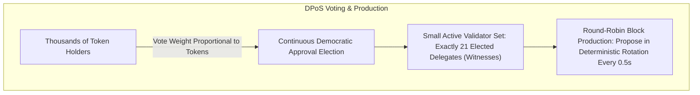
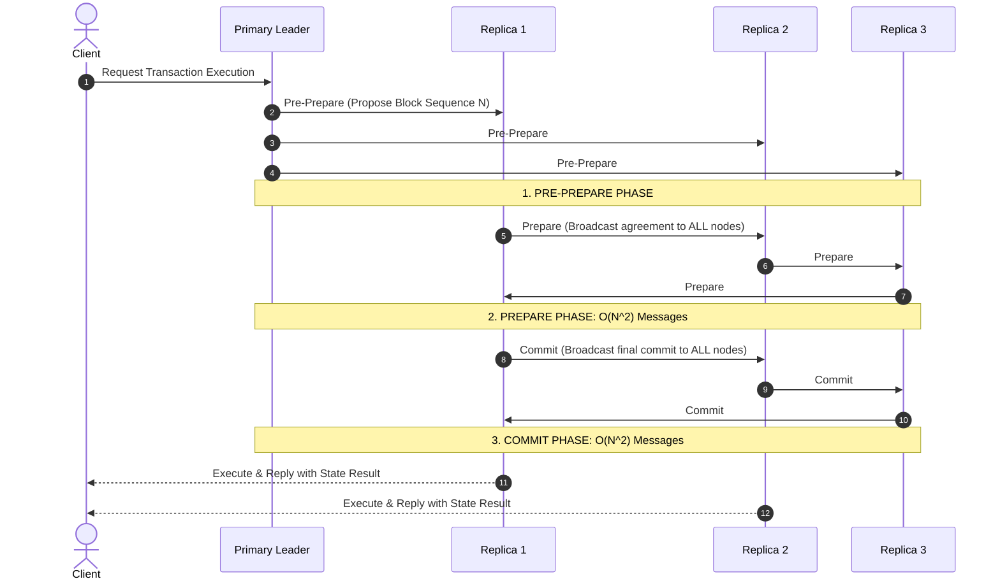
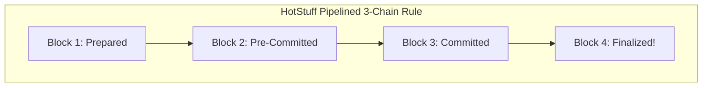
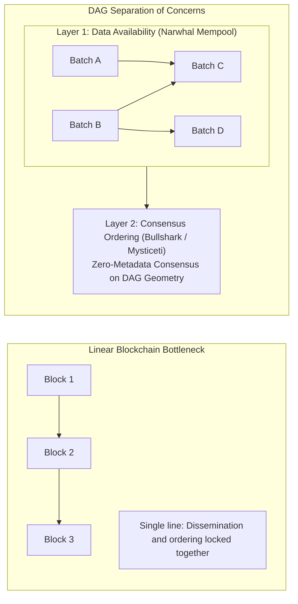

# Alternative and Hybrid Consensus Models

While Nakamoto Proof of Work and Casper-style Proof of Stake dominate the largest market-capitalization blockchains, distributed systems researchers have engineered a rich ecosystem of alternative consensus architectures.

Consensus design is fundamentally a study of trade-offs.
No consensus algorithm can maximize every dimension simultaneously: throughput, latency, finality time, validator decentralization, energy consumption, and capital accessibility exist in perpetual tension.

To meet specialized application demands (such as sub-second decentralized trading, enterprise private consortia, high-frequency gaming, and cross-chain settlement), architects developed three major alternative families:
1. **Delegated Proof of Stake (DPoS)**
2. **Classical and Chained BFT Protocols (PBFT, Tendermint, HotStuff)**
3. **Directed Acyclic Graph (DAG) Consensus Engines (Narwhal, Bullshark, Mysticeti)**

Let us evaluate the mechanics, mathematical bounds, and trade-offs of each paradigm.

## Delegated Proof of Stake (DPoS)

Invented by Daniel Larimer in 2014 and deployed in systems like BitShares, Steem, and EOS, **Delegated Proof of Stake (DPoS)** replaces open validator pools with a democratic representative republic.

### The Mechanism of DPoS

1. **Continuous Voting:** Any token holder can vote for block producers (called **Delegates** or **Witnesses**). A voter's influence is directly proportional to the number of tokens they hold.
2. **Fixed Committee Size:** Only the top $K$ vote-receiving candidates (typically a very small number, such as exactly 21 delegates in EOS) are granted the cryptographic authority to produce blocks.
3. **Deterministic Round-Robin Schedule:** Instead of calculating Proof of Work or running complex randomized leader lotteries, the 21 elected delegates produce blocks in a strict, rotating round-robin order (e.g. Delegate 1 at second 0, Delegate 2 at second 0.5, Delegate 3 at second 1.0).
4. **Instant Eviction:** If a delegate misses blocks, acts dishonestly, or votes for an invalid transaction, token holders immediately shift their votes to standby delegates, voting the offending producer out of the active set within minutes.

### The Trade-offs of DPoS

- **The Throughput Advantage:** Because only 21 nodes participate in consensus, network communication overhead is near-zero.
  Delegates can run high-performance enterprise server hardware connected via dedicated fiber connections, achieving 500-millisecond block intervals and thousands of transactions per second.
- **The Centralization Flaw (Cartel Formation):** DPoS concentrates network governance into an oligarchy.
  In practice, the top 21 delegates often form political and economic cartels: they vote for each other using treasury tokens, split block production rewards among themselves, and establish an entrenched political monopoly that retail token holders cannot unseat.
  Furthermore, 21 known server IP addresses make the network extremely susceptible to state-level regulatory coercion, physical subpoenas, and targeted DDoS attacks.

## Classical Byzantine Fault Tolerance: PBFT to Tendermint

Classical BFT protocols originated in academic distributed systems literature long before cryptocurrencies existed.
Unlike Nakamoto chains, classical BFT protocols provide **instant, deterministic finality**: once a block is committed, it can never be reorganized.

### 1. Practical Byzantine Fault Tolerance (PBFT)

Introduced in 1999 by Miguel Castro and Barbara Liskov, **PBFT** proved that a Byzantine-resilient state machine could operate efficiently under partial synchrony.

PBFT achieves agreement through three multi-round voting phases:

1. **Pre-Prepare Phase:** The primary leader proposes a transaction order to all replicas.
2. **Prepare Phase:** Every replica validates the proposal and broadcasts a `Prepare` message to **every other replica in the network**.
   Nodes wait until they receive a two-thirds quorum of prepare votes ($2f + 1$).
3. **Commit Phase:** Once a node receives the prepare quorum, it broadcasts a `Commit` message to **every other replica**.
   Nodes wait for a two-thirds commit quorum before writing the block permanently to disk.

#### The Scalability Bottleneck: Quadratic Message Overhead $\mathcal{O}(N^2)$

In PBFT, every node must send messages to every other node in both the Prepare and Commit phases.
The total message complexity across $N$ nodes scales quadratically:

$$\text{Message Complexity} = \mathcal{O}(N^2)$$

| Number of Nodes ($N$) | Messages per Block ($\approx N^2$) | Operational Feasibility |
| :--- | :--- | :--- |
| **4 Nodes** | 16 messages | Negligible overhead (sub-millisecond) |
| **100 Nodes** | 10,000 messages | High bandwidth consumption |
| **1,000 Nodes** | 1,000,000 messages | Bandwidth saturation; severe network lag |
| **10,000 Nodes** | 100,000,000 messages | Mathematically impossible over open internet |

Because of this $\mathcal{O}(N^2)$ communication bottleneck, classical PBFT cannot scale to thousands of permissionless validators; it is restricted to enterprise private consortia with fewer than 50 to 100 known nodes.

### 2. Tendermint Core (Cosmos)

Engineered by Jae Kwon in 2014, **Tendermint** adapted PBFT into a production-grade blockchain consensus engine powering the Cosmos ecosystem.

Tendermint streamlines PBFT into a round-based state machine:
- **Propose:** The designated leader proposes a candidate block.
- **Prevote:** Validators verify the block and broadcast a prevote.
  If a two-thirds supermajority ($> \frac{2}{3}$) of validator stake prevotes for the block, the block achieves a **Polka**.
- **Precommit:** Upon observing a Polka, validators broadcast a precommit vote.
  Once a two-thirds supermajority of precommits is received, the block is finalized immediately.

Tendermint enforces **immediate, zero-reorg finality**: there are no transient forks or reorgs.
If consensus cannot be reached within a timeout window (due to leader offline status or network partitions), the round advances to a new leader, prioritizing safety over liveness.

### 3. HotStuff: Linear View-Change (Aptos, Sui, Diem)

Published in 2018 by Ittai Abraham, Dahlia Malkhi, and colleagues, **HotStuff** is a third-generation classical BFT framework chosen by Meta's Diem (formerly Libra) and refined by Aptos.

In PBFT and Tendermint, if the leader node fails or goes offline, electing a new leader (the **View-Change protocol**) incurs high message overhead: $\mathcal{O}(N^2)$ or $\mathcal{O}(N^3)$.
HotStuff achieved a theoretical breakthrough: **Linear Message Complexity $\mathcal{O}(N)$ in all cases, including leader failure and view-changes**.

- **Star Communication:** Replicas do not broadcast messages to every other replica.
  Instead, they send votes exclusively to the primary leader.
  The leader aggregates votes into a compact cryptographic threshold signature (or BLS signature) and broadcasts a single message back to the replicas.
- **Pipelined Chaining:** Instead of running separate, isolated voting phases for each block, HotStuff chains consensus votes directly across sequential blocks:
  - Block $N$ is proposed.
  - The proposal of Block $N+1$ acts as the Prepare vote for Block $N$.
  - The proposal of Block $N+2$ acts as the Precommit vote for Block $N$.
  - The proposal of Block $N+3$ commits and finalizes Block $N$.

## Directed Acyclic Graph (DAG) Consensus Architectures

The most significant modern evolution in high-throughput consensus is the transition from linear blockchains to **Directed Acyclic Graphs (DAGs)**, spearheaded by protocols like Narwhal & Bullshark (Sui) and Mysticeti.

### The Inherent Bottleneck of Linear Chains

In traditional linear blockchains (Bitcoin, Ethereum, Cosmos):
- Consensus and transaction dissemination are tightly coupled into a single serialized pipeline.
- The leader must gather transactions, order them, broadcast the block, and collect consensus votes before the next block can begin.
- Network bandwidth is wasted: while nodes are waiting for consensus votes to settle, communication lines sit idle.

### The DAG Paradigm: Decoupling Data Availability from Consensus

DAG-based consensus architectures split the problem of distributed agreement into two completely independent layers:

1. **Layer 1: High-Speed Data Availability (The Mempool DAG):**
   - Nodes stream batches of transactions continuously into an asynchronous DAG structure (such as **Narwhal**).
   - Nodes do not wait for consensus to order transactions.
   - Every node independently gossips batches, references previous batches via cryptographic hash pointers, and signs for data availability.
   - This saturates 100 percent of available network bandwidth, scaling throughput to over 100,000 transactions per second.

2. **Layer 2: Zero-Communication Consensus Ordering (Bullshark / Mysticeti):**
   - Once the DAG structure is established and shared among nodes, **no additional consensus voting messages are transmitted across the network**.
   - Every validator independently reads the geometry of the DAG stored on its local disk.
   - Using a deterministic algorithm (such as Bullshark), each node independently traverses the DAG vertices, identifies anchor rounds, and orders transactions into an identical global sequence.

By separating the heavy payload of transaction dissemination from the lightweight mathematical logic of chronological ordering, modern DAG consensus engines eliminate the classical trade-off between finality latency and high-throughput data execution.

## Comprehensive Comparison Matrix

| Metric | Proof of Work (Bitcoin) | Casper PoS (Ethereum) | Delegated PoS (EOS, Tron) | Tendermint Core (Cosmos) | DAG Consensus (Sui Mysticeti) |
| :--- | :--- | :--- | :--- | :--- | :--- |
| **Sybil Resistance** | Physical Hash Rate (Thermodynamic ASICs) | Native Capital Collateral (32 ETH Deposits) | Token Weighted Democratic Votes | Native Capital Collateral | Native Capital Collateral |
| **Finality Type** | Probabilistic (Heaviest chain depth) | Deterministic (Casper FFG Checkpoints) | Probabilistic to Deterministic (BFT-DPoS) | Deterministic (Zero-reorg instant finality) | Deterministic (Sub-second DAG finality) |
| **Finality Latency** | ~60 Minutes (6 confirmations) | ~12.8 Minutes (2 epochs) | ~1 to 2 Seconds | ~6 Seconds (1 block) | ~400 to 800 Milliseconds |
| **Message Complexity** | $\mathcal{O}(N)$ Gossip propagation | $\mathcal{O}(N)$ Gossip with BLS Aggregation | $\mathcal{O}(K)$ where $K \approx 21$ Delegates | $\mathcal{O}(N^2)$ Quadratic Multi-Round | $\mathcal{O}(N)$ Decoupled Streaming |
| **Validator Count** | Unbounded (Permissionless open mining) | $> 1,000,000$ active validator keys | Very low (Fixed at 21 to 101 delegates) | Medium (100 to 180 active validators) | High (100+ high-capacity validators) |
| **Fault Tolerance ($f$)** | $< 50\%$ Hash Rate | $< 33\%$ Staked Capital (Slashing) | $< 33\%$ Elected Delegates | $< 33\%$ Staked Capital | $< 33\%$ Staked Capital |
| **Safety vs. Liveness** | Favors Liveness (Never halts) | Balances both (Inactivity leak for liveness) | Favors Liveness (Delegates skip offline peers) | Strictly Favors Safety (Halts on partition) | Strictly Favors Safety |
