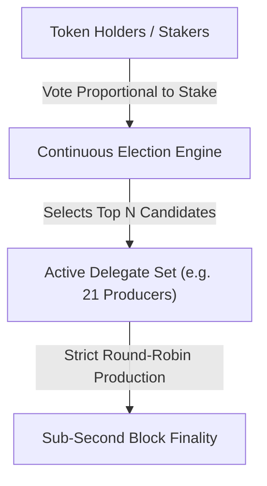
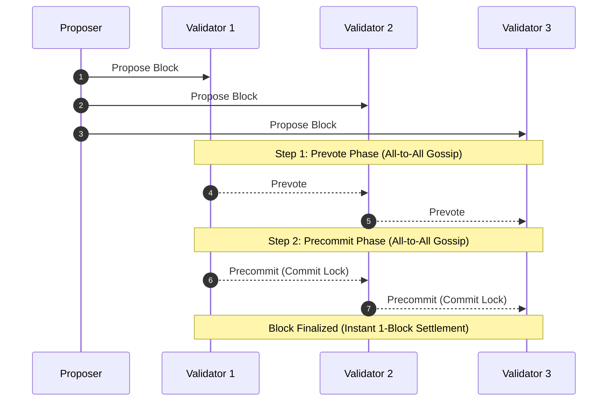
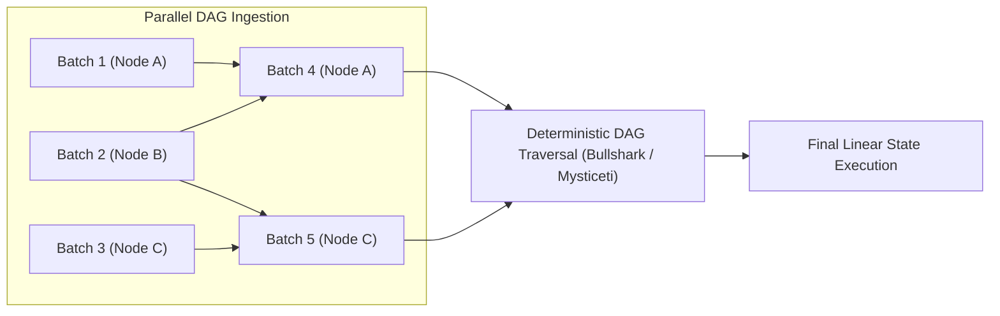

# Alternative and Hybrid Consensus Models

While Nakamoto consensus and Casper-style Proof of Stake dominate major networks, alternative architectures have emerged to optimize specific operational dimensions.
By adjusting communication topology, validator set cardinality, and data structures, alternative protocols target lower transaction latency, higher throughput, or novel security assumptions.

## Delegated Proof of Stake (DPoS)

Daniel Larimer introduced Delegated Proof of Stake in 2014.
DPoS treats network governance and block production as an ongoing representative election.

### Mechanics of DPoS

- **Delegate Election:** Token holders do not validate blocks directly. Instead, they cast votes proportional to their token balance to elect a small, fixed active set of delegates (e.g. 21 block producers in EOS or 27 super representatives in TRON).
- **Scheduled Block Production:** Delegates rotate through a deterministic, round-robin schedule to produce blocks. Because the leader for each slot is known in advance and network communication occurs among a tiny group of enterprise nodes, block intervals can be compressed to sub-second windows (e.g. 500 ms).
- **Dynamic Re-election:** If a delegate fails to propose a block or acts maliciously, voters can withdraw their stakes, dropping the delegate below the election threshold and replacing them with a standby candidate.

### Trade-offs of DPoS

- **Advantages:** Extremely high transaction throughput, minimal latency, and zero computational waste.
- **Vulnerabilities:** Political centralization, voter apathy (where a tiny fraction of active tokens decides the validator set), vote-buying cartels, and susceptibility to regulatory censorship due to identifiable node operators.

## Classical BFT Protocols: PBFT, Tendermint, and HotStuff

Classical Byzantine Fault Tolerant algorithms guarantee deterministic finality without the probabilistic waiting periods of Nakamoto consensus.

### 1. Practical Byzantine Fault Tolerance (PBFT)

Published by Miguel Castro and Barbara Liskov in 1999, PBFT demonstrated that BFT consensus could execute in sub-millisecond latencies over local networks.
PBFT relies on three phases: Pre-prepare, Prepare, and Commit.
However, PBFT requires every node to broadcast messages to every other node in both the Prepare and Commit rounds.
This introduces quadratic message complexity:

$$\mathcal{O}(N^2)$$

where $N$ is the number of validators.
If a network scales to 1,000 nodes, each block requires over one million network messages, capping classical PBFT to small validator sets (typically fewer than 50 to 100 participants).

### 2. Tendermint (CometBFT)

Jae Kwon adapted PBFT for public blockchain networks in 2014 with Tendermint.
Tendermint powers the Cosmos network and application-specific blockchains (appchains).
Tendermint uses a 2-step voting process (Prevote and Precommit) weighted by staked voting power.
- **Instant Finality:** Once two-thirds of the validator set signs a Precommit message for a block, that block is permanently finalized. Forks cannot occur unless at least one-third of the validator weight double-signs.
- **Safety Over Liveness:** If one-third or more of the validators disconnect or fail to agree, the chain intentionally halts rather than continuing on a divergent branch.

### 3. HotStuff and Chained BFT

Introduced in 2018 by Yin et al., HotStuff restructured BFT communication.
Instead of an all-to-all messaging topology, validators send votes solely to the designated round leader.
The leader aggregates the votes into a compact threshold signature and broadcasts the result back to nodes.
This reduces normal-case communication complexity to linear scale:

$$\mathcal{O}(N)$$

HotStuff forms the algorithmic basis for AptosBFT and Sui's consensus layer.

## Directed Acyclic Graph (DAG) Consensus

Linear blockchains force all transactions into a single sequential queue of blocks.
This creates a physical throughput bottleneck dictated by block propagation times across the globe.
DAG-based architectures decouple transaction dissemination from total ordering.

### Narwhal and Bullshark / Mysticeti

Modern high-performance Layer 1 networks (such as Sui and Aptos) separate consensus into two distinct layers:

1. **Data Availability Layer (Narwhal):** Nodes gossip arbitrary transaction payloads concurrently, assembling them into a Directed Acyclic Graph of verified batches. Each batch references multiple predecessor batches. Dissemination saturates raw network bandwidth without waiting for consensus agreement.
2. **Consensus Ordering Engine (Bullshark / Mysticeti):** Once the DAG structure is populated, nodes independently traverse the graph locally using deterministic topological sort rules to derive an unambiguous, linear sequence of transactions.

Because transaction payloads are already downloaded and verified before the ordering step occurs, the consensus engine transmits only tiny graph references, pushing network throughput beyond 100,000 transactions per second.

## Consensus Architecture Comparison

| Model | Representative Protocols | Finality Guarantee | Fault Tolerance ($f$) | Scalability Limits |
| :--- | :--- | :--- | :--- | :--- |
| **Nakamoto PoW** | Bitcoin, Litecoin, Kaspa | Probabilistic (Decreases with depth $k$) | $< 50\%$ computational hash power | Constrained by block propagation delay $\Delta$ |
| **Casper PoS (Gasper)** | Ethereum | Economic / Deterministic (2 epochs / 12.8 min) | $< 33\%$ staked capital for safety; $< 50\%$ for liveness | Scalable to hundreds of thousands of validators via BLS aggregation |
| **DPoS** | EOS, TRON, BitShares | Deterministic (Sub-second) | $< 33\%$ elected delegates | Extreme throughput; limited by validator governance centralization |
| **Classical BFT** | Tendermint (Cosmos), PBFT | Deterministic (Instant 1-block finality) | $< 33\%$ validator voting power | Limited to 100-300 nodes due to $\mathcal{O}(N^2)$ message complexity |
| **DAG-Based Consensus**| Sui (Mysticeti), Aptos, Fantom | Deterministic (Asynchronous graph traversal) | $< 33\%$ stake weight | High throughput; separates data availability from linear ordering |
