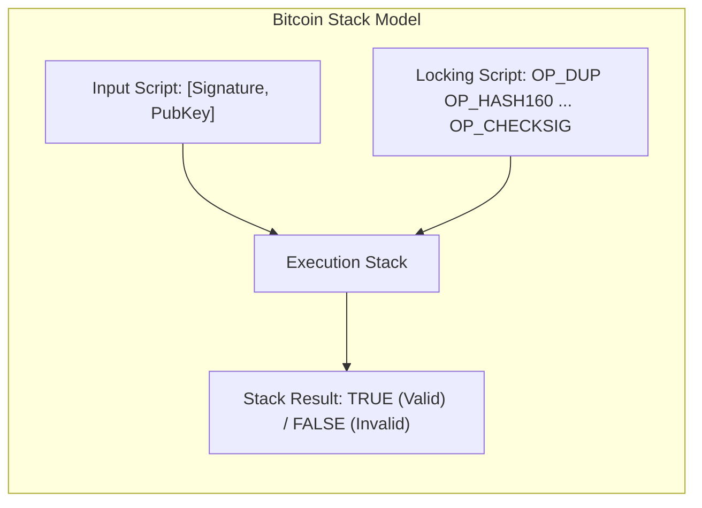
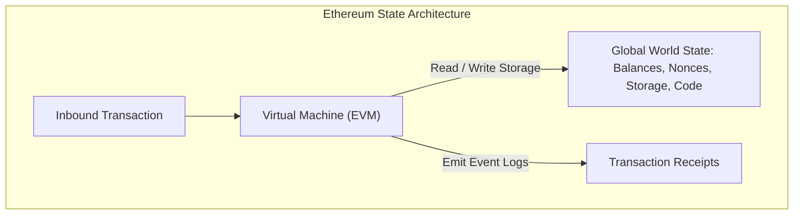
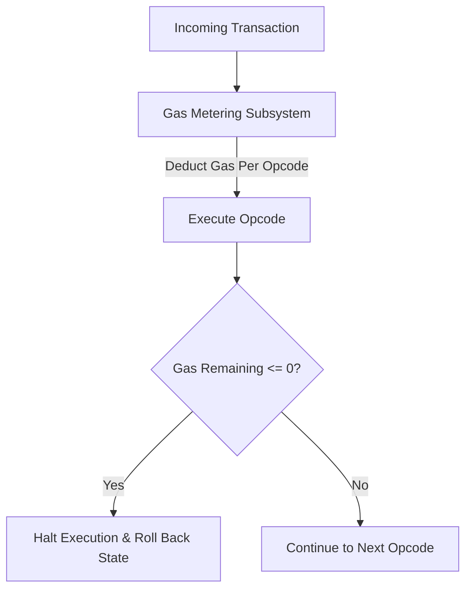

# From Static Ledgers to Programmable State

Early distributed ledgers were designed specifically as single-purpose financial transfer engines.
Bitcoin proved that a network of untrusted computers could achieve consensus on a ledger of monetary balances.
However, developers quickly sought to extend this decentralized trust to arbitrary business logic, financial derivatives, and automated protocols.
Transitioning from a static ledger to a general-purpose state computer required resolving fundamental theoretical constraints around computation, state storage, and the Halting Problem.

## Bitcoin Script and Its Design Constraints

Bitcoin was never completely static.
Every unspent transaction output contains a snippet of code in a Forth-like, stack-based language called **Bitcoin Script**.
When a transaction attempts to spend an output, the unlocking script and locking script execute sequentially on an evaluation stack.



Despite enabling basic conditional spending (such as multi-signature authorization and hash-timelocked contracts), Bitcoin Script exhibits three intentional design constraints:

### 1. Lack of Turing-Completeness

Bitcoin Script intentionally excludes loops (`for`, `while`, or backward `goto` jumps).
Without loops, script execution runs in strictly bounded time ($O(n)$ where $n$ is instruction count).
Every operation is evaluated linearly from left to right, guaranteeing that a node can never be frozen by processing a maliciously constructed transaction.

### 2. Statelessness

Bitcoin Script is entirely isolated.
A script has no visibility into anything outside the specific transaction spending it.
It cannot query:
- Historical block hashes or previous block headers.
- Account balances of third parties.
- Global network state or future state conditions.
It can answer only a single binary question: *Does the spender satisfy the cryptographic conditions required to unlock this specific output right now?*

### 3. Value-Blindness

A script cannot enforce fine-grained control over the amounts withdrawn from a UTXO.
An unspent output must be consumed completely in a single transaction, requiring all division and change calculation to occur through external transaction structures rather than internal programmatic logic.

## The Push for Expressiveness: Mastercoin and Colored Coins

Between 2012 and 2014, developers attempted to build complex financial applications on top of Bitcoin:

- **Colored Coins:** Annotated specific satoshis by tracking their transaction lineage from genesis, using them to represent real-world assets such as equities or commodities.
- **Mastercoin (Omni Layer) and Counterparty:** Encoded protocol metadata into `OP_RETURN` script opcodes, treating the Bitcoin blockchain as a dumb data availability layer while maintaining a secondary, off-chain state engine.

These metacoins suffered from severe operational friction:
- Bitcoin miners could not validate the secondary protocol rules.
- Transactions invalid under the higher-level protocol were still mined into Bitcoin blocks, requiring specialized off-chain indexing nodes to parse and filter valid states.
- Performance was strictly bottlenecked by Bitcoin's 10-minute block times and restricted data carrier byte limits (initially capped at 40 to 80 bytes).

## The Ethereum Synthesis: A Turing-Complete World Computer

In late 2013, Vitalik Buterin published the Ethereum Whitepaper, proposing a general-purpose, stateful decentralized platform.
Instead of grafting isolated application logic onto a payments network, Ethereum integrated a virtual machine directly into the core consensus layer.



### What Turing-Completeness Means in Blockchains

A computational system is Turing-complete if it can simulate any single-taped Turing machine.
Practically, this means the execution environment supports:
- Arbitrary conditional branching (`JUMP`, `JUMPI`).
- Unbounded loops and recursion.
- Read and write access to arbitrary mutable persistent storage.

Turing-completeness allows developers to write arbitrary programs (smart contracts) directly on-chain: automated market makers, decentralized governance engines, escrow vaults, and dynamic NFTs.

## The Halting Problem and Gas Metering

Turing-completeness introduces a fundamental computer science vulnerability: **The Halting Problem**.
Alan Turing proved in 1936 that no general algorithm can determine whether an arbitrary computer program will terminate or run forever.

If a decentralized virtual machine allowed arbitrary Turing-complete code without restrictions, an attacker could broadcast a contract containing an infinite loop:

```solidity
// Vulnerability in unmetered execution
while (true) {
    // Infinite loop freezes network nodes
}
```

Every full node attempting to validate this transaction would enter the loop and hang indefinitely, halting the entire blockchain.



Ethereum resolved the Halting Problem by making computation finite through an economic resource abstraction called **Gas**:
- Every low-level virtual machine opcode costs a predefined quantity of gas.
- The transaction sender must purchase and allocate an explicit `gasLimit` in advance.
- As the virtual machine executes bytecodes sequentially, it deducts gas from the balance.
- If the allocated gas drops to zero before execution concludes, execution halts immediately with an `out-of-gas` exception.
- All state modifications are reverted, but the consumed gas is permanently deducted to compensate nodes for computational overhead.

Through gas metering, Ethereum made execution strictly finite, enabling Turing-complete expressive capability without sacrificing network stability.

## Architectural Comparison

| Architectural Feature | Static Scripting (Bitcoin) | Turing-Complete State Machine (Ethereum) |
| :--- | :--- | :--- |
| **Computational Model** | Linear stack execution (No loops) | Turing-complete stack, memory, and persistent storage |
| **State Storage** | Stateless (Local UTXO scope only) | Stateful (Global key-value storage trie per account) |
| **Halting Guarantee** | Bounded instruction length ($O(n)$) | Deterministic gas metering |
| **Upgradability** | Static conditions; no state migration | Modifiable proxy architectures and contract calls |
| **Execution Scope** | Spend authorization for single output | Multi-party interactive contracts and composability |
