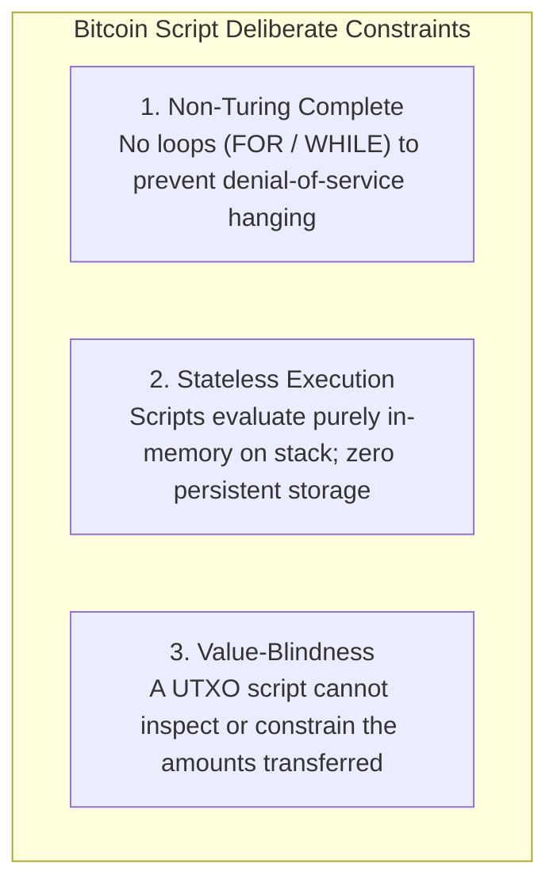
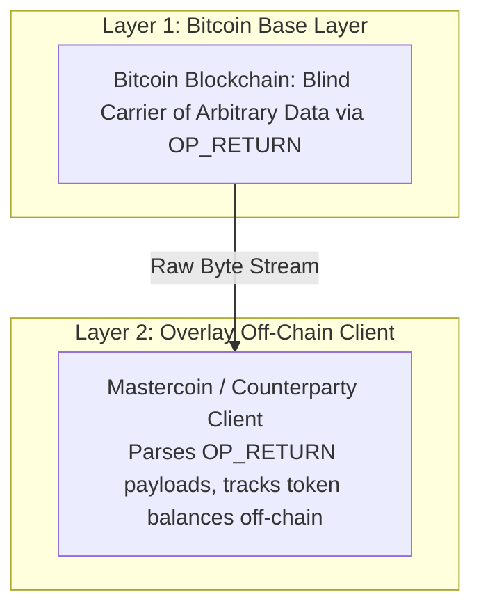
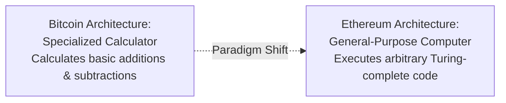
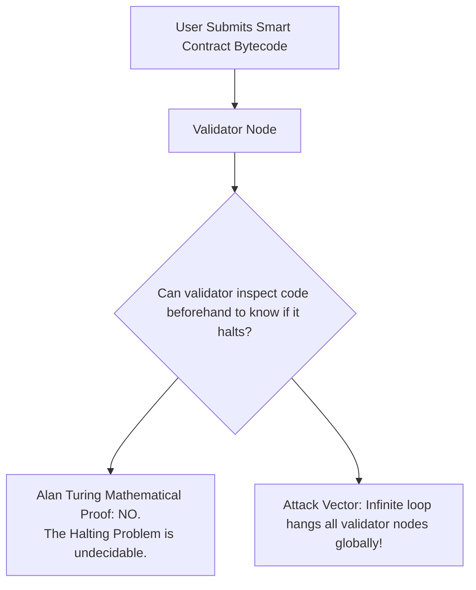
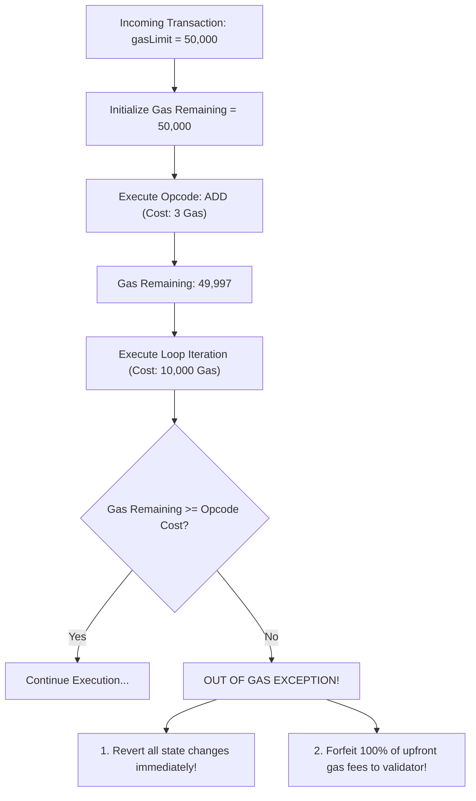

# From Static Ledgers to Programmable State

Bitcoin demonstrated that a decentralized network of untrusted computers could achieve permanent, unforgeable consensus over a shared ledger of balances.
However, Bitcoin was intentionally engineered as a **specialized, single-purpose application**: a secure, peer-to-peer electronic cash system.

As computer scientists and software engineers examined Bitcoin's underlying architecture, a profound realization emerged:
If a decentralized network can reach consensus on simple arithmetic operations (such as subtracting 5 coins from Alice and adding 5 coins to Bob), could that same decentralized network reach consensus on **arbitrary computer programs**?
Could a blockchain function not merely as a decentralized spreadsheet, but as a global, trustless, decentralized computer?

This transition from static ledgers to programmable state machines is the technological leap that birthed **Ethereum**, smart contracts, and decentralized finance.

## The Limitations of Bitcoin Script

Bitcoin is not entirely devoid of programmability.
Every Bitcoin transaction output is guarded by a locking script written in **Bitcoin Script**.
However, Satoshi Nakamoto intentionally constrained the design of Bitcoin Script:



### 1. Lack of Turing Completeness (No Loops)

A programming language is considered **Turing-complete** if it can simulate any arbitrary Turing machine: in essence, it can compute anything that is computable given sufficient time and memory.
The hallmark of Turing-complete languages is the ability to execute loops (`while`, `for`, or arbitrary recursion).

Bitcoin Script **deliberately lacks loop opcodes**:
- The opcodes `OP_LOOP` and `OP_WHILE` do not exist.
- Scripts evaluate strictly in a single, top-to-bottom pass over an execution stack.
- **The Design Rationale:** Nakamoto recognized that if nodes must validate transactions before forwarding them, an attacker could broadcast a transaction containing an infinite loop (`while(true) {}`).
  Every full node on Earth evaluating that script would hang indefinitely, consuming 100 percent CPU and crashing the global financial network.
  By eliminating loops, Bitcoin guaranteed that every script terminates in finite, predictable time.

### 2. Statelessness (No Persistent Storage)

A Bitcoin Script has zero access to external state or memory outside the immediate transaction execution stack:
- A script cannot query the current block height (without explicit timelock opcodes).
- A script cannot read the balance of another address.
- A script cannot store a variable on-chain to be read or incremented by a subsequent transaction.
- Once the script finishes evaluating to `TRUE`, the stack is wiped from RAM.
Without persistent memory, one cannot build applications that require state progression, such as lending protocols, decentralized domain registries, or escrow state machines.

### 3. Value-Blindness

In the UTXO model, an output locking script cannot inspect the transaction's other outputs or amounts.
A script can enforce *who* is allowed to sign for the funds, but it cannot dictate *how much* can be withdrawn or enforce conditions like: *"You can withdraw at most 1 BTC per day."*
The output is completely all-or-nothing.

## The Era of Metacoins: Mastercoin and Colored Coins

Between 2012 and 2014, developers attempted to build advanced financial applications on top of Bitcoin without modifying the core consensus rules.
This led to the invention of **Metacoins** and **Overlay Networks**:



### Colored Coins (2012)

The **Colored Coins** design proposed "coloring" specific satoshis to represent real-world assets (such as gold ounces, company stock, or real estate titles).
By tracking the specific provenance of an individual satoshi through the UTXO transaction graph, an off-chain ledger could treat that satoshi as a company share.
However, because Bitcoin miners knew nothing about this "color," a user could accidentally spend their multi-thousand-dollar colored stock certificate as a standard transaction fee to a miner!

### Mastercoin (Omni Layer, 2013)

Introduced by J.R. Willett, **Mastercoin** pioneered embedding arbitrary data payloads into standard Bitcoin transactions using the `OP_RETURN` opcode (which allowed attaching up to 80 bytes of arbitrary metadata).

- **How It Worked:** Alice sends 0.0001 BTC to Bob, attaching an `OP_RETURN` payload encoding: `CREATE_TOKEN: "USDT", AMOUNT: 1000`.
- **The Decoupling Flaw:** Bitcoin miners saw only a meaningless 80-byte string of bytes.
  Miners did not validate whether Alice actually owned the tokens she was transferring.
  Validation required running a separate, heavy **Mastercoin client** that scraped the Bitcoin blockchain, parsed the `OP_RETURN` tags, and calculated token balances off-chain.

Metacoins proved that developers craved expressive tokens and financial logic, but building overlay protocols on a blind carrier chain was clunky, fragile, and unable to support trustless contract interactions.

## Vitalik Buterin and the Ethereum World Computer

In late 2013, a 19-year-old programmer and co-founder of *Bitcoin Magazine*, **Vitalik Buterin**, realized that attempting to patch specialized financial features onto Bitcoin via overlays was an architectural dead end.

Rather than creating specialized blockchains for individual use cases (one blockchain for domain names, one for file storage, one for asset issuance), Buterin proposed a radical architectural paradigm shift:

> Why not build a single blockchain that features a general-purpose, Turing-complete programming language built directly into the consensus layer itself?



In late 2013, Buterin published the **Ethereum Whitepaper**, subtitled *A Next-Generation Smart Contract and Decentralized Application Platform*.
Ethereum transformed the blockchain from a passive ledger into an active **World Computer**:
- The state of the blockchain is no longer just a list of coin balances.
- The state of the blockchain is a massive, unified virtual machine holding account balances, executable computer code (smart contracts), and persistent key-value storage databases.
- Anyone can deploy any arbitrary computer program to the blockchain. Once deployed, the code runs forever exactly as written, without any possibility of censorship, downtime, or third-party interference.

## The Halting Problem and the Invention of Gas

Making a decentralized state machine Turing-complete immediately runs headfirst into the foundational dilemma that Satoshi Nakamoto sought to avoid: **The Halting Problem**.

### Alan Turing and the Halting Problem (1936)

In 1936, mathematician Alan Turing proved one of the most fundamental theorems in computer science:

> It is mathematically impossible to write a general algorithm that can inspect an arbitrary computer program and determine whether that program will eventually halt (finish executing) or run forever in an infinite loop.



If a blockchain allows arbitrary loops, a validator **cannot know** whether a smart contract will run for 5 iterations or loop infinitely until it actually executes the code.
If a malicious user submits an infinite loop:

```solidity
while (true) {
    // Malicious attack hanging global nodes
}
```

Every full node on the planet attempting to validate the block would freeze, resulting in a permanent denial-of-service collapse of the entire network.

### The Solution: Metered Computation via Gas

Ethereum solved the Halting Problem through an economic and computational mechanism called **Gas**.

Instead of allowing computation to run freely, Ethereum transforms computation into a scarce, metered economic commodity:
1. Every individual low-level machine instruction (opcode) in the Ethereum Virtual Machine has a strict, deterministic cost measured in **units of gas** (e.g., adding two numbers costs 3 gas; writing a 32-byte word to disk costs 20,000 gas).
2. When a user submits a transaction, they must declare a **`gasLimit`**: the maximum units of gas they are willing to purchase.
3. The user pays for this gas upfront in native cryptocurrency (Ether).



#### How Gas Bypasses the Halting Problem

Because every step of computation consumes a finite amount of prepaid gas:
- An infinite loop is impossible.
- If a program loops endlessly, it quickly burns through its prepaid `gasLimit`.
- The moment gas hits zero, the EVM triggers an **Out-of-Gas (OOG)** exception.
- The virtual machine instantly halts execution, rolls back all state modifications (balances and storage revert to their pre-transaction values), and awards 100 percent of the consumed gas fee to the block proposer to compensate them for the CPU time spent executing the loop.

Gas decoupled Turing completeness from the threat of denial-of-service attacks, creating a self-regulating, economically bounded environment for universal decentralized computation.
