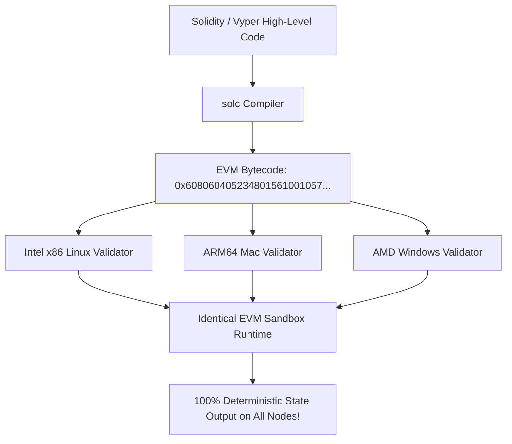
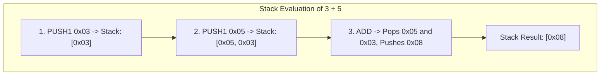
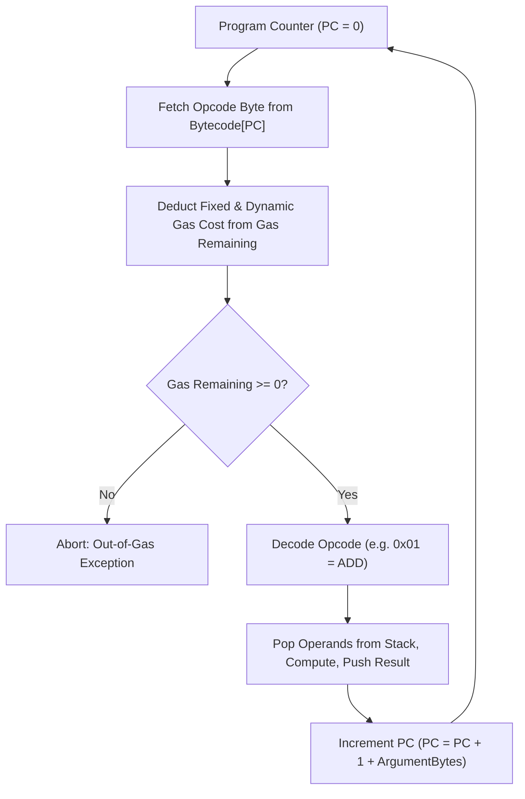
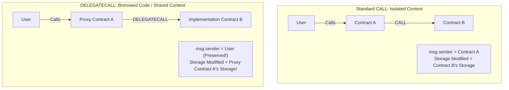
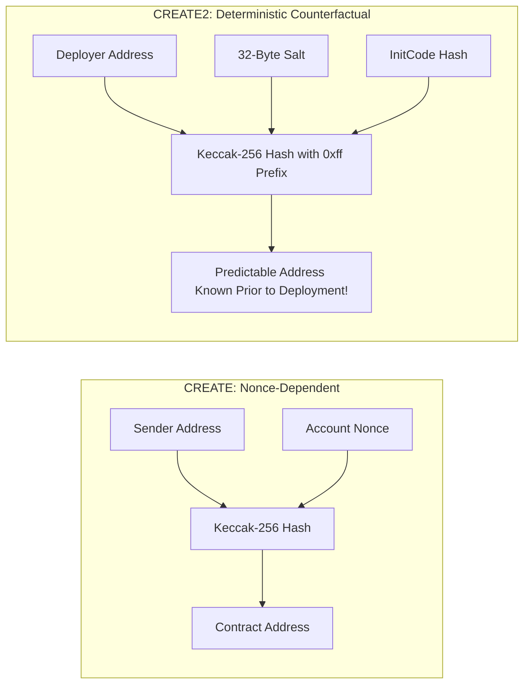

# The Ethereum Virtual Machine

The Ethereum Virtual Machine (EVM) is the execution runtime environment that powers the Ethereum World Computer.
Every smart contract deployed to Ethereum, whether a multi-billion dollar decentralized exchange (Uniswap), a lending market (Aave), or a simple ERC-20 token, runs on top of the EVM.

Understanding the internal architecture of the EVM: its memory layout, storage model, execution stack, and opcode instruction set, is what separates basic smart contract programmers from proficient protocol architects and security researchers.

## What is a Virtual Machine?

In standard computing, software is compiled into machine code tailored to a specific physical processor architecture (such as x86_64 for Intel/AMD chips or ARM64 for Apple Silicon).
However, a public blockchain consists of thousands of independent validator computers running on completely different hardware, operating systems, and CPU instruction sets.

If smart contracts were compiled directly to x86_64 machine code:
- An ARM64 validator (such as a Raspberry Pi or modern Mac server) could not execute the bytecode.
- Minor differences in CPU floating-point handling, memory architectures, or operating system system calls could cause different nodes to compute slightly different state outcomes, permanently breaking consensus.

To achieve **complete cross-platform determinism**, Ethereum introduced a **Virtual Machine**:
- A virtual machine is a software-emulated computer that runs on top of the physical host computer.
- Developers write smart contracts in high-level languages like **Solidity** or **Vyper**.
- The compiler compiles this code into standardized, platform-independent **EVM Bytecode**.
- Every validator runs an identical EVM execution engine (implemented in Go, Rust, C++, or Java), ensuring that executing a specific byte sequence yields the identical state modification on every machine across the globe.



## The 256-Bit Word Architecture

Standard physical CPUs operate on 32-bit or 64-bit words.
The EVM, however, is architected natively around **256-bit words** (32 bytes):

$$\text{Word Size} = 256 \text{ bits} = 32 \text{ bytes}$$

### Why 256 Bits?

Ethereum was engineered specifically for cryptography.
The core primitives of modern blockchain systems:
- SHA-256 and Keccak-256 hash digests are exactly 256 bits.
- Elliptic curve private keys, public key coordinates, and scalar field elements on secp256k1 are 256 bits.
- Merkle roots and storage slot keys are 256 bits.

By designing the virtual machine natively around 256-bit words, the EVM can manipulate cryptographic keys, hash outputs, and token balances with maximum efficiency without requiring multi-word assembly slicing.
The trade-off is computational efficiency: handling 256-bit arithmetic on physical 64-bit host processors requires four underlying 64-bit CPU operations per EVM arithmetic instruction.

## The EVM Data Regions: Stack, Memory, Storage, and Calldata

The EVM is a **quasi-Turing-complete, stack-based machine**.
During execution, the EVM partitions data across six distinct physical regions, each with fundamentally different lifecycles, access costs, and performance characteristics:

```mermaid
flowchart TD
    subgraph Volatile Execution Context (Cleared After Tx)
        Stack["The Stack: 1,024 Slots of 256-Bit Words (LIFO)"]
        Memory["Memory: Byte-Addressable Linear Buffer (Volatile)"]
        Calldata["Calldata: Read-Only Transaction Payload"]
        ReturnData["ReturnData: Buffer Holding Returned Bytes from Sub-calls"]
    end

    subgraph Persistent State (Stored on Disk via Merkle Trie)
        Storage["Storage: 2^256 Slots of 256-Bit Words (Persistent Disk DB)"]
        Code["Code: Immutable Contract Bytecode ROM"]
    end
```

Let us examine the primary four data regions in depth:

### 1. The Stack: The Computational Engine

The EVM is not a register-based machine (like modern x86 or ARM CPUs).
It is a **stack machine** that operates on a Last-In, First-Out (LIFO) stack.
- **Capacity:** Exactly **1,024 items**. If an operation pushes a 1,025th item onto the stack, the EVM triggers a `Stack Overflow` exception and halts.
- **Word Size:** Each stack slot holds exactly one 256-bit word.
- **The 16-Slot Access Constraint ("Stack Too Deep"):** While the stack can hold 1,024 words, EVM swap and duplicate instructions (`SWAP1` through `SWAP16`, `DUP1` through `DUP16`) can only reach the top 16 items on the stack.
  If a smart contract function attempts to manipulate more than 16 local variables simultaneously, the Solidity compiler aborts with the infamous error: `"Stack too deep"`.



### 2. Volatile Memory: Temporary Scratchpad

EVM **Memory** is an ephemeral, linear byte-addressable array allocated during transaction execution.
- **Lifecycle:** Created when a message call begins, expanded dynamically as needed, and completely destroyed (wiped from RAM) the moment execution completes.
- **Addressing:** Bytes are read using `MLOAD` and written using `MSTORE` (32-byte chunks) or `MSTORE8` (single bytes).
- **Quadratic Memory Expansion Gas:** Memory is cheap to allocate initially, but becomes quadratically expensive as it grows to protect nodes against memory-exhaustion attacks.

The gas cost to expand memory to $a$ words (where 1 word = 32 bytes) is:

$$C_{\text{mem}}(a) = 3 \times a + \left\lfloor \frac{a^2}{512} \right\rfloor$$

Allocating a few kilobytes of memory costs negligible gas.
However, attempting to allocate several gigabytes of memory causes the $\frac{a^2}{512}$ quadratic term to skyrocket, rapidly burning the entire transaction gas limit and halting execution.

### 3. Persistent Storage: The On-Chain Database

EVM **Storage** is the persistent, permanent key-value database that survives across transactions.
Every smart contract has its own isolated storage space.
- **Keyspace:** Stupendous: $2^{256}$ keys mapping to $2^{256}$ values of 256-bit words.
  Every storage slot is initialized to zero (`0x00`).
- **Disk Persistence:** Storage modifications are written directly to the host node's underlying database (such as LevelDB or Pebble) and committed to the contract's Merkle Patricia Storage Trie.
- **The Gas Expense (Disk I/O):** Because writing to storage forces thousands of global nodes to write data permanently to physical SSDs, storage operations are the most expensive opcodes in the EVM:
  - Reading a warm storage slot (`SLOAD`): 100 gas.
  - Reading a cold storage slot (`SLOAD`): 2,100 gas.
  - Writing a new value to a zero storage slot (`SSTORE`): **20,000 gas**.

### 4. Calldata: The Read-Only Transaction Payload

**Calldata** is the immutable, read-only byte array sent along with a transaction or cross-contract call.
- **Structure:** Contains the 4-byte function selector followed by ABI-encoded arguments.
- **Immutability:** Contract code cannot modify calldata in place.
- **Gas Efficiency:** Calldata is significantly cheaper than memory or storage (4 gas per zero byte, 16 gas per non-zero byte), making it ideal for passing large datasets (such as rollup state batches).

## The EVM Opcode Execution Cycle

At runtime, the EVM operates as a sequential fetch-decode-execute loop:



1. **Program Counter (PC):** The EVM maintains a pointer indicating which byte of contract bytecode to execute next.
2. **Fetch and Decode:** The byte at `Bytecode[PC]` is matched to its corresponding opcode (e.g., `0x60` = `PUSH1`, `0x01` = `ADD`, `0x54` = `SLOAD`, `0xF3` = `RETURN`).
3. **Gas Deduction:** The gas cost of the opcode is calculated. If the remaining transaction gas is insufficient, an exception is thrown.
4. **Execution:** Operands are popped from the stack, the operation is executed in memory or storage, and the output is pushed back onto the stack.
5. **PC Advance:** The program counter advances to the next instruction until reaching `RETURN`, `STOP`, `REVERT`, or `SELFDESTRUCT`.

## Cross-Contract Interaction: `CALL` vs. `DELEGATECALL`

In decentralized finance, smart contracts rarely operate in isolation.
Protocols constantly invoke other contracts.
The EVM provides two primary opcodes for cross-contract interaction, each establishing fundamentally different execution contexts:



### 1. The `CALL` Opcode (Isolated Context)

When Contract A executes a standard `CALL` to Contract B:
- **`msg.sender`:** Inside Contract B, `msg.sender` becomes **Contract A**.
- **Storage Context:** Code executes inside Contract B's storage space. Any storage writes modify Contract B's state.

### 2. The `DELEGATECALL` Opcode (The Foundation of Upgradeable Proxies)

Introduced in EIP-7, `DELEGATECALL` allows Contract A to execute code from Contract B **inside Contract A's own storage and execution context**:
- **`msg.sender` and `msg.value`:** Preserved from the original caller (the user).
- **Storage Context:** Code is fetched from Contract B, but **all reads and writes mutate Contract A's storage slots**.

This architectural primitive enabled the modern **Proxy Pattern**:
- Users interact with an immutable **Proxy Contract** that holds all user funds, token balances, and state variables.
- The proxy executes a `DELEGATECALL` to an **Implementation Contract** holding the business logic.
- To upgrade the protocol, developers deploy a new implementation contract and update a single storage pointer in the proxy, preserving all user balances while upgrading the underlying code.

## Deterministic Address Derivation: `CREATE` vs. `CREATE2`

When deploying a new smart contract to Ethereum, where does its 20-byte address come from?
The EVM provides two contract creation opcodes with fundamentally different mathematical properties:



### 1. The `CREATE` Opcode (Traditional Deployment)

Under `CREATE`, the contract address is derived from the deployer's address and the deployer's sequential transaction count (nonce):

$$\text{Address} = \text{Rightmost20Bytes}\Big(\text{Keccak-256}\big(\text{RLP}(\text{DeployerAddress}, \text{Nonce})\big)\Big)$$

- **Limitation:** The address depends on the exact chronological order in which transactions are broadcast.
  If the deployer broadcasts multiple transactions simultaneously, a reordering in the mempool will change the contract address.

### 2. The `CREATE2` Opcode (Counterfactual Determinism)

Introduced in EIP-1014 (the Constantinople upgrade), `CREATE2` decouples address derivation from the deployer's nonce:

$$\text{Address} = \text{Rightmost20Bytes}\Big(\text{Keccak-256}\big(\mathtt{0xff} \mathbin{\Vert} \text{DeployerAddress} \mathbin{\Vert} \text{Salt} \mathbin{\Vert} \text{Keccak-256}(\text{InitCode})\big)\Big)$$

- **`0xff` Prefix:** A 1-byte constant that guarantees addresses generated via `CREATE2` can never collide with addresses generated via `CREATE`.
- **`Salt`:** An arbitrary 32-byte value chosen by the developer.
- **`InitCode`:** The contract's deployment bytecode and constructor arguments.

#### Why `CREATE2` Revolutionized Ethereum Architecture:
- **Counterfactual Deployment:** Users and protocols can calculate the exact address where a smart contract will live **years before it is physically deployed on-chain**.
- **State Channels and Layer 2s:** Users can deposit funds into a counterfactual smart contract address off-chain, and deploy the contract to Layer 1 only if a dispute arises.
- **Factory Predictability:** Decentralized exchanges (like Uniswap V2 and V3) use `CREATE2` to deterministically calculate liquidity pool addresses from the sorted addresses of the two traded tokens:
  $$\text{PoolAddress} = f(\text{Factory}, \text{TokenA}, \text{TokenB})$$
  eliminating the need for on-chain registry lookups and dramatically saving gas.
