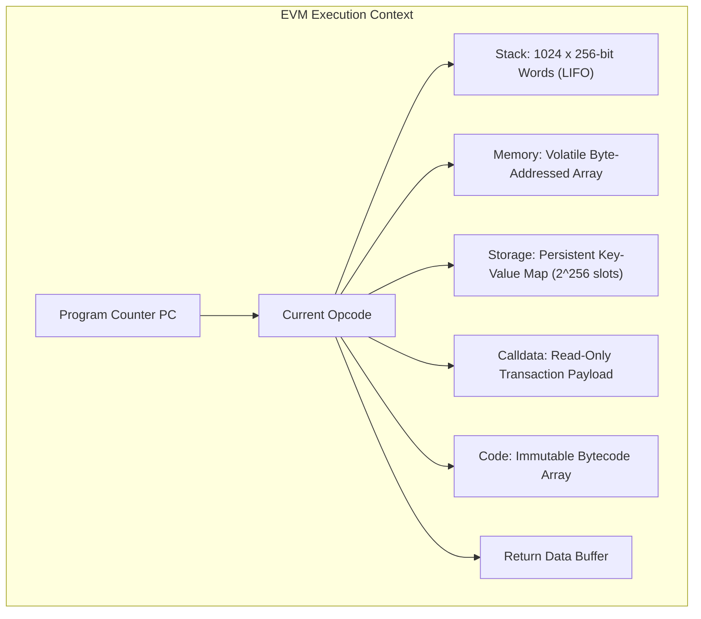
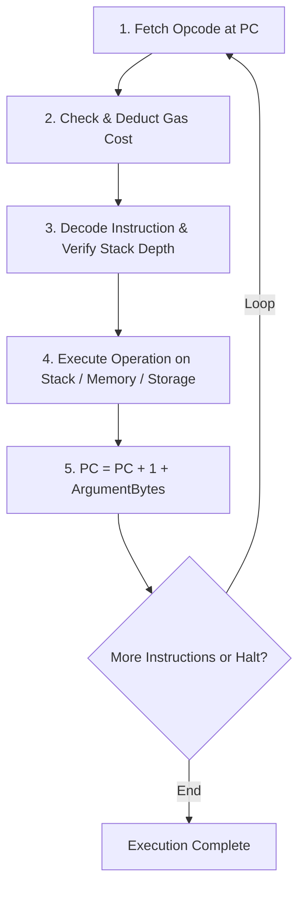
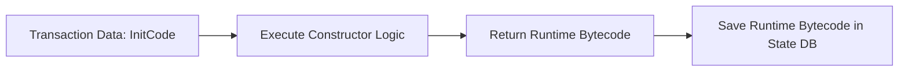

# The Ethereum Virtual Machine

The Ethereum Virtual Machine (EVM) is the decentralized runtime environment that executes smart contracts across every Ethereum node.
Architecturally, the EVM is a deterministic, isolated, quasi-Turing complete stack machine operating with a 256-bit word size.
Its state is completely sandboxed: code executing inside the EVM has no access to the host machine's network interfaces, filesystem, or operating system processes.

## Architecture and Data Regions

The EVM execution environment partitions data across six distinct storage and memory areas:

### 1. The Stack

The EVM is a Last-In, First-Out (LIFO) stack machine.
- **Word Size:** 256 bits (32 bytes). This native width was chosen specifically to facilitate 256-bit cryptographic operations like Keccak-256 and secp256k1 point calculations.
- **Capacity:** Maximum depth of 1,024 elements.
- **Addressing Limits:** Opcodes can only access elements near the top of the stack. Direct access is restricted to the top 16 elements via `DUP1` through `DUP16` and `SWAP1` through `SWAP16`. Attempting to reference variables deeper than 16 slots triggers compiler `Stack too deep` errors.

### 2. Volatile Memory

Memory is a transient, byte-addressed linear array initialized to zero at the start of contract execution.
- **Lifespan:** Memory exists only during contract execution and is completely erased when execution returns or halts.
- **Addressing:** Addressed at byte-level granularity using `MLOAD` and `MSTORE` (reading and writing 32-byte chunks) or `MSTORE8` (writing a single byte).
- **Expansion Cost:** Memory gas costs expand quadratically. Reading or writing beyond current memory bounds expands its allocation:
  $$C_{\text{mem}}(a) = 3a + \left\lfloor \frac{a^2}{512} \right\rfloor$$
  where $a$ is the number of 32-byte words allocated.
  This quadratic expansion model discourages excessive RAM consumption on validator nodes.

### 3. Persistent Storage

Storage is a permanent, persistent key-value mapping from 256-bit keys to 256-bit values:

$$\text{Storage}: \{0, 1\}^{256} \to \{0, 1\}^{256}$$

- **Persistence:** Storage persists permanently across blocks in the account's state trie.
- **Cost:** Because updating storage alters the global Merkle Patricia Trie on disk, storage operations are the most expensive opcodes in the EVM.
  Writing a non-zero value to an empty slot (`SSTORE`) costs up to 20,000 gas, whereas reading a cold storage slot (`SLOAD`) costs 2,100 gas under EIP-2929.

### 4. Calldata

Calldata is a read-only, byte-addressable buffer containing the input arguments sent by the transaction caller.
Because calldata cannot be mutated, the EVM avoids memory allocation overhead, charging only 4 gas for zero bytes and 16 gas for non-zero bytes.
Contracts access calldata via `CALLDATALOAD`, `CALLDATASIZE`, and `CALLDATACOPY`.

### 5. Executable Code

The contract's compiled bytecode resides in a dedicated read-only byte array.
The virtual machine accesses instructions sequentially using an internal integer pointer called the **Program Counter** (`PC`).
Bytecode cannot be modified at runtime.

## Opcode Execution Cycle

The EVM execution loop proceeds instruction by instruction:

Opcodes fall into specific functional classes:

| Class | Examples | Description |
| :--- | :--- | :--- |
| **Arithmetic** | `ADD`, `MUL`, `SUB`, `DIV`, `EXP` | Performs 256-bit modular arithmetic on stack items |
| **Bitwise** | `AND`, `OR`, `XOR`, `NOT`, `SHL`, `SHR` | Bit-level logic and shift operations |
| **Stack Ops** | `POP`, `PUSH1`..`PUSH32`, `DUP1`..`DUP16`, `SWAP1`..`SWAP16` | Push literals, duplicate elements, or swap top stack elements |
| **Flow Control** | `JUMP`, `JUMPI`, `JUMPDEST`, `STOP` | Branching and jump targets; jumps must land on valid `JUMPDEST` opcodes |
| **Context** | `CALLER`, `CALLVALUE`, `ADDRESS`, `TIMESTAMP`, `NUMBER` | Accesses block and transaction metadata |
| **Storage & Memory** | `SLOAD`, `SSTORE`, `MLOAD`, `MSTORE`, `MSTORE8` | Interacts with memory and persistent disk storage |
| **System Calls** | `CALL`, `DELEGATECALL`, `STATICCALL`, `CREATE`, `REVERT` | Dispatches external contract calls or deploys contracts |

### The Role of `DELEGATECALL`

The `DELEGATECALL` opcode allows a contract to execute code from an external contract target while preserving the caller's context:
- `msg.sender` remains the original sender.
- `msg.value` remains the original call value.
- Storage writes modify the storage layout of the calling contract, not the target library.

This primitive forms the architectural foundation of proxy contract upgradability patterns (such as ERC-1967 and UUPS).

## Contract Deployment and Address Derivation

Smart contracts are deployed by submitting a transaction with an empty `to` field and compiled bytecode embedded in the `data` payload.

- **Initialization Bytecode (InitCode):** Contains constructor parameters and setup routines. It executes once upon deployment, runs initialization logic, and returns the final runtime bytecode.
- **Runtime Bytecode:** The persistent bytecode stored in the state database that executes whenever subsequent transactions call the deployed contract address.

### Address Derivation Formulas

#### 1. Standard Deployment (`CREATE`)

Under the `CREATE` opcode, a contract's address is deterministically derived from the deploying sender's address and the sender's account nonce:

$$\text{Address} = \text{B}_{12..31}\Big(\text{keccak256}\big(\text{RLP}([ \text{sender}, \text{nonce} ])\big)\Big)$$

where $\text{B}_{12..31}$ denotes the rightmost 20 bytes of the hash.

#### 2. Deterministic Deployment (`CREATE2`)

EIP-1014 introduced the `CREATE2` opcode to enable counterfactual address derivation independent of the sender's current nonce:

$$\text{Address} = \text{B}_{12..31}\Big(\text{keccak256}\big( \mathtt{0xff} \mathbin{\Vert} \text{sender} \mathbin{\Vert} \text{salt} \mathbin{\Vert} \text{keccak256}(\text{initcode}) \big)\Big)$$

Because the address depends exclusively on the sender, a 32-byte user-chosen `salt`, and the initialization bytecode hash, developers can compute and fund a contract's address before it is deployed on-chain.
