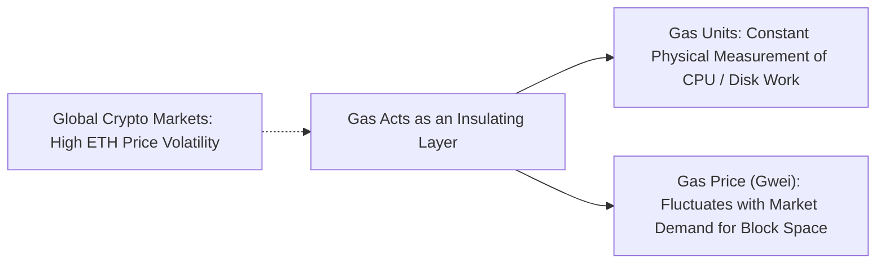
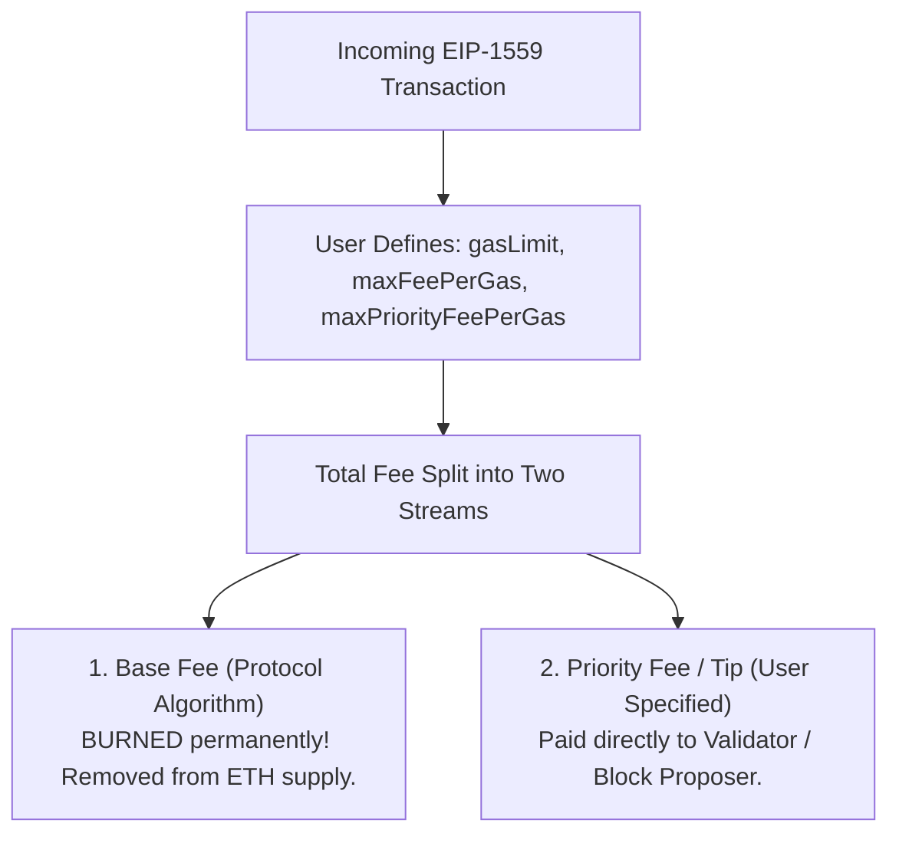
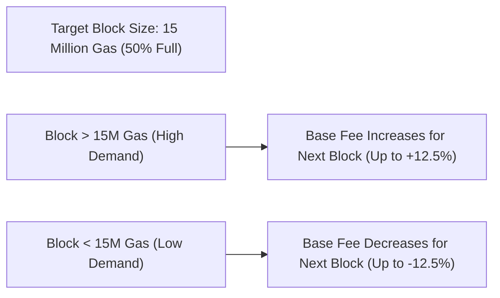
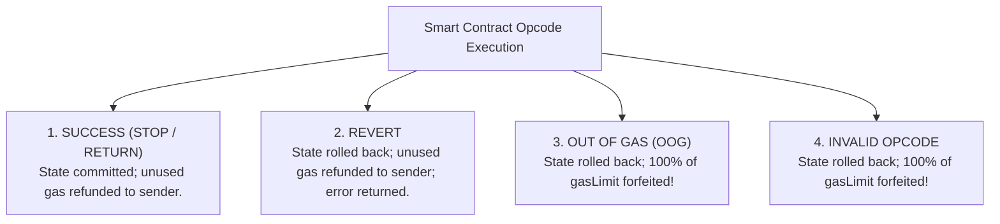

# Gas Economics and Execution Halting

In standard desktop or cloud software development, developers rarely concern themselves with the computational cost of an addition operation or writing a variable to RAM.
Physical hardware is abundant, and operating systems virtualize memory seamlessly.

On a decentralized blockchain, however, computing resources are intensely scarce.
Every instruction executed by a smart contract is not executed once on a central server; it is executed **redundantly by tens of thousands of independent validator computers worldwide**.
Every byte of persistent storage is replicated across thousands of physical solid-state drives permanently.

To allocate these scarce resources efficiently, prevent denial-of-service attacks, and create a sustainable economic market for transaction processing, Ethereum introduced **Gas Economics**.

## Decoupling Computation from Fiat Currency: Gas vs. Ether

A common question from newcomers is: *Why did Ethereum invent "Gas" instead of simply pricing transactions directly in Ether (ETH)?*

The answer lies in monetary volatility:

- **Gas Units (The Computational Measure):**
  Gas is a unit of pure physical work.
  Adding two numbers with the `ADD` opcode costs **3 gas**.
  Writing a new word to disk with `SSTORE` costs **20,000 gas**.
  These values are hardcoded in the protocol specification and remain completely constant regardless of whether ETH is trading at $10 or $10,000.
- **Gas Price (The Market Auction):**
  The price of gas is denominated in **gwei** (where $1 \text{ gwei} = 10^{-9} \text{ ETH} = 1,000,000,000 \text{ wei}$).
  The gas price fluctuates dynamically based on supply and demand for block space.

By decoupling the physical measurement of work (Gas) from the economic asset used to pay for it (Ether), the cost of executing an operation scales naturally with hardware capacity rather than market speculation.

## The Intrinsic Gas Floor

Before the Ethereum Virtual Machine executes a single opcode, every transaction must pay a baseline non-refundable cost called **Intrinsic Gas** ($G_{\text{intrinsic}}$):

$$G_{\text{intrinsic}} = 21,000 + G_{\text{calldata}} + G_{\text{creation}} + G_{\text{access\_list}}$$

Let us break down each component:

1. **The 21,000 Base Gas:**
   Every standard transaction incurs a 21,000 gas fee to cover the baseline overhead:
   - Recovering the sender's public key from the ECDSA signature (`ecrecover`).
   - Verifying the sender's account balance and incrementing the account nonce.
   - Writing the updated balances and nonces to the disk state trie.
2. **Calldata Costs:**
   Every byte sent in the transaction data payload consumes gas:
   - **4 gas** for every zero byte (`0x00`).
   - **16 gas** for every non-zero byte.
   Because non-zero bytes require persistent storage and bandwidth while zero bytes compress efficiently, non-zero bytes are priced four times higher.
3. **Contract Creation (32,000 gas):**
   If the transaction deploys a new contract (`to` field is null), an additional 32,000 gas is assessed to cover the initialization of a new account state trie node.

If a transaction specifies a `gasLimit` smaller than $G_{\text{intrinsic}}$, nodes drop it immediately without running the EVM.

## EIP-1559: The Dynamic Fee Market Architecture

Prior to August 2021 (the London Hard Fork), Ethereum operated on a naive **first-price auction**:
- Users bid a single gas price.
- Miners ordered transactions strictly by highest bid and kept 100 percent of the fee.
- This created wild fee volatility, forced users to drastically overpay during congestion, and incentivized miner fee manipulation.

In 2021, Ethereum activated **EIP-1559**, completely redesigning the fee mechanics:

### 1. The Base Fee (Burned)

Under EIP-1559, every block has a protocol-calculated **Base Fee per Gas**:
- **Mandatory:** Every transaction included in the block must pay at least this base fee.
- **Burned:** Crucially, **100 percent of the base fee is burned (destroyed)** by sending it to a dead address, permanently shrinking the circulating supply of ETH.
- **Why Burn It?** If the base fee were paid to the miner, miners could collude with off-chain users to artificially inflate block space or create fake transactions to manipulate the base fee calculation without economic penalty. Burning the fee aligns miner incentives strictly with the protocol.

### 2. The Priority Fee (Tip to Validator)

The **Priority Fee** (miner tip) is an optional additional payment that goes directly into the block proposer's pocket to incentivize them to prioritize your transaction over others during times of congestion.

### 3. Effective Gas Price Calculation

When a transaction executes, the actual price paid per unit of gas is calculated deterministically:

$$\text{EffectiveGasPrice} = \min\big(\text{maxFeePerGas}, \text{BaseFee} + \text{maxPriorityFeePerGas}\big)$$

$$\text{Total Transaction Cost} = \text{GasUsed} \times \text{EffectiveGasPrice}$$

Any remaining difference between `maxFeePerGas` and the actual `EffectiveGasPrice` is refunded directly back to the user's account.

## The Base Fee Adjustment Formula: Elastic Blocks

How does the protocol know whether to raise or lower the base fee?
Ethereum implements an algorithmic feedback loop based on **Elastic Block Sizes**:

- **Target Block Size:** 15,000,000 gas.
- **Maximum Block Size:** 30,000,000 gas (a hard ceiling: 200% of target).

The base fee for block $n+1$ ($B_{n+1}$) is calculated from the gas used in block $n$ ($G_n$):

$$B_{n+1} = B_n \times \left( 1 + \frac{1}{8} \times \frac{G_n - 15,000,000}{15,000,000} \right)$$

- **If a block is exactly 50% full ($G_n = 15\text{M}$):**
  The numerator is zero. The base fee remains identical.
- **If a block is 100% full ($G_n = 30\text{M}$):**
  The fraction evaluates to $\frac{15\text{M}}{15\text{M}} = 1$.
  The base fee increases by exactly **12.5 percent** for the next block.
- **If a block is completely empty ($G_n = 0$):**
  The fraction evaluates to $-1$.
  The base fee decreases by exactly **12.5 percent** for the next block.

Because the base fee adjusts by up to 12.5% per block, a sudden traffic spike causes the base fee to grow exponentially:
$$(1.125)^{10} \approx 3.25\times \quad \text{in just 10 blocks (2 minutes)}$$
This rapid exponential price discovery quickly prices out low-priority transactions, smoothing network congestion back down to the 15 million gas target.

## Execution Halting: Out-of-Gas vs. Reverts

When a smart contract executes, it can terminate in one of four states:

### 1. Clean Revert (`REVERT` Opcode)

A revert occurs when contract execution encounters a logical failure condition (such as `require(balance >= amount, "Insufficient funds")` in Solidity):
- **State Rollback:** Every modification made by the transaction: balances, storage variables, token transfers, contract creations, is immediately and atomically rolled back to its pre-transaction state.
- **Gas Handling:** Gas consumed *up to the point of revert* is paid to the validator.
  **All unspent remaining gas is refunded back to the sender**.
- **Error Reason:** The transaction returns an error message or custom error bytes to the caller.

### 2. Out-of-Gas Exception (OOG)

An Out-of-Gas exception occurs when a transaction exhausts its allocated `gasLimit` while in the middle of executing:
- **State Rollback:** Like a revert, all state changes are completely rolled back to maintain consistency.
- **Punitive Gas Handling:** **Zero gas is refunded.** The user forfeits **100 percent of their prepaid `gasLimit`**.
- **Why the Penalty?** Because the validator spent physical CPU time executing instructions until the fuel ran out, the validator must be compensated for their hardware expenditure.
  Without this forfeiture rule, attackers could spam nodes with massive computations for free.

## Storage Gas Refunds and EIP-3529

In early Ethereum designs, the protocol attempted to incentivize developers to clean up unused blockchain state by offering generous **gas refunds** when a contract cleared storage slots (`SSTORE` from non-zero to zero) or executed `SELFDESTRUCT`.

However, this created dangerous unintended systemic behaviors:
- **Gas Tokens (Chi, Gastoken):** Developers realized they could "mint" gas tokens when gas prices were low by filling up dummy storage slots, and "burn" those tokens during high congestion to claim refunds, effectively turning Ethereum's storage into an arbitrage commodity market.
- **Block-Stuffing Exploits:** Attackers used refunds to artificially inflate block execution time beyond safe physical thresholds.

In August 2021, **EIP-3529** overhauled the refund mechanism:
- Removed refunds for the `SELFDESTRUCT` opcode completely.
- Reduced storage clearance refunds from 15,000 gas to a modest **4,800 gas**.
- Capped maximum refunds at **one-fifth (20%)** of the total gas consumed in the transaction.

This permanently eliminated gas token arbitrage schemes and stabilized block execution latencies across validator nodes.
