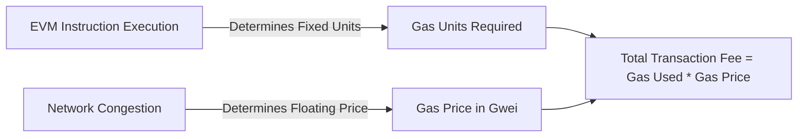
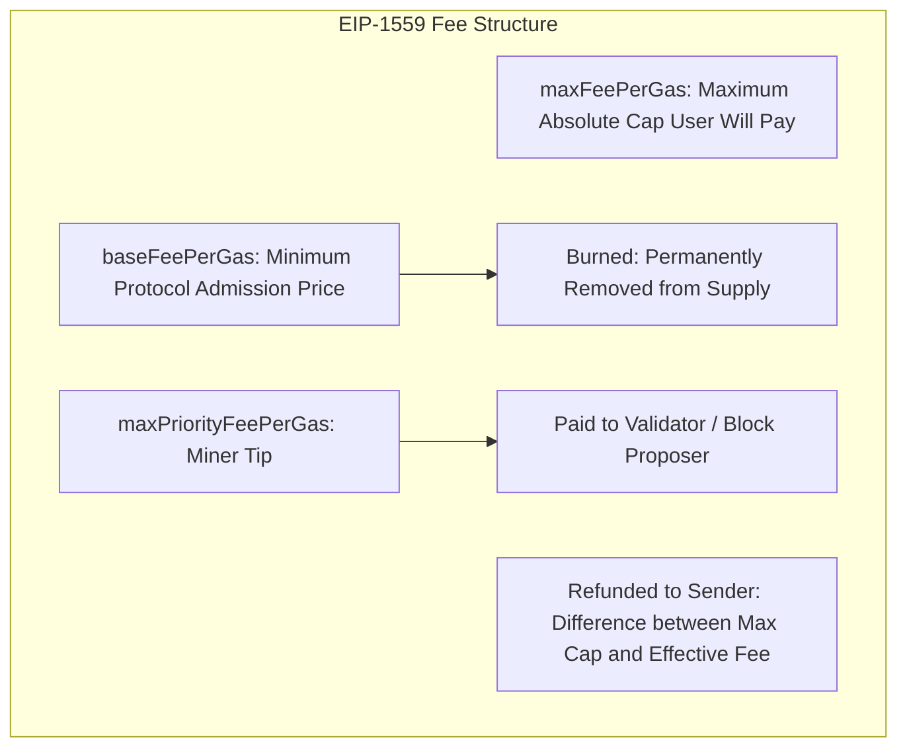
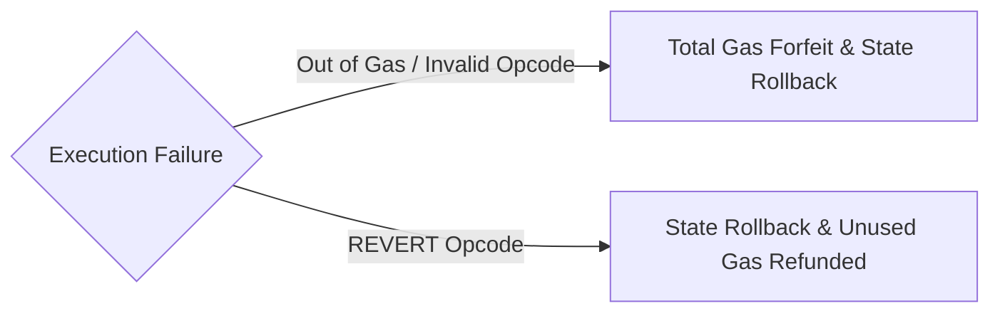

# Gas Economics and Execution Halting

Blockchains operate as shared, resource-constrained state machines.
Because every full node executes every transaction to maintain synchronization, unmetered execution would expose the network to denial-of-service (DoS) attacks and state explosion.
The gas model creates an economic abstraction that prices computational steps, memory allocations, and persistent disk writes, ensuring nodes are compensated for hardware resource consumption.

## Gas vs. Native Currency

The protocol deliberately decouples the metric of computation (**Gas**) from the volatile market asset (**Ether**):

- **Gas:** An absolute, deterministic unit measuring computational effort. Adding two numbers (`ADD`) always requires exactly 3 gas, regardless of market conditions.
- **Gas Price:** The market price a user pays in native currency (gwei) per unit of gas consumed ($1 \text{ gwei} = 10^{-9} \text{ ETH} = 10^9 \text{ wei}$).

By decoupling these metrics, the computational cost of an algorithm remains invariant across years, while market dynamics dictate the monetary price required to secure block space.

## Intrinsic Gas

Before an execution environment processes a single contract opcode, every incoming transaction must pay an **intrinsic gas** fee:

$$G_{\text{intrinsic}} = 21000 + \sum G_{\text{calldata}} + G_{\text{access\_list}} + G_{\text{creation}}$$

- **Baseline Cost (21,000 gas):** Covers signature verification, account nonce incrementation, balance checks, and basic transaction record keeping on disk.
- **Calldata Costs:** 4 gas for every zero byte ($0x00$) and 16 gas for every non-zero byte.
- **Access Lists (EIP-2930):** 2,400 gas per specified address and 1,900 gas per storage key to warm state caches prior to execution.
- **Contract Creation:** An additional 32,000 gas is charged if the transaction deploys a new contract.

## The EIP-1559 Fee Mechanism

Prior to the London hard fork in 2021, Ethereum relied on a first-price auction.
Users submitted transactions with a single gas price bid.
Miners selected the highest bids first, forcing users to guess competitive market prices and causing erratic fee spikes during congestion.

EIP-1559 replaced first-price auctions with a dynamic, protocol-enforced **Base Fee** paired with a discretionary **Priority Fee** (tip).

### 1. Base Fee and Block Elasticity

Under EIP-1559, block size varies dynamically:
- **Target Gas Limit:** 15,000,000 gas.
- **Maximum Gas Limit:** 30,000,000 gas (a $2\times$ burst capacity).

The protocol algorithmically adjusts the base fee for the next block ($B_{n+1}$) based on how full the current block ($B_n$) was relative to the 15M target:

$$\text{BaseFee}_{n+1} = \text{BaseFee}_n \left( 1 + \frac{1}{8} \cdot \frac{\text{GasUsed}_n - \text{TargetGas}}{\text{TargetGas}} \right)$$

- If a block is exactly 100 percent full (30M gas), the base fee increases by the maximum allowable cap of **12.5 percent** for the subsequent block.
- If a block is empty (0 gas), the base fee decreases by 12.5 percent.
- If a block hits exactly the 15M target, the base fee remains unchanged.

### 2. Base Fee Burning

Crucially, the base fee is not paid to the validator.
It is burned (permanently sent to the zero address and destroyed).
Burning the base fee prevents miners from artificially inflating fees or colluding with users to generate false gas prices.
Economically, this links network usage directly to native token deflation (the EIP-1559 ultrasound money thesis).

### 3. Priority Fee and Effective Gas Price

Users specify two parameters when submitting an EIP-1559 transaction:
- `maxFeePerGas`: The absolute maximum price per gas unit the user is willing to pay.
- `maxPriorityFeePerGas`: The maximum tip paid directly to the validator to incentivize fast inclusion.

The actual price charged per gas unit is the **Effective Gas Price**:

$$\text{EffectivePrice} = \min\big(\text{maxFeePerGas}, \text{baseFeePerGas} + \text{maxPriorityFeePerGas}\big)$$

Any surplus between `maxFeePerGas` and the `EffectivePrice` is returned to the user's balance.

## Execution Halting: Out of Gas vs. Revert

When contract execution encounters an error, the EVM handles state mutations and gas accounting based on the error type:

### 1. Out-of-Gas (OOG) Exception

If opcode execution exhausts the provided `gasLimit`:
- All state modifications (storage writes, balance transfers, event logs) are rolled back to the state before the transaction executed.
- The sender loses **100 percent** of the allocated `gasLimit`.
- No refund is issued. The full fee is surrendered to compensate the network for processing the failed computations.

### 2. Explicit Revert (`REVERT`)

When a transaction triggers an explicit `require()` failure or a `revert()` statement:
- All state modifications are rolled back.
- Execution halts, and an optional error string or custom error payload is returned in the return data buffer.
- The transaction sender is charged **only for the gas consumed up to the moment of revert**.
- All unspent remaining gas is refunded back to the sender's account balance.

## Storage Gas Dynamics and Refunds

Because storage slots consume persistent disk space on every full node, writing data to empty storage slots (`SSTORE`) carries high gas costs (20,000 gas).
Historically, Ethereum offered large gas refunds for clearing storage slots or invoking `SELFDESTRUCT`.
This incentivized arbitrageurs to fill storage slots when gas prices were low and clear them when gas prices were high (the Gastoken exploit), causing severe state bloat.

To neutralize this exploit, EIP-3529:
- Removed gas refunds for `SELFDESTRUCT`.
- Reduced storage clearance refunds to a maximum cap of **20 percent** of the total gas consumed by the transaction.
- This eliminated tokenized gas arbitrage while preserving incentives to prune unneeded state.
