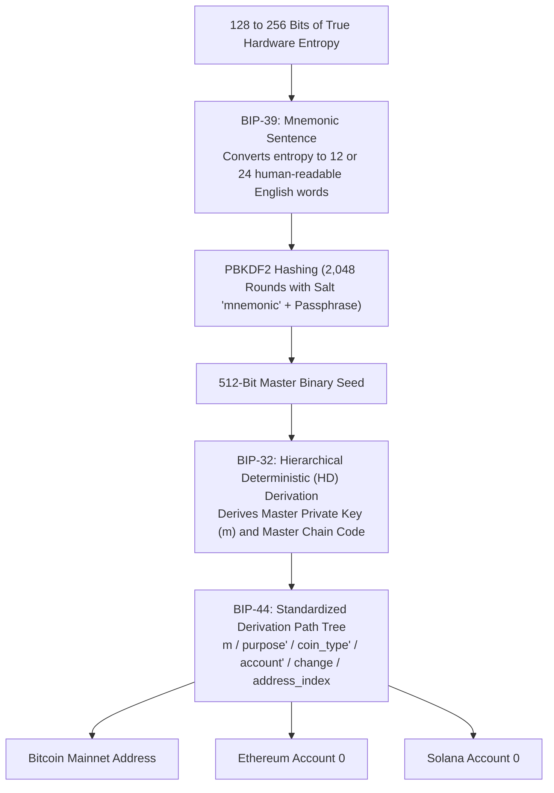
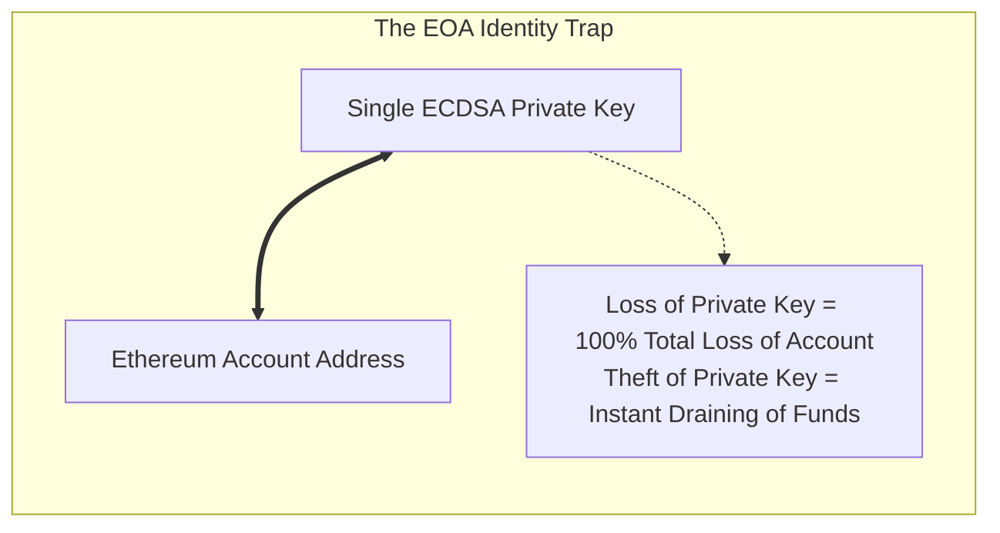
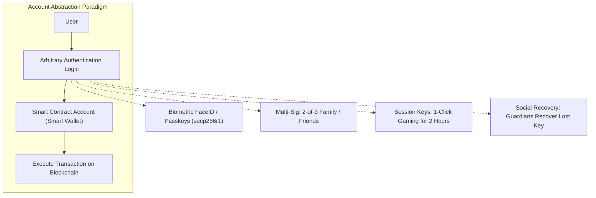
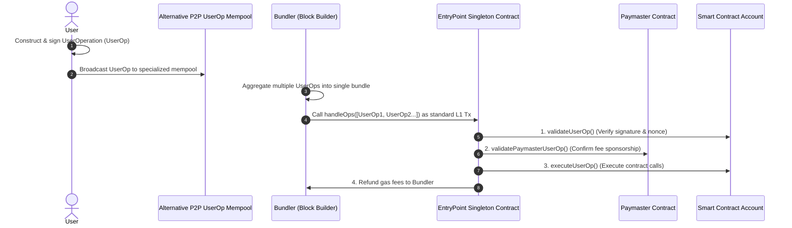

# Wallets and Account Abstraction

For mainstream users, their relationship with a blockchain is mediated entirely through a single piece of software: the **wallet**.
A crypto wallet does not actually store coins inside your phone or hardware dongle.
Your funds live permanently on the public blockchain ledger as account balances or UTXOs.
A wallet is an interface that stores your cryptographic **private keys**, generates digital signatures to authorize state transitions, and derives addresses.

However, the historical model of blockchain accounts: **Externally Owned Accounts (EOAs)**, imposes severe security risks and user experience friction.
If a user loses their private key, their funds are lost forever.
If an attacker steals a private key, the account is drained instantaneously with zero possibility of recovery.

To bring billions of users into decentralized networks without compromising self-sovereignty, the industry developed **Account Abstraction (ERC-4337)**, transforming every user account into a programmable smart contract.

## The Architecture of Modern Wallets: BIP Standards

Modern cryptocurrency wallets do not generate random private keys individually.
Generating independent random keys for every transaction would require constantly backing up private keys to disk, risking data loss.

Instead, all modern wallets follow a hierarchical suite of three Bitcoin Improvement Proposals (BIPs):

### 1. BIP-39: Mnemonic Seed Phrases

In 2013, Marek Palatinus and colleagues introduced **BIP-39**, translating raw binary entropy into human-memorable word sequences.
- **Entropy Generation:** The device samples 128 to 256 bits of cryptographically secure random entropy (from hardware noise generators).
- **Checksum Calculation:** A SHA-256 hash of the entropy is computed. The first few bits of the hash are appended to the entropy as a checksum.
- **Wordlist Mapping:** The bit sequence is partitioned into 11-bit chunks ($2^{11} = 2,048$ possibilities). Each 11-bit chunk maps directly to a word in a standardized 2,048-word English dictionary.
  - 128 bits of entropy produces a **12-word seed phrase**.
  - 256 bits of entropy produces a **24-word seed phrase**.
- **Seed Derivation:** The mnemonic words are hashed using **PBKDF2** (Password-Based Key Derivation Function 2) with HMAC-SHA512 over 2,048 iterations, producing a single **512-bit master binary seed**.

### 2. BIP-32: Hierarchical Deterministic (HD) Wallets

Introduced by Pieter Wuille, **BIP-32** allows a wallet to derive an infinite tree of child keypairs from that single 512-bit master seed using elliptic curve scalar multiplication and a 32-byte **Chain Code**:
- Backing up the single seed phrase once backs up every past, present, and future private key generated by that wallet.
- Child keys can be derived deterministically without ever exposing the master private key.

### 3. BIP-44: Multi-Account Hierarchy

**BIP-44** standardizes the derivation path structure across multiple blockchains:

$$\mathtt{m / \text{purpose}' / \text{coin\_type}' / \text{account}' / \text{change} / \text{address\_index}}$$

- **`purpose'`:** Set to `44'` (or `84'` for Native SegWit, `86'` for Taproot).
- **`coin_type'`:** A registered integer identifying the blockchain:
  - `0'` for Bitcoin Mainnet.
  - `60'` for Ethereum.
  - `501'` for Solana.
- **`account'`:** Allows partitioning a single seed into separate organizational accounts (e.g. Personal vs Business).
- **`change`:** `0` for external receiving addresses; `1` for internal change addresses.
- **`address_index`:** Sequential counter (`0, 1, 2, ...`) generating individual addresses.

For example, the derivation path for an Ethereum user's primary account is:

$$\mathtt{m / 44' / 60' / 0' / 0 / 0}$$

## The Fundamental Flaw of Externally Owned Accounts (EOAs)

On Ethereum today, the default account structure is an **Externally Owned Account (EOA)**.
An EOA has a 1-to-1 hardcoded link between its private key and its on-chain identity:

### The Systemic Vulnerabilities of EOAs

1. **Catastrophic Failure Modes:**
   If a user accidentally reveals their 12-word seed phrase to a phishing website, an automated sweeper bot drains their account within seconds.
   There is no mechanism to freeze the account, rotate the private key, or add a multi-factor authorization delay.
2. **Gas Dependency (The On-Ramp Problem):**
   An EOA cannot execute a transaction or interact with any smart contract unless the account holds native ETH to pay for gas.
   If Alice has $10,000 in USDC stablecoins in her wallet but zero ETH, she cannot transfer her USDC.
   She must first purchase ETH from a centralized exchange, complete KYC, and transfer the ETH to her wallet before she can move her own money.
3. **Signature Overhead:**
   Every single action in Web3 requires an individual cryptographic signature.
   Playing a blockchain game or executing a multi-step DeFi transaction requires approving five or six consecutive pop-up modals, destroying user experience.
4. **Hardcoded Cryptography:**
   EOAs are permanently hardcoded to use **ECDSA over the secp256k1 curve**.
   Users cannot use secure hardware enclaves built into smartphones (such as Apple's Secure Enclave or Android Keystore, which use the secp256r1 curve) or quantum-resistant signature schemes.

## Account Abstraction: The Smart Contract Account Paradigm

**Account Abstraction** decouples the account's on-chain identity from a single hardcoded cryptographic private key.
Instead of being governed by a raw keypair, the user's account **is a programmable smart contract**.

Under Account Abstraction, the verification logic (`validateUserOp`) is defined entirely in software:
- **Key Rotation:** If your signing key is compromised, you can rotate the key without changing your account address or moving your assets.
- **Social Recovery:** If you lose your phone, trusted friends, family members, or institutional guardians can sign a recovery transaction restoring your access, permanently eliminating the fear of lost seed phrases.
- **Gas Sponsorship (Paymasters):** Applications can sponsor gas fees for their users, or allow users to pay gas in stablecoins like USDC instead of native ETH.
- **Batched Transactions:** Users can execute an ERC-20 `approve` and Uniswap `swap` in a single atomic transaction with a single click.

## ERC-4337: Account Abstraction Without Consensus Changes

Historically, implementing Account Abstraction required a contentious hard fork to alter the core EVM consensus rules.
In 2021, Vitalik Buterin and Ethereum researchers designed **ERC-4337: Account Abstraction via Alternative Mempool**, which achieves full account abstraction **without modifying Ethereum's underlying Layer 1 consensus protocol**.

Let us examine the complete ERC-4337 operational architecture:

### The Core Components of ERC-4337

1. **`UserOperation` (UserOp):**
   A high-level pseudo-transaction object that describes what the user wants to execute.
   It includes the sender's smart account address, call data, gas limits, signature bytes, and optional paymaster information.
2. **The Alternative Mempool:**
   UserOperations are not broadcast to the standard Ethereum mempool (because standard nodes would reject them as invalid raw transactions).
   Instead, they gossip across a specialized peer-to-peer mempool run by specialized nodes called **Bundlers**.
3. **Bundlers:**
   A Bundler is a specialized node operator (often an MEV searcher or block builder).
   The Bundler packages dozens of individual UserOperations from the alternative mempool into a single, massive standard Ethereum transaction calling `handleOps()` on the EntryPoint contract.
   The Bundler pays the upfront L1 gas fee in ETH and is repaid by the smart accounts or paymasters.
4. **The `EntryPoint` Singleton Contract:**
   A battle-tested, immutable smart contract deployed at the identical address across every EVM chain.
   The EntryPoint acts as the central router and verification coordinator:
   - **Verification Loop:** Calls `validateUserOp()` on each smart account to verify signatures and ensure fees can be paid.
   - **Execution Loop:** Calls the smart account's execution logic to interact with target dApps.
5. **Paymasters:**
   Optional smart contracts that sponsor transaction gas fees for users.
   A gaming application can deploy a Paymaster that pays 100% of its players' gas fees, or a DeFi exchange can deploy a Paymaster that accepts USDC from the user and reimburses the Bundler in ETH.

## Comprehensive Comparison: EOA vs. ERC-4337

| Feature | Externally Owned Account (EOA) | Smart Contract Account (ERC-4337) |
| :--- | :--- | :--- |
| **Identity Control** | Single ECDSA private key (secp256k1) | Programmable smart contract logic |
| **Private Key Loss** | Permanent, unrecoverable loss of all funds | Recoverable via Social Guardians / Multi-sig |
| **Private Key Theft** | Account instantly drained with zero recourse | Prevented via daily spend limits & timelocks |
| **Gas Payment Options** | Strictly native token (ETH) only | Sponsored by dApps or paid in any ERC-20 token |
| **Signature Standards** | Hardcoded to ECDSA only | Arbitrary: Passkeys, WebAuthn, BLS, Post-Quantum |
| **Transaction Batching** | No (1 transaction per signature) | Yes (Atomic multi-call batching in 1 click) |
| **L1 Protocol Changes** | Legacy standard built into genesis | Zero protocol changes required |
