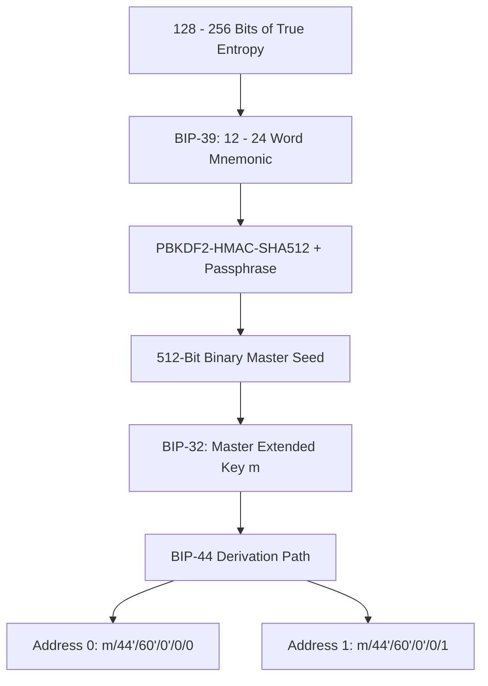
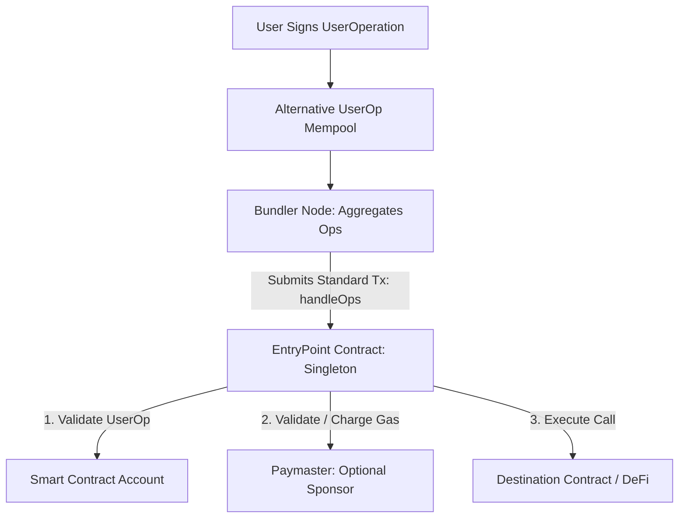

# Wallets and Account Abstraction

A cryptocurrency wallet does not store coins or tokens.
Tokens exist exclusively as records in on-chain state databases.
A wallet is a cryptographic key management engine and user agent that generates keypairs, signs transactions, and interfaces with RPC gateways.
As the ecosystem expands beyond raw cryptographic keys, account abstraction replaces rigid keypair rules with programmable smart contract accounts.

## Hierarchical Deterministic (HD) Wallets

Early wallets generated random keypairs independently for each transaction (JBOK: Just a Bunch of Keys).
Backing up a JBOK wallet required creating a fresh file backup whenever a new address was generated.
Modern wallets standardize on Hierarchical Deterministic (HD) key generation, deriving an infinite tree of keypairs from a single random master seed.

### 1. BIP-39: Mnemonic Sentences

BIP-39 standardizes the conversion of raw machine entropy into human-readable word lists:
1. Generate between 128 and 256 bits of cryptographically secure random entropy.
2. Compute the SHA-256 hash of the entropy and append a checksum consisting of the initial $\frac{\text{Entropy Length}}{32}$ bits.
3. Partition the combined bit sequence into 11-bit segments. Each 11-bit integer maps to one of 2,048 predefined English words.
4. Pass the resulting 12 to 24 words through the Password-Based Key Derivation Function 2 (PBKDF2) using HMAC-SHA512 with 2,048 iterations and the salt `"mnemonic" + optional_passphrase`.
5. The output is a 512-bit master binary seed.

### 2. BIP-32 and BIP-44: Derivation Paths

BIP-32 specifies how to derive child keys from parent keys using HMAC-SHA512 and a 256-bit **chain code**.
BIP-44 standardizes the hierarchical derivation tree structure across multi-currency wallets:

$$\text{Path: } m \;/\; \text{purpose}' \;/\; \text{coin\_type}' \;/\; \text{account}' \;/\; \text{change} \;/\; \text{address\_index}$$

- `purpose`: Set to `44'` (hardened derivation) to denote BIP-44 compliance.
- `coin_type`: Registered index for the asset (e.g. `0'` for Bitcoin, `60'` for Ethereum).
- `account`: Zero-indexed integer partitioning funds into logical sub-accounts.
- `change`: Set to `0` for external receiving addresses; set to `1` for internal change addresses (in UTXO chains).
- `address_index`: Sequential integer identifying the specific keypair in that account.

Hardened derivation (indicated by an apostrophe `'`) prevents an attacker who compromises a child private key and the master public key from mathematically recovering the parent private key.

## Limitations of Externally Owned Accounts (EOAs)

In the standard EVM architecture, only an Externally Owned Account (EOA) can initiate transactions and pay gas fees.
EOAs couple authentication tightly with asset ownership, creating severe operational friction:

- **Single Key Vulnerability:** An EOA is governed by a single ECDSA private key. If the key is lost, funds are permanently inaccessible. If the key is leaked, funds are immediately drained.
- **Fixed Cryptographic Algorithm:** EOAs cannot use modern hardware enclaves (such as Apple Secure Enclave or Android Keystore) because EOAs are hardcoded to secp256k1 rather than the NIST P-256 standard.
- **Gas Inflexibility:** An EOA cannot pay transaction fees in stablecoins or ERC-20 tokens. A new user cannot perform an on-chain transfer without first acquiring native ETH to cover gas.
- **No Atomic Batching:** Executing a basic token swap requires two separate on-chain transactions: an `approve()` transaction followed by a `swap()` transaction, incurring redundant fees and UX drop-off.

## Smart Contract Accounts and ERC-4337

Account Abstraction decouples the authorization logic from the core protocol rules, allowing smart contracts to act as primary user accounts.

Historically, introducing account abstraction required consensus-level hard forks (such as EIP-2938 or EIP-3074).
**ERC-4337** achieved full account abstraction without modifying Ethereum's underlying consensus layer by introducing a parallel, higher-level mempool.

### Core Components of ERC-4337

1. **`UserOperation`:** An off-chain data structure expressing the user's intent. Like a transaction, it contains sender, nonce, calldata, gas limits, and signature data, but it executes on a custom smart contract rather than an EOA.
2. **Bundlers:** Specialized block-building actors who monitor the alternative `UserOperation` mempool, simulate execution, aggregate valid operations, and submit them to the network inside a standard L1 transaction calling the singleton `handleOps()` method.
3. **`EntryPoint`:** A canonical, audited smart contract that coordinates validation and execution loops across the entire network.
4. **Smart Contract Account:** The user's wallet contract. It implements two core interfaces:
   - `validateUserOp`: Verifies arbitrary signatures, validates nonces, and surrenders required gas funds to the EntryPoint.
   - `execute`: Dispatches the verified transactions to target contracts.
5. **Paymaster:** An optional auxiliary contract that sponsors gas fees. Paymasters enable gasless transactions for onboarding or allow users to pay gas in arbitrary ERC-20 tokens (e.g. USDC).

## Capabilities Enabled by Account Abstraction

| Feature | Externally Owned Account (EOA) | Smart Contract Account (ERC-4337) |
| :--- | :--- | :--- |
| **Authentication Scheme** | Hardcoded secp256k1 ECDSA | Arbitrary (WebAuthn, Passkeys, BLS, Multisig) |
| **Gas Sponsorship** | Unsupported (Sender must hold ETH) | Fully supported via Paymaster contracts |
| **Fee Payment Options** | Native token only | ERC-20 tokens, fiat subscriptions, or third-party sponsorship |
| **Transaction Batching** | Requires sequential transactions | Native atomic multicall (`approve` + `swap` in 1 tx) |
| **Account Recovery** | Irreversible seed phrase loss | Social recovery, time-delayed guardians, dead-man switches |
| **Spending Limits** | All-or-nothing key compromise | Daily limits, whitelist-only addresses, session keys for gaming |
