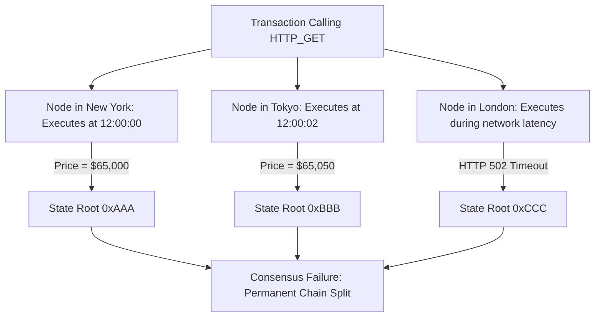
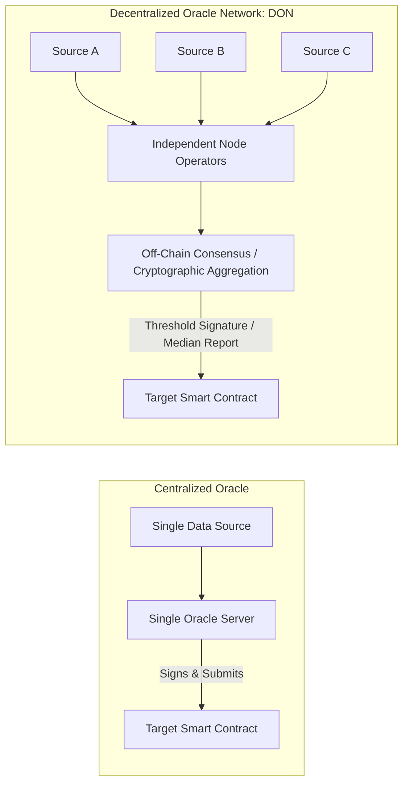

# The Oracle Problem

Blockchains are deterministic state machines.
Every node validating a block must execute the identical sequence of opcodes and arrive at the identical state root.
Because external web APIs, database servers, and physical real-world sensors are non-deterministic and dynamic, a smart contract cannot execute an HTTP request.
The inability of a blockchain to access real-world information without introducing centralized trust is the **Oracle Problem**.

## Why Smart Contracts Cannot Fetch Off-Chain Data

If a virtual machine supported an opcode like `HTTP_GET("api.exchange.com/btc_price")`, consensus would collapse:



- When Node A in New York executes the transaction, the API returns `$65,000`.
- When Node B in Tokyo executes the identical transaction two seconds later, the market price has shifted to `$65,050`.
- When Node C re-validates the block from disk three years later during initial node synchronization, the domain name has expired and the request fails with an HTTP error.
Because the inputs diverge across nodes, the resulting state roots diverge, making decentralized consensus impossible.
Therefore, all external data must be pushed into the blockchain as an explicit transaction payload signed by an external entity.

## Centralized vs. Decentralized Oracles

An oracle is any entity that queries, verifies, and submits external real-world data onto the blockchain.



### 1. Centralized Oracles

A single private server fetches data from an API and pushes it to an on-chain contract.
This approach reintroduces all the vulnerabilities that decentralized ledgers were built to eliminate:
- **Single Point of Failure:** If the server crashes, all dependent DeFi lending markets and derivatives freeze.
- **Data Tampering:** The operator can forge price feeds to liquidate competitor positions or front-run user transactions.
- **Regulatory Pressure:** A single operator can be legally compelled to alter or halt data delivery.

### 2. Decentralized Oracle Networks (DONs)

Decentralized Oracle Networks (such as Chainlink) replace single servers with multi-layered Byzantine-resilient consensus:
- **Source Diversity:** Multiple independent nodes query multiple independent, premium data aggregators.
- **Node Operator Diversity:** The network runs across geographically separated, legally distinct node operators.
- **Consensus Aggregation:** Nodes execute off-chain reporting (OCR) protocols to validate data authenticity, reach consensus on the median value, and generate an aggregated cryptographic threshold signature before submitting the result on-chain.

## Push vs. Pull Oracle Architectures

| Parameter | Push Oracles (e.g. Chainlink Data Feeds) | Pull / On-Demand Oracles (e.g. Pyth, Chainlink Data Streams) |
| :--- | :--- | :--- |
| **Delivery Model** | Nodes continuously monitor prices and push updates on-chain when triggers are met. | Prices are streamed off-chain at sub-second latency; users pull signed updates on demand. |
| **Trigger Conditions** | Deviation threshold (e.g. $0.5\%$ price change) or maximum time interval (heartbeat). | Atomic user transaction requirement (user pulls price when executing a trade or liquidation). |
| **Gas Footprint** | Paid continuously by protocol sponsors or DAO treasuries regardless of market trading volume. | Paid exclusively by the transacting user as part of their execution bundle. |
| **Data Latency** | Minutes to seconds; can lag during extreme L1 gas congestion. | Milliseconds; suited for high-frequency perpetual exchanges and options. |

## Oracle Manipulation and Flash Loan Exploits

Many DeFi exploits stem from relying on vulnerable on-chain price calculations rather than robust decentralized oracles.
The most frequent vulnerability is reading the instantaneous spot price from an Automated Market Maker (AMM) liquidity pool:

```solidity
// Vulnerable on-chain spot pricing pattern
function getPrice() public view returns (uint256) {
    return tokenA.balanceOf(pool) / tokenB.balanceOf(pool);
}
```

Because an attacker can borrow hundreds of millions of dollars of uncollateralized capital within a single transaction using a **Flash Loan**, they can manipulate AMM pool balances instantaneously:

```mermaid
sequenceDiagram
    autonumber
    actor Attacker
    participant Lending as Flash Loan Provider
    participant AMM as Uniswap V2 Pool
    participant Target as Vulnerable Lending Protocol

    Attacker->>Lending: Borrow 100M USDC via Flash Loan
    Attacker->>AMM: Dump 100M USDC for Token X (Artificially crashes USDC / Token X spot price)
    Attacker->>Target: Deposit cheap Token X as collateral
    Attacker->>Target: Borrow Maximum USDC based on manipulated spot price
    Attacker->>AMM: Swap back to restore balance
    Attacker->>Lending: Repay Flash Loan + Fee
    Note over Attacker,Target: Attacker extracts millions in profit; protocol left insolvent
```

### Mitigations: Time-Weighted Average Prices (TWAP)

To prevent single-block flash loan price manipulation, Uniswap V2 introduced the Time-Weighted Average Price (TWAP) oracle.
Instead of querying the spot price at block $t$, a TWAP measures the cumulative price over an extended time interval $[t_1, t_2]$:

$$P_{t_1, t_2} = \frac{\sum_{i=1}^{k} P_i \cdot \Delta t_i}{t_2 - t_1}$$

Because an attacker cannot hold a flash loan across multiple blocks, manipulating a 30-minute TWAP requires maintaining a distorted pool price across dozens of consecutive blocks.
Doing so exposes the attacker to massive arbitrage losses against outside trading bots, making the economic cost of manipulation exceed any potential protocol exploit profit.
