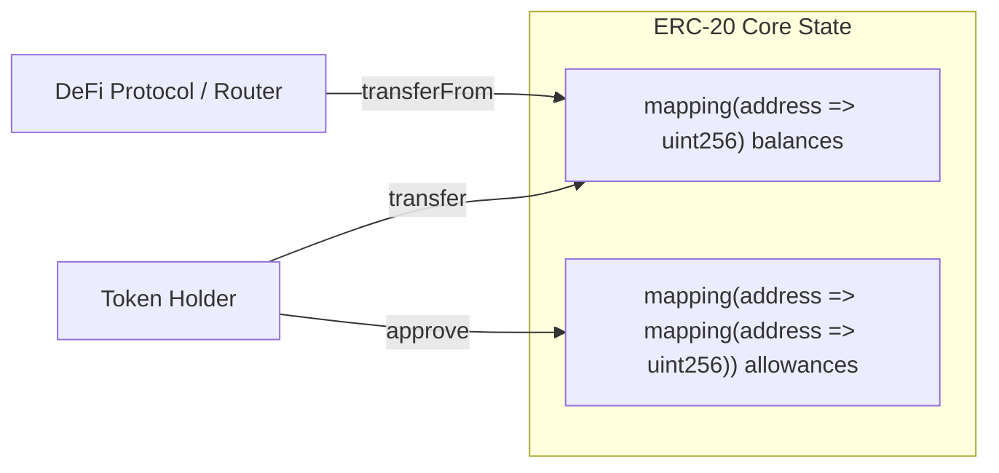
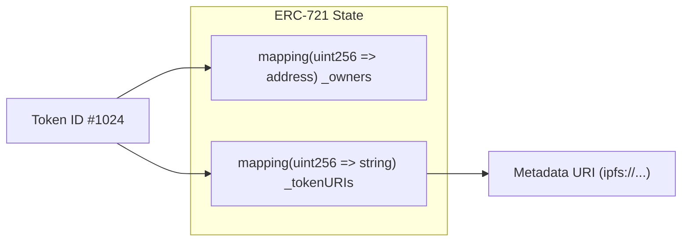
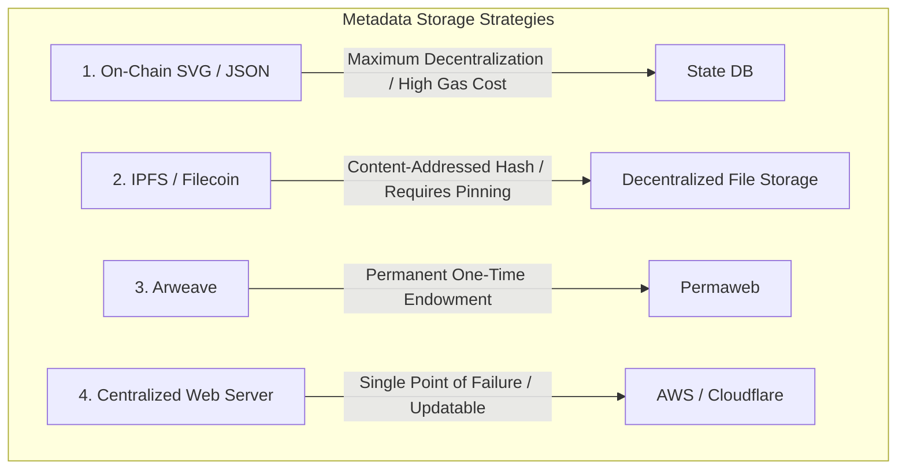

# Token Standards and Digital Ownership

Smart contracts allow developers to issue custom digital assets directly on-chain.
Without standardized interfaces, every decentralised application (dApp) would have to implement custom integration logic for every token, breaking composability.
Ethereum Request for Comment (ERC) standards define uniform application-level interfaces that allow decentralized exchanges, lending pools, and wallets to interact with any token out of the box.

## The ERC-20 Fungible Token Standard

Fabian Vogelsteller proposed ERC-20 in 2015.
It defines a standardized interface for **fungible tokens**, where every unit of the asset is identical, interchangeable, and divisible.



### Core Interface Methods

- `totalSupply() external view returns (uint256)`: Returns the aggregate circulating token supply.
- `balanceOf(address account) external view returns (uint256)`: Returns the token balance of a specific address.
- `transfer(address to, uint256 amount) external returns (bool)`: Transfers tokens directly from the caller to the destination address.
- `approve(address spender, uint256 amount) external returns (bool)`: Authorizes a third-party contract or address to spend up to `amount` on behalf of the caller.
- `transferFrom(address from, address to, uint256 amount) external returns (bool)`: Executes a transfer from an authorized allowance.
- `allowance(address owner, address spender) external view returns (uint256)`: Queries the remaining spending allowance granted to a spender.

### Gasless Approvals: EIP-2612 (Permit)

Traditional ERC-20 interactions require two consecutive on-chain transactions: an `approve()` transaction followed by a `transferFrom()` call.
EIP-2612 introduced the `permit()` method, utilizing EIP-712 structured cryptographic signatures.
Users sign an off-chain approval payload, allowing the target protocol to submit the signature and execute the token transfer atomically in a single transaction.

## The ERC-721 Non-Fungible Token Standard

William Entriken, Dieter Shirley, Jacob Evans, and Nastassia Sachs authored ERC-721 in 2018 to represent **non-fungible tokens (NFTs)**.
Every ERC-721 token is globally unique, non-interchangeable, and identified by an explicit `uint256 tokenId`.



### Core Interface Methods

- `ownerOf(uint256 tokenId) external view returns (address)`: Returns the current owner address of a specific token identifier.
- `safeTransferFrom(address from, address to, uint256 tokenId)`: Transfers ownership and verifies that the recipient contract implements `IERC721Receiver.onERC721Received` to prevent permanent token loss.
- `tokenURI(uint256 tokenId) external view returns (string)`: Returns the Uniform Resource Identifier pointing to the token's off-chain or on-chain metadata schema.

## The ERC-1155 Multi-Token Standard

Witek Radomski introduced ERC-1155 in 2018 to resolve efficiency bottlenecks in gaming environments where a user might hold thousands of fungible items (e.g. gold coins) alongside distinct unique items (e.g. legendary weapons).

Rather than deploying a separate smart contract for each asset class, an ERC-1155 contract manages an arbitrary number of token types within a single contract instance:

- **Unified Balances:** A single nested mapping tracks balances across all token identifiers:
  ```solidity
  mapping(uint256 => mapping(address => uint256)) internal _balances;
  ```
- **Batch Operations:** Supports native batch transfers (`safeBatchTransferFrom`), allowing multiple distinct token types and quantities to transfer in a single transaction, reducing gas costs by up to 80 percent compared to sequential ERC-721 transfers.

## Metadata Storage Architectures

Token value and visual utility often depend on external metadata (images, trait attributes, audio).
Where this metadata is stored determines the censorship resistance and longevity of the asset.



### 1. On-Chain Storage

Metadata and vector graphics (SVGs) are generated dynamically using Solidity code and encoded directly into base64 data URIs stored in contract state.
- **Advantages:** Guaranteed immutability; exists as long as the underlying blockchain exists.
- **Disadvantages:** Extreme gas costs for deployment and storage.

### 2. InterPlanetary File System (IPFS)

Files are addressed cryptographically by their cryptographic content identifier (CID):
`ipfs://QmXoypizjW3WknFiJnKLwHCnL72vedxjQkDDP1mXWo6uco/`
- **Advantages:** Content addressing guarantees that the file contents cannot be altered without changing the URI.
- **Disadvantages:** Requires dedicated pinning services (such as Filecoin, Pinata, or local nodes) to ensure long-term data persistence.

### 3. Centralized HTTP Servers

The token points to a standard Web2 endpoint: `https://api.project.com/metadata/1.json`.
- **Advantages:** Zero gas costs and instant asset updates.
- **Disadvantages:** The domain owner can change the metadata at will, shut down the server, or alter images after sale, breaking ownership guarantees.

## Token Standards Comparison

| Dimension | ERC-20 | ERC-721 | ERC-1155 |
| :--- | :--- | :--- | :--- |
| **Asset Nature** | Fungible (Indivisible units) | Non-Fungible (Unique IDs) | Multi-Token (Fungible, Semi-Fungible, Non-Fungible) |
| **Contract Deployment** | One contract per asset type | One contract per collection | One contract for multiple asset collections |
| **Identifier Tracking** | Tracks balance per address | Tracks owner per `tokenId` | Tracks balance per `(tokenId, address)` |
| **Batch Transfers** | Unsupported natively | Unsupported natively | Native `safeBatchTransferFrom` |
| **Primary Use Cases** | Stablecoins, Governance, Utility | Digital Art, Real-World Assets | Web3 Gaming, In-Game Items, Fractional Bundles |
