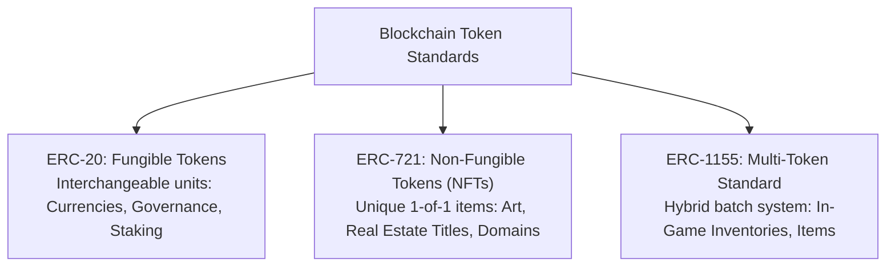
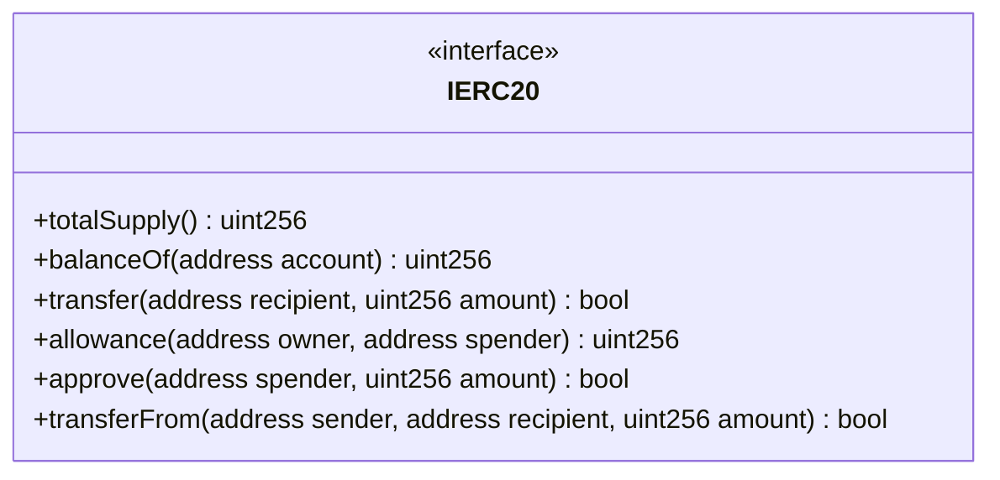
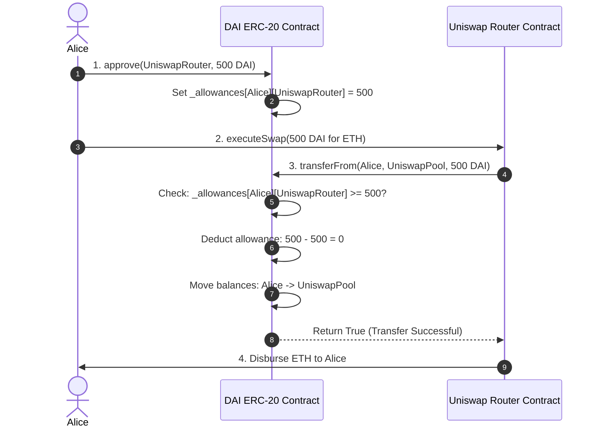
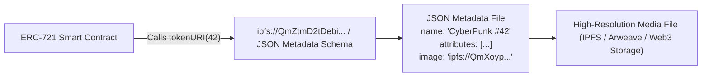
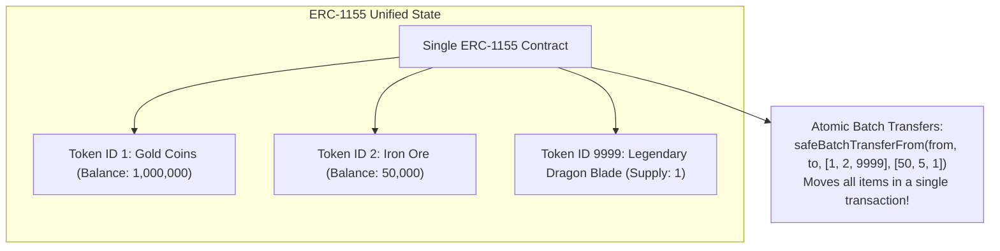

# Token Standards and Digital Ownership

Before the invention of programmable blockchains, digital ownership was fundamentally illusory.
When you "bought" an ebook on Amazon Kindle, a song on iTunes, or an in-game skin in a multiplayer video game, you did not own a digital asset.
You were granted a revocable, conditional software license stored in a private corporate database.
If the company went bankrupt, shut down its servers, or banned your account, your digital property evaporated overnight.

Ethereum and smart contracts transformed digital property into an autonomous mathematical reality.
On a blockchain, digital ownership is enforced not by corporate terms of service, but by self-executing code operating on a neutral, permissionless ledger.

However, if every developer who wanted to launch a token wrote arbitrary, custom function names:
- Developer A writes: `transferMoney(address to, uint256 amount)`
- Developer B writes: `sendCoins(address receiver, uint256 val)`
- Developer C writes: `pay(uint256 tokens, address destination)`

No decentralized exchange (DEX), wallet, or block explorer could interact with these assets without writing custom integration code for every single token on Earth.
To establish global composability, the Ethereum community created **Token Standards** through the Ethereum Improvement Proposal (EIP) process.

## The Triad of Standardized Digital Assets

Modern decentralized ecosystems are powered by three foundational token standards:



Let us dissect the technical architecture, internal data structures, and edge cases of each standard.

## Deep Dive: The ERC-20 Fungible Token Standard

Proposed by Fabian Vogelsteller and Vitalik Buterin in November 2015, **ERC-20** defined the universal blueprint for **fungible assets**.
"Fungible" means that every individual unit of the token is identical, interchangeable, and indistinguishable from any other unit.
One USDC in your wallet has the exact same economic utility and market value as any other USDC in existence.

### The Internal Data Structures

At its core, an ERC-20 smart contract is essentially a glorified spreadsheet implemented as two persistent Solidity mappings:

```solidity
// 1. Account Balances: Maps an address to its current token balance
mapping(address => uint256) private _balances;

// 2. Allowances: Maps an owner to an authorized spender and spending cap
mapping(address => mapping(address => uint256)) private _allowances;
```

### The Core Interface Functions

The ERC-20 standard mandates six essential functions and two event logs:



1. **`totalSupply()`:** Returns the total circulating token supply.
2. **`balanceOf(address account)`:** Returns the token balance of a specific address by reading `_balances[account]`.
3. **`transfer(address recipient, uint256 amount)`:**
   - Directly moves tokens from `msg.sender` to `recipient`.
   - Decrements `_balances[msg.sender]` and increments `_balances[recipient]`.
   - Emits a `Transfer(msg.sender, recipient, amount)` event.

### The Two-Step Allowance Mechanism: `approve` and `transferFrom`

A direct `transfer()` works when a human transfers tokens to a friend.
However, smart contracts cannot "pull" tokens from your wallet autonomously.
If you deposit $1,000 in DAI into an Aave lending pool or Uniswap liquidity pool, the target smart contract cannot reach into your wallet and take your funds without your explicit cryptographic authorization.

To enable trustless protocol interactions, ERC-20 introduced the **Allowance Pattern**:



1. **Step 1 (`approve`):** Alice broadcasts a transaction calling `approve(UniswapRouter, 500)`.
   The token contract updates its nested allowance mapping:
   $$\_allowances[\text{Alice}][\text{UniswapRouter}] \leftarrow 500$$
2. **Step 2 (`transferFrom`):** Alice calls Uniswap's swap function.
   Inside its execution logic, Uniswap calls `transferFrom(Alice, PoolAddress, 500)` on the DAI contract.
   The DAI contract checks if Uniswap's authorized allowance is sufficient, decrements the allowance to zero, and transfers the tokens.

### EIP-2612: Gasless Approvals via Off-Chain Signatures (`permit`)

The traditional `approve` + `transferFrom` workflow requires **two sequential transactions**, forcing the user to pay gas twice and wait for two separate block confirmations.

In 2020, **EIP-2612** introduced the **`permit()`** extension using EIP-712 typed structured data hashing:
- The user signs an off-chain message specifying the spender, amount, nonce, and deadline.
- The user transmits the $(v, r, s)$ signature bytes directly to the application.
- The application submits the permit signature and the swap call in a **single atomic transaction**, saving gas and enabling gasless account experiences.

## Deep Dive: The ERC-721 Non-Fungible Token (NFT) Standard

While ERC-20 standardizes fungible commodities, the real world is filled with unique, non-interchangeable assets: real estate land deeds, physical artwork, concert tickets, and identity credentials.
In January 2018, William Entriken, Dieter Shirley, Jacob Evans, and Nastassia Sachs introduced **ERC-721**, establishing the standard for **Non-Fungible Tokens (NFTs)**.

In ERC-721:
- Every individual token is uniquely identified by an unsigned 256-bit integer: **`tokenId`**.
- Within a given contract, no two tokens share the same ID:
  $$\text{Token Identifier} = (\text{ContractAddress}, \text{tokenId})$$

### The Internal Data Structures

```solidity
// Maps an individual unique tokenId to its current owner address
mapping(uint256 => address) private _owners;

// Maps an owner address to their total count of owned NFTs
mapping(address => uint256) private _balances;

// Maps a specific tokenId to an approved operator address
mapping(uint256 => address) private _tokenApprovals;

// Maps an owner to an operator approved to manage ALL their tokens
mapping(address => mapping(address => bool)) private _operatorApprovals;
```

### Safe Transfers: The Reentrancy and Black Hole Guard

ERC-721 introduces `safeTransferFrom(address from, address to, uint256 tokenId)`:
If the recipient `to` is a smart contract, `safeTransferFrom` executes a safety check:
- It invokes the `onERC721Received()` hook on the destination contract.
- If the destination contract does not implement the official `IERC721Receiver` interface, the entire transaction reverts.
- **Why?** If a user accidentally sends an NFT to a smart contract that was never programmed to handle NFTs, the token would be permanently trapped inside that contract address forever (a "black hole"). Safe transfers protect users from accidental asset destruction.

### The Metadata Architecture: On-Chain vs. Off-Chain Storage

An NFT smart contract does not store heavy image, video, or audio files on-chain.
Storing a 5-megabyte JPEG file in Ethereum persistent storage would cost hundreds of thousands of dollars in gas!

Instead, the contract stores a lightweight string pointer accessed via the **`tokenURI(uint256 tokenId)`** function:



#### Metadata Storage Architectures:
1. **Centralized HTTP URLs (High Risk):**
   Points to an AWS S3 bucket: `https://api.myproject.com/metadata/42.json`.
   If the company stops paying its AWS bill, the image disappears, leaving the NFT holder with a broken link.
2. **Decentralized Content Addressing (IPFS / Arweave - Industry Best Practice):**
   Points to an immutable cryptographic content identifier (CID): `ipfs://Qm...`.
   The file is identified by its hash digest; the content can never be silently swapped or modified by the creator.
3. **100% On-Chain SVGs (Maximum Permanence):**
   The contract dynamically generates scalable vector graphic (SVG) code mathematically from contract storage slots (used by Uniswap V3 LP positions and OnChainChain).
   The asset lives directly in the Ethereum state machine for eternity.

## Deep Dive: The ERC-1155 Multi-Token Standard

Engineered by Witek Radomski and the Enjin team in 2018, **ERC-1155** was designed to solve severe inefficiencies in blockchain gaming and complex decentralized protocols.

### The Problem with ERC-20 and ERC-721 in Gaming

Consider a blockchain role-playing game (RPG) containing:
- 10,000 unique swords and shields (NFTs).
- 5,000,000 gold coins (fungible currency).
- 500,000 wooden arrows and health potions (semi-fungible consumables).

Under legacy standards:
- The developer would have to deploy hundreds of separate smart contracts.
- If a player crafts an armor set requiring 100 gold coins, 5 iron ingots, and a magic gem, the player must execute **three separate transactions**, paying separate gas fees for each asset.

### The ERC-1155 Multi-Token Breakthrough

ERC-1155 consolidates an infinite number of fungible, non-fungible, and semi-fungible tokens inside a **single smart contract deployment**:

```solidity
// Single nested mapping tracks ALL token IDs and ALL account balances!
mapping(uint256 => mapping(address => uint256)) private _balances;
```



- If `totalSupply(id) == 1`, the token behaves identically to an ERC-721 NFT.
- If `totalSupply(id) > 1`, the token behaves as a fungible commodity.
- **Atomic Batch Operations:** With `safeBatchTransferFrom()`, a user can transfer dozens of different asset types to another player in a single atomic transaction, saving up to 80 percent in gas overhead compared to ERC-721.

## Comprehensive Comparison Matrix

| Architectural Dimension | ERC-20 (Fungible) | ERC-721 (Non-Fungible) | ERC-1155 (Multi-Token) |
| :--- | :--- | :--- | :--- |
| **Asset Nature** | Strictly interchangeable units | Strictly unique 1-of-1 items | Hybrid (Fungible, semi-fungible, NFT) |
| **State Mapping** | `address => uint256` | `uint256 => address` | `uint256 => (address => uint256)` |
| **Token Identifier** | Contract address alone | Contract address + `tokenId` | Contract address + `tokenId` |
| **Batch Transfers** | No (requires loop / external multicall) | No (1 transaction per NFT) | **Yes:** Native `safeBatchTransferFrom()` |
| **Contract Overhead** | 1 contract per token type | 1 contract per collection | 1 single contract for thousands of tokens |
| **Typical Use Cases** | Stablecoins (USDC), governance (UNI) | Digital art, real estate, ENS domains | Game items, inventory systems, financial tickets |
