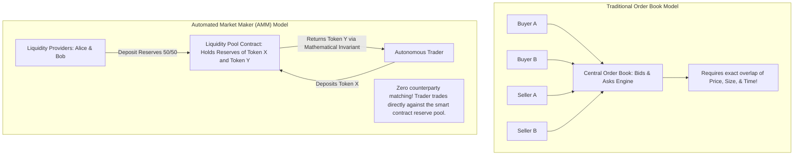
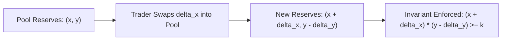
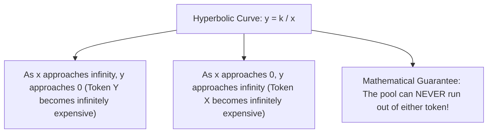
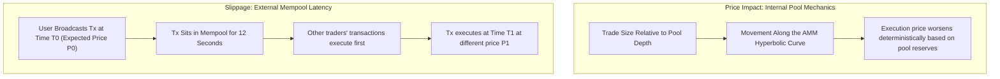
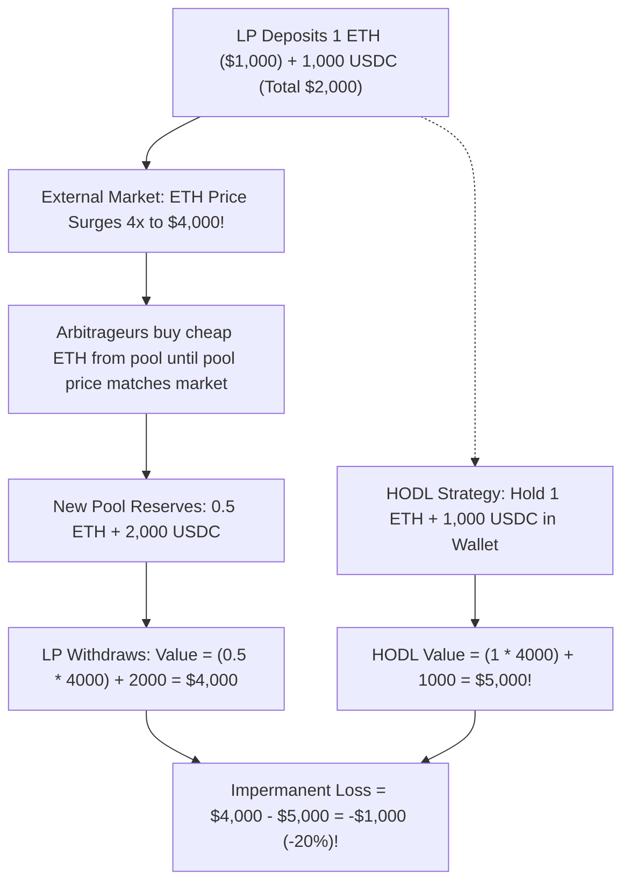
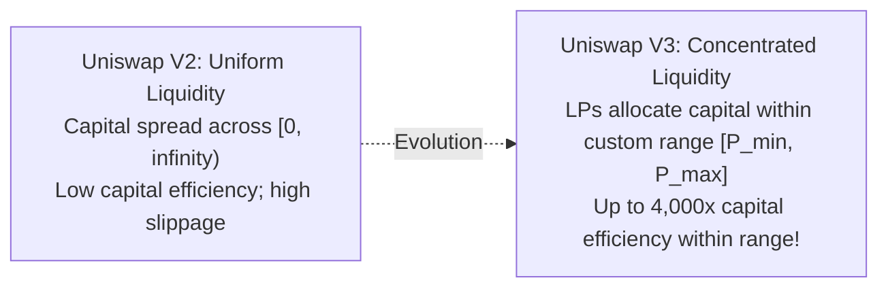

# Automated Market Makers and Liquidity Pools

In traditional finance, trading assets relies on the **Central Limit Order Book (CLOB)**.
Every stock exchange (such as the New York Stock Exchange or NASDAQ) and centralized cryptocurrency exchange (such as Binance or Coinbase) maintains a continuous ledger of bids (buyers) and asks (sellers) sorted by price and time.
Professional institutional firms called **market makers** continuously post orders on both sides of the book, capturing the bid-ask spread and providing liquidity to retail traders.

When developers attempted to deploy traditional order books onto Ethereum in 2016 and 2017 (such as EtherDelta), the model broke down completely:
- Every order placement, order cancellation, and price adjustment requires broadcasting an on-chain transaction.
- On a blockchain with 12-second block intervals and volatile gas fees, market makers could not adjust orders fast enough to avoid being front-run by latency arbitrageurs.
- The high gas costs of placing and canceling thousands of orders per day bankrupted liquidity providers.

The breakthrough that unlocked decentralized finance (DeFi) was the invention of the **Automated Market Maker (AMM)** and **Liquidity Pools**, pioneered by Hayden Adams and **Uniswap**.

## The Conceptual Shift: Order Books vs. Liquidity Pools

Instead of matching individual buyers with individual sellers via an order book, an AMM replaces counterparty matching with an autonomous mathematical formula operating over a pooled reserve of capital:

In an AMM:
- **No Order Book:** There are no active bids, asks, or order cancellations.
- **Pooled Reserves:** Passive investors called **Liquidity Providers (LPs)** deposit equal values of two tokens into a shared smart contract reserve pool.
- **Autonomous Counterparty:** When a trader wants to swap Token X for Token Y, they do not wait for another human to sell Token Y.
  The trader deposits Token X directly into the smart contract pool and withdraws Token Y according to a deterministic mathematical formula.

## The Constant Product Invariant: $x \cdot y = k$

Uniswap V2 is governed by one of the most famous equations in computer science: the **Constant Product Market Maker (CPMM)** formula:

$$x \cdot y = k$$

where:
- $x$ represents the total balance reserve of Token X held in the pool smart contract.
- $y$ represents the total balance reserve of Token Y held in the pool smart contract.
- $k$ is a fixed invariant constant that must remain unchanged during a trade (ignoring trading fees).

### The Hyperbolic Price Curve

Plotted on a Cartesian coordinate plane, $x \cdot y = k$ traces a smooth, asymptotic hyperbola:

Because the curve never touches either the horizontal or vertical axis ($x > 0$ and $y > 0$ for all finite trades), an AMM pool **can never completely run out of liquidity**.
As a trader drains more of Token Y from the pool, the marginal cost of Token Y rises asymptotically, becoming infinitely expensive before the reserve reaches zero.

## Deriving the Swap Equation with Trading Fees

Let us walk through the exact mathematical derivation of a trade on Uniswap V2, including the standard **0.30 percent trading fee** ($\gamma = 0.997$ or $99.7\%$ multiplier).

Suppose a trader wants to deposit $\Delta x$ tokens into the pool to purchase $\Delta y$ tokens:
1. The initial pool state satisfies:
   $$x \cdot y = k$$
2. A 0.3% fee is deducted from the input amount:
   $$\Delta x_{\text{effective}} = \Delta x \times (1 - \text{fee}) = 0.997 \cdot \Delta x$$
3. After the swap, the new reserves must satisfy the invariant:
   $$(x + 0.997 \cdot \Delta x)(y - \Delta y) = k$$
4. Since $k = x \cdot y$, substitute:
   $$(x + 0.997 \cdot \Delta x)(y - \Delta y) = x \cdot y$$
5. Solve for the output amount $\Delta y$:
   $$y - \Delta y = \frac{x \cdot y}{x + 0.997 \cdot \Delta x}$$
   $$\Delta y = y - \frac{x \cdot y}{x + 0.997 \cdot \Delta x}$$
   $$\Delta y = \frac{y(x + 0.997 \cdot \Delta x) - x \cdot y}{x + 0.997 \cdot \Delta x}$$

$$\Delta y = \frac{0.997 \cdot \Delta x \cdot y}{x + 0.997 \cdot \Delta x}$$

This compact formula is executed on-chain by the Uniswap pair contract in every single swap.

### Concrete Numerical Walkthrough

Let us ground this equation in a realistic scenario:

Suppose a Uniswap pool contains:
- Reserve of Token X (ETH): $x = 100 \text{ ETH}$
- Reserve of Token Y (USDC): $y = 300,000 \text{ USDC}$
- Spot price: $\frac{300,000}{100} = \$3,000 \text{ per ETH}$
- Constant $k = 100 \times 300,000 = 30,000,000$

Alice wants to sell **$10 \text{ ETH}$** ($\Delta x = 10$) into the pool.
How much USDC ($\Delta y$) will she receive?

1. Apply the 0.3% fee:
   $$0.997 \times 10 = 9.97 \text{ ETH}$$
2. Calculate the denominator:
   $$x + 0.997 \cdot \Delta x = 100 + 9.97 = 109.97$$
3. Calculate the numerator:
   $$9.97 \times 300,000 = 2,991,000$$
4. Compute the output $\Delta y$:
   $$\Delta y = \frac{2,991,000}{109.97} \approx 27,198.32 \text{ USDC}$$

Notice the result:
At the spot price of $3,000/ETH, Alice might have expected $10 \times 3,000 = \$30,000$.
However, she received only **$27,198.32 USDC** (an average execution price of $\$2,719.83$ per ETH).
Why did Alice receive nearly $2,800 less than the spot price?
Because of **Price Impact**.

## Slippage vs. Price Impact

Traders frequently confuse slippage and price impact.
They describe fundamentally different phenomena:

- **Price Impact:** The deterministic shift in price caused directly by your own trade moving the reserve ratio along the $x \cdot y = k$ curve.
  A large trade relative to the pool's total reserves causes massive price impact.
- **Slippage:** The difference between the price you expected when you clicked "Swap" in your wallet and the actual price executed when your transaction was finally mined into a block, caused by other users' transactions executing before yours in the mempool.

## Liquidity Provision and LP Share Tokens

Where does the initial capital in an AMM come from?
Independent Liquidity Providers (LPs) deposit capital into the pool.

When an LP deposits both tokens, the smart contract mints specialized **ERC-20 LP Tokens** that represent their proportional claim on the pool's assets.

### Minting LP Shares: The Geometric Mean

When the very first liquidity provider initializes a pool with $x_0$ of Token X and $y_0$ of Token Y, the initial LP share supply $S_{\text{minted}}$ is calculated using the geometric mean:

$$S_{\text{minted}} = \sqrt{x_0 \cdot y_0} - 1,000$$

- **The Minimum Liquidity Burn (1,000 Wei):** Uniswap V2 permanently burns the first $1,000$ share units by sending them to address `0x000...000`.
  This prevents the "First Depositor Inflation Attack," where an attacker manipulates the share price of an empty pool to steal subsequent deposits through integer rounding truncation.

For subsequent deposits, LP shares are minted in strict proportion to existing reserves:

$$S_{\text{minted}} = \min\left( \frac{\Delta x}{x} \cdot S_{\text{total}}, \frac{\Delta y}{y} \cdot S_{\text{total}} \right)$$

When an LP wants to withdraw their funds, they burn their LP tokens back to the contract and receive their proportional share of the current reserves plus all accumulated 0.3% trading fees.

## Impermanent Loss: The Liquidity Provider's Cost

Providing liquidity is not risk-free.
Liquidity providers face a specific mathematical risk called **Impermanent Loss (IL)**.

### The Impermanent Loss Formula

Impermanent loss measures the difference in total portfolio value between **providing liquidity to an AMM pool** versus **simply holding the identical tokens in your personal wallet**.

Let $k$ be the price ratio change between the two tokens ($r = \frac{P_{\text{new}}}{P_{\text{old}}}$).
The impermanent loss fraction is derived as:

$$\text{IL}(r) = \frac{2\sqrt{r}}{1 + r} - 1$$

| Price Change Ratio ($r$) | Percentage Price Shift | Impermanent Loss Percentage |
| :--- | :--- | :--- |
| **$1.25\times$** | $+25\%$ | **$-0.6\%$** |
| **$1.50\times$** | $+50\%$ | **$-2.0\%$** |
| **$2.00\times$** | $+100\%$ (2x price increase) | **$-5.7\%$** |
| **$3.00\times$** | $+200\%$ (3x price increase) | **$-13.4\%$** |
| **$4.00\times$** | $+300\%$ (4x price increase) | **$-20.0\%$** |
| **$5.00\times$** | $+400\%$ (5x price increase) | **$-25.5\%$** |

### Why is it Called "Impermanent"?

The loss is termed "impermanent" because if the relative price of the two tokens returns to its exact original ratio when you deposited, the loss completely disappears!
However, if an LP withdraws their capital while prices are divergent, the loss is realized permanently.
For liquidity provision to be profitable, the cumulative 0.3% trading fees earned by the pool must exceed the impermanent loss incurred from price divergence.

## Evolution: Uniswap V3 Concentrated Liquidity

In Uniswap V2, liquidity is spread uniformly across the entire price curve from zero to infinity ($[0, \infty)$).
In an ETH/USDC pool where ETH trades between $2,500 and $3,500:
- Over **90 percent of the pooled capital** sits idle in extreme ranges (waiting for ETH to trade at $1 or $1,000,000), earning zero fees.
- Capital efficiency is extraordinarily low.

In May 2021, Uniswap launched **Uniswap V3**, introducing **Concentrated Liquidity**:

- **Custom Price Ranges (Ticks):** LPs choose specific minimum and maximum price boundaries ($[P_{\text{lower}}, P_{\text{upper}}]$) for their capital.
- **Extreme Capital Efficiency:** Within that narrow price band, an LP's capital provides up to **4,000 times higher liquidity depth** than Uniswap V2, generating drastically higher fee yields with smaller capital outlays.
- **NFT LP Positions:** Because every LP can select custom price ranges, LP positions are no longer fungible.
  Uniswap V3 represents LP positions as unique **ERC-721 NFTs** containing the specific tick range coordinates.
- **Range Risk:** If the market price moves outside an LP's specified range, their position converts 100 percent into the depreciating asset and stops earning all trading fees until the price moves back into range.
