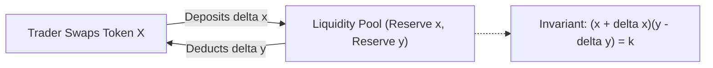
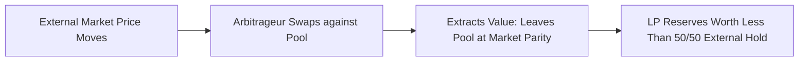

# Automated Market Makers and Liquidity Pools

Traditional financial exchanges rely on Central Limit Order Books (CLOBs).
Market makers maintain active queues of buy and sell orders, and matching engines execute trades whenever bid and ask prices cross.
On public blockchains, placing, updating, and canceling limit orders on-chain incurs unsustainable gas fees and latency bottlenecks.
Automated Market Makers (AMMs) replace peer-to-peer order books with peer-to-pool algorithmic pricing.

## The Constant Product Invariant

Vitalik Buterin conceptualized the decentralized AMM, and Hayden Adams formalized it with Uniswap in 2018.
The protocol pools two tokens (Token X and Token Y) in a smart contract and prices them according to the **Constant Product Formula**:

$$x \cdot y = k$$

where:
- $x$ is the reserve balance of Token X.
- $y$ is the reserve balance of Token Y.
- $k$ is the invariant product of the pool reserves.



The instantaneous spot price of Token X in terms of Token Y is the marginal derivative of the invariant curve:

$$P_x = -\frac{dy}{dx} = \frac{y}{x}$$

## The Swap Equation with Protocol Fees

When a user trades $\Delta x$ tokens into the pool, a fee is deducted (typically $f = 0.3\%$ in Uniswap V2, meaning the fee multiplier is $\gamma = 1 - 0.003 = 0.997$).
The invariant must be preserved after accounting for the deposited amount:

$$\big(x + \gamma \Delta x\big) \big(y - \Delta y\big) = k$$

Solving for the output amount $\Delta y$ yielded to the trader:

$$\Delta y = \frac{y \cdot \gamma \Delta x}{x + \gamma \Delta x}$$

Because the pool fee increases $k$ slightly on each trade, liquidity providers earn cumulative interest on their proportional pool ownership.

## Price Impact and Slippage

In order-book systems, price changes stepwise as order levels are cleared.
In an AMM, price changes continuously along the hyperbolic invariant curve:

- **Price Impact:** The degradation in execution price caused by the trade itself. As the input amount $\Delta x$ increases relative to total reserves $x$, the marginal price moves against the trader, yielding fewer output tokens per input unit.
- **Slippage:** The difference between the expected execution price when a transaction is broadcast and the actual execution price when the transaction is mined into a block.
  Slippage occurs when other transactions in the mempool execute before the user's transaction.
  Clients specify a maximum slippage tolerance (e.g. $0.5\%$); if the realized output falls below this threshold, the contract invokes `revert()`.

```mermaid
flowchart TD
    subgraph Constant Product Curve x * y = k
        A["Current State: (x0, y0)"] -->|Deposit Delta X| B["New State: (x1, y1)"]
        B -->|Resulting Price Shift| C["Higher Cost Per Token Y"]
    end
```

## Liquidity Provider (LP) Shares

Liquidity providers (LPs) supply both Token X and Token Y into the pool at the prevailing ratio $\frac{y}{x}$.
In exchange, the contract mints fungible ERC-20 **LP tokens** representing fractional claims on the underlying reserves.

When depositing initial reserves ($x_0, y_0$), the minted LP shares equal the geometric mean:

$$S_{\text{initial}} = \sqrt{x_0 \cdot y_0} - 1000$$

where 1,000 shares are permanently burned to the zero address to prevent minimum-liquidity inflation attacks.
For subsequent deposits, minted shares scale proportionally with reserve additions:

$$S_{\text{minted}} = \min\left( \frac{\Delta x}{x} \cdot S_{\text{total}}, \; \frac{\Delta y}{y} \cdot S_{\text{total}} \right)$$

When an LP burns their shares, the contract returns their exact proportional share of both reserve balances, including all accumulated trading fees.

## Impermanent Loss (Divergence Loss)

Supplying liquidity to an AMM exposes LPs to **Impermanent Loss**.
Impermanent loss is the opportunity cost of depositing tokens into an AMM compared to simply holding the identical assets in a private wallet.

When the external market price of an asset diverges from the price inside the pool, external arbitrageurs execute swaps against the pool to align the pool's ratio with global market prices.
Arbitrageurs extract value from the pool, leaving LPs with more of the depreciating asset and less of the appreciating asset.



### Mathematical Derivation

Let $r = \frac{P_{\text{new}}}{P_{\text{initial}}}$ be the price ratio multiplier.
The value of the LP position relative to holding outside the pool is expressed as:

$$\text{IL}(r) = \frac{2 \sqrt{r}}{1 + r} - 1$$

The loss is symmetric: any divergence in price (whether the asset increases or decreases relative to the other) results in an impairment:

| Price Ratio ($r$) | Direction | Impermanent Loss |
| :--- | :--- | :--- |
| **$1.25\times$** | $+25\%$ or $-20\%$ | $-0.6\%$ |
| **$1.50\times$** | $+50\%$ or $-33\%$ | $-2.0\%$ |
| **$2.00\times$** | $+100\%$ or $-50\%$ | $-5.7\%$ |
| **$3.00\times$** | $+200\%$ or $-67\%$ | $-13.4\%$ |
| **$5.00\times$** | $+400\%$ or $-80\%$ | $-25.5\%$ |

The loss is termed "impermanent" because if the relative prices return to their initial ratio, the loss disappears.
However, if an LP withdraws reserves while prices remain divergent, the loss becomes permanently realized.
LPs remain profitable only if cumulative trading fee revenues exceed the realized impermanent loss.

## Concentrated Liquidity (Uniswap V3)

In Uniswap V2, liquidity is distributed across the entire infinite price spectrum from $0$ to $\infty$.
Because most trading occurs within a narrow price band, over 99 percent of deposited capital sits idle in reserve.

Uniswap V3 introduced **Concentrated Liquidity**.
LPs select specific price intervals $[p_a, p_b]$ within which their capital is active:
- **Capital Efficiency:** LPs achieve up to $4,000\times$ higher capital efficiency within tight bands, generating significantly higher fee yields per dollar deposited.
- **Non-Fungible Positions:** Because each LP can specify arbitrary custom price bounds, LP positions cannot be represented as fungible ERC-20 tokens; they are minted as unique ERC-721 NFTs.
- **Range Risk:** If market price moves outside an LP's chosen range $[p_a, p_b]$, the position is completely converted into the depreciated asset and ceases earning all trading fees until the market returns within range.
