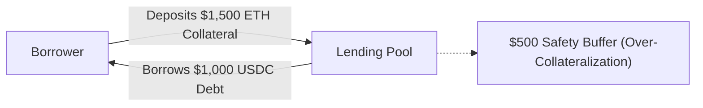
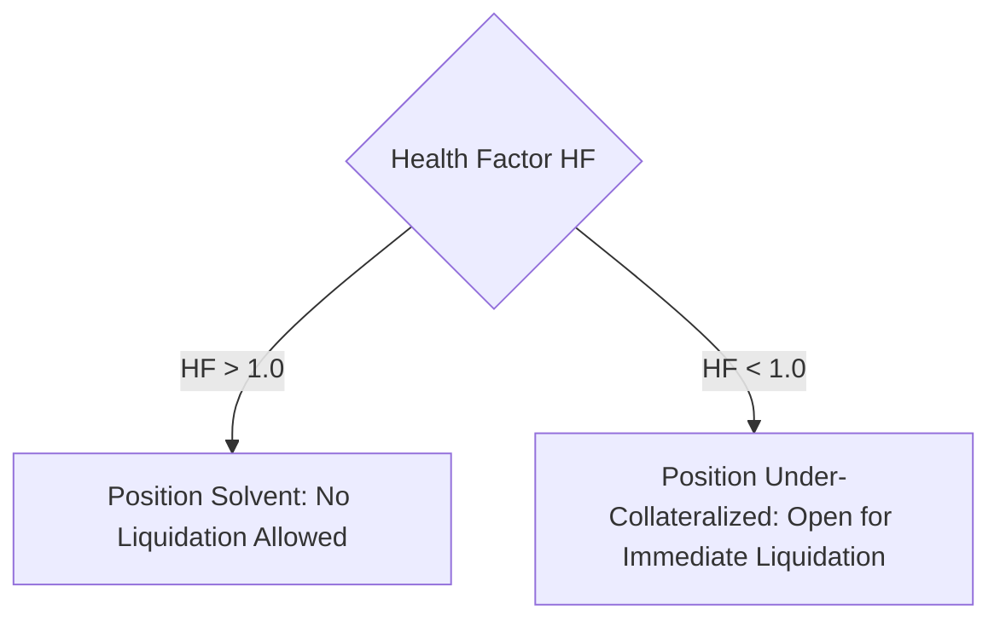
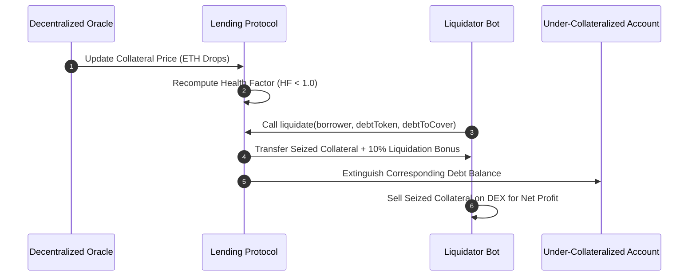
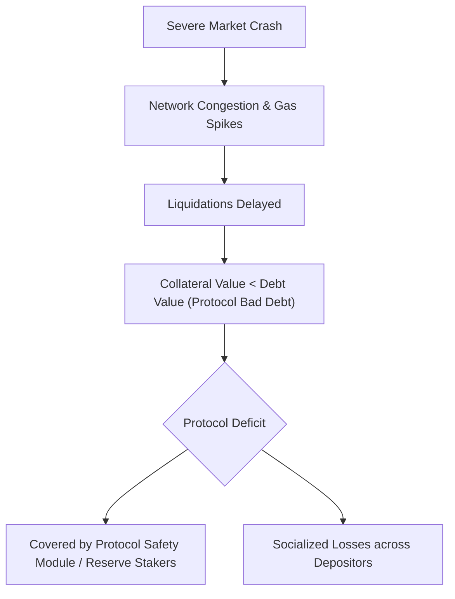
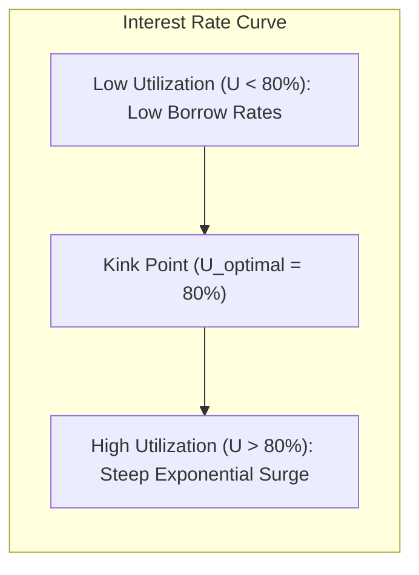

# Collateralized Lending and Protocol Solvency

Traditional credit markets rely on identity verification, credit scores, and legal enforcement systems to underwrite unsecured or under-collateralized loans.
If a debtor defaults, courts and collections agencies seize real-world assets.
Public blockchains operate without identity registries or legal recourse.
To remain solvent in a pseudonymous, permissionless environment, decentralized money markets rely strictly on **over-collateralized lending** and automated programmatic liquidations.

## Over-Collateralization Architecture

In protocols such as Aave, Compound, and MakerDAO, a borrower must deposit collateral worth significantly more than the value of the debt they wish to draw.
The surplus collateral acts as an economic buffer against market volatility.

### Core Risk Parameters

Protocols mathematically define borrowing limits and solvency margins using four parameters:

- **Loan-to-Value (LTV):** The maximum borrowing capacity granted upon depositing collateral. If ETH has an LTV of $80\%$, depositing $\$1,000$ of ETH allows the user to borrow up to $\$800$ of another asset.
- **Liquidation Threshold ($LT$):** The critical collateralization percentage where a loan is flagged as dangerously under-collateralized ($LT > \text{LTV}$). For example, an $LT$ of $85\%$ means the position becomes liquidatable when debt reaches $85\%$ of collateral value.
- **Liquidation Penalty / Bonus:** A percentage discount on collateral granted to third-party liquidators (typically $5\%$ to $10\%$) to incentivize rapid liquidation.
- **Close Factor:** The maximum percentage of outstanding debt that a liquidator can repay in a single transaction (often capped at $50\%$).

## The Health Factor Metric

Lending protocols track the solvency of every active account using a normalized scalar termed the **Health Factor ($HF$)**:

$$HF = \frac{\sum_i \big(\text{Collateral}_i \cdot P_i \cdot LT_i\big)}{\sum_j \big(\text{Debt}_j \cdot P_j\big)}$$

where $P_i$ and $P_j$ are the asset prices provided by decentralized oracles.

- If $HF > 1$, the position is considered safe. Collateral safely covers outstanding debt.
- If $HF < 1$, the position breaches safety margins. Any participant in the network can execute a liquidation against the borrower's position.

## Liquidation Mechanics

Liquidations in DeFi are not executed by the protocol core itself.
They are executed by competitive, automated third-party bots (liquidators) monitoring on-chain oracle updates and mempool transactions.

1. The oracle reports a drop in the borrower's collateral asset price, driving $HF$ below $1.0$.
2. The liquidator invokes the `liquidationCall()` method, repaying up to the close factor amount of the borrower's outstanding debt using their own funds.
3. In exchange, the lending contract seizes the borrower's collateral equal to the repaid debt value **plus** the liquidation bonus.
4. The liquidator immediately swaps the seized collateral on an AMM to lock in arbitrage profit, restoring the protocol to a safe collateralization ratio.

## Bad Debt and Protocol Insolvency

If the market price of a collateral asset crashes faster than liquidators can process transactions, or if high gas spikes congest the network, collateral value can fall below total debt ($HF < 1$ with collateral $< \text{debt}$).

When this occurs, liquidators have no economic incentive to step in because repaying the debt yields collateral worth less than the payment.
The remaining deficit is termed **Bad Debt**.
To absorb bad debt without bankrupting depositors, mature protocols maintain safety modules:
- **Aave Safety Module:** Stakers lock AAVE/ETH tokens to backstop insolvency, absorbing up to 30 percent of bad debt during shortfall events.
- **MakerDAO Debt Auction:** The protocol mints and auctions fresh MKR tokens to the open market to recapitalize the system back to parity.

## Dynamic Interest Rate Models

Interest rates in decentralized money markets are calculated algorithmically based on capital supply and demand.
The core metric is the **Utilization Rate ($U$)**:

$$U = \frac{\text{Total Borrows}}{\text{Total Cash Reserves} + \text{Total Borrows}}$$

Protocols use a piecewise linear (kinked) interest rate model to manage liquidity:

- When $U < U_{\text{optimal}}$ (below the kink, e.g. 80%), interest rates rise gradually to encourage borrowing.
- When $U > U_{\text{optimal}}$, borrow rates spike exponentially toward maximum levels (e.g. 50% to 100% APR).
This sharp increase incentivizes debtors to repay loans quickly and attracts external liquidity providers to deposit fresh funds, guaranteeing that withdrawal liquidity remains available for standard depositors.
