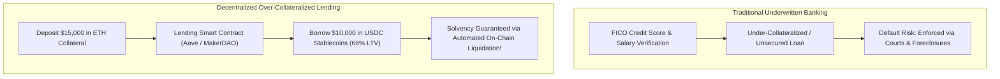
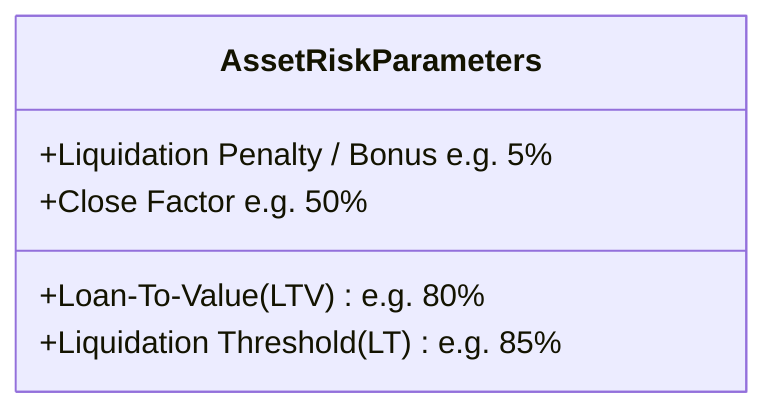
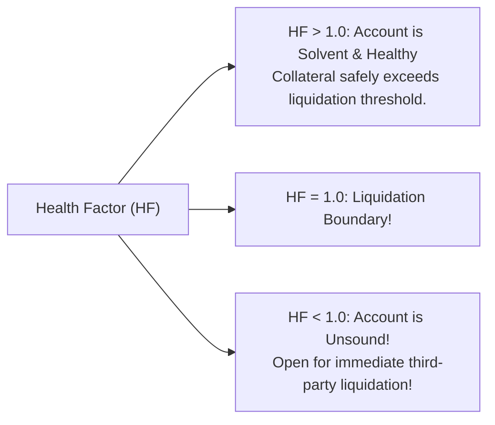
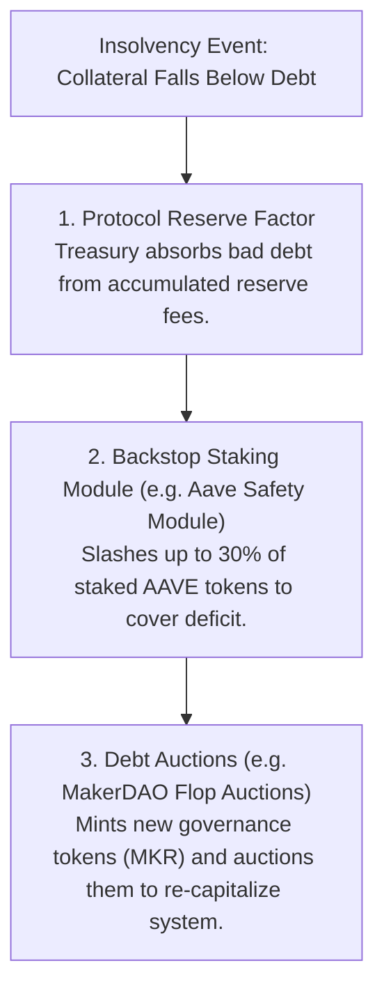
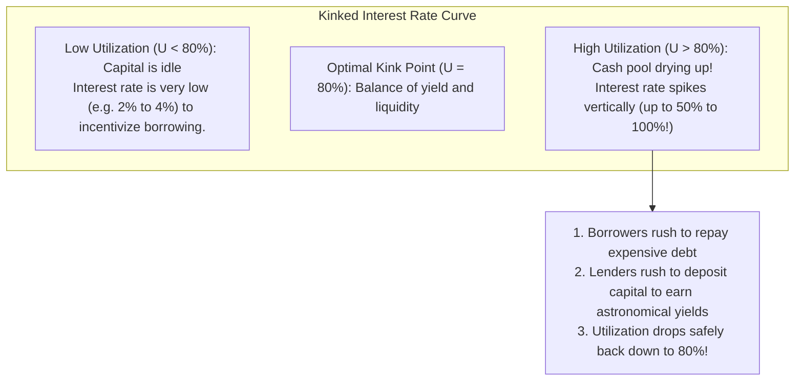

# Collateralized Lending and Protocol Solvency

In traditional banking, lending money is mediated by credit underwriting bureaus (such as FICO, Equifax, or Experian), legal contracts, and law enforcement.
A bank lends you money because they know your legal identity, inspect your income tax returns, and possess the power to garnish your wages or repossess your home if you fail to repay.

On a public blockchain, users operate pseudonomously through 20-byte addresses.
There are no credit scores, no legal jurisdictions, and no bailiffs who can seize off-chain property.
If a smart contract loaned someone $10,000 without collateral, the borrower would simply walk away with the funds, abandon the address, and never return.

To solve this fundamental trust barrier, decentralized finance (DeFi) invented **Over-Collateralized Lending Protocols**, exemplified by **Aave**, **Compound**, and **MakerDAO**.
By anchoring loans to transparent on-chain collateral and automated liquidation engines, DeFi protocols create trustless money markets that operate with zero human intermediaries.

## The Over-Collateralization Paradigm

In DeFi, you cannot borrow money on faith.
You can borrow assets only if you first deposit an amount of collateral that is **strictly greater in value** than the borrowed loan:

$$\text{Collateral Value} > \text{Borrowed Debt Value}$$



### Why Would Anyone Borrow Under These Terms?

A common question from beginners is: *If I have $15,000 in ETH, why would I deposit it just to borrow $10,000 in cash? Why not simply sell $10,000 of my ETH?*

Borrowers use over-collateralized loans for four primary financial motivations:
1. **Tax Optimization:** Selling cryptocurrency triggers a taxable capital gains event in most jurisdictions. Borrowing against assets is not considered a sale and incurs zero capital gains tax.
2. **Long-Term HODL Exposure:** If you believe ETH will appreciate 500 percent over the next two years, selling your ETH sacrifices that upside. By borrowing against your ETH, you retain 100 percent exposure to price appreciation while accessing liquid cash today.
3. **Leverage (Going Long):** A trader can deposit $10,000 in ETH, borrow $7,000 in USDC, buy another $7,000 in ETH on Uniswap, and deposit that new ETH back into the lending market, creating a leveraged long position.
4. **Shorting Assets:** A trader can deposit stablecoins, borrow an asset they believe will collapse (e.g. a failing altcoin), sell it immediately for cash, wait for the price to drop, buy it back cheaply, and return the loan to pocket the difference.

## Core Risk Parameters in Decentralized Lending

Lending protocols manage solvency through four mathematical parameters configured on a per-asset basis:



### 1. Loan-To-Value (LTV) Ratio

The **Loan-To-Value (LTV)** ratio defines the maximum amount a user can borrow against their deposited collateral at the initial moment the loan is taken:

$$\text{Max Borrow Capacity} = \text{Collateral Value} \times \text{LTV}$$

For example, if an asset has an LTV of **$80\%$**, depositing $\$10,000$ worth of ETH permits you to borrow at most $\$8,000$ in stablecoins.

### 2. The Liquidation Threshold (LT)

The **Liquidation Threshold (LT)** is the critical margin boundary at which a loan is deemed under-collateralized and becomes eligible for immediate liquidation by the protocol:

$$\text{LT} > \text{LTV}$$

The buffer between the LTV (e.g., $80\%$) and the Liquidation Threshold (e.g., $85\%$) provides the borrower with a safety margin against small price fluctuations.

### 3. The Liquidation Bonus (Liquidator Incentive)

To incentivize third-party arbitrageurs to monitor the blockchain and liquidate risky loans, the protocol awards liquidators a discount on the seized collateral (typically **$5\%$ to $10\%$**).
The liquidator repays the borrower's debt and receives collateral worth $105\%$ to $110\%$ of the repaid debt.

### 4. The Close Factor

The maximum percentage of a borrower's outstanding debt that can be liquidated in a single liquidation transaction (typically **$50\%$**).
This protects borrowers from having their entire collateral pool wiped out by a brief price flash crash.

## The Health Factor Formula

To track the solvency of a borrower's account across multiple collateral assets and multiple borrowed debts in real time, protocols like Aave compute a normalized metric called the **Health Factor ($HF$)**:

$$HF = \frac{\sum \big(\text{Collateral}_i \times \text{Price}_i \times \text{LT}_i\big)}{\sum \big(\text{Debt}_j \times \text{Price}_j\big)}$$



- **If $HF > 1.0$:** The account is fully solvent. No one can touch the user's collateral.
- **If $HF < 1.0$:** The account breaches the liquidation threshold.
  The smart contract automatically opens the position to anyone in the world to liquidate.

## Step-by-Step Liquidation Mechanics

Smart contracts cannot monitor their own state autonomously; code runs only when triggered by an external transaction.
Liquidation is executed by **external liquidator bots** operating in open competition:

```mermaid
sequenceDiagram
    autonumber
    actor Borrower as Alice (Borrower)
    participant Oracle as Chainlink Price Oracle
    participant Pool as Aave Lending Pool
    actor Liquidator as Liquidator Bot (Searcher)

    Borrower->>Pool: Deposits $10,000 ETH; Borrows $8,000 USDC (HF = 1.06)
    Note over Oracle: ETH price drops 15% on Binance & Coinbase!
    Oracle->>Pool: Update price feed: Alice HF drops to 0.92! (HF < 1.0)
    Liquidator->>Pool: Call liquidationCall(Alice, 4,000 USDC debt repaid)
    Pool->>Pool: 1. Burns 4,000 USDC of Alice debt (50% Close Factor)
    Pool->>Pool: 2. Seizes $4,200 of Alice ETH collateral (5% bonus!)
    Pool->>Liquidator: Transfers $4,200 in ETH to Liquidator
    Note over Liquidator: Liquidator dumps ETH on Uniswap for $4,200 USDC -> $200 Net Profit!
    Note over Borrower: Alice debt reduced; Health Factor restored to > 1.1!
```

### Concrete Numerical Walkthrough

1. **Deposit:** Alice deposits $10 \text{ ETH}$ when ETH is trading at $\$1,000$ (Collateral Value = $\$10,000$).
   - Asset parameters: $\text{LTV} = 80\%$, $\text{LT} = 85\%$, Liquidation Bonus = $5\%$, Close Factor = $50\%$.
2. **Borrow:** Alice borrows $\$8,000 \text{ USDC}$.
   - Her Health Factor is:
     $$HF = \frac{10,000 \times 0.85}{8,000} = \frac{8,500}{8,000} = 1.0625 \quad (\text{Solvent})$$
3. **Price Crash:** The market drops. ETH falls from $\$1,000$ to **$\$900$**.
   - Her collateral value is now: $10 \times 900 = \$9,000$.
   - Her Health Factor collapses to:
     $$HF = \frac{9,000 \times 0.85}{8,000} = \frac{7,650}{8,000} = 0.956 \quad (HF < 1.0 \implies \text{Liquidatable!})$$
4. **Liquidation:** A liquidator bot observes Alice's $HF < 1.0$:
   - The bot repays **$50\%$ of Alice's debt** ($4,000 \text{ USDC}$) via `liquidationCall()`.
   - In return, the bot receives $\$4,000$ of ETH plus the **$5\%$ bonus** ($\$4,200$ worth of ETH):
     $$\text{ETH Seized} = \frac{4,200}{900} \approx 4.667 \text{ ETH}$$
   - The liquidator immediately sells the $4.667 \text{ ETH}$ on Uniswap for $\$4,200$ USDC, pocketing a **$\$200$ instant risk-free profit** after repaying the $4,000 USDC loan.
5. **Outcome:** Alice's debt is reduced to $\$4,000$ USDC, her remaining collateral is $5.333 \text{ ETH}$ (worth $\$4,800$), and her Health Factor recovers to:
   $$HF = \frac{4,800 \times 0.85}{4,000} = \frac{4,080}{4,000} = 1.02 \quad (\text{Solvent again})$$

## Systemic Insolvency and Bad Debt

What happens if an asset's price does not drop smoothly, but suffers an instantaneous 60% flash crash within a single block (for example, during the March 2020 COVID market collapse or the May 2022 Terra-Luna collapse)?

If ETH price drops so rapidly that the value of Alice's collateral falls below her debt:

$$\text{Collateral Value} < \text{Debt Value}$$

Alice's position becomes underwater.
The liquidator has zero financial incentive to liquidate her position because the seized collateral is worth less than the debt they would have to repay.
This creates **Bad Debt (Protocol Insolvency)**.

### Protocol Backstops Against Bad Debt

To prevent bad debt from collapsing the protocol, DeFi architectures implement multi-layered safety mechanisms:



1. **Reserve Funds:** Protocols divert a small percentage of all borrower interest into an emergency reserve treasury.
2. **Safety Staking Modules:** Aave allows users to stake AAVE tokens in a "Safety Module" in exchange for yield.
   If a market shortfall occurs, the protocol's governance contract automatically slashes up to **30 percent of staked tokens** to sell for stablecoins and recapitalize the insolvent pool.
3. **Flop Debt Auctions:** MakerDAO's smart contracts trigger automated "Flop Auctions": the protocol mints new MKR governance tokens out of thin air and sells them on open markets to raise DAI to burn bad debt, diluting governance holders to protect system solvency.

## Dynamic Interest Rates: The Kinked Utilization Curve

Unlike traditional banks where interest rates are set by central bankers in boardroom meetings, DeFi interest rates are calculated algorithmically in real time based on the **Utilization Rate ($U$)**:

$$U = \frac{\text{Total Borrowed Capital}}{\text{Total Deposited Capital}}$$



Protocols use a **piecewise linear (kinked) interest rate model**:
- When $U < U_{\text{optimal}}$ (typically 80%), the borrow interest rate grows gently.
- When $U > U_{\text{optimal}}$, the borrow rate spikes vertically toward 50% or 100% APR.
This steep economic penalty immediately forces borrowers to repay their loans and entices outside lenders to deposit fresh capital, guaranteeing that the pool never runs out of available cash for depositors seeking withdrawals.
