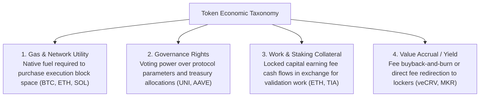
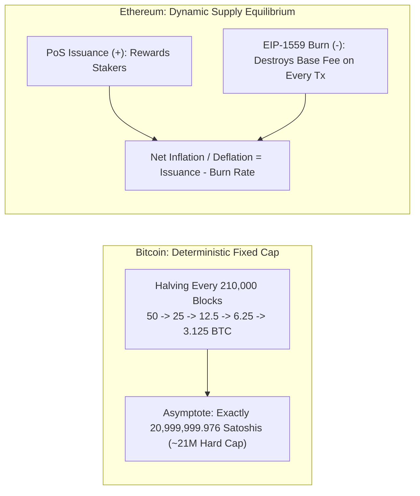
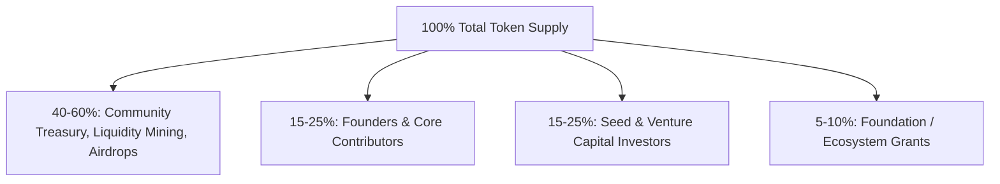
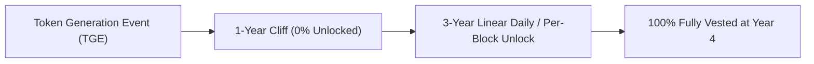
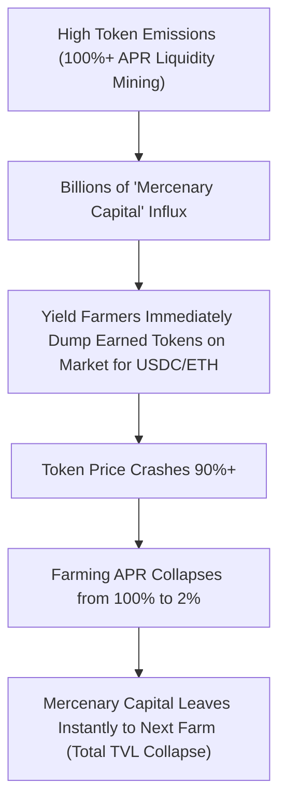
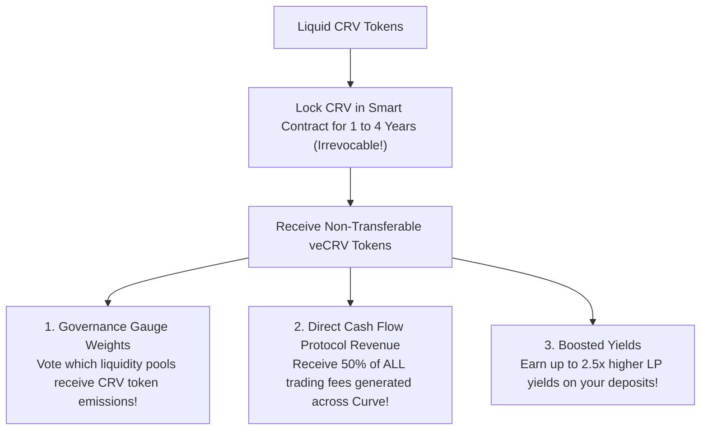

# Tokenomics and Economic Incentive Design

In traditional corporate finance, the financial health of an enterprise is measured through cash flows, balance sheets, and dividends, governed by legal corporate charters and securities regulators.

In decentralized protocols, there is no corporate entity, no human human resources department, and no physical office.
A protocol is merely an open-source collection of smart contracts deployed to an immutable blockchain.
For a protocol to survive, bootstrap network effects, attract capital, and maintain security, it must coordinate thousands of self-interested, pseudonymous actors using **Tokenomics** (token economics) and **mechanism design**.

Tokenomics is the interdisciplinary architecture combining game theory, monetary economics, cryptography, and computer science to design sustainable economic incentive loops.

## A Functional Taxonomy of Crypto Assets

Before designing a tokenomic model, one must categorize what economic role the token performs:

1. **Network Fuel (Gas Tokens):** The base-layer asset required to pay validators for hardware execution (e.g., BTC, ETH, SOL).
   Demand scales directly with network transaction volume.
2. **Governance Tokens:** Grants holders voting rights on protocol risk parameters, interest rate curves, code upgrades, and treasury grant disbursements (e.g., UNI, COMP).
3. **Staking / Work Tokens:** Capital locked up as bonded collateral to perform an active computational or consensus task (such as proposing blocks or operating oracle nodes).
4. **Value-Accrual Tokens:** Tokens designed to capture economic surplus generated by the protocol through programmatic fee distributions or buyback-and-burn mechanics.

## Supply Dynamics: Bitcoin Hard Cap vs. Ethereum Dynamic Equilibrium

The supply architecture of a token defines its monetary policy: whether it is disinflationary, inflationary, or deflationary.

### 1. The Bitcoin Hard Cap: The Geometric Series

Bitcoin enforces a strict mathematical ceiling of **21 million coins**:

$$\text{Max Supply} = \sum_{i=0}^{32} 210,000 \times \frac{50}{2^i} = 210,000 \times 50 \times \sum_{i=0}^{32} \left(\frac{1}{2}\right)^i \approx 20,999,999.976 \text{ BTC}$$

- Every 210,000 blocks (roughly every four years), the mining block subsidy cuts in half ($50 \to 25 \to 12.5 \to 6.25 \to 3.125 \dots$).
- After 64 halving events (around the year 2140), the block subsidy hits zero satoshis, and miners will be compensated **strictly through transaction fees**.
- **Economic Thesis:** Scarcity is absolute. As global demand increases against an inelastic, mathematically fixed supply, purchasing power must appreciate.

### 2. Ethereum Dynamic Equilibrium (Ultrasound Money)

Ethereum does not have a fixed supply cap.
Instead, its monetary supply is governed by two opposing economic forces:

$$\Delta \text{Supply} = \text{Staking Issuance} - \text{Base Fee Burn}$$

1. **Staking Issuance (Inflation):** The protocol mints new ETH to reward validators for securing the chain.
   The issuance rate scales with the square root of total staked ETH ($\approx 2.5\% \times \sqrt{\text{Total Staked}}$), resulting in a modest baseline annual inflation of approximately $0.5\%$ to $0.8\%$.
2. **EIP-1559 Fee Burn (Deflation):** Every transaction executed on Ethereum burns 100 percent of its base fee.
   - During periods of high network congestion (DeFi booms, NFT mints, rollup batch postings), the daily ETH burn rate exceeds the daily staking issuance, causing the total circulating supply of ETH to **shrink** (deflation).
   - During periods of low activity, issuance outpaces burn, and supply expands gently.

This creates an autonomous, self-balancing economic equilibrium where supply expansion directly reflects network utility.

## Token Allocation and Vesting Schedules

When a new protocol launches, how tokens are distributed among early stakeholders determines whether the project survives long-term or suffers catastrophic price collapses.

### The Anatomy of a Vesting Schedule

To prevent founders and early investors from dumping all their tokens onto retail buyers on day one, smart contracts enforce strict programmatic **Vesting Schedules**:

- **Cliff Period (e.g. 1 Year):** A mandatory freeze window where zero tokens are unlocked. If a founder leaves the team during the cliff, they forfeit 100 percent of their allocation.
- **Linear Unlock:** After the cliff expires, tokens unlock incrementally on a per-second or per-block basis over three to four years, smoothing token emissions into secondary markets.

## Liquidity Mining and the Mercenary Capital Collapse

In the summer of 2020 ("DeFi Summer"), Compound launched the **COMP governance token**, pioneering **Liquidity Mining** (yield farming).

The concept was simple:
- To incentivize users to deposit capital into the protocol, Compound rewarded lenders and borrowers with free COMP tokens on every block.
- Users earned 100%+ annual yields simply for depositing capital.

### The Systemic Failure Mode: The "Farm and Dump" Loop

Liquidity mining bootstrapped initial awareness, but revealed a fatal economic trap:
1. The yield was paid in the protocol's newly minted, inflationary token.
2. The investors providing capital were **mercenary capital**: yield farmers who held zero ideological or long-term alignment with the protocol.
3. Every hour, yield farmers claimed their minted rewards and dumped them on open AMMs to cash out into ETH or USDC.
4. As the token price cratered under continuous programmatic sell pressure, the farming APR evaporated.
5. Mercenary capital withdrew its liquidity within seconds and moved to the next high-yield protocol, leaving the original project with a decimated token price and zero sticky users.

Sustainable tokenomics requires rewarding long-term committed users rather than subsidizing transient mercenary liquidity.

## The Solution: Curve and Vote-Escrowed (veToken) Mechanics

To permanently resolve the mercenary capital trap, Michael Egorov designed the **Vote-Escrowed (veToken)** model for **Curve Finance**.

Instead of allowing users to dump governance tokens immediately, Curve introduced a powerful time-weighted commitment mechanism:

### The veCRV Mathematics

- **Irrevocable Lock:** A user locks CRV tokens in a smart contract for anywhere from **1 week up to 4 years**.
  Once locked, the tokens cannot be unlocked, withdrawn, or transferred under any circumstances until the timer expires.
- **Linear Decay:** Locking 1 CRV for 4 years grants **1.0 veCRV**.
  Locking 1 CRV for 1 year grants **0.25 veCRV**.
  As time passes toward the unlock date, your veCRV balance decays linearly to zero.
- **Non-Transferability:** veCRV is not an ERC-20 token that can be sold on Uniswap. It is a non-transferable internal accounting balance bound to your specific address.

### The Curve Wars and Bribe Markets

Because veCRV holders vote weekly on **Gauge Weights** (deciding which liquidity pools receive the daily allocation of newly minted CRV emissions), other protocols (like Frax, Abracadabra, and Synthetix) needed veCRV voting power to ensure their own stablecoins had deep liquidity on Curve.

This sparked the famous **Curve Wars**:
- Protocols competed to accumulate as much CRV as possible to lock for 4 years.
- Platforms like **Convex Finance** emerged, pooling liquid CRV from retail users to monopolize over 50 percent of all veCRV voting power.
- Dedicated **Bribe Markets** (Votium, Bribe.crv) emerged where protocols openly paid millions of dollars in weekly cash bribes directly to veCRV voters to direct emissions to their pools.

The veToken model transformed governance from a meaningless speculative token into an active, cash-flow-generating economic asset, permanently aligning long-term token holders with protocol survival.
