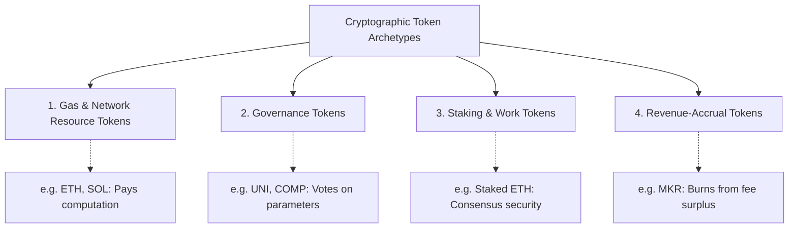
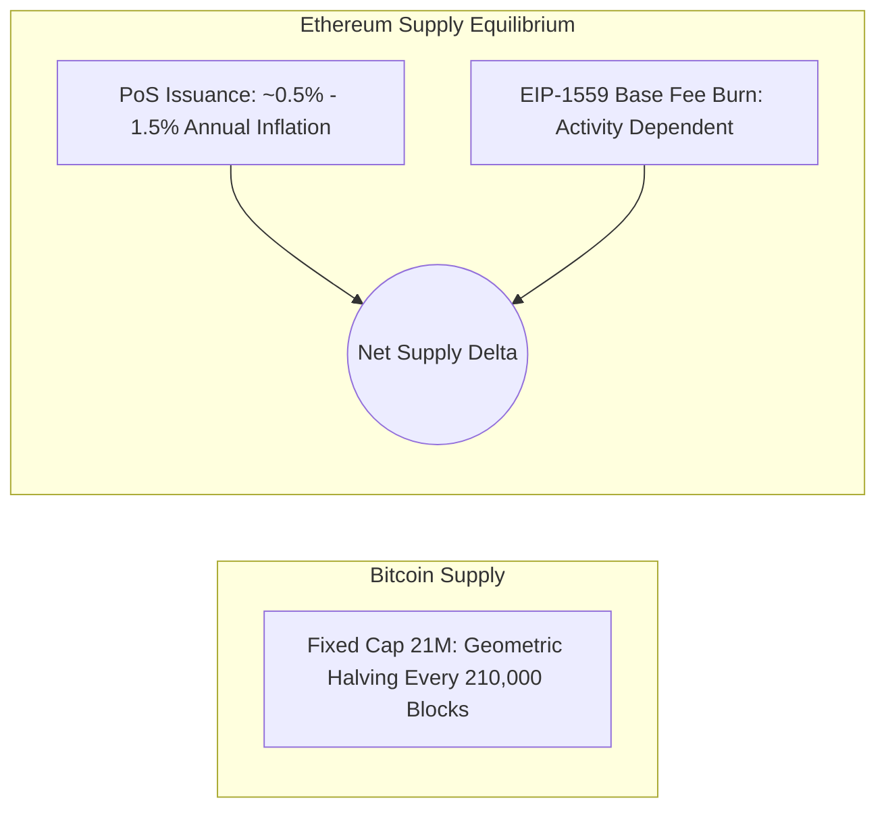
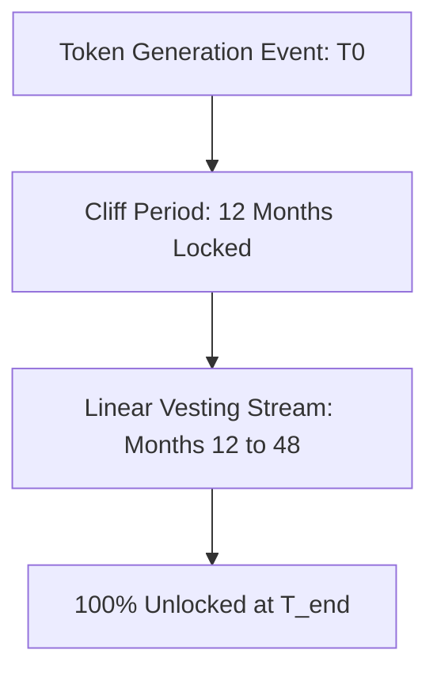
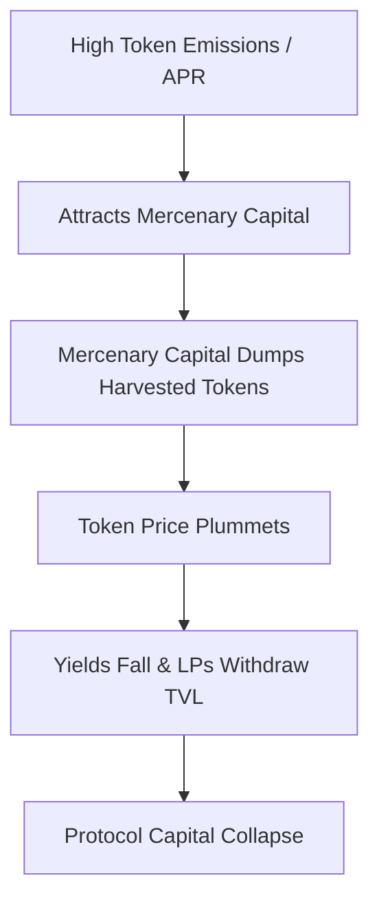
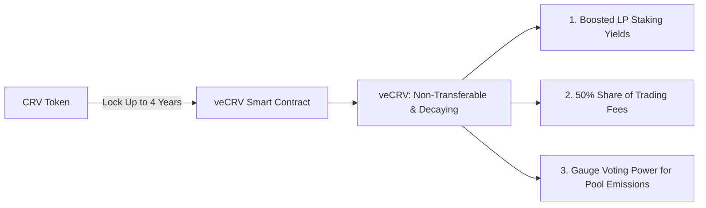

# Tokenomics and Economic Incentive Design

Cryptographic protocols rely on game theory and economic mechanisms to coordinate distributed actors.
Without centralized management or legal enforcement, protocols use programmatic token incentives to secure consensus, attract liquidity, and coordinate governance.
Tokenomics analyzes the issuance schedules, utility models, value-accrual mechanics, and distribution architectures that govern digital assets.

## Token Classification and Utility Taxonomy

Tokens in decentralized systems serve specific operational roles:

- **Gas and Network Resource Tokens:** Native assets used to meter and purchase computational execution and block space (e.g. ETH, SOL, AVAX).
- **Governance Tokens:** ERC-20 tokens that confer voting rights on protocol parameters, fee structures, and treasury grants (e.g. UNI, AAVE).
- **Staking and Work Tokens:** Assets bonded or locked by operators to earn the right to provide services (such as block validation or oracle reporting) subject to programmatic slashing.
- **Value-Accrual Tokens:** Tokens designed to capture protocol fee revenue through buyback-and-burn mechanisms, direct fee distributions, or fee discounts.

## Monetary Policy and Supply Schedules

A token's supply schedule dictates its inflationary or deflationary trajectory over time.

### 1. Hard-Capped Disinflationary Supply (Bitcoin)

Bitcoin enforces a strict mathematical supply cap of 21,000,000 BTC.
Issuance occurs through block subsidies that halve every 210,000 blocks:

$$S_{\text{block}}(i) = \frac{50}{2^{\lfloor i / 210000 \rfloor}} \quad \text{BTC}$$

The geometric series converges to 21 million:

$$\sum_{i=0}^{32} 210000 \times \frac{50}{2^i} \approx 20,999,999.9769 \text{ BTC}$$

Once the subsidy hits zero around the year 2140, transaction fees alone must sustain miner security budgets.

### 2. Activity-Dependent Equilibrium (Ethereum)

Following the Merge and the activation of EIP-1559, Ethereum abandoned static supply caps in favor of dynamic supply equilibrium:
- **Issuance:** Proof of Stake mints fresh ETH to reward validators, scaling with the square root of total staked ETH ($\approx 0.5\%$ to $1.5\%$ annual inflation).
- **Destruction:** Every on-chain transaction burns the base fee.
When network gas prices exceed approximately 15 to 20 gwei, the burn rate outpaces validator issuance, rendering ETH net deflationary.

## Vesting Schedules and Distribution Architecture

To prevent early teams and private investors from dumping tokens on open markets, protocols implement programmatic smart contract vesting vaults.

A standard vesting curve includes a **cliff** followed by continuous linear unlocks:

$$V(t) = \begin{cases} 0 & \text{if } t < t_{\text{cliff}} \\ T_{\text{total}} \cdot \left( \frac{t - t_0}{t_{\text{end}} - t_0} \right) & \text{if } t_{\text{cliff}} \le t < t_{\text{end}} \\ T_{\text{total}} & \text{if } t \ge t_{\text{end}} \end{cases}$$

Vesting contracts (such as OpenZeppelin's `VestingWallet`) allow beneficiaries to draw vested tokens continuously block-by-block, avoiding discrete unlock spikes.

## Liquidity Mining vs. Sustainable Capital

In 2020, Compound ignited the "DeFi Summer" by distributing COMP tokens to users who supplied or borrowed capital.
While **liquidity mining** rapidly bootstrapped Total Value Locked (TVL), it revealed structural economic flaws:

- **Mercenary Capital:** Yield farmers deposit capital solely to harvest emission rewards, sell them immediately on DEXs for stablecoins, and withdraw their underlying liquidity as soon as yields drop.
- **Hyperinflationary Dilution:** Emitting unbacked governance tokens to subsidize trading yields dilutes long-term holders without building sticky protocol loyalty.

## The Vote-Escrowed (ve) Token Model

Curve Finance introduced the **Vote-Escrowed (ve)** architecture (veCRV) to resolve mercenary capital dynamics and align long-term incentives.

- **Time-Weighted Locking:** Users lock their tokens inside an irrevocable smart contract for a duration ranging from one week to four years.
- **Decaying Voting Weight:** In exchange, users receive non-transferable, un-tradeable `veTokens`. Voting weight scales linearly with lock duration:
  $$\text{veBalance} = \text{Locked Amount} \times \frac{\text{Time Remaining}}{4 \text{ years}}$$
- **Gauge Weights:** veToken holders vote on which liquidity pools receive weekly token emission allocations.
  This creates external demand from protocols competing to incentivize their own pools, sparking the "Curve Wars" where protocols pay weekly bribes to veToken voters in exchange for emission direction.
