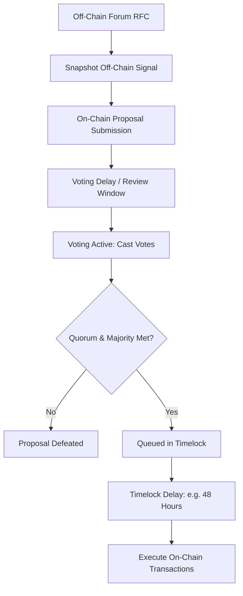
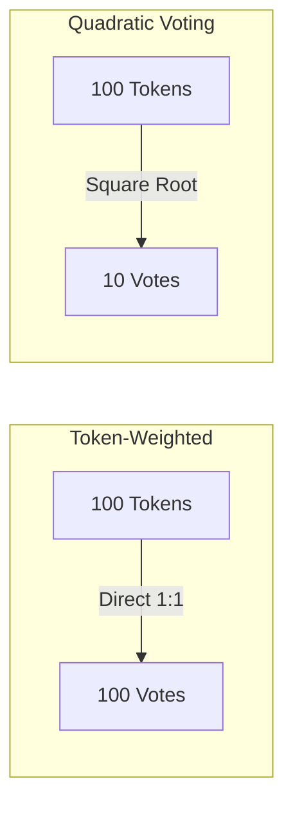

# Decentralized Autonomous Organizations

Decentralized Autonomous Organizations (DAOs) represent an internet-native organizational primitive.
Instead of relying on corporate charters, boards of directors, and domestic commercial courts, DAOs govern collective capital and protocol parameters through smart contracts.
State changes, treasury disbursements, and protocol parameter modifications execute algorithmically once stakeholder proposals satisfy predefined on-chain voting rules.

## The Proposal Lifecycle

A standard on-chain governance process follows an explicit state machine from initial ideation through execution.

### 1. Off-Chain Signaling and Consensus Gathering

Submitting on-chain transactions consumes gas and creates immutable records.
DAOs typically filter proposals through preliminary off-chain stages:
- **RFC and Discourse Forums:** Community members publish open Requests for Comments to debate architectural parameters and financial allocations.
- **Snapshot Soft-Voting:** Stakeholders vote gaslessly on IPFS-hosted platforms (like Snapshot) using signed cryptographic messages reflecting token balances at a specific historical block height.

### 2. On-Chain Submission and Voting Delay

To prevent governance spam, a proposer must meet a minimum token holding threshold (such as 100,000 UNI) to invoke the `propose()` function on the Governor contract.
Once proposed, a **Voting Delay** (typically one to two days) begins:
- Locks token balances against flash-loan voting attacks.
- Provides token holders sufficient time to delegate voting weight or withdraw funds if they disagree with the proposal.

### 3. Active Voting Window

During the voting window, token holders submit votes: `For`, `Against`, or `Abstain`.
To succeed, a proposal must satisfy two requirements:
- **Quorum:** The cumulative votes cast must exceed a predefined minimum percentage of total circulating voting power (e.g. $4\%$).
- **Simple Majority:** The votes `For` must exceed the votes `Against`.

### 4. Timelock Queuing and Autonomous Execution

If a proposal succeeds, it moves into a **Timelock Controller** smart contract.
The timelock enforces a mandatory delay (e.g. 48 hours) before execution:
- **Emergency Protection:** Users who object to the approved parameter change have an invariant time window to exit the protocol, unstake capital, or withdraw liquidity before the code executes on-chain.
Once the delay elapses, any participant can call `execute()`, triggering the low-level transactions embedded in the proposal payload to deploy contracts, update interest rate curves, or disburse treasury tokens.

## Voting Architectures and Mathematical Mechanics

How voting power scales relative to token holdings determines the democratic health and decentralization of a DAO.

### 1. 1-Token-1-Vote (Linear Plutocracy)

Under standard linear voting, voting power scales one-to-one with token balances:

$$V = T$$

While simple to implement via ERC-20 checkpoints, linear voting concentrates governance authority in a handful of venture funds and founding teams (whales), disenfranchising retail community contributors and inviting voter apathy.

### 2. Quadratic Voting

Glen Weyl proposed Quadratic Voting to amplify the collective preference of broad coalitions over concentrated wealth.
Under quadratic voting, the cost to cast $V$ votes scales quadratically:

$$\text{Cost} = V^2 \implies V = \sqrt{\text{Tokens}}$$

| Token Balance | Linear Votes ($V = T$) | Quadratic Votes ($V = \sqrt{T}$) |
| :--- | :--- | :--- |
| **1** | 1 | 1 |
| **100** | 100 | 10 |
| **10,000** | 10,000 | 100 |
| **1,000,000** | 1,000,000 | 1,000 |

Under quadratic voting, 100 independent participants holding 100 tokens each collectively wield $100 \times 10 = 1,000$ votes, easily outvoting a single whale holding 10,000 tokens (who wields only 100 votes).

**The Sybil Vulnerability:** Quadratic voting cannot operate on permissionless public keys without robust Sybil resistance.
If a whale holding 10,000 tokens splits their capital across 100 distinct addresses with 100 tokens each, they bypass the quadratic penalty and restore linear voting power.
Therefore, quadratic voting requires cryptographic identity verification (such as Gitcoin Passport or World ID).

### 3. Ragequit Mechanics (Moloch Framework)

Pioneered by MolochDAO, ragequit mechanics protect minority stakeholders in investment and grant-making DAOs.
If a member votes against a proposal and the proposal passes, the member has the absolute right during the grace period to surrender their DAO shares and withdraw their exact proportional share of the underlying treasury assets before the proposal executes.
This removes the threat of majority tyranny.

## Governance Attack Vectors

| Attack Vector | Mechanism | Smart Contract Defense |
| :--- | :--- | :--- |
| **Flash Loan Governance Attack** | An attacker borrows millions of governance tokens via an uncollateralized flash loan, votes instantly to seize the treasury, and repays the loan in the same transaction. | Use historical snapshot block checkpoints (ERC-20 Votes / OpenZeppelin Governor) and enforce mandatory multi-day voting delays. |
| **Bribe Markets** | Third parties deploy automated contracts (e.g. Votium, Bribe.crv) to buy governance votes, directing treasury grants or emission schedules toward their private assets. | Implement vote-escrow mechanics (veTokenomics) and encourage delegation to aligned stewards. |
| **Low-Quorum Hijacking** | An attacker submits a malicious proposal during holiday periods when voter turnout is low, sneaking the change past minimal quorum requirements. | Implement dynamic quorum adjustments that scale up when proposal value increases, paired with mandatory timelock buffers. |
