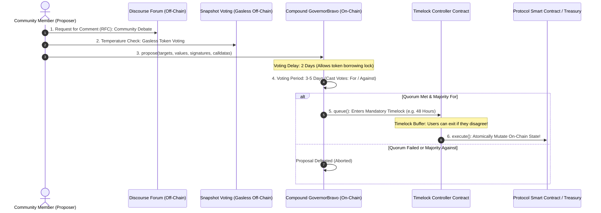
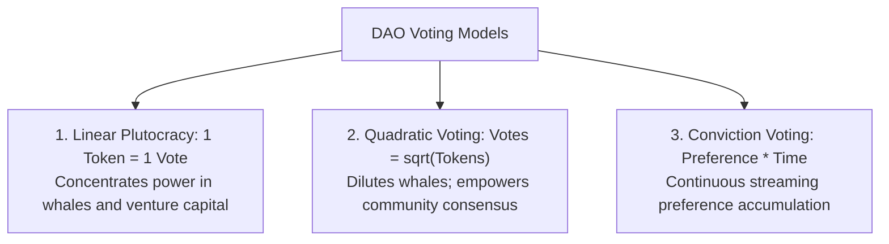
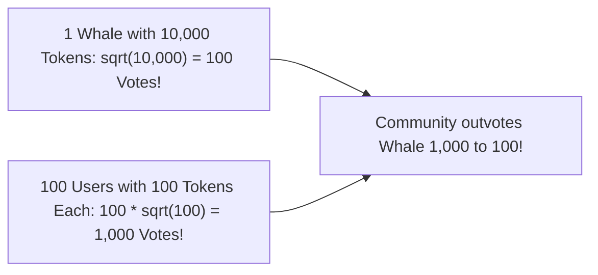
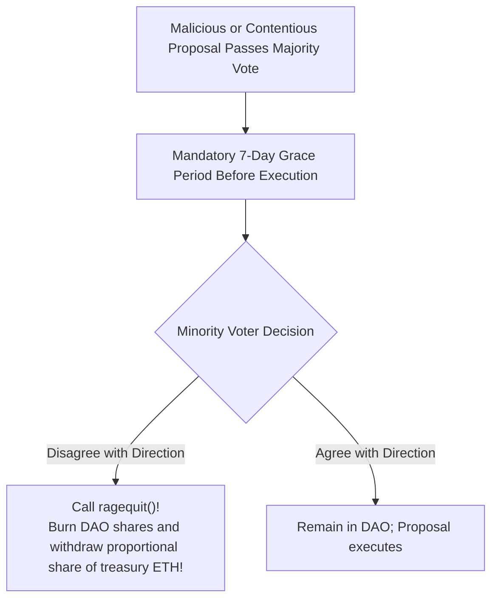

# Decentralized Autonomous Organizations

Throughout history, human organization has been structured around hierarchical legal frameworks: the joint-stock corporation, non-profit trusts, and government bureaucracies.
These organizations are governed by legal corporate charters, boards of directors, and domestic courts.
Enforcement relies on the physical legal system: if an executive embezzles corporate funds or violates a shareholder agreement, shareholders must hire attorneys, file lawsuits, and rely on judges and police to enforce property rights.

This traditional corporate structure has significant limitations:
- Bound to specific nation-state legal jurisdictions.
- Expensive legal and bureaucratic overhead.
- Susceptible to opaque, behind-closed-doors corruption by corporate executives.
- Geographic discrimination: an engineer in Nigeria or Vietnam cannot easily hold shares or exercise voting rights in a Delaware C-Corporation.

The blockchain revolution enabled an entirely new organizational structure: the **Decentralized Autonomous Organization (DAO)**.
A DAO is an internet-native organization where collective decision-making, voting rights, and treasury management are governed not by paper legal documents, but by **immutable, self-executing smart contracts**.

## The Conceptual Architecture of a DAO

In a DAO:
- **No CEO or Board of Directors:** Authority is distributed among token holders according to predefined smart contract rules.
- **Transparent Treasury:** Capital sits inside a multi-signature smart contract or timelock contract visible to the entire world.
- **Autonomous Execution:** When a proposal passes a democratic governance vote, the smart contract executes the state change (such as transferring $1 million from the treasury or upgrading contract code) automatically on-chain with zero human intermediaries.

```mermaid
flowchart TD
    subgraph Traditional Corporation
        Shareholders1[Shareholders] --> Board[Board of Directors]
        Board --> Executive[CEO & Management]
        Executive --> Treasury1[Bank Account]
        LegalSystem["Enforced by Courts, Lawyers & Domestic Police"] -.-> Executive
    end

    subgraph Decentralized Autonomous Organization (DAO)
        TokenHolders[Global Token Holders] -->|Cryptographic Votes| GovernanceContract[On-Chain Governance Contract]
        GovernanceContract -->|Automated Execution| Timelock[Timelock Controller]
        Timelock -->|Direct State Mutation| Treasury2[On-Chain Multi-Million Dollar Treasury]
    end
```

## The End-to-End Governance Proposal Lifecycle

How does an idea transform into an on-chain execution?
Major DAOs (such as Uniswap, Compound, and Aave) follow a structured multi-stage governance pipeline:



### Stage 1: Off-Chain Discourse and Temperature Check

Before spending thousands of dollars in gas to post an on-chain proposal, the community debates the idea:
- **RFC (Request for Comments):** Posted on the DAO's public Discourse forum for community discussion and technical refinement.
- **Temperature Check (Snapshot):** A non-binding off-chain vote hosted on **Snapshot**.
  Users sign free cryptographic messages with their wallets to prove token holdings.
  If the temperature check passes, the proposal moves to formal on-chain submission.

### Stage 2: On-Chain Proposal Submission (`propose`)

To prevent spam, the user must hold a minimum threshold of governance tokens (e.g., 2,500,000 UNI) to call `propose()` on the **GovernorBravo** contract.
The proposer submits four synchronized arrays:
1. `targets`: The smart contract addresses to call.
2. `values`: The amount of native ETH to send.
3. `signatures`: The function signatures to invoke (e.g., `transfer(address,uint256)`).
4. `calldatas`: The exact ABI-encoded parameters.

### Stage 3: Voting Delay and Snapshot Block

Once submitted, the proposal enters a **Voting Delay** (typically 1 to 2 days).
At the end of this delay, the contract records the **Snapshot Block**:
- The voting power of every account is permanently locked to their balance at that specific historical block height.
- This prevents attackers from seeing a contentious proposal, borrowing millions of tokens on secondary markets, voting on the proposal, and selling the tokens back within the same hour.

### Stage 4: Active Voting and Quorum

Token holders cast their votes: `For`, `Against`, or `Abstain`.
For a proposal to pass, it must fulfill two mathematical criteria:
1. **Majority Approval:** $\text{Votes}_{\text{For}} > \text{Votes}_{\text{Against}}$.
2. **Quorum Threshold:** A minimum total percentage of the entire token supply (typically 4% to 10%) must participate to prevent minority cartels from passing malicious proposals in secret.

### Stage 5: The Timelock Delay and Execution

If approved, the proposal is queued into the **Timelock Controller**:
- **Mandatory Cooling Period (e.g., 48 Hours):** Execution is intentionally delayed by two days.
- **Why?** The timelock is the ultimate safety valve for protocol users.
  If a malicious proposal passes (e.g., draining the treasury or raising fees to 100%), the 48-hour delay allows liquidity providers and users to withdraw their capital safely from the protocol before the code executes.
- **Execution:** Once the timelock expires, anyone can call `execute()`.
  The contract executes the low-level calls, transferring funds or upgrading bytecode autonomously.

## Voting Mechanisms and Mathematical Paradigms

How should voting power be calculated in a decentralized community?
DAOs explore several mathematical models, each with profound trade-offs:



### 1. Linear Plutocracy (1 Token = 1 Vote)

In standard token voting, your voting influence scales linearly with your balance:

$$V = T$$

- **The Whales Dilemma:** A single billionaire venture capital firm holding 10 million tokens wields more political power than 10,000 grassroots community members holding 500 tokens each.
  This transforms governance into a plutocracy where capital owners dictate terms to active users.

### 2. Quadratic Voting (QV)

Pioneered by Glen Weyl, **Quadratic Voting** was designed to balance the intensity of preference against raw wealth concentration:

$$\text{Voting Power } V = \sqrt{T} \quad \iff \quad \text{Cost in Tokens } T = V^2$$

- To cast 1 vote, you need $1^2 = 1 \text{ token}$.
- To cast 2 votes, you need $2^2 = 4 \text{ tokens}$.
- To cast 10 votes, you need $10^2 = 100 \text{ tokens}$.
- To cast 100 votes, you need $100^2 = 10,000 \text{ tokens}$.



Quadratic voting gives immense leverage to broad community consensus over concentrated wealth.
However, **Quadratic Voting possesses a fatal flaw on anonymous blockchains: it is trivially vulnerable to Sybil attacks!**
If the whale splits their 10,000 tokens across 100 separate wallet addresses (100 tokens per wallet), their voting power jumps from 100 votes to 1,000 votes!
Therefore, Quadratic Voting cannot function securely in permissionless environments without robust **Proof of Humanity or Decentralized Identity (DID)** systems (such as Worldcoin or Gitcoin Passport).

## The MolochDAO Architecture: The Ragequit Defense

In 2019, Ameen Soleimani designed **MolochDAO**, named after the mythological demon of coordination failure.
Moloch introduced one of the most celebrated innovations in DAO history: **The Ragequit**.



In standard corporations, if the majority 51% of shareholders vote to waste the corporate treasury on a foolish project, the 49% minority has zero recourse; their capital is trapped.

In MolochDAO:
- After every voting period, the contract enters a **7-Day Grace Period**.
- If a proposal passes that a minority opposes, any dissenting member can invoke `ragequit()`.
- The smart contract burns their DAO shares and immediately returns their exact proportional fraction of the treasury's underlying assets (ETH, DAI) directly to their personal wallet.
- Only after dissenting members have safely exited with their capital does the proposal execute.
Ragequitting eliminates the tyranny of the majority, guaranteeing that capital can never be held hostage by hostile governance factions.

## Governance Attack Vectors and Exploit Case Studies

Decentralized governance contracts manage billions of dollars of capital, making them lucrative targets for financial exploits:

### 1. Flash Loan Governance Takeovers (The Beanstalk Farms Exploit)

In April 2022, an attacker exploited credit-based stablecoin protocol **Beanstalk Farms**, draining **$182 million** in a single atomic transaction:
1. The attacker borrowed $1 billion in assets via a flash loan across Aave and Uniswap.
2. The attacker swapped the capital for Beanstalk governance tokens (Stalk), instantly capturing over **67 percent of total voting power**.
3. The attacker submitted a malicious governance proposal (BIP-18) that transferred all treasury assets directly to the attacker's personal wallet.
4. Because Beanstalk had an emergency execution function that bypassed the standard timelock if a proposal achieved a two-thirds supermajority, the attacker voted "YES" using their flash-loaned tokens and executed the proposal in the exact same transaction block.
5. The attacker drained the treasury, repaid the $1 billion flash loan, and walked away with $76 million in clean profit.

#### Mitigation:
Governance protocols must strictly enforce multi-day voting delays, multi-day timelocks, and calculate voting weight from historical block snapshots prior to proposal submission, completely neutralizing flash loans.

### 2. Low-Quorum Hostile Hijacking (Build Finance DAO)

In February 2022, a malicious actor noticed that **Build Finance DAO** had low community voter turnout:
- The attacker bought enough tokens on open AMMs to fulfill the minimum quorum threshold.
- The attacker submitted an innocent-sounding proposal that granted their address total minting control over the protocol token.
- Because the legitimate community was not monitoring the forum, the proposal passed quietly.
- Upon execution, the attacker minted 1.1 million new tokens, drained all liquidity from the DEX pools, and completely destroyed the project.

DAOs must maintain vigilant automated monitoring bots, high quorum requirements, and emergency veto multisigs (Security Councils) to protect protocol reserves from voter apathy.
