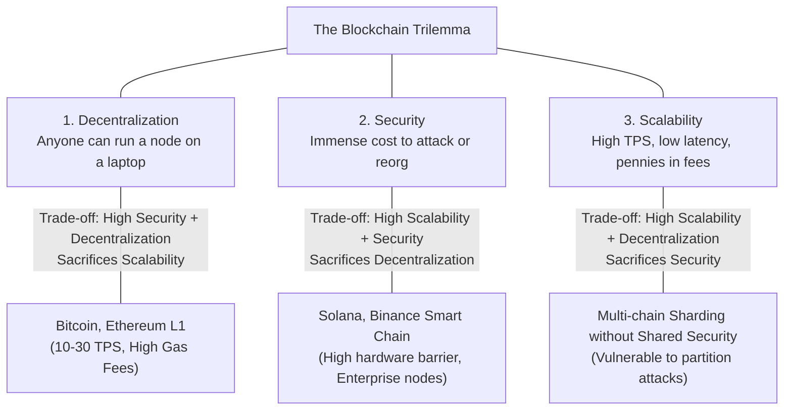
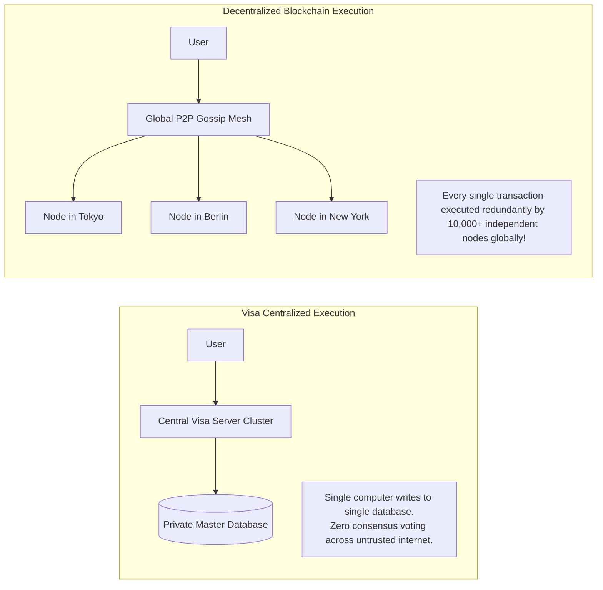
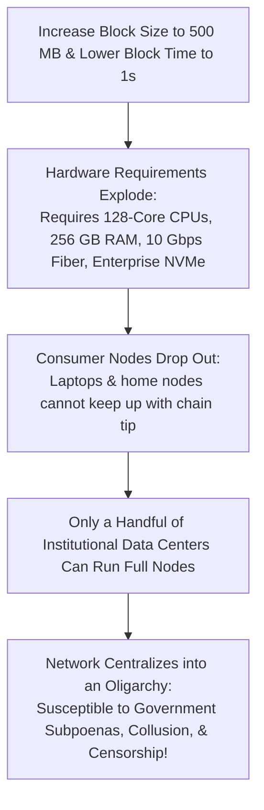
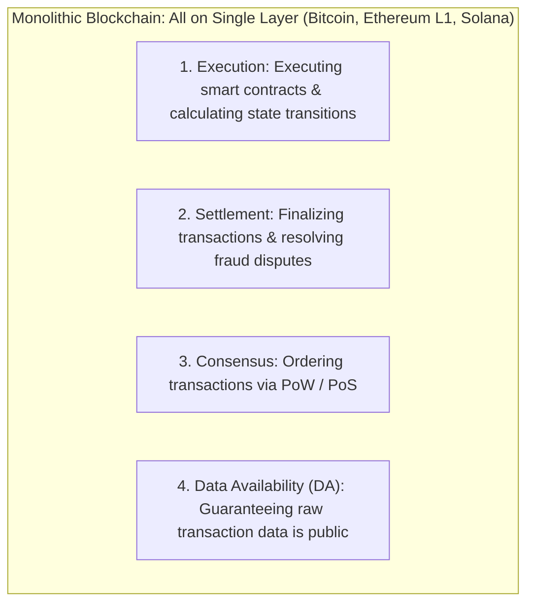
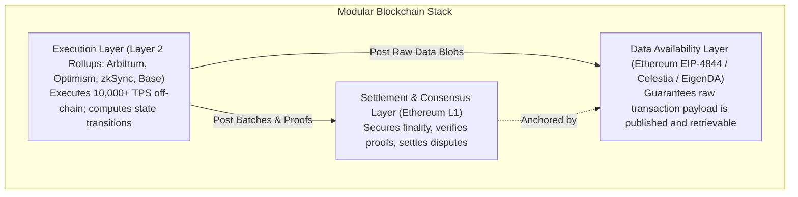

# The Blockchain Trilemma

In computer science and distributed systems architecture, designing protocols is an exercise in managing fundamental trade-offs.
No single database or communication network can maximize every operational parameter simultaneously.

In 2017, Ethereum creator Vitalik Buterin formalized the core architectural constraint of public distributed ledgers as **The Blockchain Trilemma**.
The trilemma posits that a decentralized ledger can achieve at most **two out of three** core properties simultaneously:

1. **Decentralization:** The network can be validated and operated by thousands of ordinary users on consumer-grade hardware without relying on an oligarchy of data centers.
2. **Security:** The protocol is mathematically and economically resilient against coordinated Byzantine attacks, 51% reorganizations, and colluding cartels.
3. **Scalability (Throughput):** The system can process thousands of transactions per second (TPS) with sub-second finality and negligible user transaction fees.

To understand why the Trilemma exists, one must examine the physical physics of distributed computing and the fatal bottleneck of monolithic architecture.

## The Physical Bottlenecks of Distributed Throughput

A common question from newcomers is: *Why can Visa process 24,000 transactions per second, while Bitcoin processes only 7 TPS and Ethereum Layer 1 processes only 15 to 30 TPS?*

The answer lies in how computation and verification are structured:

In a centralized system like Visa:
- A high-performance server cluster in a private data center writes updates to a shared SQL database.
- There is no Byzantine fault tolerance, no peer-to-peer gossip latency, and no redundant independent verification.

In a decentralized blockchain:
- **Redundant Execution:** When you swap tokens on Uniswap, that transaction is not executed once.
  It is executed **redundantly by tens of thousands of independent validator nodes across the globe**.
- **The Physical Throughput Limit:** Transaction throughput ($\text{TPS}$) is physically bounded by the capacity of the slowest participating validator node:

$$\text{Throughput} \propto \frac{\text{Block Size } S}{\text{Block Propagation Time } \Delta + \text{Block Execution Time } T_{\text{exec}}}$$

### The Three Hardware Bottlenecks:

1. **Network Bandwidth:** If blocks are 100 megabytes in size, gossiping them across consumer residential internet connections takes 30 seconds, causing constant network splits and massive orphan rates.
2. **CPU Execution Speed:** Evaluating complex smart contract opcodes and verifying thousands of cryptographic digital signatures consumes processor cycles.
3. **Disk I/O and State Bloat (The True Killer):** Every transaction must read and write to disk databases (LevelDB/Pebble).
   Disk input/output operations per second (IOPS) are the primary physical bottleneck preventing monolithic chains from scaling on consumer hardware.

## The Monolithic Trap: Raising the Block Size

The naive approach to scaling a blockchain is simple: **Why not just make blocks 100 times larger and decrease block time to 1 second?**

This is the path taken by monolithic high-throughput blockchains (such as Bitcoin Cash, EOS, and early alternative L1s).
While this temporarily raises TPS, it triggers the **Monolithic Centralization Trap**:

1. **State Explosion:** If a blockchain processes 50,000 TPS, its global state trie expands by tens of gigabytes every single day, requiring hundreds of terabytes of ultra-fast NVMe storage within a few years.
2. **Consumer Hardware Exclusion:** Ordinary users running nodes on home laptops can no longer keep up with the tip of the chain; their machines fall behind and crash.
3. **Loss of Self-Sovereignty:** When ordinary people cannot afford to run a full node, they are forced to trust a handful of multi-million-dollar data center operators.
   At that point, the blockchain ceases to be decentralized; it becomes an inefficient, expensive replica of Amazon Web Services.

The core philosophy of Ethereum and Bitcoin is that **preserving the ability of ordinary humans to run a verifying full node on consumer hardware is non-negotiable**.
Without decentralization, cryptographic immutability is an illusion.

## The Paradigm Shift: Monolithic vs. Modular Architecture

For the first decade of blockchain history (2009-2020), every blockchain was **Monolithic**.
A monolithic blockchain forces a single blockchain layer to execute all four foundational functions of distributed consensus simultaneously:

Because all four functions compete for the identical CPU cycles, bandwidth, and disk storage of a single node, monolithic blockchains cannot escape the Trilemma.

### The Modular Blockchain Revolution

Spearheaded by researchers like Mustafa Al-Bassam (Celestia), John Adler (Fuel), and Vitalik Buterin, the industry initiated the **Modular Blockchain Paradigm Shift**:

> Instead of forcing one blockchain to do everything, decouple the four functions and delegate them to specialized, independent layers optimized for specific tasks!

### The Four Modular Functions Explained:

1. **Execution:** Taking incoming transactions, executing EVM/SVM bytecode, updating user balances, and calculating the new state root.
   In modular architectures, execution is moved off-chain to **Layer 2 Rollups**, which can run at thousands of transactions per second.
2. **Settlement:** The ultimate judicial arbiter that finalizes state commitments, resolves fraud proofs, and verifies mathematical zero-knowledge validity proofs.
3. **Consensus:** Establishing the indisputable, immutable chronological ordering of transaction batches through Proof of Stake or Proof of Work.
4. **Data Availability (DA):** Ensuring that the raw transaction bytes are publicly broadcast and retrievable by anyone, proving that no validator has hidden transactions.

By offloading execution to Layer 2 rollups while anchoring security, consensus, and data availability to a decentralized Layer 1 like Ethereum, the modular paradigm **solves the Blockchain Trilemma**:
- **Decentralization:** Preserved on Layer 1, where ordinary users continue running full nodes.
- **Security:** Layer 2 rollups inherit 100 percent of the multi-billion-dollar cryptographic security and economic finality of Layer 1.
- **Scalability:** Achieved by executing thousands of transactions per second off-chain, compressing them into compact cryptographic proofs, and settling them on Layer 1 for pennies.
