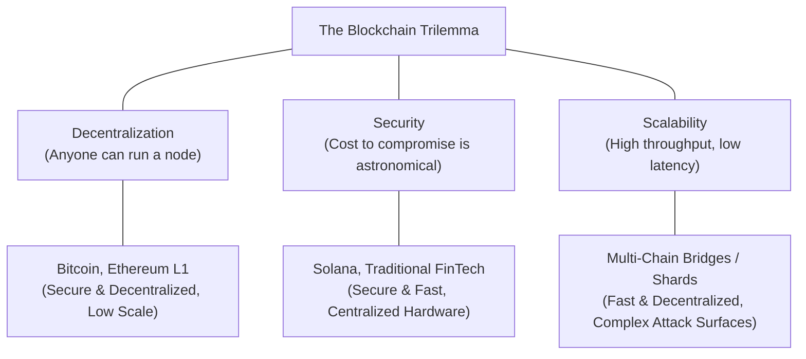
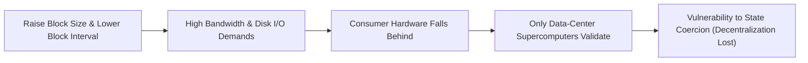
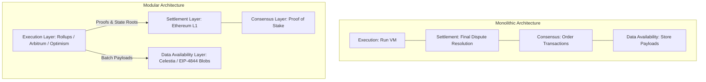

# The Blockchain Trilemma

Decentralized architectures face physical and cryptographic trade-offs when designing shared state machines.
Coined by Vitalik Buterin, the **Blockchain Trilemma** states that a decentralized ledger can achieve at most two of three fundamental properties simultaneously: Decentralization, Security, and Scalability.

## The Three Vertices of the Trilemma

### 1. Decentralization

Decentralization measures the degree to which network validation and consensus are distributed across independent physical actors.
- **Node Hardware Requirements:** If running a full validating node requires a consumer laptop and standard broadband, thousands of individuals can verify the chain independently.
- **Censorship Resistance:** High node distribution ensures that no single geopolitical jurisdiction, cloud hosting provider, or corporate entity can shut down the network or censor specific accounts.

### 2. Security

Security defines the economic and computational cost required to produce an invalid state transition or reorganize confirmed history.
- In Proof of Work, security is the cost of acquiring more than 50 percent of global ASIC hash rate.
- In Proof of Stake, security is the cost of acquiring and risking the destruction of more than 33 percent to 66 percent of total staked capital.
- A secure network maintains safety and liveness under adversarial network conditions and severe DDoS attacks.

### 3. Scalability

Scalability is the network's capacity to process transactions per second (TPS) while maintaining low fees and sub-second confirmation latencies.
- Measured in computational gas throughput ($\text{gas/second}$) and transactional throughput ($\text{TPS}$).
- A scalable system handles global adoption spikes without network congestion driving transaction fees to prohibitive levels.

## The Physical Conflict: Throughput vs. Decentralization

The root cause of the trilemma lies in the requirement that every full node must independently verify every transaction.
Throughput in a distributed ledger is governed by block size ($S$) and block interval ($T$):

$$\text{Throughput} \propto \frac{S}{T}$$

To dramatically increase throughput on a single monolithic Layer 1:
1. **Increase Block Size ($S$):** The chain produces 50 MB blocks instead of 1 MB blocks.
2. **Decrease Block Interval ($T$):** The chain produces blocks every 400 milliseconds instead of every 12 seconds.

This single-layer optimization creates state explosion and bandwidth saturation:
- Validating nodes must process hundreds of megabytes of state changes per second, requiring high-end data-center servers with NVMe RAID arrays and dedicated fiber uplinks.
- Consumer hardware drops off the network because home connections cannot keep pace with the tip of the chain.
- The validator set shrinks to a small federation of corporate servers, sacrificing decentralization and censorship resistance.

## Monolithic vs. Modular Blockchains

To escape the constraints of the Trilemma without sacrificing decentralization, modern blockchain architecture splits execution from consensus.

### 1. Monolithic Architecture

In a monolithic blockchain (such as Bitcoin, Ethereum L1, or Solana), a single integrated network performs all four core tasks simultaneously:
- **Execution:** Computing state transitions and evaluating smart contract logic.
- **Settlement:** Providing deterministic finality and resolving disputes.
- **Consensus:** Agreeing on the chronological ordering of transactions.
- **Data Availability (DA):** Ensuring all transaction payloads are broadcast and accessible to every validator.

Monolithic chains are bounded by the weakest link: running all four functions on the identical set of nodes forces the network to choose between high hardware requirements or low throughput.

### 2. Modular Architecture

A modular blockchain decouples these four responsibilities across specialized protocol layers:
- **Layer 2 (Execution):** Rollups execute transactions off-chain at high speeds and low costs on specialized hardware.
- **Layer 1 (Settlement & Consensus):** Ethereum L1 verifies cryptographic proofs (validity proofs or fraud proofs) and provides immutable ordering and economic finality.
- **Data Availability:** Specialized DA layers (such as Celestia or Ethereum EIP-4844 blob storage) store raw transaction data cheaply without requiring the execution engine to interpret it.

By offloading heavy computation off-chain while anchoring cryptographic proofs to a decentralized Layer 1, modular architectures achieve scalability without sacrificing security or consumer-grade node verifiability.
