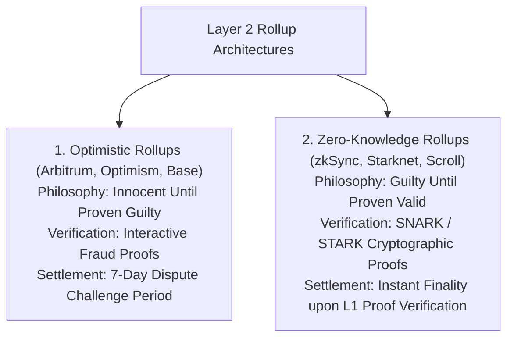
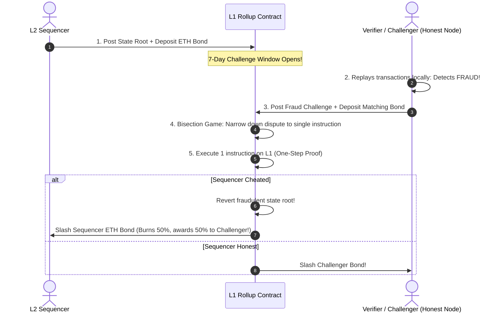
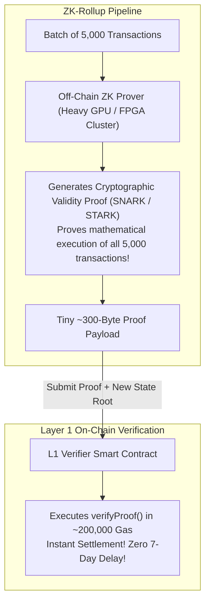
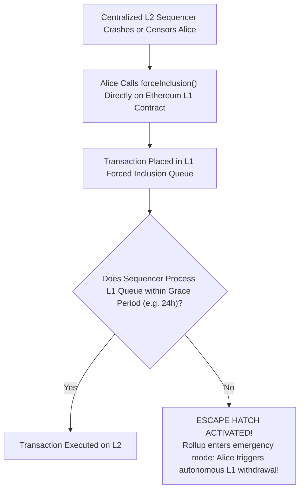

# Layer 2 Scaling and Rollup Architecture

In the modular blockchain paradigm, Layer 1 (Ethereum) functions as the foundational trust, settlement, and consensus layer.
However, Layer 1 execution capacity is inherently scarce.
To scale global transaction throughput to millions of users without sacrificing Layer 1 decentralization, the industry developed **Layer 2 (L2) Scaling Architectures**.

A true Layer 2 is not a separate, competing blockchain.
A true Layer 2 is an execution protocol that **inherits the complete cryptographic security and economic finality of its underlying Layer 1 base chain**.
If the entire Layer 2 validator and sequencer set suddenly goes rogue, shuts down, or attempts to steal funds, users can always safely withdraw 100 percent of their capital back to Layer 1 using self-executing base-chain smart contracts.

The dominant Layer 2 scaling paradigm is the **Rollup**.

## What is a Rollup?

The name "rollup" describes exactly what the technology does:
A rollup takes hundreds or thousands of transactions, executes them off-chain, **rolls them up into a single compact cryptographic batch**, and posts that batch down to a smart contract on Ethereum Layer 1.

```mermaid
flowchart TD
    subgraph Layer 2 Execution Environment (Arbitrum, Optimism, zkSync, Base)
        Tx1[Tx 1] & Tx2[Tx 2] & Tx3[Tx 3] & Txn[Tx 1,000] --> Sequencer[L2 Sequencer]
        Sequencer --> FastExec["Execute Transactions Off-Chain in Sub-Seconds<br/>Throughput: 2,000+ TPS!"]
        FastExec --> Compression["Compress 1,000 Transactions into Compact Data Batch"]
    end

    subgraph Layer 1 Settlement (Ethereum)
        RollupContract["L1 Rollup Smart Contract (Rollup.sol)"]
        Compression -->|Single L1 Transaction: Post Data Batch + State Root| RollupContract
        RollupContract --> Security["Inherits 100% of Ethereum Multi-Billion Dollar Security!"]
    end
```

### The Rollup Equation: Amortizing Gas Overhead

On Ethereum Layer 1, every transaction consumes a minimum of 21,000 gas, plus storage and execution costs.
If 1,000 users execute transactions on L1 individually, the total gas consumed is at least $21,000 \times 1,000 = 21,000,000 \text{ gas}$, filling an entire block.

In a rollup:
1. Transactions execute off-chain in a high-speed execution engine.
2. The sequencer discards signatures (which are verified off-chain) and strips unnecessary headers.
3. The raw state diffs or compressed transaction inputs are packed into a dense byte array.
4. The sequencer posts this single batch to Layer 1 inside a single transaction.
5. The fixed cost of the Layer 1 transaction is **amortized across all 1,000 users**, slashing transaction fees by **90 percent to 99 percent** for the end user.

## The Two Rollup Paradigms: Optimistic vs. Zero-Knowledge

Every rollup must solve a fundamental challenge:
*When the Layer 2 sequencer posts an updated state root to Layer 1, how does the Layer 1 smart contract know that the sequencer did not lie and steal everyone's money?*

To answer this question, the blockchain industry divided into two architectural philosophies:
1. **Optimistic Rollups:** Use **Fraud Proofs** (Assume valid until proven guilty).
2. **Zero-Knowledge (ZK) Rollups:** Use **Validity Proofs** (Assume guilty until proven valid mathematically).



Let us dissect the mechanics of both systems in rigorous detail.

## Deep Dive: Optimistic Rollups and Fault Proofs

Optimistic rollups (such as **Arbitrum One**, **OP Mainnet**, and **Base**) operate on the principle of optimism:
When the sequencer submits a new state root to the Layer 1 contract, the L1 contract **optimistically assumes the state root is 100% valid** and does not verify the transactions immediately.

However, to protect user funds, the rollup enforces a mandatory **7-Day Dispute Challenge Window**:



### The 1-of-N Honesty Assumption

Optimistic rollups rely on a remarkably robust game-theoretic security guarantee called the **1-of-N Honesty Assumption**:
- The network does not require a majority of honest nodes.
- It does not even require a 33% honest quorum.
- **As long as a single honest verifier exists anywhere on Earth** who downloads the raw data, detects a fraudulent state root, and submits a fraud proof within the 7-day challenge window, the fraudulent state transition will be reversed and the malicious sequencer's multi-million dollar bond will be slashed.

### Interactive Fraud Proving (The Arbitrum Bisection Game)

In early optimistic designs (Non-Interactive Fraud Proofs), verifying a fraud dispute required executing an entire contested Layer 2 block on Layer 1.
However, if an L2 block consumed 50 million gas, it would exceed Ethereum Layer 1's 30 million gas block ceiling, making fraud proof execution physically impossible!

Arbitrum solved this with **Interactive Bisection Proving**:
1. The sequencer and the challenger enter an off-chain bisection game on Layer 1.
2. The challenger says: *"In this batch of $1,000,000$ computation steps, Step 1 is correct but Step 1,000,000 is fraudulent."*
3. The contract cuts the range in half: *"What was the state at Step 500,000?"*
4. The sequencer and challenger bisect the search space back and forth over several rounds ($\log_2 N$).
5. In just 20 rounds ($\log_2(1,000,000) \approx 20$), the disagreement is narrowed down to **a single EVM opcode instruction**.
6. The Layer 1 contract executes that **single instruction** using its built-in One-Step Prover (`OP_ONE_STEP`).
7. The fraudulent party is identified, their bond is slashed, and the state root is corrected, all while consuming negligible Layer 1 gas!

### The Drawback: The 7-Day Withdrawal Delay

The major operational trade-off of optimistic rollups is latency:
Because anyone has 7 days to dispute a state transition, **official Layer 2 to Layer 1 native bridge withdrawals take exactly 7 days to complete**.
(Users who cannot wait 7 days use third-party liquidity bridges like Across or Hop, which loan them funds on Layer 1 instantly in exchange for a small convenience fee).

## Deep Dive: Zero-Knowledge (ZK) Rollups and Validity Proofs

Zero-Knowledge Rollups (such as **zkSync Era**, **Starknet**, **Scroll**, and **Linea**) eliminate fraud proofs and challenge periods entirely.
They operate on the principle of **cryptographic validity**:
A ZK-rollup never asks Layer 1 to assume anything.
Every state transition submitted to Layer 1 is accompanied by an incontrovertible mathematical proof: a **Succinct Non-Interactive Argument of Knowledge (SNARK)** or **Scalable Transparent Argument of Knowledge (STARK)**.



### The Mathematical Magic: Succinctness and Verification Asymmetry

The power of Zero-Knowledge proofs lies in their profound computational asymmetry:
- **Generating the Proof (Prover Work):** Extremely heavy.
  Specialized GPU, FPGA, or ASIC clusters spend minutes computing complex polynomial commitments and elliptic curve pairings over millions of algebraic gates.
- **Verifying the Proof (Verifier Work):** Incredibly lightweight.
  The Layer 1 verifier contract executes a few elliptic curve bilinear pairing checks, consuming approximately **200,000 to 300,000 gas**, regardless of whether the proof covers 100 transactions or 100,000 transactions!

Because the proof cannot be forged under the laws of mathematics:
- The Layer 1 contract verifies the proof **in the exact same block it is submitted**.
- **Withdrawals settle in minutes**, eliminating the 7-day optimistic waiting period.
- An invalid state transition is mathematically impossible; the verifier contract simply reverts if the proof does not check out.

## The Sequencer Decentralization Dilemma

While rollups achieve massive scalability, modern production rollups share a critical centralization vector: **The Centralized Sequencer**.

In most rollups today, a single entity (such as the Arbitrum Foundation or Optimism Foundation) operates the sequencer:
- The sequencer controls transaction ordering.
- **The Censorship Vector:** A centralized sequencer can censor transactions or extract massive Maximum Extractable Value (MEV).
- **The Liveness Failure:** If the sequencer crashes, the L2 network temporarily halts.

### The Escape Hatch: L1 Force-Inclusion (`enqueue`)

Why does a centralized sequencer not compromise user security?
Because every true rollup implements an **Escape Hatch (Forced L1 Inclusion)**:



If the sequencer censors Alice, she broadcasts her transaction directly to the Layer 1 rollup contract.
The contract queues her transaction:
- If the sequencer fails to include Alice's transaction within a mandatory window (e.g., 24 hours), the rollup enters emergency mode.
- Alice can unilaterally withdraw her assets directly on Layer 1.
Even under a totally malicious sequencer, user funds are mathematically secure on Layer 1.

## Comprehensive Comparison Matrix

| Architectural Dimension | Optimistic Rollups (Arbitrum, OP) | Zero-Knowledge Rollups (zkSync, Starknet) |
| :--- | :--- | :--- |
| **Proof Mechanism** | Interactive Fault / Fraud Proofs | Cryptographic Validity Proofs (SNARK / STARK) |
| **Philosophy** | Assumed valid until proven fraudulent | Assumed invalid until mathematically proven |
| **L1 Verification Cost** | Negligible during normal times; gas paid only if challenged | Fixed gas cost (~250k gas) for proof verification |
| **Withdrawal Latency** | **7 Days** (Mandatory challenge window) | **Minutes / Hours** (Time to generate & verify proof) |
| **EVM Compatibility** | **High:** Near 100% bytecode equivalence (EVM-equivalent) | **Medium / High:** Requires zkEVM circuits or custom VMs (Cairo) |
| **Computational Overhead** | Incurred by challengers monitoring state | Incurred by provers generating heavy ZK proofs |
| **Security Foundation** | Game theory & 1-of-N economic honesty | Pure cryptographic & mathematical hardness |
