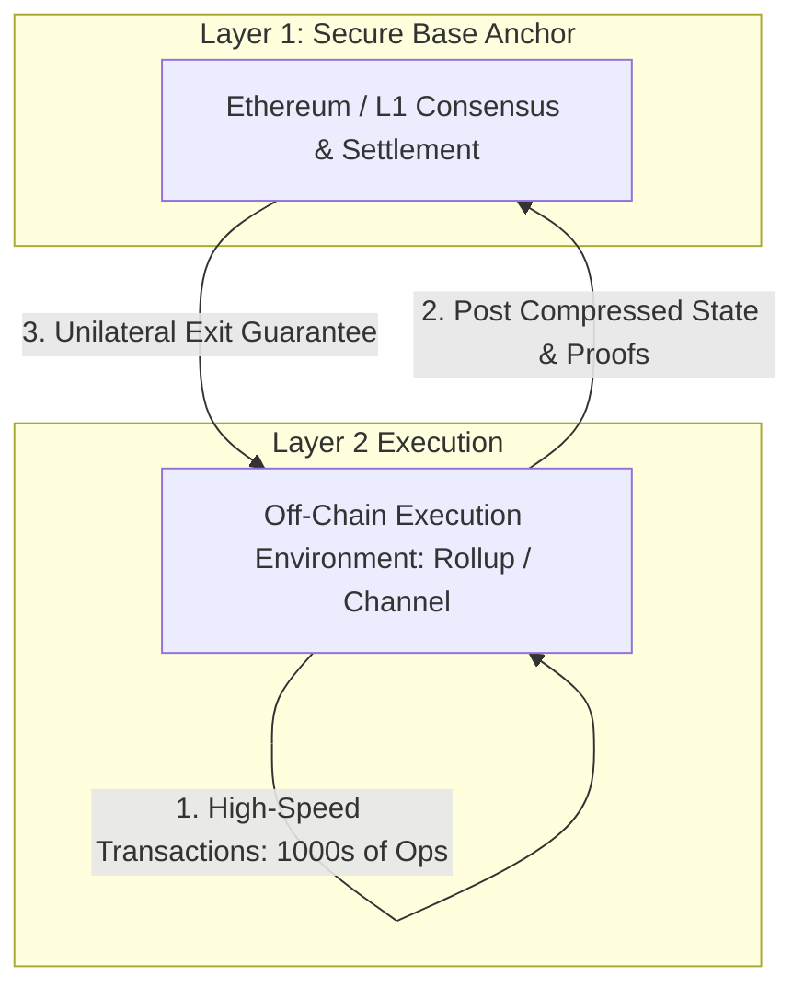
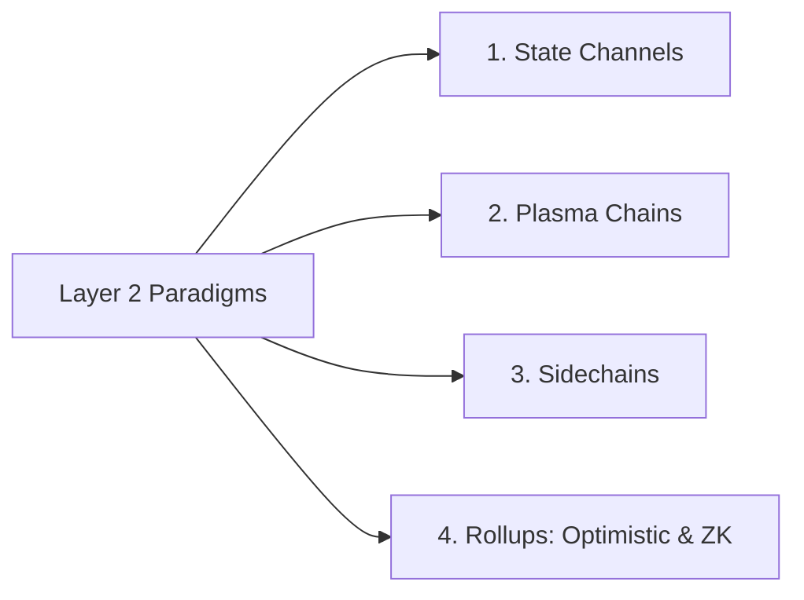
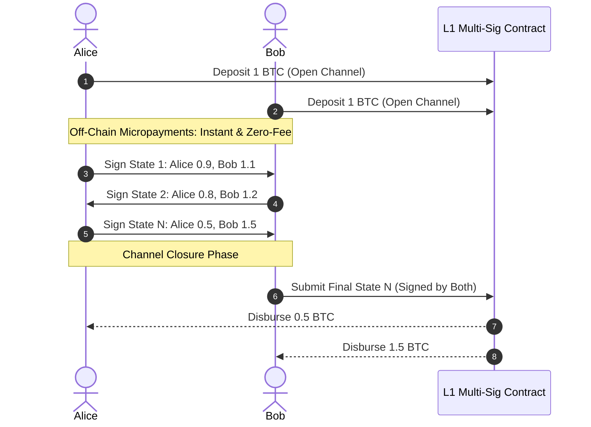

# Layer 2 Fundamentals

As Layer 1 blockchains achieve global adoption, block space demand outstrips supply, causing transaction fee spikes and execution latency.
Scaling an L1 by altering base parameters degrades decentralization.
Layer 2 (L2) systems resolve this bottleneck by executing transactions off-chain while anchoring security, data availability, and settlement to an underlying Layer 1 blockchain.

## Defining a True Layer 2

Not all off-chain or secondary systems qualify as a Layer 2.
An architecture is a genuine Layer 2 if and only if:
- **Inherited Security:** It derives its security directly from the underlying L1 consensus.
- **Unilateral Exit:** Users can bridge their assets back to Layer 1 autonomously, even if all Layer 2 sequencers, operators, and validators actively collude or go offline.

If an off-chain system relies on its own independent validator set or lacks cryptographic settlement guarantees on L1, it is a sidechain or separate network, not an L2.

## Taxonomy of Layer 2 Architectures

Over the past decade, off-chain scaling has evolved across several distinct technical paradigms:

### 1. State Channels (e.g. Bitcoin Lightning Network)

State channels allow two or more participants to conduct an arbitrary number of off-chain transactions while submitting only two transactions to the underlying L1: an opening deposit and a closing settlement.

- **Dispute Resolution:** If Alice attempts to cheat by submitting an older state (e.g. State 1 where she had 0.9 BTC), Bob submits the newer signed State N within a dispute window. The contract enforces a penalty, confiscating Alice's entire deposit and awarding it to Bob.
- **Limitations:** Channels require 100 percent capital lockup (illiquidity), require participants to remain online to monitor disputes (or hire Watchtowers), and cannot support shared, multi-party smart contract state (such as AMMs).

### 2. Plasma (Child Chains)

Proposed by Joseph Poon and Vitalik Buterin in 2017, Plasma constructs child blockchains that periodically commit Merkle roots of transaction blocks to an L1 smart contract.
- **Dispute Mechanism:** If the Plasma operator withholds data or acts dishonestly, users initiate an on-chain exit by submitting a Merkle proof of their funds to L1.
- **The Data Availability (DA) Flaw:** If the operator withholds block data while submitting valid roots to L1, users cannot generate the Merkle proofs needed to prove their current account balances during an exit.
  This "Mass Exit" problem caused the ecosystem to transition away from Plasma toward rollups.

### 3. Sidechains (e.g. Polygon PoS)

A sidechain is an independent blockchain running a separate consensus mechanism (such as DPoS or PoA) alongside the main chain.
- Assets move between chains via a two-way bridge contract.
- **Security Reality:** Sidechains **do not** inherit L1 security. If the sidechain's validator set colludes or suffers a 51 percent attack, they can drain all funds locked in the L1 bridge contract.
  A sidechain is a distinct Layer 1 running parallel to the parent chain, connected via bridging smart contracts.

## The Rollup Breakthrough

Rollups resolved the fundamental data availability flaw that undermined Plasma.
In a rollup:
1. **Off-Chain Execution:** Hundreds or thousands of transactions execute off-chain on a high-throughput sequencer.
2. **On-Chain Data Availability:** The sequencer compresses transaction data and posts it directly to Layer 1 (either as `calldata` or EIP-4844 data blobs).
3. **Cryptographic Proofs:** The sequencer submits state commitments accompanied by cryptographic proofs ensuring validity.

Because all raw transaction data is anchored permanently to Layer 1, any node can download the L1 data, reconstruct the full Layer 2 state independently, and execute unilateral exits even if the sequencer vanishes.

## Comparative Architecture Matrix

| Metric | State Channels | Sidechains | Optimistic Rollups | Zero-Knowledge Rollups |
| :--- | :--- | :--- | :--- | :--- |
| **Security Anchor** | L1 Multi-sig dispute | Separate validator set | Full L1 security inheritance | Full L1 security inheritance |
| **Data Availability** | Off-chain (Participants) | Off-chain (Sidechain nodes)| On-chain L1 (Calldata / Blobs) | On-chain L1 (Calldata / Blobs) |
| **Smart Contract Support** | Unusable for shared state | Full EVM support | Full EVM equivalence | Full EVM equivalence / zkVM |
| **Capital Efficiency** | Low (Capital locked in channels)| High | High | High |
| **Withdrawal Delay** | Instant (Cooperative) / Days | Minutes (Bridge dependent) | 7-day challenge period | Instant (Proof generation time) |
| **Hardware Overhead** | Minimal consumer device | High sidechain nodes | Standard sequencer | Intensive ZK proof generation |
