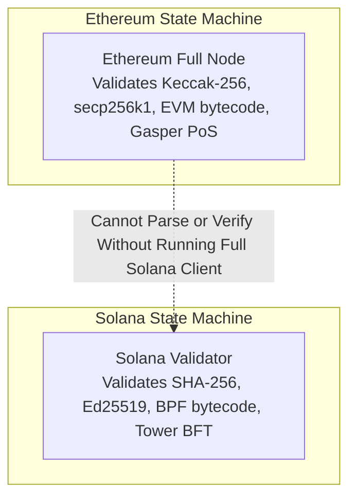
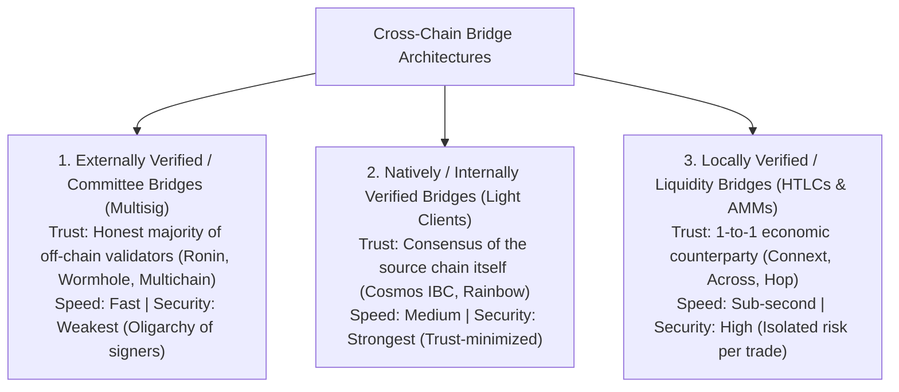
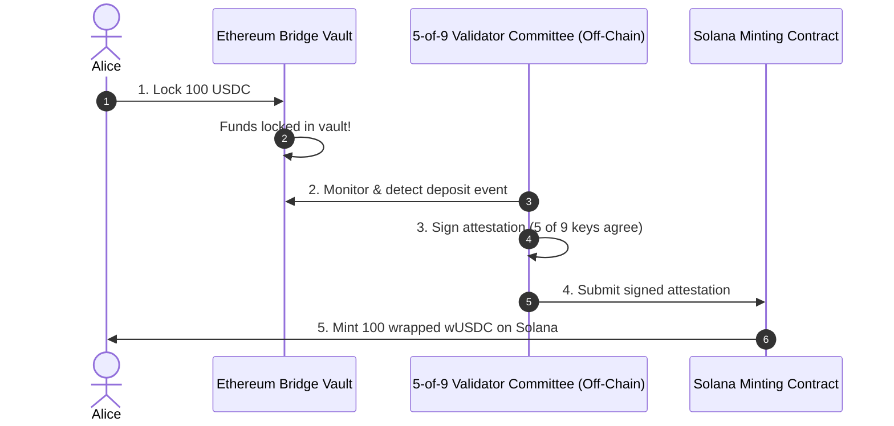
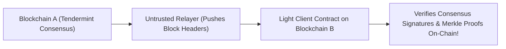
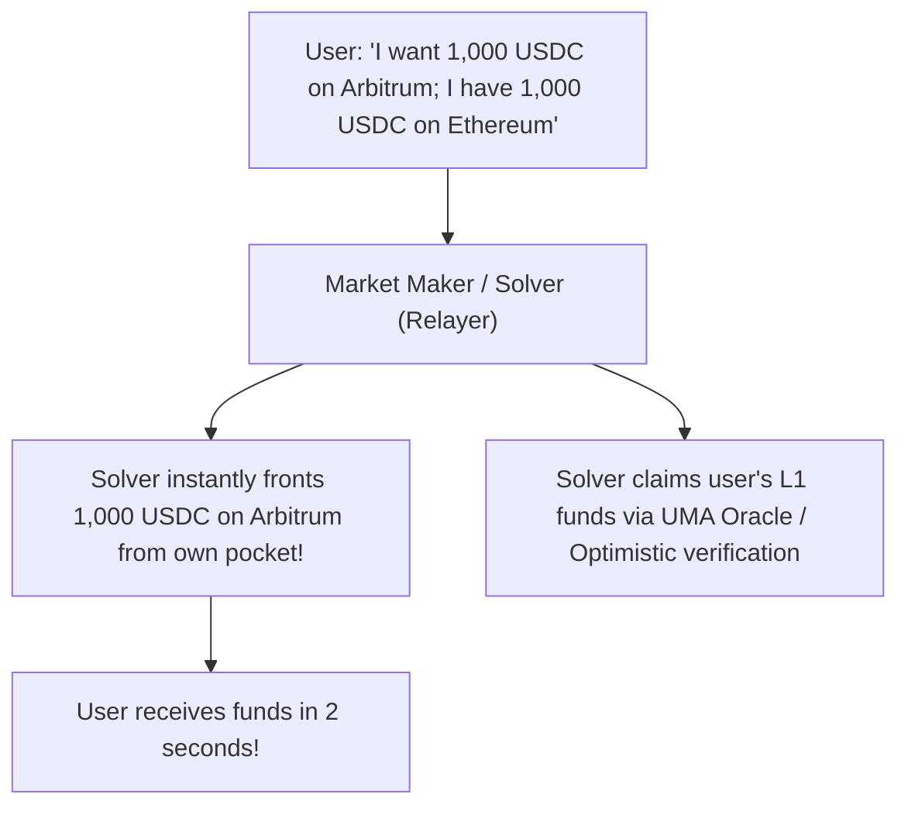
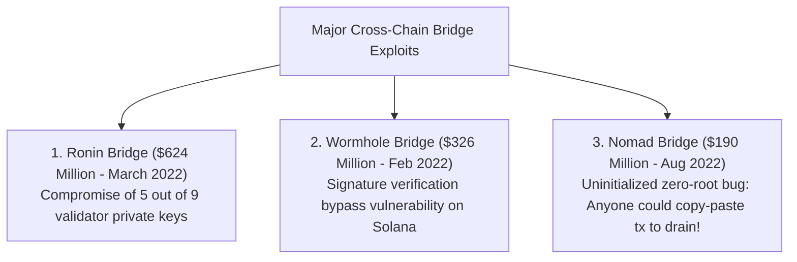

# Cross-Chain Interoperability and Bridges

In the early days of blockchain, Bitcoin was the sole decentralized network in existence.
Today, the Web3 landscape is an expansive, fragmented multi-chain universe:
- General-purpose Layer 1 networks (Ethereum, Solana, Avalanche, BNB Chain).
- Application-specific appchains (Cosmos zones, Polkadot parachains).
- Dozens of Layer 2 and Layer 3 rollups (Arbitrum, Optimism, zkSync, Base).

Each of these networks is an **isolated cryptographic silo**.
An Ethereum full node knows nothing about what is happening on Solana.
A Solana validator does not validate Bitcoin transactions.
They run different consensus mechanisms, different cryptographic curves, different virtual machines, and different state databases.

For capital, users, and smart contracts to communicate across these isolated ecosystems, the industry relies on **Cross-Chain Bridges**.
However, cross-chain communication is arguably the most dangerous frontier in distributed computing: between 2021 and 2023, cross-chain bridge hacks resulted in **over $2.5 billion in stolen assets**.

## Why Blockchains Cannot Talk to Each Other

A beginner's common intuition is: *If both chains are connected to the internet, why can't a smart contract on Ethereum simply query a smart contract on Solana?*

This impossibility stems from the core principle of **Decentralized State Verification**:

- To verify that a transaction truly occurred on Solana, an Ethereum node would have to download and execute all Solana blocks.
- But Ethereum validators are already running at maximum capacity executing Ethereum blocks!
- Running a second complete blockchain inside the virtual machine of the first blockchain is computationally and economically impossible.

Therefore, cross-chain bridging requires **relaying cryptographic proofs or trusted attestations across networks**.

## The Cross-Chain Bridging Taxonomy

Vitalik Buterin and distributed systems researchers categorize cross-chain bridges into three fundamental architectural models based on their trust assumptions:

Let us evaluate each bridging model in detail.

## 1. Externally Verified Bridges (Multisig & Committee)

The vast majority of early bridges were **Externally Verified Bridges**:
- An off-chain federation or validator committee (typically running a $k$-of-$N$ multi-signature or threshold signature scheme) monitors both chains.
- To bridge 100 USDC from Ethereum to Solana:
  1. Alice deposits 100 USDC into a bridge contract on Ethereum.
  2. The bridge contract locks the USDC in its vault.
  3. The off-chain federation detects the deposit event, signs a cryptographic message confirming the deposit, and transmits it to Solana.
  4. A bridge contract on Solana verifies the federation's signatures and mints 100 "wrapped USDC" (wUSDC) into Alice's Solana wallet.

### The Systemic Vulnerability: The Honeypot Dilemma

Externally verified bridges are fast and cheap to build, but they create **massive centralized honeypots**:
- As billions of dollars are bridged, the Layer 1 vault contract accumulates vast reserves of real assets.
- However, the security of that multi-billion-dollar vault does not depend on the security of Ethereum or Solana; **it depends entirely on the private keys of the off-chain committee!**
- If an attacker compromises the threshold number of committee keys (e.g. 5 private keys), the attacker can sign a forged message, mint billions in unbacked wrapped tokens on the destination chain, and drain the entire Layer 1 vault dry!

## 2. Natively Verified Bridges (On-Chain Light Clients)

The gold standard of cross-chain security is the **Natively Verified Bridge**, exemplified by **Cosmos Inter-Blockchain Communication (IBC)** and the **NEAR Rainbow Bridge**.

### How IBC Works:

Instead of trusting a third-party committee of humans, Blockchain B runs an **on-chain Light Client contract** that tracks the consensus of Blockchain A:
1. An untrusted off-chain relayer continuously pushes Blockchain A's block headers to the light client contract on Blockchain B.
2. The light client verifies the cryptographic signatures of Blockchain A's actual validator set.
3. When Alice locks funds on Chain A, the relayer submits a **Merkle Inclusion Proof** proving that Alice's transaction is committed inside Chain A's canonical block header.
4. The light client on Chain B verifies the Merkle proof mathematically and unlocks her funds.

### The Security Invariant: Trust-Minimized

Natively verified bridges inherit the complete security of the underlying consensus layers:
- An attacker **cannot forge a transfer** without corrupting the entire source blockchain's consensus (e.g., executing a 67% Byzantine attack or 51% PoW reorg).
- The relayer is completely untrusted; if a relayer submits a fake header or invalid proof, the on-chain light client math rejects it automatically.
- **The Drawback:** Extremely expensive in gas fees. Verifying foreign cryptographic curves and block headers inside the EVM consumes immense computational resources, limiting IBC deployment primarily to custom appchains.

## 3. Locally Verified / Liquidity Bridges (Intent-Based Networks)

To combine the trust-minimization of light clients with the speed and low cost of committees, modern DeFi uses **Intent-Based Liquidity Bridges** (such as **Across** and **Stargate**):

- Instead of locking and minting wrapped tokens, the user broadcasts an **Intent**.
- Professional market makers (Solvers) front their own liquid capital on the destination chain instantly, transferring funds to the user in sub-seconds.
- The solver then uses an optimistic proof system (like UMA's Optimistic Oracle) to claim the user's locked deposit on the origin chain.
- If a solver gets hacked, **only the solver's private capital is at risk**; there is no centralized multi-billion-dollar vault holding user funds that can be drained.

## Anatomizing Historic Bridge Exploits

Cross-chain bridges have suffered some of the largest financial thefts in recorded human history:

### 1. The Ronin Bridge Hack ($624 Million - March 2022)

The Ronin Network (built for the Axie Infinity gaming ecosystem) used a 5-of-9 multisig committee to authorize cross-chain withdrawals:
- The North Korean Lazarus Group executed targeted spear-phishing attacks against Sky Mavis engineers, compromising four private validator keys.
- They accessed a fifth validator key through an Axie DAO free gas RPC node that had failed to revoke its authorization permissions.
- With 5 of the 9 signatures in hand, the attackers signed two fraudulent withdrawal transactions, draining **173,600 ETH and 25.5 million USDC** from the bridge vault.

### 2. The Wormhole Bridge Hack ($326 Million - February 2022)

Wormhole connects Ethereum to Solana:
- A smart contract vulnerability on the Solana side allowed the attacker to inject a deprecated system instruction (`system_program`) to spoof the signature verification contract.
- The contract falsely verified that Wormhole's off-chain "Guardians" had approved a deposit of 120,000 ETH.
- The attacker minted 120,000 wrapped ETH (wETH) out of thin air on Solana, bridged it back across to Ethereum, and redeemed it for real ETH from the Ethereum vault contract.

### 3. The Nomad Bridge Exploit ($190 Million - August 2022)

During a routine contract upgrade, the Nomad team initialized their confirmation root mapping with a default value of `0x00`:
- Because an empty transaction input produced a hash of `0x00`, the contract evaluated any message with a zero-root as **already confirmed!**
- An attacker discovered the bug and forged a 100-token withdrawal.
- When other users and MEV searchers saw the exploit transaction in the public mempool, they simply copy-pasted the raw transaction bytes, swapped the recipient address to their own wallet, and submitted it.
- Over 300 independent copycat actors joined the feeding frenzy, completely draining $190 million from the bridge vault in hours.

## Bridge Security Invariants for Protocol Designers

To build bridges that resist catastrophic failure, protocol architects enforce three non-negotiable principles:

1. **Defense in Depth and Rate Limiting:**
   A bridge should never allow unlimited, instantaneous withdrawals.
   Enforce strict volume caps (e.g. maximum $5 million withdrawal per hour) and mandatory timelocks for large transactions, giving security teams time to halt the bridge if an exploit begins.
2. **Decouple Minting from Custody (Burn-and-Mint vs. Lock-and-Mint):**
   Whenever possible, use native burn-and-mint standards (such as Circle's **Cross-Chain Transfer Protocol - CCTP**) rather than creating synthetic wrapped tokens.
   Under CCTP, USDC is burned natively on the source chain and minted natively on the destination chain, eliminating the need for a custodial vault honeypot entirely.
3. **Zk-SNARK Consensus Verification:**
   The future of bridging is **ZK-Light Clients** (such as Succinct Telepathy and Electron).
   Using zero-knowledge proofs, a SNARK proves that a foreign chain's validator set signed a block header, allowing trust-minimized, mathematically verifiable cross-chain communication at minimal on-chain verification gas costs.
