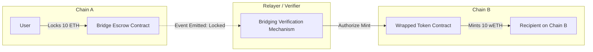
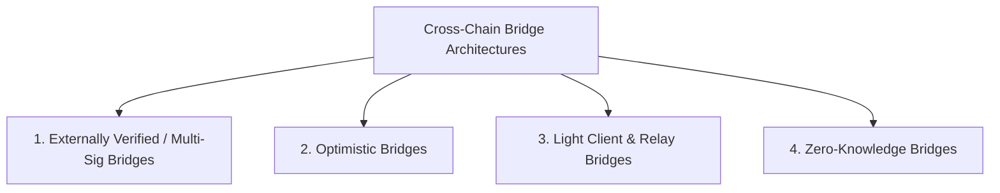
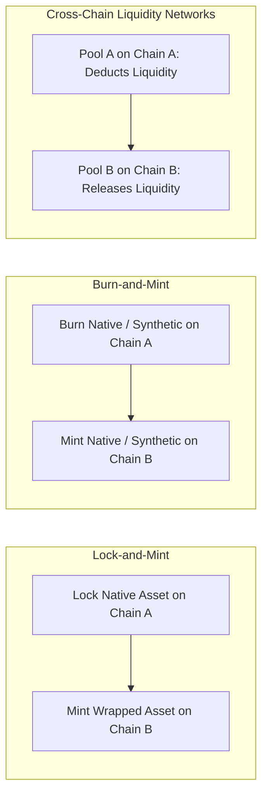

# Interoperability and Cross-Chain Bridges

Public blockchains are sovereign, isolated state machines.
By design, Ethereum has no native mechanism to verify what occurs on Solana, and Bitcoin cannot observe transactions on Avalanche.
As capital and applications fragment across hundreds of distinct Layer 1s and Layer 2s, cross-chain communication protocols and bridges provide the connective tissue enabling asset transfers and cross-chain contract calls.
However, connecting isolated consensus domains introduces severe security vulnerabilities, making bridges the most exploited components in Web3 history.

## The Bridging Problem: Sovereign Consensus Isolation

A smart contract on Chain A cannot read memory or state from Chain B because their consensus engines and cryptographic primitives operate independently.
To move an asset from Chain A to Chain B, a bridge must verify that an event occurred on Chain A before releasing corresponding funds or tokens on Chain B.

## Bridging Models and Verification Architectures

Cross-chain architectures are categorized by their underlying trust assumptions:

### 1. Externally Verified Bridges (Multi-Sig & MPC)

The most widespread and historically vulnerable bridge design.
A small set of off-chain validators (or a Multi-Party Computation federation) monitors Chain A.
When a deposit occurs, the validators sign an attestation approving the minting of wrapped tokens on Chain B.
- **Trust Assumption:** $M$-of-$N$ honest threshold among bridge operators.
- **Vulnerabilities:** If a threshold of private keys is compromised, stolen, or socially engineered, the attackers can forge minting authorizations and drain 100 percent of the collateral locked in the escrow contract.
  The Ronin Network ($625M) and Harmony Horizon ($100M) bridge hacks occurred due to compromised multi-sig validator keys.

### 2. Optimistic Bridges (e.g. Nomad)

Optimistic bridges introduce a challenge window before transactions are finalized on the destination chain.
A relayer submits a proposed message root, opening a dispute window (e.g. 30 minutes).
Independent watchers monitor both chains.
If an unauthorized transaction is submitted, a watcher posts a fraud proof to the destination contract, halting the bridge before funds can be withdrawn.
- **Trust Assumption:** $1$-of-$N$ honest watcher assumption.

### 3. Light Client and Relay Bridges (e.g. Cosmos IBC, Rainbow Bridge)

The gold standard for decentralized bridging between sovereign Layer 1s.
A smart contract on Chain B implements an on-chain **light client** that verifies the consensus proofs and block headers of Chain A directly:
- Relayers continuously forward block headers from Chain A to Chain B.
- The light client on Chain B verifies the cryptographic signatures (e.g. Ed25519 or BLS) of Chain A's validator set.
- Individual transactions are verified using Merkle inclusion proofs checked directly against the verified block headers.
- **Trust Assumption:** Equivalent to the security of the underlying consensus mechanisms of both chains.
  No external multi-sig committee exists to be compromised.

### 4. Zero-Knowledge (ZK) Bridges

Running a full light client on-chain is computationally prohibitive on networks with high gas costs like Ethereum, because verifying hundreds of foreign signatures per block exhausts gas limits.
ZK bridges solve this by generating a ZK-SNARK proof off-chain demonstrating that a foreign block header was signed by a valid supermajority of validators.
The on-chain contract on Chain B verifies only the single, compact ZK proof ($\sim 250,000$ gas), attaining light-client grade security at low gas overhead.

## Asset Transfer Mechanisms

Bridges move value across chains using three primary mechanisms:

### 1. Lock-and-Mint (Wrapped Assets)

- **Mechanism:** The user locks native ETH into a smart contract on Ethereum. The bridge mints an equivalent quantity of wrapped tokens (`wETH`) on Avalanche.
- **Risk:** Wrapped tokens carry systemic counterparty risk. If the underlying escrow vault on Ethereum is exploited, the wrapped tokens on Avalanche become completely unbacked and crash to zero.

### 2. Burn-and-Mint (Native Minting)

- **Mechanism:** Used by standardized native assets (such as Circle's Cross-Chain Transfer Protocol / CCTP for USDC). The user burns native USDC on the source chain, and the issuer contract mints authentic, native USDC directly on the destination chain.
- **Risk:** Eliminates wrapped asset fragmentation and unbacked token risks, but requires centralized issuer authorization or standardized protocol burn-and-mint hooks.

### 3. Liquidity Networks (e.g. Across, Stargate)

- **Mechanism:** Independent liquidity providers deposit native pools of tokens on both chains.
  When Alice deposits USDC on Arbitrum, an off-chain market maker immediately fronts native USDC from their local pool on Optimism to Alice for a small fee, rebalancing their capital later via slow, secure settlement layers.
- **Risk:** Zero wrapped asset risk; failure modes are limited to temporary liquidity exhaustion in destination pools.

## Cross-Chain Attack Vectors and Historical Exploits

| Incident | Amount Lost | Vulnerability Root Cause |
| :--- | :--- | :--- |
| **Ronin Network (2022)** | $625 Million | Multi-sig key compromise: Attacker compromised 5 of 9 validator private keys through spear-phishing. |
| **Wormhole Bridge (2022)** | $320 Million | Smart contract signature verification bypass: Attacker forged a sysvar instruction on Solana to bypass Guardian signature verification. |
| **Nomad Bridge (2022)** | $190 Million | Uninitialized storage pointer: An update set the trusted message root to `0x00`, causing uninitialized messages to auto-validate as genuine proofs. |
| **Harmony Horizon (2022)** | $100 Million | Compromised 2-of-5 multi-sig server infrastructure. |
